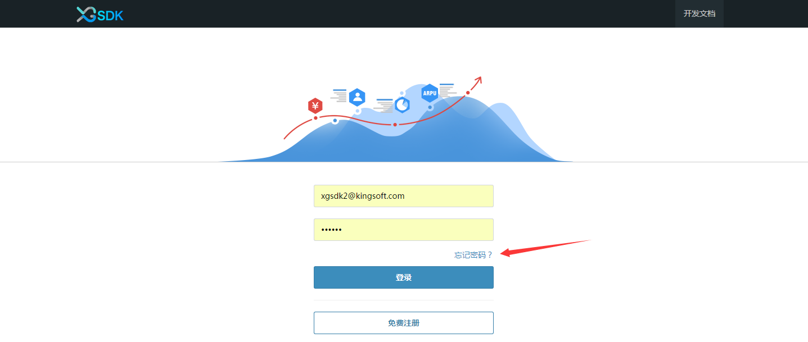
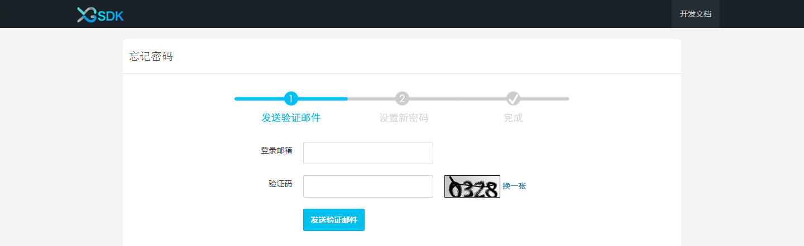
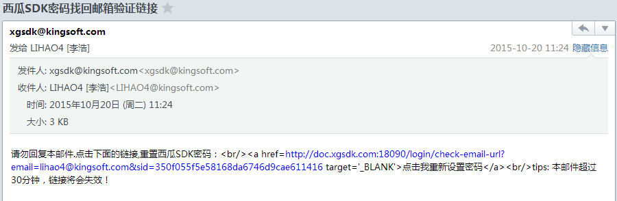
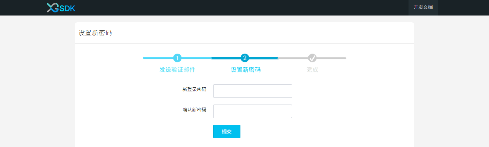
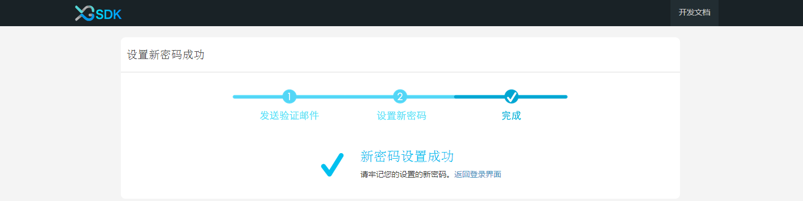

# 详细说明

西瓜 SDK 为游戏商提供一套完整的 SDK 接入方案，一次性解决游戏 SDK 接入问题，整个接入过程不会改变、影响任何 SDK 的功能、参数等，整个过程对于最终玩家而言是透明的。
游戏商只需专注于游戏不必为接入时渠道间的差异而苦恼，将这些烦恼都交给我们来解决。西瓜 SDK 包括了渠道 SDK 、支付系统、数据统计等等。
游戏商可以根据自身游戏的技术架构选择对应的 SDK 版本，并参考相应的接入指南。下面将对整个西瓜SDK功能进行详细说明。
<ol><B>
<li><a href="#1">注册登陆</a></li>
<li><a href="#2">个人信息编辑</a></li>
<li><a href="#3">游戏、发布计划</a></li>
<li><a href="#4">开发接入SDK</a></li>
<li><a href="#5">配置渠道参数、充值回调地址、图标资源</a></li>
<li><a href="#6">项目成员管理</a></li>
<li><a href="#7">协作日志</a></li>
<li><a href="#8">高级配置</a></li>
<li><a href="#9">充值补单</a></li>
<li><a href="#10">统计工具</a></li>
<li><a href="#10">接入交流</a></li>
</B></ol>

## 一. 注册登录

### 1.1 注册
西瓜提供新用户免费注册，注册时请填写真实信息，以便找回密码和后续反馈交流

### 1.2 登陆
用户输入用户名和密码登陆，当忘记密码时，点击如图所示的“忘记密码”找回密码。

找回密码时需输入注册时的邮箱号码和正确的验证码，然后发送验证邮件。再收到验证邮件之后，点击邮件中的验证链接，将跳转到重置密码页面，输入新密码即可。整个过程如下图所示。

发送验证邮件

验证邮件成功发送

邮箱接收验证链接

重置密码

重置密码成功

## 二. 个人信息编辑

## 三. 游戏、发布计划

### 3.1 游戏创建与编辑

### 3.2 发布计划创建、编辑、克隆、锁定

## 四. 开发接入SDK

## 五. 配置渠道参数、充值回调地址、图标资源

### 5.1 渠道参数

### 5.2 充值回调地址

### 5.3 图标资源

## 六. 项目成员管理

系统中的用户，分为管理员和普通用户两种，两种用户在权限上存在着一定的差异，例如只有管理员才可以对发布计划进行修改锁定、查看协作日志、添加成员管理等等。用户在创建一个游戏后，会自动成为此游戏的管理员。在游戏接入的过程中，通常会需要多个工作人员的协作，这时可以通过点击页面上的“项目成员”,输入用户邮箱的方式添加新成员，新添加的项目成员默认身份为普通用户，管理员可以通过点击成员管理，来对用户进行身份设置或移除。当用户不再希望参与某个游戏时，可以点击退出该游戏，退出后该用户不再是该游戏的项目成员，无法查看游戏的所有进展情况。退出的用户还可以通过其他管理员再次添加进游戏。

## 七. 协作日志
当多用户一同协作时，对参数、回调地址、资源等修改会变得十分频繁，有些变动可能十分细微而不易察觉，这些变动如果没有一个统一的记录，整个协作过程将变得十分混乱，对于追责和审阅都将十分不便。协作日志将帮助用户解决这一困扰，每一个用户的任何动作都将被记录在协作日志之中，通过查询协作日志，可以清晰的看到整个游戏的变动更改情况。
  

当协作日志内容太多时，查询变得不容易，这时可以通过选择筛选条件来对某一特定事件、发布计划、渠道来进行查询，使得查询过程更快捷简便。

## 八. 高级配置

## 九. 充值补单
进入充值补单界面，如果游戏在24小时之内有出现“游戏拒绝”状态的订单，页面上会出现提示，可以点击立即处理来对游戏拒绝订单进行处理。点击补单按钮，会对“游戏拒绝”的订单进行补单，补单成功后，订单状态从“游戏拒绝”变成“订单初始化”。

充值补单可以对所有订单进行查询，可以设定特定渠道、订单状态、订单时间等搜索条件。当订单状态为“游戏拒绝”时，该订单会显示补单按钮，点击补单按钮，会对“游戏拒绝”的订单进行补单，补单成功后，订单状态从“游戏拒绝”变成“订单初始化”，补单按钮将会消失。

系统还提供了按订单号搜索和按角色ID搜索功能，用于查找一个或多个订单和某个角色相关的所有订单。

## 十. 统计工具

## 十一. 接入交流
西瓜提供了QQ群以方便用户的交流反馈，感谢您对西瓜SDK的支持。

