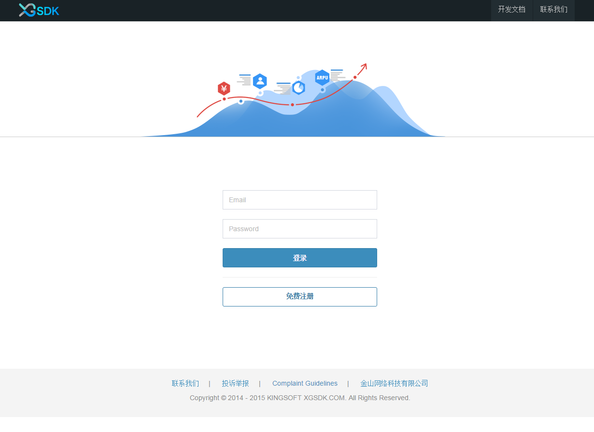
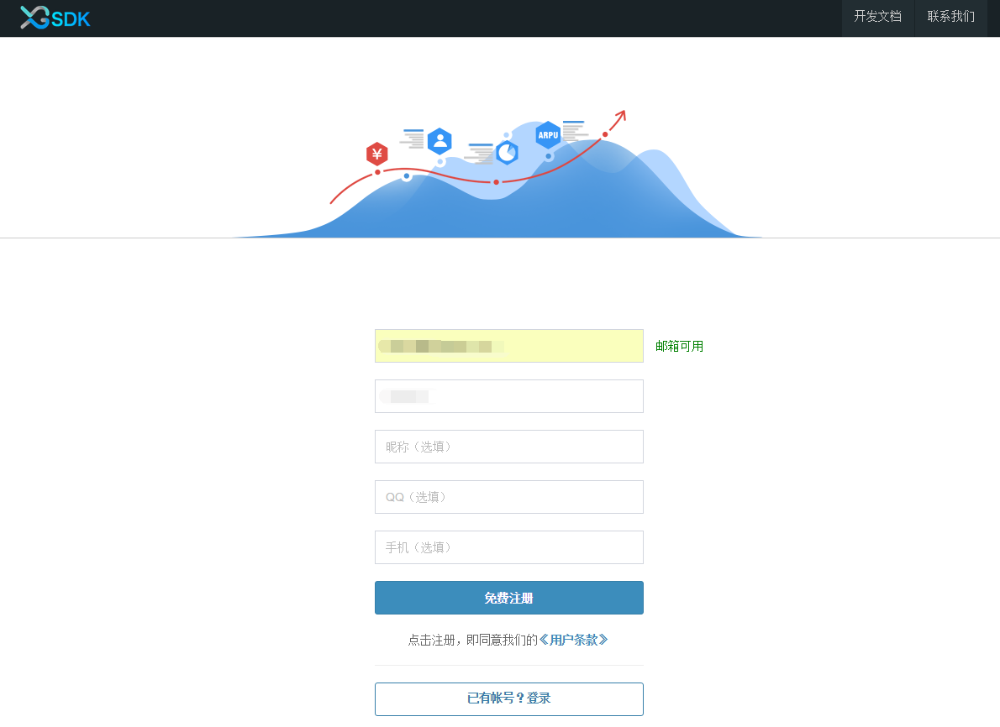
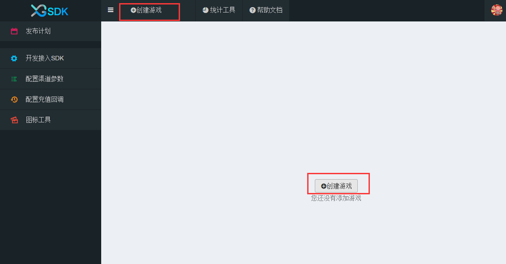
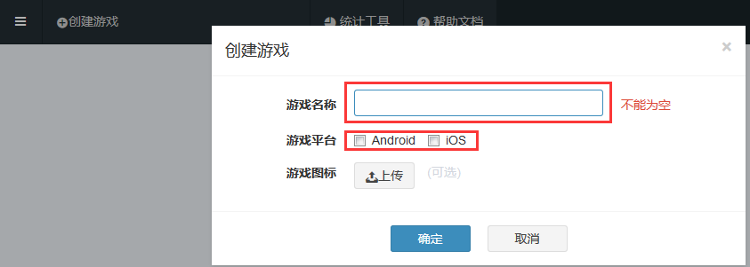
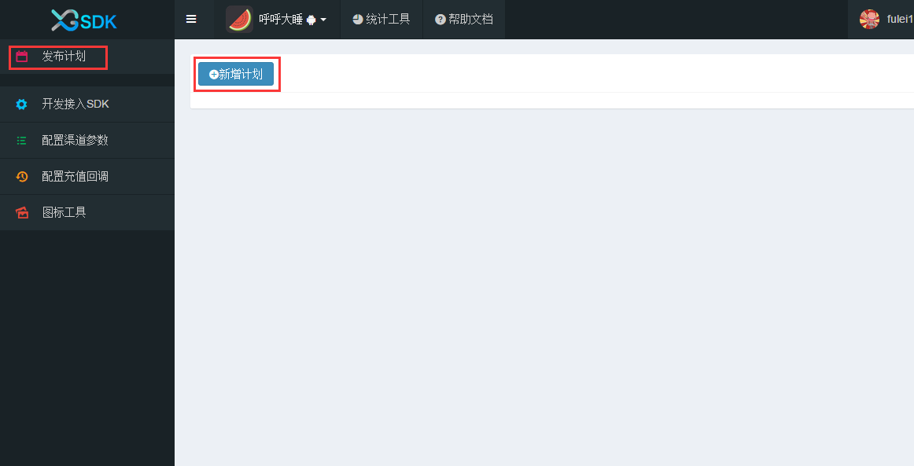
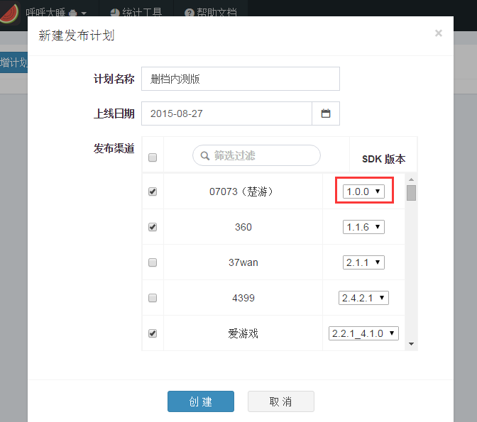
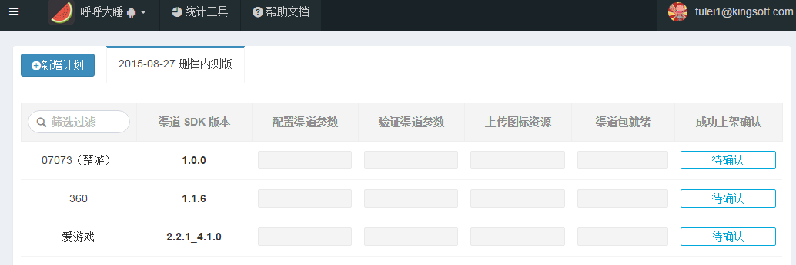
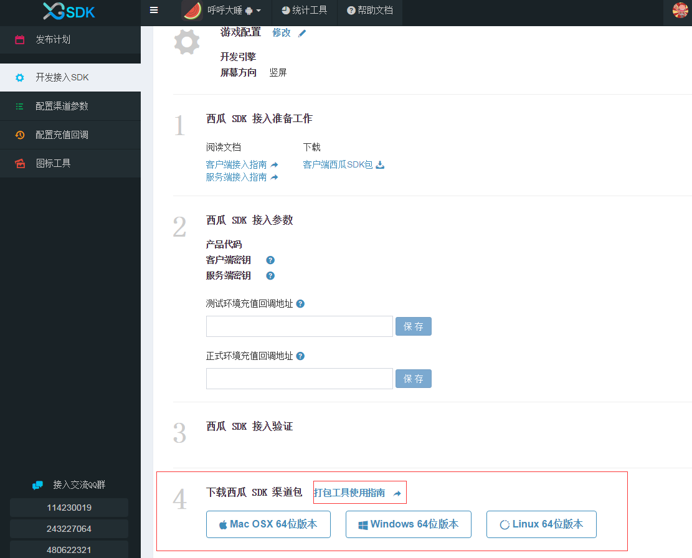

#Hello西瓜

- - -

###欢迎来到XGSDK，让我们一起开始西瓜的使用之旅！

西瓜SDK为游戏商提供一套完整的SDK接入方案,一次性解决游戏SDK接入问题,整个接入过程不会改变、影响任何SDK的功能、参数等,整个过程对于最终玩家而言是透明的.
游戏商只需专注于游戏不必为接入时渠道间的差异而苦恼,将这些烦恼都交给我们来解决.西瓜SDK包括了渠道SDK、支付系统、数据统计等等.
游戏商可以根据自身游戏的技术架构选择对应的SDK版本,并参考相应的接入指南. 
###快速接入
按照下面10个步骤，即可完成SDK的接入,帮助游戏上架。
<ul>
<li><a href="#1">1. 注册账号</a></li>
<li><a href="#2">2. 创建游戏</a></li>
<li><a href="#3">3. 发布计划</a></li>
<li><a href="#4">4. SDK接入</a></li>
<li><a href="#5">5. 配置渠道参数</a></li>
<li><a href="#6">6. 配置充值回调地址</a></li>
<li><a href="#7">7. 上传图标资源</a></li>
<li><a href="#8">8. 下载打包工具打包</a></li>
<li><a href="#9">9. 提交渠道包</a></li>
<li><a href="#10">10. 上架确认</a></li>
</ul>

###1.注册账号

1.1西瓜SDK需要注册账号才可以进行登录的，登录后可以创建新游戏，所以使用前需要登录西瓜SDK主页进行账号注册（<a href="http://console.xgsdk.com/login">点击注册</a>）； 
  
1.2在输入框中填入对应信息，点击免费注册即可； 
  
1.3注册成功输入用户名、密码，进入如下页面即注册成功。 
  

----

###2.创建游戏

2.1点击“创建”游戏；

2.2输入游戏名称、选择游戏平台、上传游戏图标（可选项），点击确认即可； 
  
2.3创建游戏成功。

---

###3.发布计划

3.1为游戏创建发布计划，可以更好的跟进游戏的接入完成进度，避免影响上架时间，点击“新增计划”开始创建一个新的发布计划；

3.2输入计划中对应的计划名称（如删档内测版、不删档公测版等）、上线日期（游戏上架时间）、发布渠道（选择游戏上线渠道，至少要选择一个渠道），在选择渠道时可以选择所需的渠道SDK版本（默认版本是当前所支持的最新版本），点击创建即可；
 
  
3.3创建好的发布计划如下： 

---

###4.SDK接入

4.1  选择菜单栏中“开发接入SDK”，在弹出窗口选择游戏引擎类型、屏幕样式. 

 
4.2      将西瓜接入参数配置到游戏中. 
&nbsp;1)新游戏如何获取接入参数:创建一个新游戏就可以获得西瓜分给游戏的接入参数：产品代码、服务端密钥、客户端密钥.
 
2)已创建的游戏如何获取接入参数:如果游戏已创建完成,则可以点击"开发接入SDK"查看分配给游戏的接入参数,具体如下:
 

4.3  进行SDK接入     1)点击下载"客户西瓜SDK包"; 
2)参考<a href="../section2/README.md">客户端接入指南</a>和<a href="../section3/README.md">服务端接入指南</a>进行接入(客户端接入指南包括:cocos2d-x引擎接入指南、unity3d引擎接入指南、原生接口接入指南；服务端指南包括：session验证、支付通知、数据上报). 
4.4   配置测试环境充值回调地址（游戏测试时使用的充值回调地址）. 
4.5  接口验证： 对已经接入的各个的接口进行验证,如图中所示,验证中若接口未调用则显示为黄色;若接口调用成功则显示为绿色;若调用失败则显示为红色,将鼠标移至红色接口处可查看tops错误说明. 

---

###5.配置渠道参数

5.1此处配置的渠道参数为开发者在渠道申请得到的应用参数，渠道参数的具体申请步骤请参考<a href="../section4/README.md">参数申请指南</a>获取相应渠道的渠道参数，也可直接
点击“配置指南”； 
5.2将获取到的渠道参数填入对应渠道的参数表中； 
5.3去渠道后台配置游戏充值回调地址（可直接点击“去渠道后台配置”进行跳转），其中充值回调地址是渠道服务器通知西瓜SDK服务器支付订单信息的地址； 
5.4点击保存。 

---

###6.配置充值回调地址

6.1全局充值回调地址，即正式环境充值回调地址，此地址是游戏服务器接收订单支付信息的接口地址（可以是一个也可以是多个）； 

6.2渠道充值回调地址，有时游戏商为减轻服务器的压力，存在多个服务器的情况，此时就需要在渠道充值回调地址中添加不同的地址，如图： 

**注意：** 当渠道充值回调地址输入框中有地址时，优先取此地址；若渠道充值回调地址为空时，取全局充值回调地址即正式环境充值回调地址。

6.3配置完成后点击保存。 

---

###7.上传图标资源

7.1首先下载渠道相对应的角标、闪屏素材和制作要求，再参考** <a href="../section4/角标规范.md">角标制作规范</a>** 制作符合渠道要求的游戏图标资源进行上传；

7.2图标资源完成上传后进行提交。

---

###8.下载打包工具进行打包

8.1首先下载西瓜的打包工具，西瓜提供三种版本的打包工具，分别为：Mac OSX64位版本、windows 64位版本、Linux 64位版本，请选择相应版本的打包工具进行下载；

 
8.2参考** <a href="./dabaogongju.md">打包工具使用指南</a> ** 进行打包工具的安装及使用。 
8.3**备注** 西瓜提供的打包工具可以打出两种类型的包：参数demo包和渠道包；

参数demo包：通过登录、充值可以对渠道参数的正确性进行验证； 
渠道包：是最终提交给渠道的APK包。 

---

###9.提交渠道包

将通过测试的渠道包提交给对应的渠道进行审核。

---

###10.上架确认

渠道包审核通过后，在发布计划中点亮“上架完成”的进度条。
