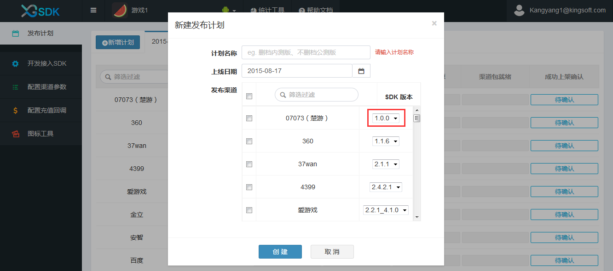

#Hello西瓜

- - -

###欢迎来到XGSDK，让我们一起开始西瓜的使用之旅！

西瓜SDK为游戏商提供一套完整的SDK接入方案,一次性解决游戏SDK接入问题,整个接入过程不会改变、影响任何SDK的功能、参数等,整个过程对于最终玩家而言是透明的.
游戏商只需专注于游戏不必为接入时渠道间的差异而苦恼,将这些烦恼都交给我们来解决.西瓜SDK包括了渠道SDK、支付系统、数据统计等等.
游戏商可以根据自身游戏的技术架构选择对应的SDK版本,并参考相应的接入指南. 
###快速接入
按照下面10个步骤，即可完成SDK的接入,帮助游戏上架。

<ul>
<li><a href="#1">1. 注册账号</a></li>
<li><a href="#2">2. 创建游戏</a></li>
<li><a href="#3">3. 发布计划</a></li>
<li><a href="#4">4. 配置渠道参数</a></li>
<li><a href="#5">5. 配置充值回调地址</a></li>
<li><a href="#6">6. SDK接入</a></li>
<li><a href="#7">7. 上传图标资源</a></li>
<li><a href="#8">8. 下载打包工具打包</a></li>
<li><a href="#9">9. 提交渠道包</a></li>
<li><a href="#10">10. 上架确认</a></li>
</ul>

###1.注册账号

1.1进入西瓜SDK官网首页[<a href="http://console.xgsdk.com/login">http://console.xgsdk.com/login</a>]，注册账号并进行登录后可创建新游戏。 
  
1.2在输入框中填入对应信息，点击免费注册即可； 
 
1.3注册成功输入用户名、密码，进入如下页面即注册成功。 
  

----

###2.创建游戏

2.1点击“创建”游戏； 
  
2.2输入游戏名称、选择游戏平台、上传游戏图标（可选项），点击确认即可； 
  
2.3创建游戏成功。

---

###3.发布计划

3.1为游戏创建发布计划，可以更好的跟进游戏的接入完成进度，避免影响上架时间，点击“新增计划”开始创建一个新的发布计划；

3.2输入计划中对应的计划名称（如删档内测版、不删档公测版等）、上线日期（游戏上架时间）、发布渠道（选择游戏上线渠道，至少要选择一个渠道），在选择渠道时可以选择所需的渠道SDK版本（默认版本是当前所支持的最新版本，如图中红框所示），点击创建完成创建发布计划；
 
  
3.3创建好的发布计划如下： 

注意：虽然完成渠道参数配置后，就可以进行打包，但是西瓜强烈建议您进行渠道参数验证和根据渠道要求上传图标资源。

---

###4.配置渠道参数

4.1此处配置的渠道参数为开发者在渠道申请得到的应用参数，渠道参数的具体申请步骤请参考<a href="../section4/README.md">参数申请指南</a>获取相应渠道的渠道参数，也可直接点击“配置指南”； 
4.2将获取到的渠道参数填入对应渠道的参数表中； 
4.3去渠道后台配置游戏充值回调地址（可直接点击“去渠道后台配置”进行跳转），其中充值回调地址是渠道服务器通知西瓜SDK服务器支付订单信息的地址； 
4.4点击保存。 

---

###5.配置充值回调地址

5.1全局充值回调地址，即正式环境充值回调地址，此地址是游戏服务器接收订单支付信息的接口地址（可以是一个也可以是多个）； 

5.2渠道充值回调地址，西瓜SDK提供一种方式可以帮游戏减轻某个渠道充值所带来的服务器压力，这种方式就是游戏可以为某一渠道配置另一个充值回调地址，具体的做法是在渠道充值回调地址中添加不同的地址，如图： 

**注意：** 当渠道充值回调地址输入框中有地址时，优先取此地址；若渠道充值回调地址为空时，取全局充值回调地址即正式环境充值回调地址。

5.3配置完成后点击保存。 

---

###6.SDK接入

6.1选择菜单栏中“开发接入SDK”，在弹出窗口选择游戏引擎类型、屏幕样式. 

 
6.2将西瓜接入参数配置到游戏中. 
1)新游戏如何获取接入参数:创建一个新游戏就可以获得西瓜分给游戏的接入参数：产品代码、服务端密钥、客户端密钥.
 
2)已创建的游戏如何获取接入参数:如果游戏已创建完成,则可以点击"开发接入SDK"查看分配给游戏的接入参数,具体如下:
 

6.3进行SDK接入     
1)点击下载"客户西瓜SDK包"; 
2)参考<a href="../section2/README.md">客户端接入指南</a>和<a href="../section3/README.md">服务端接入指南</a>进行接入(客户端接入指南包括:cocos2d-x引擎接入指南、unity3d引擎接入指南、原生接口接入指南；服务端指南包括：session验证、支付通知、数据上报). 
6.4配置测试环境充值回调地址（游戏测试时使用的充值回调地址） 
6.5 接口接入校验

西瓜SDK接入校验主要通过在线检验，现说明如下：

在线校验主要通过游戏接入测试渠道来实现，当游戏接入测试渠道后，可在西瓜SDK官网portal上所提供的西瓜SDK接入校验功能板块中观察检验结果，如图当前所有的接口处于未调用状态：

当游戏正确按照以上文档接入指定接口（例如login），并且触发login之后，可在西瓜SDK接入验证平台portal上观察到login按钮的调用状态：

如果游戏已经正确接入指定接口，但是由于参数配置不正确，可在西瓜SDK接入验证平台portal上观察到来自西瓜SDK的提示：

注意：

1.西瓜SDK在线检验只是验证游戏是否成功调用相应接口，例如：如果pay接口被激活并不代表充值一定到账，仅代表游戏成功接入西瓜SDK的pay接口。

2.游戏只需要激活其想接入的接口即可出包，并不需要激活所有接口。

3.西瓜强烈建议游戏进行在线检验，但是在线检验并不是必须的。
---

###7.上传图标资源

7.1如果渠道有图标要求（详情查看<a href="../section4/角标规范.html#jiaobiao">[渠道图标要求]</a>）请游戏上传图标资源。首先下载渠道相对应的角标、闪屏素材和制作要求，再参考** <a href="../section4/角标规范.md">角标制作规范</a>** 制作符合渠道要求的游戏图标资源进行上传；

7.2图标资源完成上传后进行提交。

---

###8.下载打包工具进行打包

8.1首先下载西瓜的打包工具，西瓜提供三种版本的打包工具，分别为：Mac OSX64位版本、windows 64位版本、Linux 64位版本，请选择相应版本的打包工具进行下载；

 
8.2参考** <a href="./dabaogongju.md">打包工具使用指南</a> ** 进行打包工具的安装及使用。 
8.3**备注** 西瓜提供的打包工具可以打出两种类型的包：参数demo包和渠道包；

参数demo包：通过登录、充值可以对渠道参数的正确性进行验证； 
渠道包：是最终提交给渠道的APK包。 

---

###9.提交渠道包

建议：

1.提包前需要通过渠道参数验证，具体验证办法是通过打包工具生成Demo包来进行参数验证，只有验证通过后方可提包。验证通过后可查看西瓜portal中“发布计划”进度点亮。

2.渠道包经过渠道自检规范验证，如果渠道没有提供自检文档，请按照西瓜提供的通用自检文档验证。验证通过后方可提包。

将通过测试的渠道包提交给对应的渠道进行审核。审核的周期一般为1-3天。

---

###10.上架确认

渠道包审核通过后，在发布计划中点亮“上架完成”的进度条。
