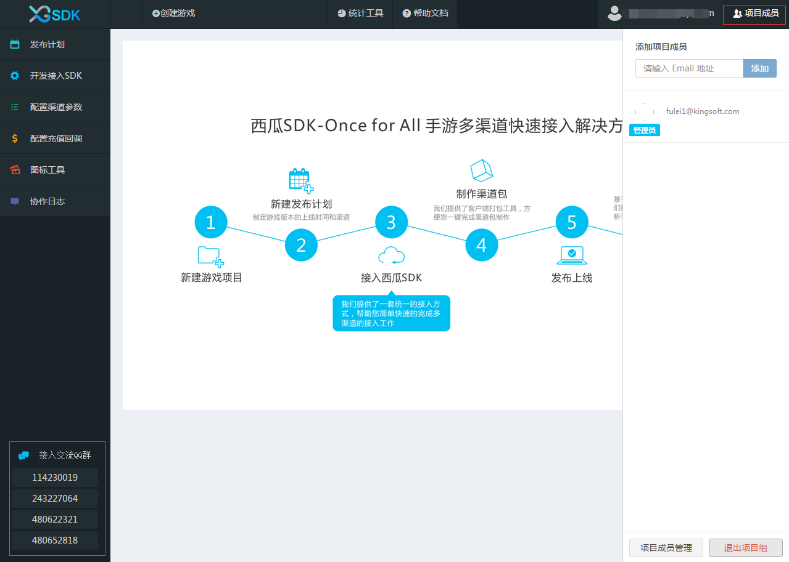

## 西瓜SDK快速入门

西瓜SDK — ONCE FOR ALL手游多渠道快速接入解决方案： 
- 创建游戏
- 创建发布计划：制定游戏版本的上线时间和渠道
- 接入西瓜SDK
- 制作渠道包：西瓜提供了客户端打包工具，实现一键完成多渠道包制作
- 发布上线
- 查看运营数据：西瓜提供了一套完善的数据运营分析平台

### 西瓜v2.0功能亮点：
1.在线接口验证：主要通过游戏接入**测试渠道**来实现，当游戏接入测试渠道后，可在西瓜SDK官网portal上所提供的西瓜SDK接入校验功能板块中观察检验结果，查看接口是否调用成功。  
- 未调用状态：如图所示；

- 调用成功状态：当游戏正确按照接入文档接入指定接口（例如login），并且触发login之后，可在西瓜SDK接入验证平台portal上观察到login按钮的调用状态如下图；

- 调用失败状态：如果游戏已经正确接入指定接口，但是由于参数配置不正确等情况，在西瓜SDK接入验证平台portal上可观察到调用异常，会有来自西瓜SDK的提示如图；

2.增加“项目成员”功能：可以为成员开通游戏权限，并进行项目成员管理，更好的了解游戏进展。
3.接入交流QQ群：可以通过此QQ群直接与我们进行交流。

