# 详细说明

西瓜 SDK 为游戏商提供一套完整的 SDK 接入方案，一次性解决游戏 SDK 接入问题，整个接入过程不会改变、影响任何 SDK 的功能、参数等，整个过程对于最终玩家而言是透明的。
游戏商只需专注于游戏不必为接入时渠道间的差异而苦恼，将这些烦恼都交给我们来解决。西瓜 SDK 包括了渠道 SDK 、支付系统、数据统计等等。
游戏商可以根据自身游戏的技术架构选择对应的 SDK 版本，并参考相应的接入指南。下面将对整个西瓜SDK功能进行详细说明。
<ol><B>
<li><a href="#1">注册登陆</a></li>
<li><a href="#2">个人信息编辑</a></li>
<li><a href="#3">游戏、发布计划</a></li>
<li><a href="#4">开发接入SDK</a></li>
<li><a href="#5">配置渠道参数、充值回调地址、图标资源</a></li>
<li><a href="#6">项目成员管理</a></li>
<li><a href="#7">协作日志</a></li>
<li><a href="#8">高级配置</a></li>
<li><a href="#9">充值补单</a></li>
<li><a href="#10">统计工具</a></li>
<li><a href="#11">接入交流</a></li>
<li><a href="#12">打包工具使用说明</a></li>
</B></ol>

### 1. 注册登录

西瓜提供新用户免费注册，注册时请填写真实信息，以便找回密码和后续反馈交流；注册得到账号后即可做好登录姿势，如果此时您忘记了密码，请点击“忘记密码”开启密码重置技能。

<!--
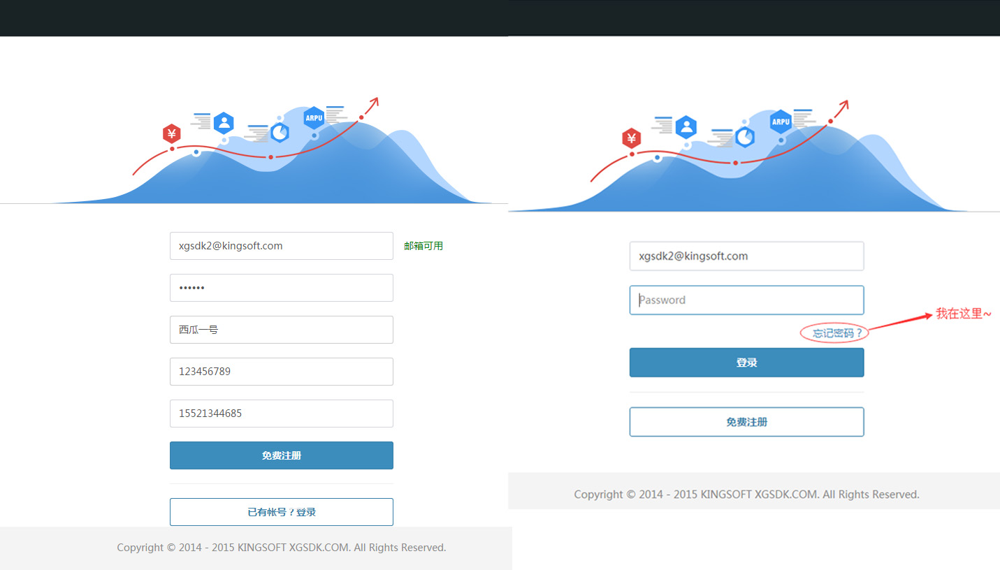

-->

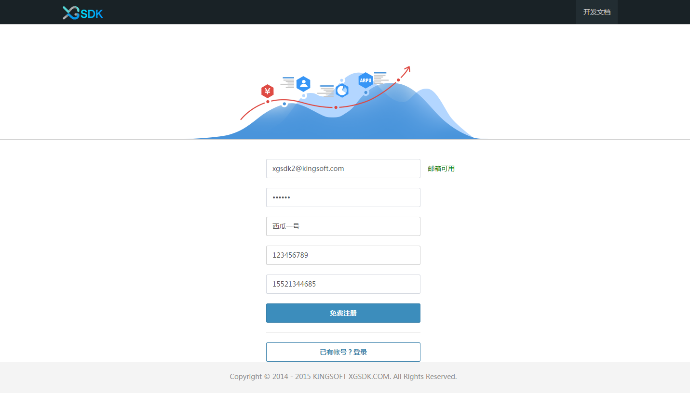

<!--
#### 1.2 登陆
用户输入用户名和密码登陆，当忘记密码时，点击如图所示的“忘记密码”找回密码。

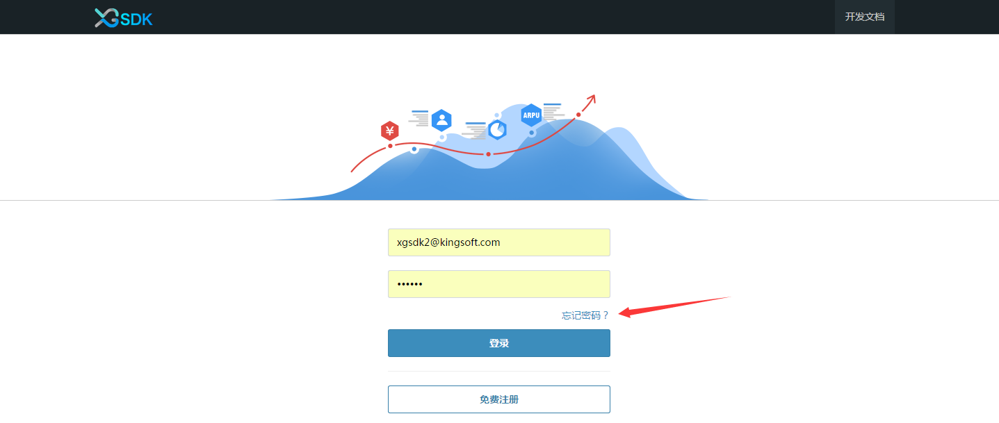

找回密码时需输入注册时的邮箱号码和正确的验证码，然后发送验证邮件。再收到验证邮件之后，点击邮件中的验证链接，将跳转到重置密码页面，输入新密码即可。整个过程如下图所示。

发送验证邮件

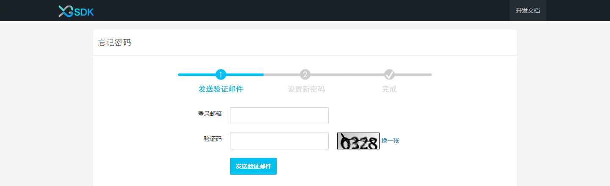

验证邮件成功发送

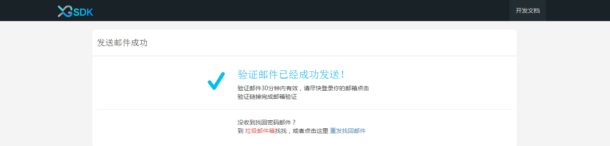

邮箱接收验证链接

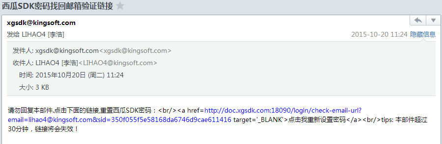

重置密码

重置密码成功

-->

### 2. 个人信息编辑
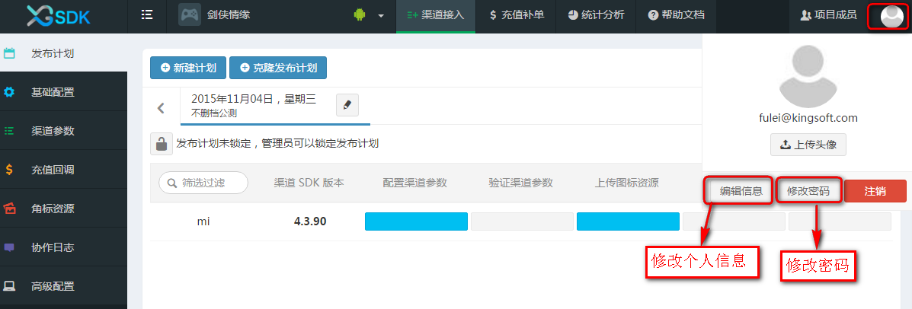

编辑个人信息： 可以对个人的昵称、手机号码、QQ号码进行更改

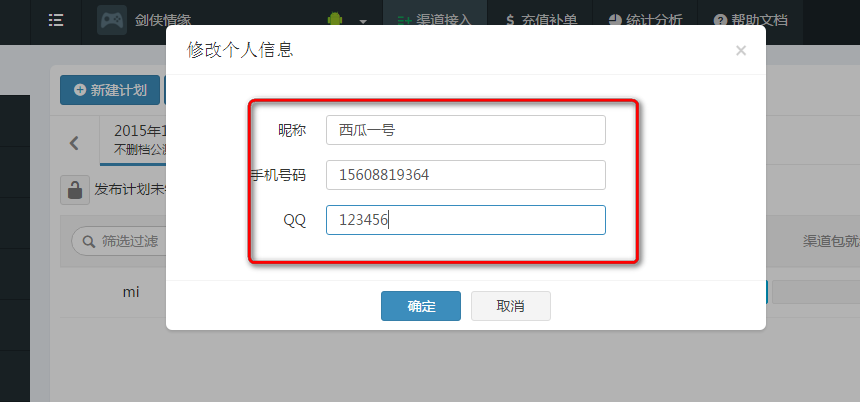

修改密码：

### 3. 游戏、发布计划

#### 3.1 游戏创建与编辑
在所有的工作开始前，请先创建游戏。

3.1.1 游戏创建  
- 游戏名称：同一个用户不能创建2个相同名称的游戏；  
- 选择游戏平台：支持多选，如果创建时只选择了Android，后期需要增加ios平台，可在 **开发接入SDK->游戏配置中点击“修改”** 增加ios平台即可；
- 游戏类型：选择游戏所属类型；
- 上传游戏图标（可选项）。  
输入以上信息点击确认即可。

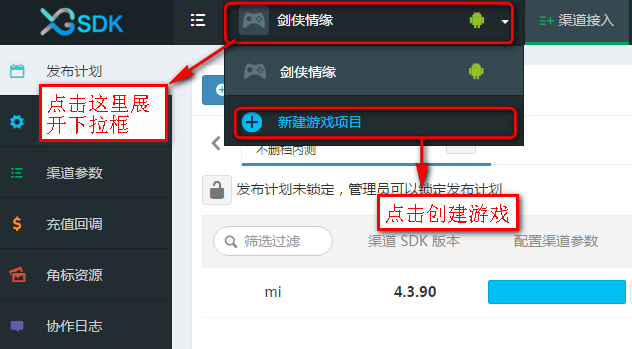

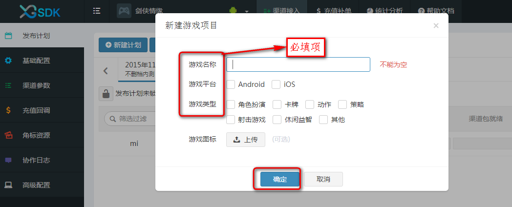

3.1.2 编辑游戏  
编辑时可以对游戏的名称、类型、图标、游戏屏幕方向、游戏引擎进行更改，也可增加平台。

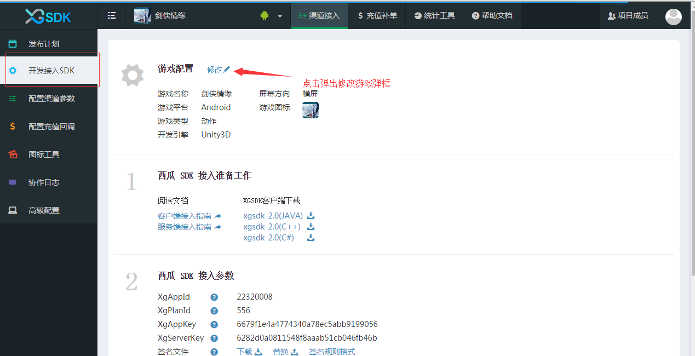

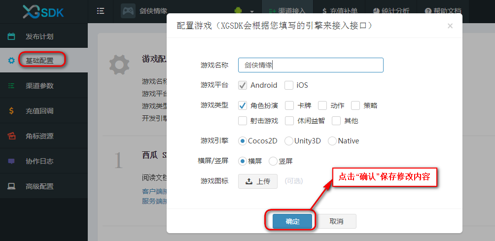

#### 3.2 发布计划创建、编辑、克隆、锁定
3.2.1 创建发布计划  
点击“新增计划”开始创建一个新的发布计划，可以更好的跟进游戏的接入完成进度，避免影响上架时间

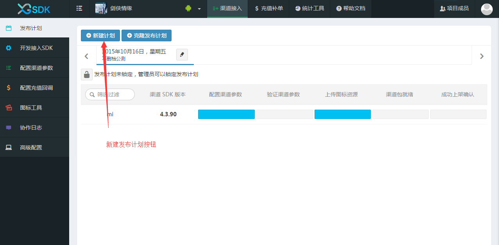

输入完整信息：  
- 上线日期：游戏上架时间；  
- 计划名称：如删档内测版、不删档公测版等；  
- 发布渠道：选择游戏上线渠道，至少要选择一个渠道；在选择渠道时可以选择所需的渠道SDK版本（默认版本是当前所支持的最新版本，如图中红框所示），点击创建完成创建发布计划。

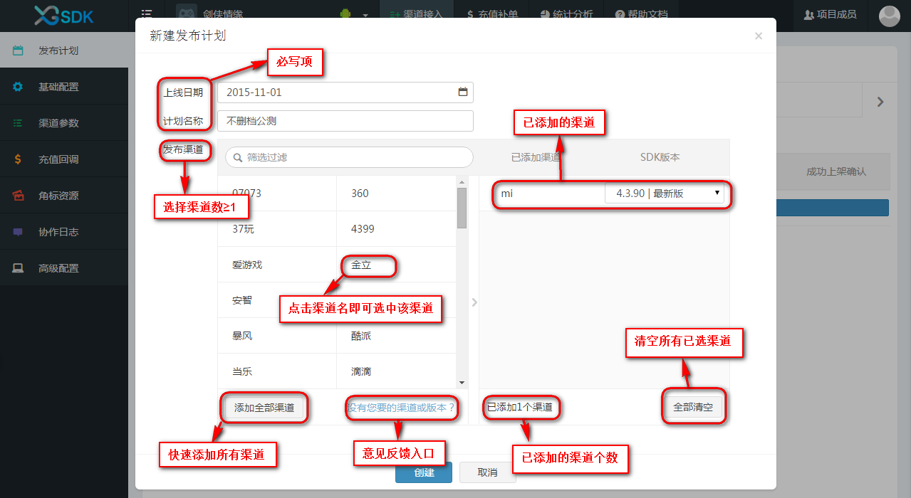

如果在创建发布计划没有您所需要的渠道或者渠道版本，请反馈给我们。

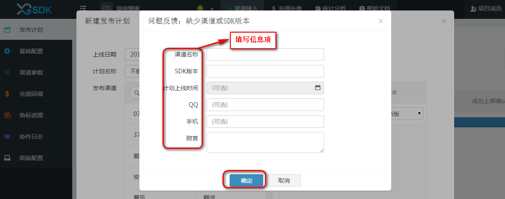

3.2.2 编辑发布计划  
在编辑发布计划中您可以修改该计划的上线时间，计划名称以及渠道

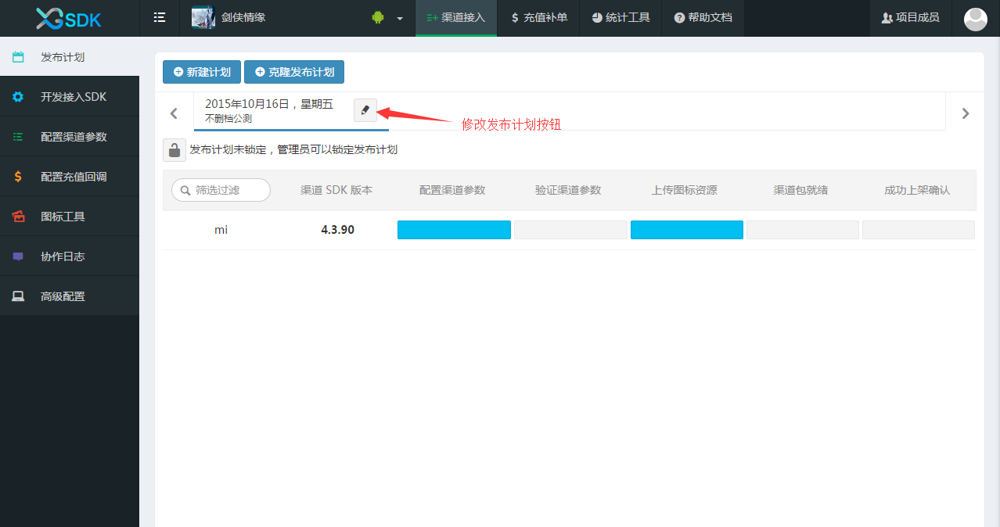

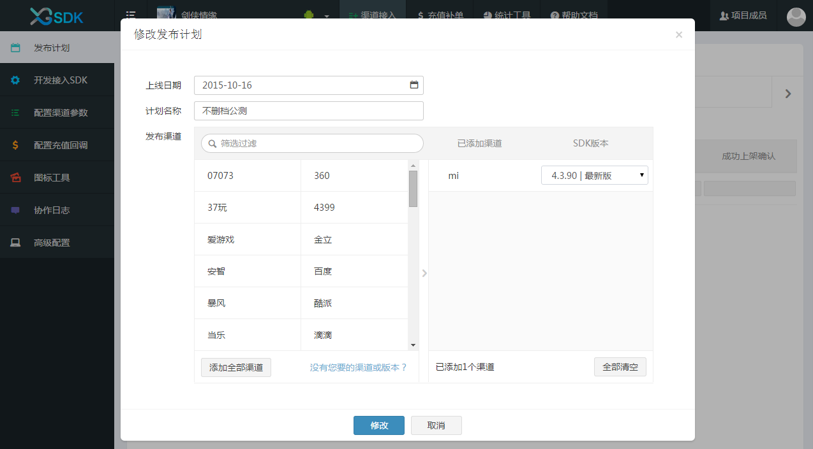

发布计划中的5步代表含义：  
- 第1步——配置渠道参数：需要将申请到的渠道参数配置到西瓜potal（配置渠道参数详细过程请参考** <a href="#5"> 5配置渠道参数</a> ** ）
- 第2步——验证渠道参数：接入西瓜SDK并用西瓜的打包工具生成DEMO包后，进行参数的验证（参数验证详细过程请参考** <a href="#5"> 5.5渠道参数验证</a> ** ）  
- 第3步——上传图标资源：如果渠道要求有角标，则需要上传指定格式的角标资源；若无角标要求，即可忽略此步
- 第4步——渠道包就绪：利用打包工具打出渠道包，打包完成后在打包工具中点击“就绪”即可点亮（仅代表一个打包完成状态）  
- 第5步——成功上架确认：渠道包通过渠道审核后手动点亮发布计划中的“成功上架”（此步只是一个状态表示，亮灭均不会影响游戏上架）  

温馨提示：虽然完成渠道参数配置后，就可以进行打包，但是西瓜强烈建议您进行渠道参数验证和根据渠道要求上传图标资源。

3.2.3 克隆发布计划  
克隆发布计划可以选定当前已有的发布计划，克隆其渠道与参数，如果您想修改克隆的渠道，可在克隆后点击改计划后的“修改按钮”进行修改；  
本功能避免了对同一渠道的参数的二次填写，降低填写过程中出错的几率。

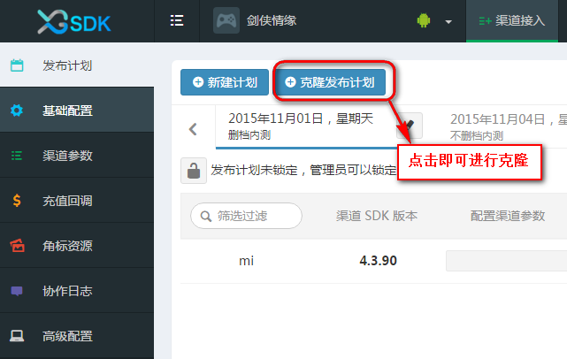

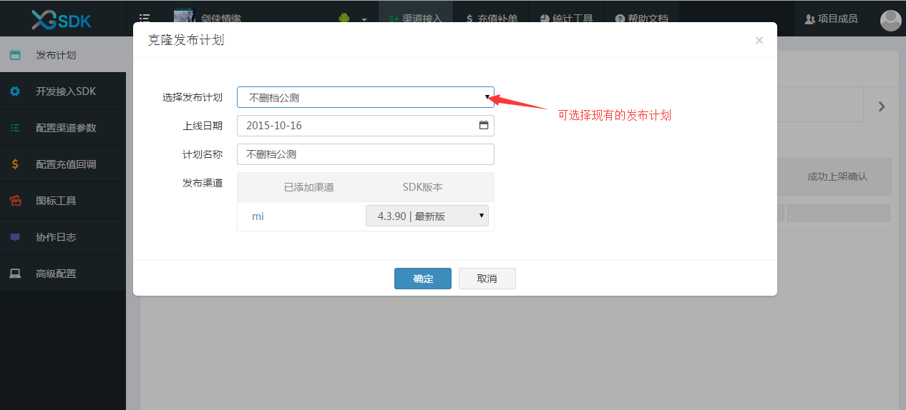

3.2.4 锁定发布计划（只有管理员才有该功能的操作权限）  
如果您是管理员，就有权限进行锁定和解锁操作；锁定后渠道参数、充值回调地址、图标资源、签名文件都不可修改，需解锁后才能修改。  

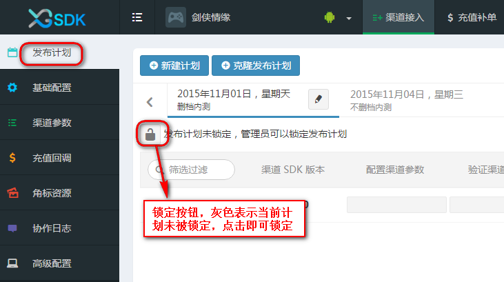

锁定按钮被点亮表示当前计划被锁定，如图：

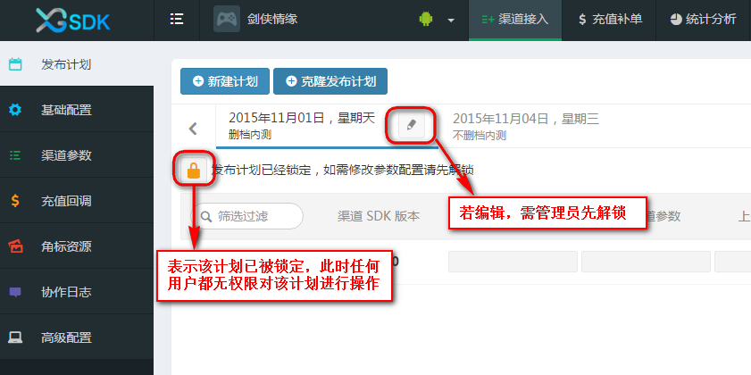

温馨提示：游戏上线后锁定对应的发布计划，可有效避免一些失误操作。

### 4. 开发接入SDK

#### 4.1  点击开发接入 SDK
在弹出窗口选择游戏引擎类型、屏幕样式

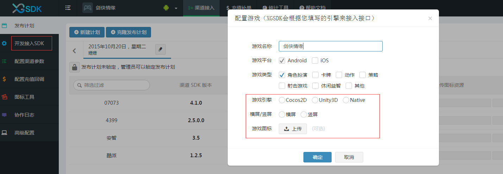  

#### 4.2  将西瓜接入参数配置到游戏中
- 新游戏如何获取接入参数：创建一个新游戏就可以获得西瓜分给游戏的接入参数：产品代码、服务端密钥、客户端密钥
- 已创建的游戏如何获取接入参数：如果游戏已创建完成，则可以点击"开发接入SDK"查看分配给游戏的接入参数，具体如下：

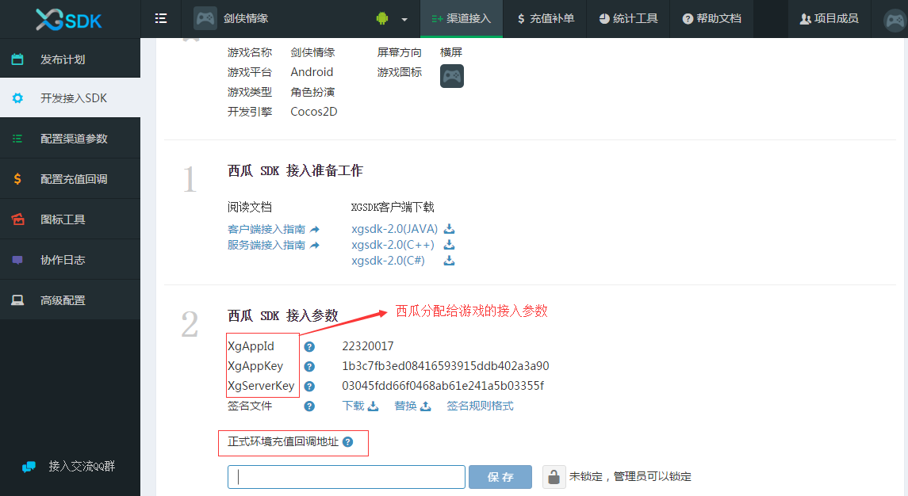

#### 4.3  进行SDK接入  
   - 点击下载"客户西瓜 SDK 包"
   - 参考<a href="../section2/README.md">客户端接入指南</a>和<a href="../section3/README.md">服务端接入指南</a>进行接入(客户端接入指南包括: cocos2d-x 引擎接入指南、unity3d 引擎接入指南、原生接口接入指南；服务端指南包括：session 验证、支付通知)  

<!--
#### 4.4  配置测试环境充值回调地址（游戏在接入西瓜的 **测试渠道** 时所需配置的充值回调地址）

#### 4.5  接口接入校验  

西瓜SDK接入校验主要通过在线检验，现说明如下：  
在线校验主要通过游戏接入**测试渠道**来实现：当游戏接入测试渠道后，可在西瓜 SDK 官网 portal 上所提供的西瓜 SDK 接入校验功能板块中观察检验结果，共有三种状态：
- 未调用状态：如图所示

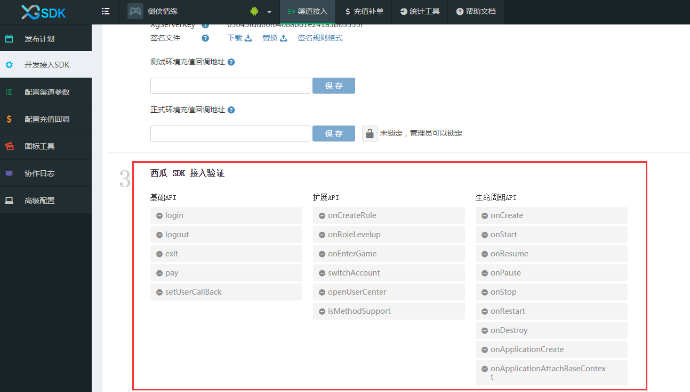

- 调用成功状态：当游戏正确按照接入文档接入指定接口（例如login），并且触发login之后，可在西瓜SDK接入验证平台portal上观察到login按钮的调用状态如图所示

- 调用失败状态：如果游戏已经正确接入指定接口，但是由于参数配置不正确等情况，在西瓜SDK接入验证平台portal上可观察到调用异常，会有来自西瓜SDK的提示如图所示

**注意：**

1. 西瓜SDK在线检验只是验证游戏是否成功调用相应接口，例如：如果pay接口被激活并不代表充值一定到账，仅代表游戏成功接入西瓜SDK的pay接口。

2. 游戏只需要激活其想接入的接口即可出包，并不需要激活所有接口，例如：只接入login接口，则无需在意其他接口的状态。

3. 此接口验证步骤是非必须的，但是西瓜强烈建议对接入的接口进行检验。

-->

### 5. 配置渠道参数、充值回调地址、图标资源

#### 5.1 渠道参数

 5.1.1 此处配置的渠道参数为开发者在渠道申请得到的应用参数，渠道参数的具体申请步骤请参考<a href="../section4/README.md">参数申请指南</a>获取相应渠道的渠道参数

5.1.2 将获取到的渠道参数填入对应渠道的参数表中  

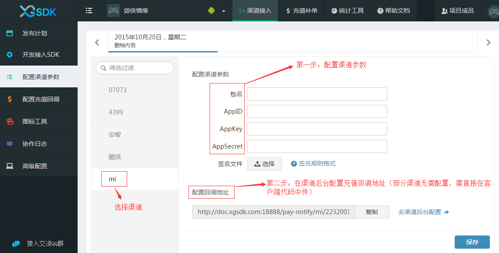

5.1.3 去渠道后台配置游戏充值回调地址（可直接点击“去渠道后台配置”进行跳转），其中充值回调地址是 **渠道服务器通知西瓜SDK服务器支付订单信息的地址**  

5.1.4 点击保存

5.1.5 渠道参数配置好后，进行参数验证（此步骤并不是必须的，但是建议对参数进行验证）：利用西瓜提供的打包工具生成demo包进行渠道参数的验证，即实现如下三点：
- 能够正常登陆；
- 所有渠道所支持的充值方式均能成功调起即弹出充值页面；
- 选择一种充值方式充值到账。

5.1.6 签名文件  

 签名文件分为3种：
 - 渠道有要求必须使用渠道所提供的签名文件（目前只有新浪、当乐对签名文件有要求），按照规定的<a href="../section2/signature.md">签名文件格式</a>生成签名文件并进行上传；  
 - 在渠道对签名文件无要求时，游戏可使用自己提供的签名文件，按照规定的<a href="../section2/signature.md">签名文件格式</a>生成签名文件并进行上传；
 - 渠道、游戏对签名文件均无要求时，即可使用西瓜为游戏生成的默认签名文件，此时不必上传签名文件，若想获取此签名文件可在如图所示地方进行下载。

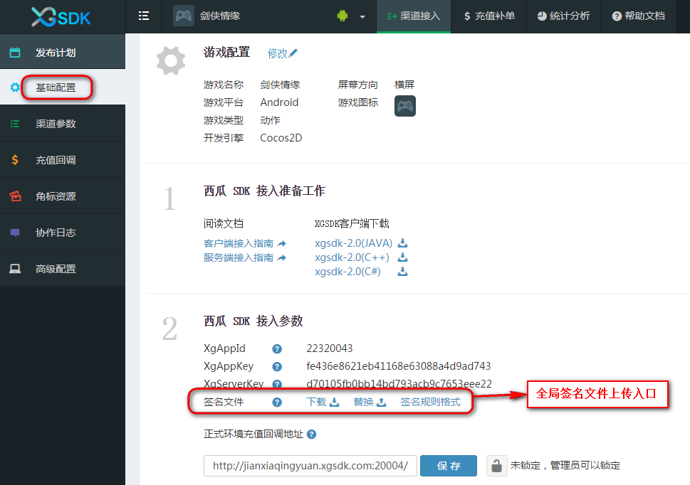

#### 5.2 充值回调地址
此处所说的充值回调地址是指：**游戏服务器接收订单支付信息的接口地址**，该地址的配置有三种方式：

- 游戏通过客户端代码传此地址（最高优先级）
- 在 **配置充值回调地址** 中对不同的渠道配置不同的充值回调地址，如图所示（次优先级）

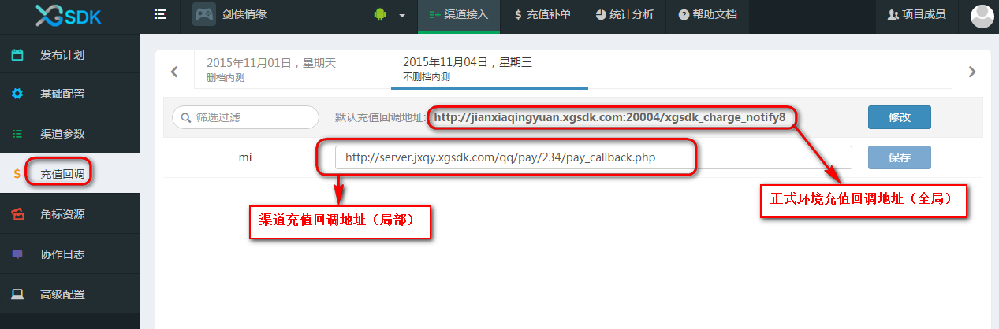

- 在如图所示的 **正式环境充值回调地址** 输入框中填写（此处只能填一个地址，最低优先级）

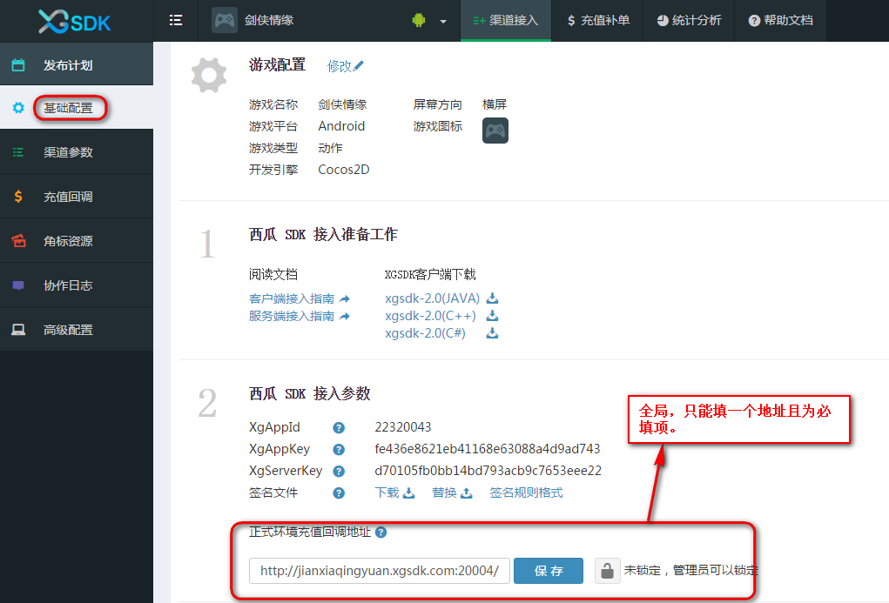

**注意：**   
当客户端代码中有传时则取所传的地址；  
若无则查看渠道充值回调地址输入框中有无地址，如果有则取此地址；若为空，取全局充值回调地址即正式环境充值回调地址。

#### 5.3 图标工具
部分渠道对角标有要求，具体要求列表<a href="../section4/icon.html#jiaobiao"> 请点击此查看。 </a>  
对于有角标要求的渠道，首先下载渠道相对应的角标、闪屏素材和制作要求，再参考** <a href="../section4/icon.md">角标制作规范</a>** 制作符合渠道要求的游戏图标资源进行上传。

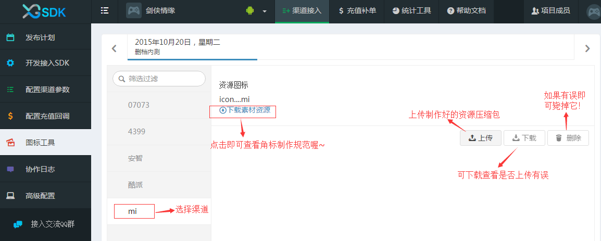

上传的角标资源压缩包结构如下所示，里面的文件夹一个都不能少喔，每个文件夹下都有一张不同分辨率的图标。

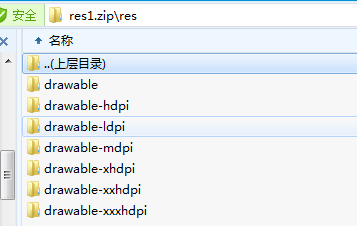

### 6. 项目成员管理

系统中的用户，分为管理员和普通用户；两种用户在权限上存在着一定的差异，例如只有管理员才可以对发布计划进行修改锁定、查看协作日志、添加成员管理等等。  
用户在创建一个游戏后，会自动成为此游戏的管理员。在游戏接入的过程中，通常会需要多个工作人员的协作，这时可以通过点击页面上的“项目成员”，输入用户邮箱的方式添加新成员，新添加的项目成员默认身份为普通用户，管理员可以通过点击“成员管理”，来对用户进行身份设置或移除。  
当用户不再希望参与某个游戏时，可以点击退出该游戏，退出后该用户不再是该游戏的项目成员，无法查看游戏的所有信息，退出的用户还可以通过其他管理员再次添加进游戏。

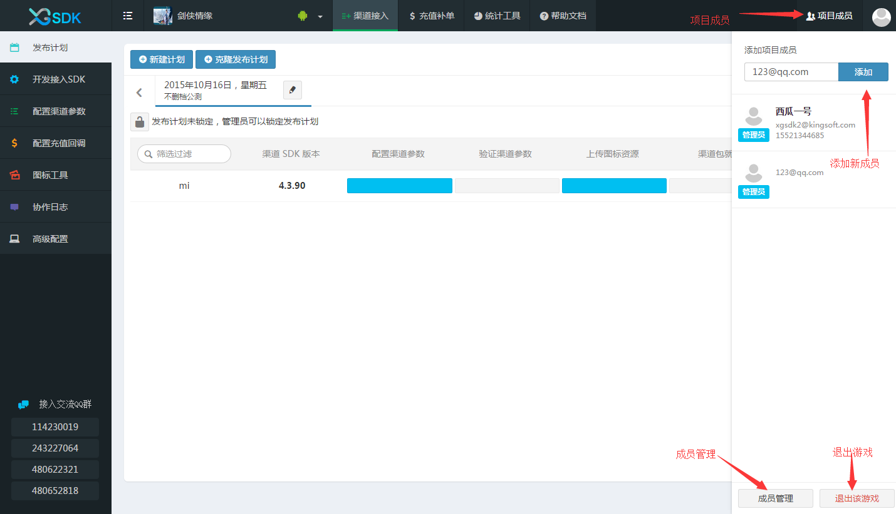

### 7. 协作日志
当多用户一同协作时，对参数、回调地址、资源等修改会变得十分频繁，有些变动可能十分细微而不易察觉，这些变动如果没有一个统一的记录，整个协作过程将变得十分混乱，对于追责和审阅都将十分不便。协作日志将帮助用户解决这一困扰，每一个用户的任何动作都将被记录在协作日志之中，通过查询协作日志，可以清晰的看到整个游戏的变动更改情况。

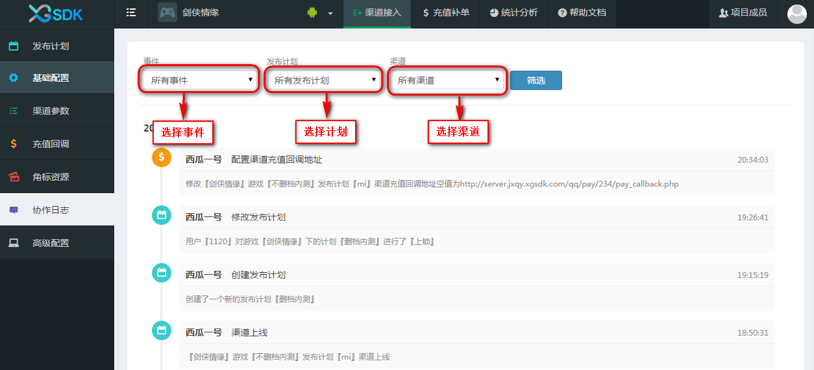

筛选查找：可以对某一特定事件、发布计划、渠道来进行查询，使得查询过程更快捷简便。

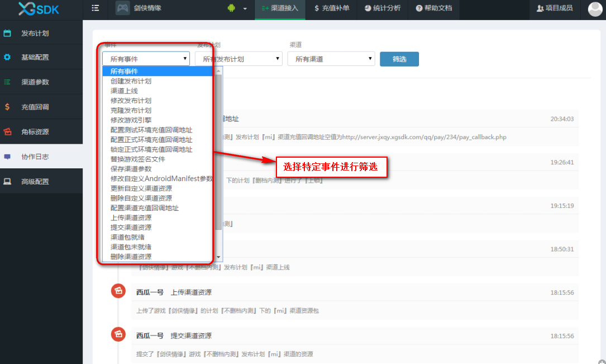

### 8. 高级配置
#### 8.1 使用自定义AndroidManifest参数

8.1.1 使用场景  

在AndroidManifest.xml文件中，可能我们针对每个渠道会有一些不同的配置项，例如JPUSH插件，每个渠道都有不同的APPKEY值。这时候为了使用同一个游戏母包进行打包操作，游戏开发者需要在母包的AndroidManifest.xml中使用一个通配符来标识这个配置项，然后通过Portal后台配置这个通配符在各个渠道的值，西瓜SDK就可以在打包阶段正确地打出每一个渠道包。

目前西瓜SDK支持10个AndroidManifest自定义参数。分别是：
- xg_param1
- xg_param2
- xg_param3
- xg_param4
- xg_param5
- xg_param6
- xg_param7
- xg_param8
- xg_param9
- xg_param10

这些KEY值目前是固定的。value值可以在Portal-高级配置中进行指定。

8.1.2 操作  

以配置JPUSH_APPKEY为例，JPUSH_APPKEY的值在每个渠道都是不一样的，我们这里使用xg_param1这个自定义参数值（当然你也可以选择其他的）：

- 在母包的AndroidMinifest.xml文件内容：

		<meta-data android:name="JPUSH_APPKEY" android:value="$xg_param1$" />

- 依次在【高级配置】 -> 【发布计划】 -> 【渠道】，进行参数值的配置。如下图所示，我们配置一个UC渠道的JPUSH_APPKEY的值。如有多个渠道请每个渠道分别配置对应的JPUSH_APPKEY的值。

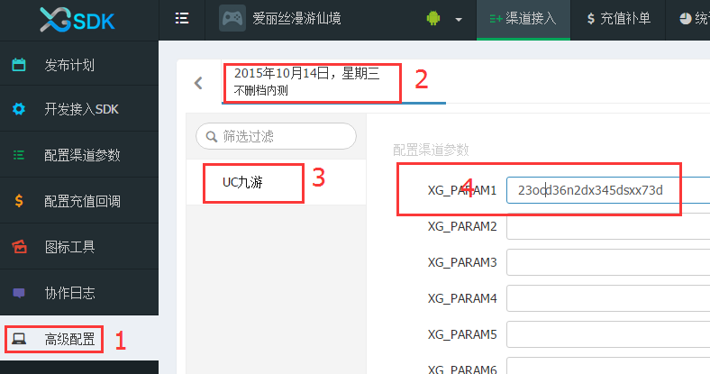

- 使用西瓜提供的打包工具（含命令行工具）进行打包之后，最终生成的渠道包apk中的AndroidManifest.xml对应的配置将被替换成：

		<meta-data android:name="JPUSH_APPKEY" android:value="23ocd36n2dx345dsxx73d" />

8.1.3 注意

- 目前的KEY是固定的，支持10个自定义参数，可以自由选择使用哪一个。

- 母包中如果使用了自定义参数，则必须在Portal中对应的发布计划和渠道必须配置对应的参数值，否则无法打包成功。

- 如果同一个发布计划中有一部分渠道不需要自定义参数，比如计划【游戏内测发布计划】中有三个渠道，分别是：【360】、【UC】、【爱游戏】，其中【360】和【UC】两个渠道有自定义参数，【爱游戏】没有自定义参数，那么请使用带自定义参数和不带自定义参数的两个母包，并且在实际打渠道包的时候针对【360】和【UC】使用带参数母包，针对【爱游戏】使用不带参数的母包。

- 自定义渠道参数的值不支持为空的替换。例如【爱游戏】渠道不需要配置**JPUSH_KEY**，则需要提供一个AndroidManifest.xml中不含有**JPUSH_KEY**的母包，而不能将【爱游戏】中的**JPUSH_KEY**的自定义参数值设置为""（空字符串）。

#### 8.2 使用自定义渠道资源

8.2.1 使用场景  

某些渠道需要在apk包中放置一些必要的资源文件，例如【爱游戏】需要将feeInfo.dat文件放置在assets目录下。
我们在Portal中的高级配置下可以指定渠道上传自定义游戏资源，该资源将在打渠道包的过程中，被拷贝到apk根目录下。

8.2.2 操作  
以【爱游戏】配置feeInfo.dat资源为例，该文件需要放置在assets目录下。

- 在本地创建assets目录，将feeInfo.dat放置于assets目录中。

- 将assets目录压缩成zip包，文件名可自由定义，例如叫**custom_res.zip**。此zip包的结果如下：

		custom_res.zip
            |_ assets
                |_ feeInfo.dat

3. 导航到【高级配置】 -> 【发布计划】 -> 【渠道】，点击上传按钮，选择刚刚生成的**custom_res.zip**包上传，如下图所示：

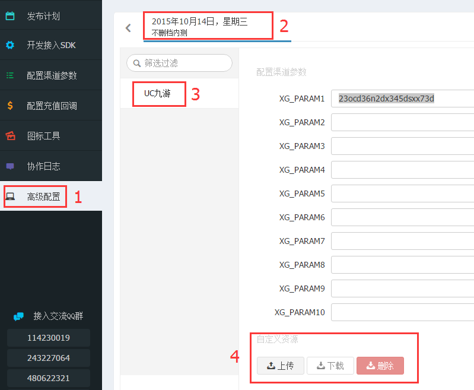

### 9. 充值补单（没有用户权限的限制）
进入充值补单界面，如果游戏在24小时之内有出现“游戏拒绝”状态的订单，页面上会出现提示，可以点击立即处理来对游戏拒绝订单进行处理。  
点击补单按钮，会对“游戏拒绝”的订单进行补单，补单成功后，订单状态从“游戏拒绝”变成“订单初始化”。

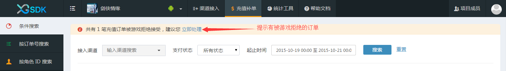

充值补单可以对所有订单进行查询，可以设定特定渠道、订单状态、订单时间等搜索条件。当订单状态为“游戏拒绝”时，该订单会显示补单按钮，点击补单按钮，会对“游戏拒绝”的订单进行补单，补单成功后，订单状态从“游戏拒绝”变成“订单初始化”，补单按钮将会消失。

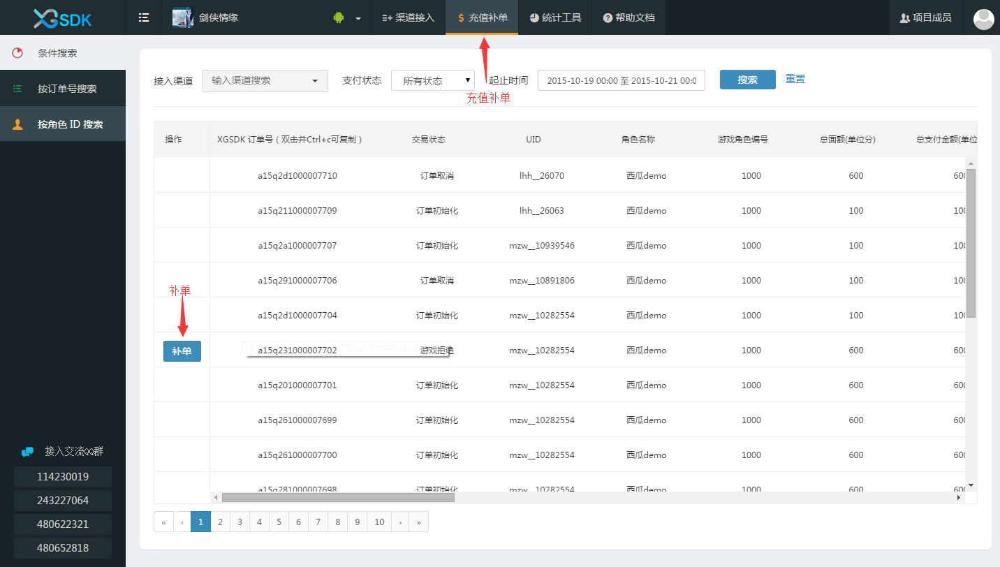

系统还提供了按订单号搜索和按角色ID搜索功能，用于查找一个或多个订单和某个角色相关的所有订单。

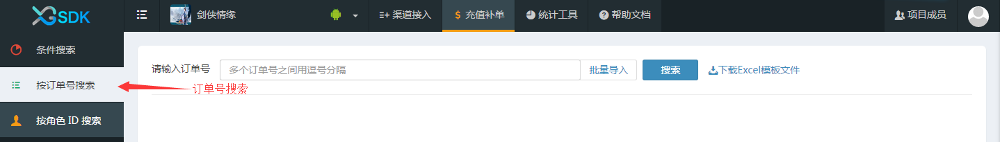

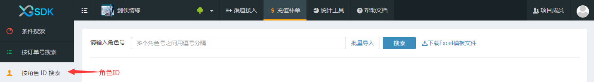

### 10. 统计工具
点击“统计工具”即可跳转到西瓜数据统计平台，请点击这里查看具体说明。（此处需要一个链接）

### 11. 接入交流
西瓜提供了QQ群以方便用户的交流反馈，感谢您对西瓜SDK的支持。

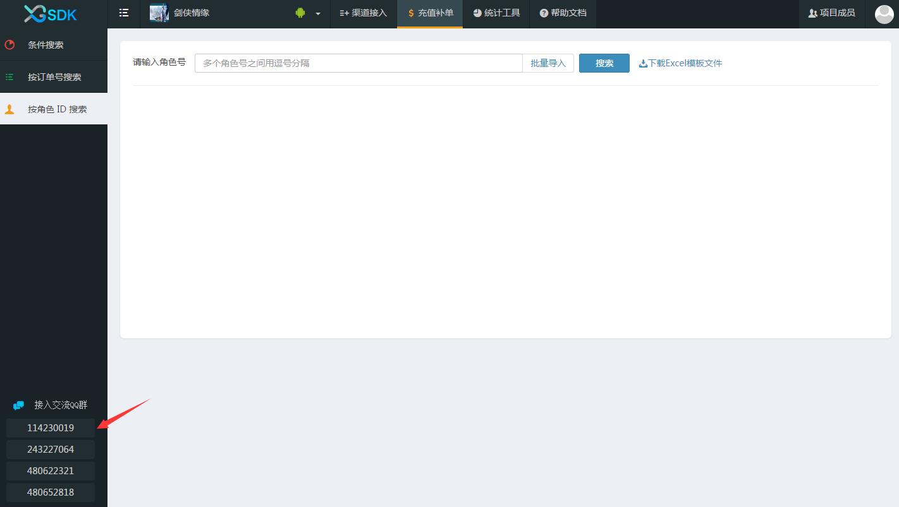

### 12. 打包工具使用说明
#### 12.1 打包工具简介
 通过打包工具可以实现使用一个游戏母包打出多个渠道包，同时也可以将角标、闪屏等资源文件打入包中，实现真正的一键式打包。
#### 12.2 环境要求
JDK1.8及以上版本

#### 12.3 使用步骤

12.3.1 下载&安装西瓜打包工具

可在这里<a href = "http://console.xgsdk.com/download.html">下载打包工具</a>，或者在 **开发接入SDK -> 下载打包工具** 中进行下载。

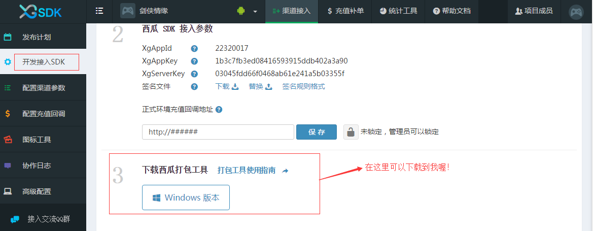

在本地进行安装。  

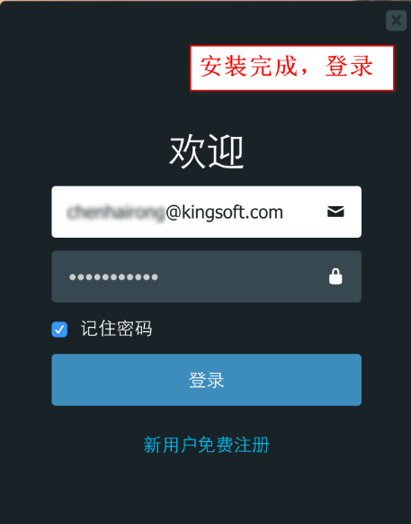

#### 12.4 检查配置

点击刷新按钮以获得最新的发布计划(服务器端预先配置)以及加载渠道配置，检查配置参数是否完善，并根据需要选择需要打包的渠道。

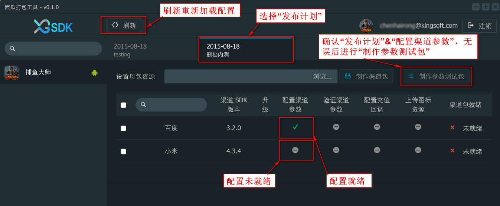

#### 12.5 开始制作

 - 制作参数测试包

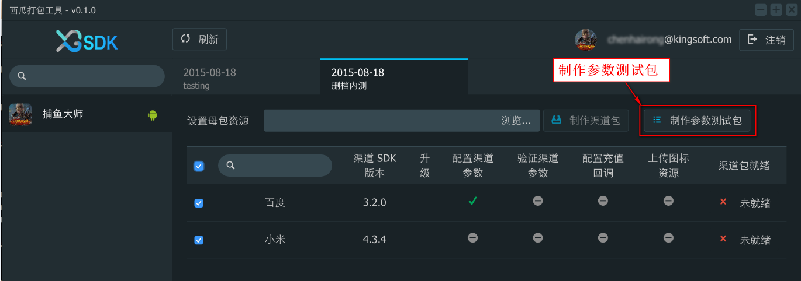

 - 制作渠道包
 手动设置母包_.png
 需手动选择设置母包资源, 点击"制作渠道包" 打包工具开始对所选择的渠道以及已加载的配置进行打包, 可以通过底部的输出控制台查看打包运行状况,过程中可能需要从服务器下载对应的资源以及工具,请留意输出控制台的日志输出以更好的监测打包工具运行步骤以及状态

- 制作过程

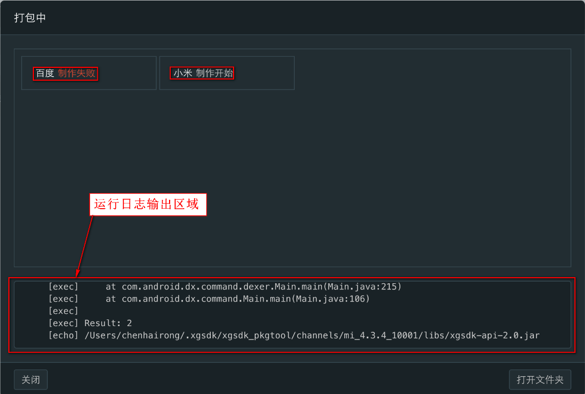

#### 12.6 查看打包输出结果

主界面将会呈现打包结果(所选渠道的打包结果："制作成功"/"制作失败")， 点击"打开文件夹"以查看打包输出,
 - 制作成功将会看到成功打包的程序安装包以及日志记录

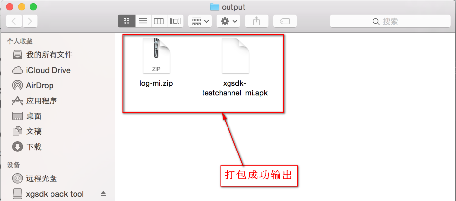

 - 制作失败只有日志文件输出

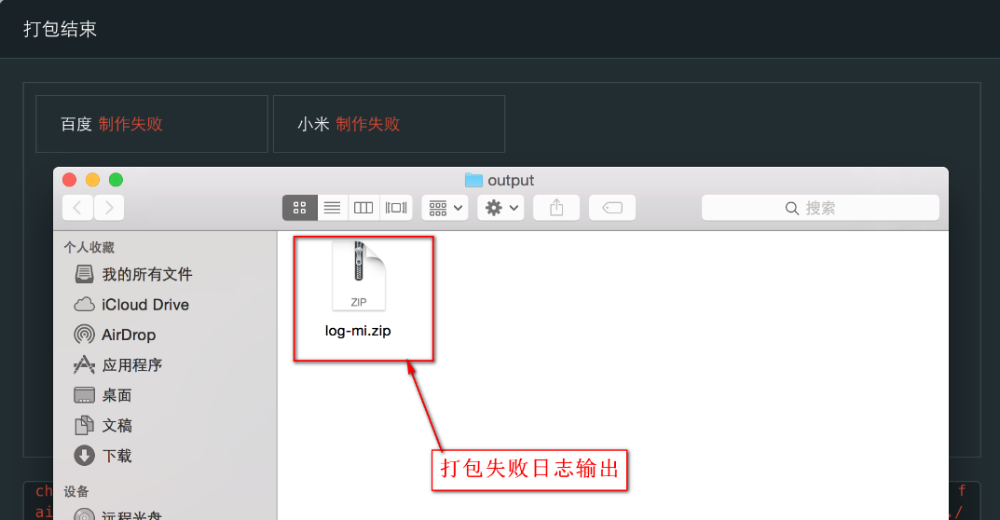

#### 12.7 更新打包结果
回到主界面对不同渠道进行状态更新以标记渠道包是否就绪

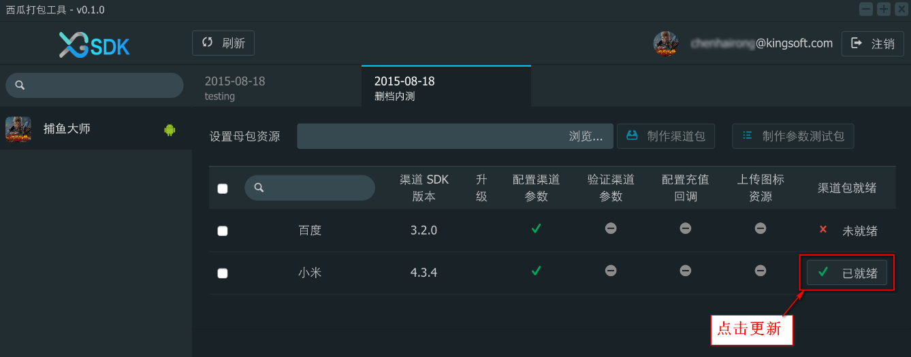
