# 详细说明
---
<ol><B>
<li><a href="#1">注册登陆</a></li>
<li><a href="#2">个人信息编辑</a></li>
<li><a href="#3">创建游戏、发布计划</a></li>
<li><a href="#4">基础配置</a></li>
<li><a href="#5">渠道参数、充值回调、角标资源</a></li>
<li><a href="#6">项目成员管理</a></li>
<li><a href="#7">协作日志</a></li>
<li><a href="#8">高级配置</a></li>
<li><a href="#9">充值补单</a></li>
<li><a href="#10">统计分析</a></li>
<li><a href="#11">接入交流</a></li>
<li><a href="#12">打包工具（Android版本）使用说明</a></li>
<li><a href="#packageios">打包工具（ios版本）使用说明</a></li>
</B></ol>

### 1. 注册登录

西瓜提供新用户免费注册，注册时请填写真实信息，以便找回密码和后续反馈交流；注册得到账号后即可登录，如果此时您忘记了密码，请点击“忘记密码”开启密码重置技能。

<!--

-->

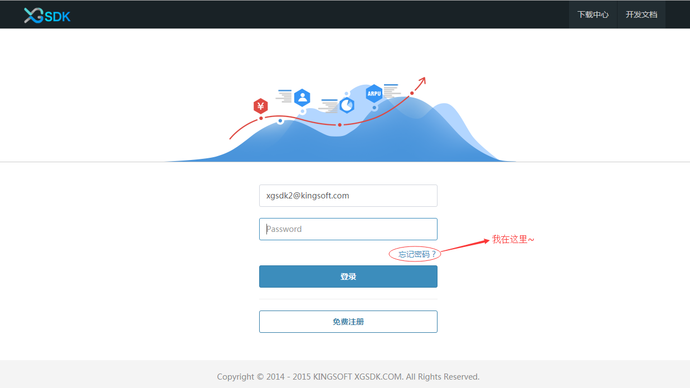

<!--
#### 1.2 登陆
用户输入用户名和密码登陆，当忘记密码时，点击如图所示的“忘记密码”找回密码。

找回密码时需输入注册时的邮箱号码和正确的验证码，然后发送验证邮件。再收到验证邮件之后，点击邮件中的验证链接，将跳转到重置密码页面，输入新密码即可。整个过程如下图所示。

发送验证邮件

验证邮件成功发送

邮箱接收验证链接

重置密码
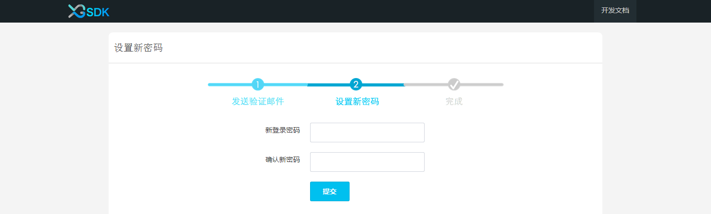

重置密码成功

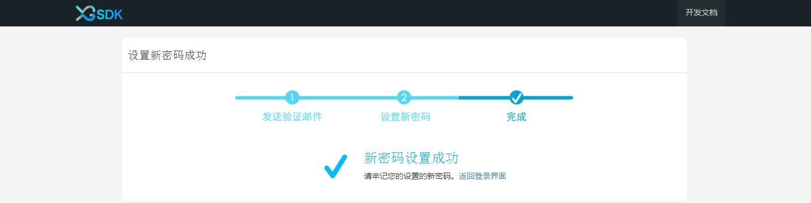

-->

### 2. 个人信息编辑
点击自己的头像即可出现“编辑信息”和“修改密码”的入口

编辑个人信息： 可以对个人的昵称、手机号码、QQ号码进行更改

修改密码：

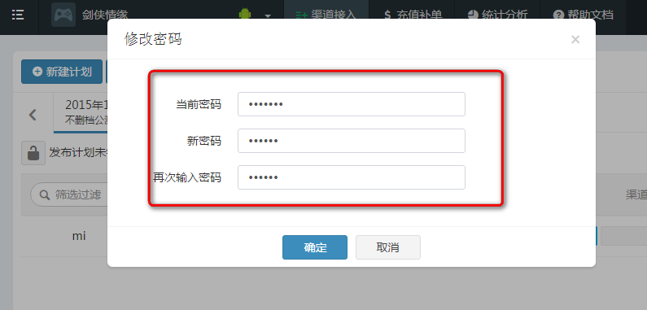

### 3. 创建游戏、发布计划

#### 3.1 游戏创建与编辑
在所有的工作开始前，请先创建游戏。

3.1.1 游戏创建  
- 游戏名称：同一个用户不能创建2个相同名称的游戏；  
- 选择游戏平台：支持多选，如果创建时只选择了Android，后期需要增加ios平台，可在 **基础配置->游戏配置中点击“修改”** 增加ios平台即可（<a href="#addios" target="_blank">查看详细步骤</a>）；
- 游戏类型：选择游戏所属类型；
- 上传游戏图标（可选项）。  
输入以上信息点击确认即可。

添加已创建游戏的ios平台步骤：

点击“基础配置”-->点击“修改”

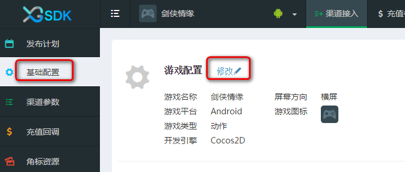

选择需要增添的ios平台，点击确认

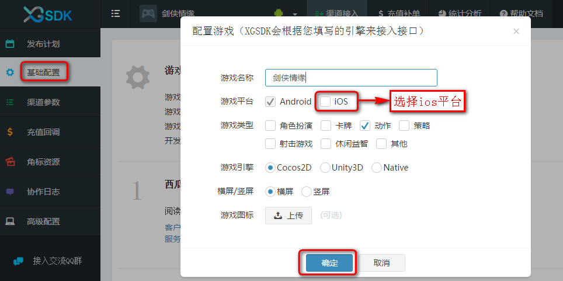

3.1.2 编辑游戏  
在“基础配置”中点击“修改”即可进行编辑，可以对游戏的名称、类型、图标、游戏屏幕方向、游戏引擎进行更改，也可增加平台。

点击“确认”保存修改内容

#### 3.2 发布计划创建、编辑、克隆、锁定
3.2.1 创建发布计划  
点击“新增计划”开始创建一个新的发布计划，可以更好的跟进游戏的接入完成进度，避免影响上架时间

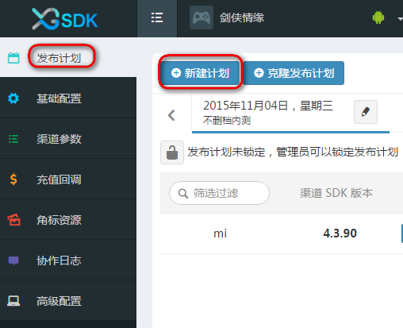

输入完整信息：  
- 上线日期：游戏上架时间；  
- 计划名称：如删档内测版、不删档公测版等；  
- 发布渠道：选择游戏上线渠道，至少要选择一个渠道；在选择渠道时可以选择所需的渠道SDK版本（默认版本是当前所支持的最新版本，如图中红框所示），点击创建完成创建发布计划。

如果在创建发布计划没有您所需要的渠道或者渠道版本，点击“没有您要的渠道或版本？”输入相应的信息点击“确定”，即可反馈给我们。

3.2.2 编辑发布计划  
在“发布计划”中点击编辑发布计划按钮，您可以修改该计划的上线时间，计划名称以及上线渠道

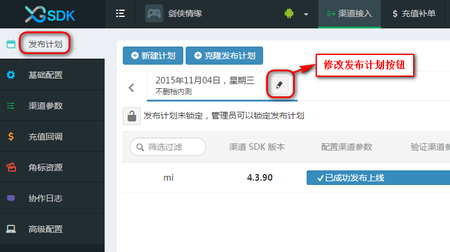

点击“修改”进行保存

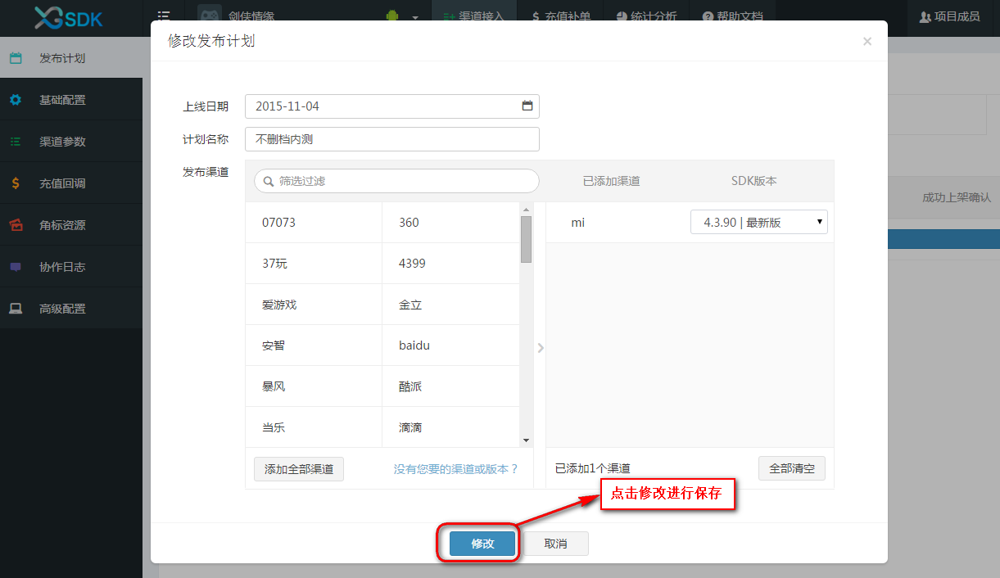

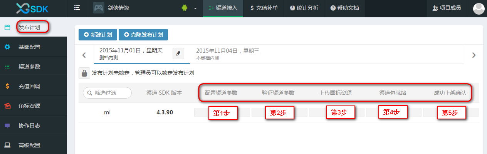

发布计划中的5步代表含义：  
- 第1步——配置渠道参数：需要将申请到的渠道参数配置到西瓜web控制台（配置渠道参数详细过程请参考** <a href="#5"> 5配置渠道参数</a> ** ）
- 第2步——验证渠道参数：接入西瓜SDK并用西瓜的打包工具生成DEMO包后，进行参数的验证
- 第3步——上传图标资源：如果渠道要求有角标，则需要上传指定格式的角标资源；若无角标要求，即可忽略此步
- 第4步——渠道包就绪：利用打包工具打出渠道包，打包完成后在打包工具中点击“就绪”即可点亮（仅代表一个打包完成状态）  
- 第5步——成功上架确认：渠道包通过渠道审核后手动点亮发布计划中的“成功上架”（此步只是一个状态表示，亮灭均不会影响游戏上架）  

温馨提示：虽然完成渠道参数配置后，就可以进行打包，但是西瓜强烈建议您进行渠道参数验证和根据渠道要求上传图标资源。

3.2.3 克隆发布计划  
克隆发布计划可以选定当前已有的发布计划，克隆其渠道与参数，如果您想修改克隆的渠道，可在克隆后点击改计划后的“修改按钮”进行修改；  
本功能避免了对同一渠道的参数的二次填写，降低填写过程中出错的几率。

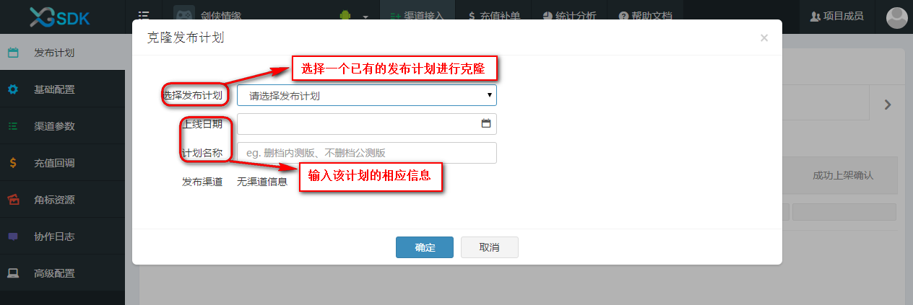

克隆后的发布计划只会继承父发布计划的2个进度条状态，即“配置渠道参数”和“上传图标资源”；若想点亮“验证渠道参数”需重新打参数包进行验证，验证通过即可点亮。

3.2.4 锁定发布计划（只有管理员才有该功能的操作权限）  
如果您是管理员，就有权限进行锁定和解锁操作；锁定后渠道参数、充值回调地址、图标资源、签名文件都不可修改，需解锁后才能修改。  

锁定按钮被点亮表示当前计划被锁定，如图：

温馨提示：游戏上线后锁定对应的发布计划，可有效避免一些失误操作。

### 4. 基础配置

#### 4.1  点击“基础配置”
在弹出窗口选择游戏引擎类型、屏幕样式

  

#### 4.2  将西瓜接入参数配置到游戏中
- 新游戏如何获取接入参数：创建一个新游戏就可以获得西瓜分给游戏的接入参数：产品代码、服务端密钥、客户端密钥
- 已创建的游戏如何获取接入参数：如果游戏已创建完成，则可以点击"基础配置"查看分配给游戏的接入参数，具体如下：

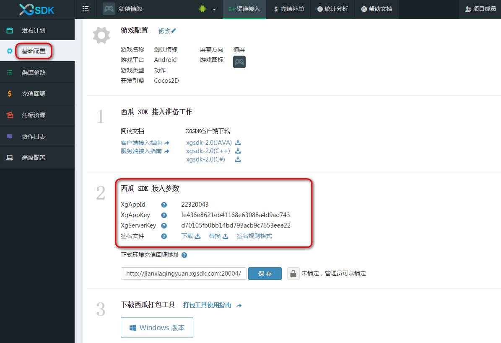

#### 4.3  进行SDK接入  
   - 点击下载"客户西瓜 SDK 包"
   - 参考<a href="../section2/README.md" target="_blank" >客户端接入指南</a>和<a href="../section3/README.md" target="_blank" >服务端接入指南</a>进行接入(客户端接入指南包括: cocos2d-x 引擎接入指南、unity3d 引擎接入指南、原生接口接入指南；服务端指南包括：session 验证、支付通知)  

<!--
#### 4.4  配置测试环境充值回调地址（游戏在接入西瓜的 **测试渠道** 时所需配置的充值回调地址）

#### 4.5  接口接入校验  

西瓜SDK接入校验主要通过在线检验，现说明如下：  
在线校验主要通过游戏接入**测试渠道**来实现：当游戏接入测试渠道后，可在西瓜 SDK 官网 西瓜web控制台 上所提供的西瓜 SDK 接入校验功能板块中观察检验结果，共有三种状态：
- 未调用状态：如图所示

- 调用成功状态：当游戏正确按照接入文档接入指定接口（例如login），并且触发login之后，可在西瓜SDK接入验证平台西瓜web控制台上观察到login按钮的调用状态如图所示

- 调用失败状态：如果游戏已经正确接入指定接口，但是由于参数配置不正确等情况，在西瓜SDK接入验证平台西瓜web控制台上可观察到调用异常，会有来自西瓜SDK的提示如图所示

**注意：**

1. 西瓜SDK在线检验只是验证游戏是否成功调用相应接口，例如：如果pay接口被激活并不代表充值一定到账，仅代表游戏成功接入西瓜SDK的pay接口。

2. 游戏只需要激活其想接入的接口即可出包，并不需要激活所有接口，例如：只接入login接口，则无需在意其他接口的状态。

3. 此接口验证步骤是非必须的，但是西瓜强烈建议对接入的接口进行检验。

-->

### 5. 渠道参数、充值回调、角标资源

#### 5.1 渠道参数

 5.1.1 此处配置的渠道参数为开发者在渠道申请得到的应用参数，渠道参数的具体申请步骤请参考<a href="../section4/README.md" target="_blank">参数申请指南</a>获取相应渠道的渠道参数

5.1.2 将获取到的渠道参数填入对应渠道的参数表中  

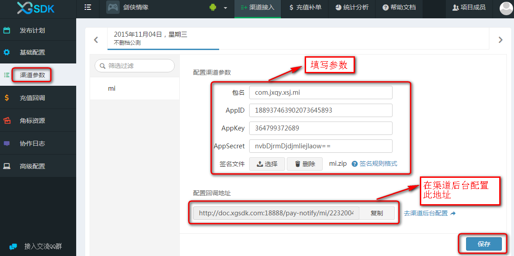

5.1.3 去渠道后台配置游戏充值回调地址（可直接点击“去渠道后台配置”进行跳转），其中充值回调地址是 **渠道服务器通知西瓜SDK服务器支付订单信息的地址**  

5.1.4 点击保存

5.1.5 渠道参数配置好后，进行参数验证（此步骤并不是必须的，但是建议对参数进行验证）：利用西瓜提供的打包工具生成demo包进行渠道参数的验证，即实现如下三点：
- 能够正常登陆；
- 所有渠道所支持的充值方式均能成功调起即弹出充值页面；
- 选择一种充值方式充值到账。

5.1.6 签名文件  

 签名文件分为3种：
 - 渠道有要求必须使用渠道所提供的签名文件（目前只有新浪、当乐对签名文件有要求），按照规定的<a href="#qianming">签名文件格式</a>生成签名文件并进行上传；  
 - 在渠道对签名文件无要求时，游戏可使用自己提供的签名文件，按照规定的<a href="#qianming">签名文件格式</a>生成签名文件并进行上传；
 - 渠道、游戏对签名文件均无要求时，即可使用西瓜为游戏生成的默认签名文件，此时不必上传签名文件，若想获取此签名文件可在如图所示地方进行下载。

若有些渠道对签名文件有特殊要求，需要单独使用不一样的签名文件，即可在“渠道参数”中选择对应渠道上传所需的签名文件

**签名文件格式要求：**  
1.签名文件格式  
签名文件必须是以.zip为后缀的压缩文件。

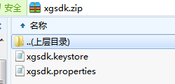

2.签名文件内容  
   压缩文件中必须包含两个文件且必须是在根目录下，即：* .properties文件和 * .keystore文件（文件名称必须为如上所示）
   -  xgsdk.properties文件中必须包含三个属性：alias、storepass和keypass，如图所示  

  

   -  xgsdk.keystore是通过xgsdk.properties文件中的信息生成的签名文件  

3.签名文件大小   
签名文件的大小不能超过10K。

#### 5.2 充值回调
充值回调是**游戏服务器接收订单支付信息的接口地址**，该地址的配置有三种方式，优先级为：客户端传＞渠道局部充值回调＞全局充值回调（即正式环境充值回调地址）

- 游戏通过客户端代码传此地址（最高优先级）
- 在 **配置充值回调地址** 中对不同的渠道配置不同的充值回调地址，如图所示（次优先级）

- 在如图所示的 **正式环境充值回调地址** 输入框中填写（此处只能填一个地址，最低优先级）

#### 5.3 角标资源
部分渠道对角标有要求，具体要求列表<a href="../section4/icon.html#jiaobiao" target="_blank"> 请点击此查看。 </a>  
对于有角标要求的渠道，首先下载渠道相对应的角标、闪屏素材和制作要求，再参考** <a href="../section4/icon.md" target="_blank">角标制作规范</a>** 制作符合渠道要求的游戏图标资源进行上传。

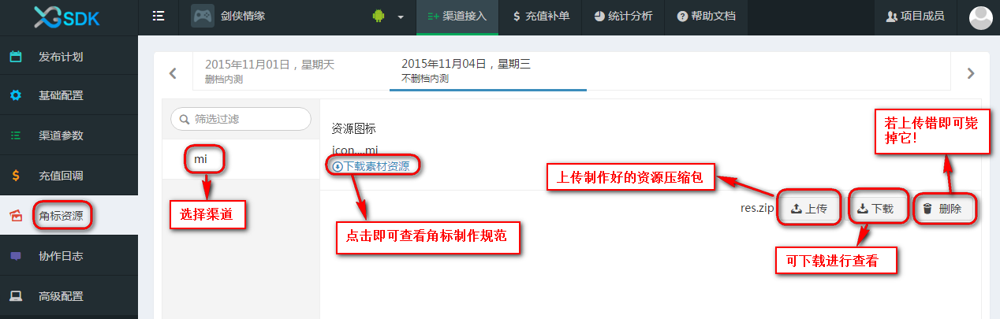

上传的角标资源压缩包结构如下所示，里面的文件夹一个都不能少喔，每个文件夹下都有一张不同分辨率的图标。

### 6. 项目成员管理

系统中的用户，分为管理员和普通用户；两种用户在权限上存在着一定的差异，例如只有管理员才可以对发布计划进行修改锁定、查看协作日志、添加成员管理等等。  
用户在创建一个游戏后，会自动成为此游戏的管理员。在游戏接入的过程中，通常会需要多个工作人员的协作，这时可以通过点击页面上的“项目成员”，输入用户邮箱的方式添加新成员，新添加的项目成员默认身份为普通用户，管理员可以通过点击“成员管理”，来对用户进行身份设置或移除。  
当用户不再希望参与某个游戏时，可以点击退出该游戏，退出后该用户不再是该游戏的项目成员，无法查看游戏的所有信息，退出的用户还可以通过其他管理员再次添加进游戏。

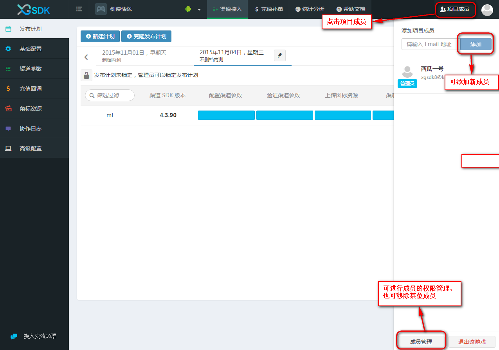

### 7. 协作日志
协作日志可以查看所有用户对游戏进行过的操作。

筛选查找：可以对某一特定事件、发布计划、渠道来进行查询，使得查询过程更快捷简便。

### 8. 高级配置
#### 8.1 使用自定义AndroidManifest参数

8.1.1 使用场景  

在AndroidManifest.xml文件中，可能我们针对每个渠道会有一些不同的配置项，例如JPUSH插件，每个渠道都有不同的APPKEY值。这时候为了使用同一个游戏母包进行打包操作，游戏开发者需要在母包的AndroidManifest.xml中使用一个通配符来标识这个配置项，然后通过西瓜web控制台后台配置这个通配符在各个渠道的值，西瓜SDK就可以在打包阶段正确地打出每一个渠道包。

目前西瓜SDK支持10个AndroidManifest自定义参数。分别是：
- xg_param1
- xg_param2
- xg_param3
- xg_param4
- xg_param5
- xg_param6
- xg_param7
- xg_param8
- xg_param9
- xg_param10

这些KEY值目前是固定的。value值可以在西瓜web控制台-“高级配置”中进行指定。

8.1.2 操作  

以配置JPUSH_APPKEY为例，JPUSH_APPKEY的值在每个渠道都是不一样的，我们这里使用xg_param1这个自定义参数值（当然你也可以选择其他的）：

- 在母包的AndroidMinifest.xml文件内容：

		<meta-data android:name="JPUSH_APPKEY" android:value="$xg_param1$" />

- 依次在【高级配置】 -> 【发布计划】 -> 【渠道】，进行参数值的配置。如下图所示，我们配置一个UC渠道的JPUSH_APPKEY的值。如有多个渠道请每个渠道分别配置对应的JPUSH_APPKEY的值。

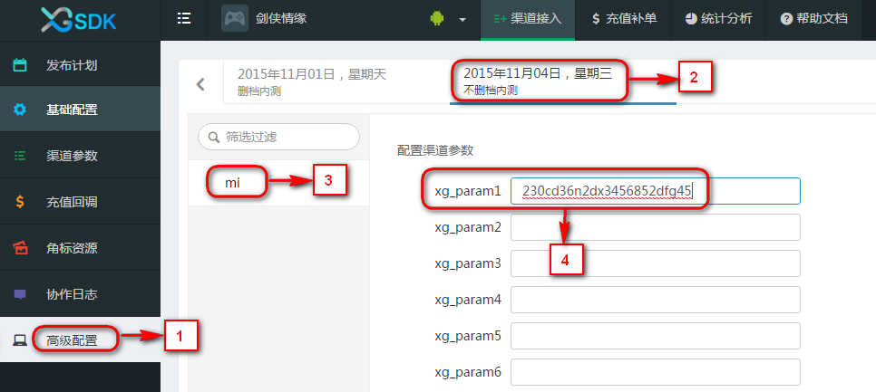

- 使用西瓜提供的打包工具（含命令行工具）进行打包之后，最终生成的渠道包apk中的AndroidManifest.xml对应的配置将被替换成：

		<meta-data android:name="JPUSH_APPKEY" android:value="23ocd36n2dx345dsxx73d" />

8.1.3 注意

- 目前的KEY是固定的，支持10个自定义参数，可以自由选择使用哪一个。

- 母包中如果使用了自定义参数，则必须在西瓜web控制台中对应的发布计划和渠道必须配置对应的参数值，否则无法打包成功。

- 如果同一个发布计划中有一部分渠道不需要自定义参数，比如计划【游戏内测发布计划】中有三个渠道，分别是：【360】、【UC】、【爱游戏】，其中【360】和【UC】两个渠道有自定义参数，【爱游戏】没有自定义参数，那么请使用带自定义参数和不带自定义参数的两个母包，并且在实际打渠道包的时候针对【360】和【UC】使用带参数母包，针对【爱游戏】使用不带参数的母包。

- 自定义渠道参数的值不支持为空的替换。例如【爱游戏】渠道不需要配置**JPUSH_KEY**，则需要提供一个AndroidManifest.xml中不含有**JPUSH_KEY**的母包，而不能将【爱游戏】中的**JPUSH_KEY**的自定义参数值设置为""（空字符串）。

#### 8.2 使用自定义渠道资源

8.2.1 使用场景  

某些渠道需要在apk包中放置一些必要的资源文件，例如【爱游戏】需要将feeInfo.dat文件放置在assets目录下。
我们在西瓜web控制台中的高级配置下可以指定渠道上传自定义游戏资源，该资源将在打渠道包的过程中，被拷贝到apk根目录下。

8.2.2 操作  
以【爱游戏】配置feeInfo.dat资源为例，该文件需要放置在assets目录下。

- 在本地创建assets目录，将feeInfo.dat放置于assets目录中。

- 将assets目录压缩成zip包，文件名可自由定义，例如叫**custom_res.zip**。此zip包的结果如下：

		custom_res.zip
            |_ assets
                |_ feeInfo.dat

3. 导航到【高级配置】 -> 【发布计划】 -> 【渠道】，点击上传按钮，选择刚刚生成的**custom_res.zip**包上传，如下图所示：

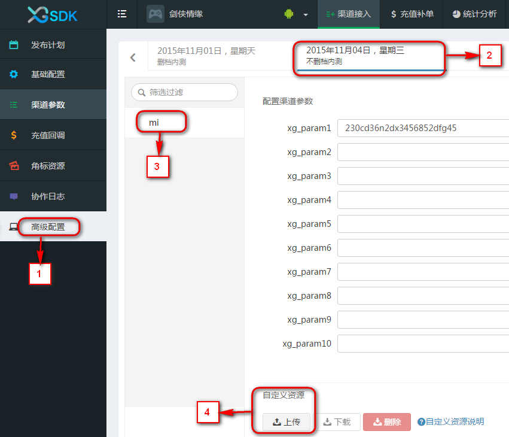

### 9. 充值补单
进入充值补单界面，如果游戏在24小时之内有出现“游戏拒绝”状态的订单，页面上会出现提示，可以点击立即处理来对游戏拒绝订单进行处理。  
点击补单按钮，会对“游戏拒绝”的订单进行补单，补单成功后，订单状态从“游戏拒绝”变成“订单初始化”。

充值补单可以对所有订单进行查询，可以设定特定渠道、订单状态、订单时间等搜索条件。当订单状态为“游戏拒绝”时，该订单会显示补单按钮，点击补单按钮，会对“游戏拒绝”的订单进行补单，补单成功后，订单状态从“游戏拒绝”变成“游戏通知成功”，补单按钮将会消失。

系统还提供了按订单号搜索和按角色ID搜索功能，用于查找一个或多个订单和某个角色相关的所有订单。

### 10. 统计分析
点击“统计分析”即可查看西瓜数据统计，请点击这里查看“<a href="../section5/dataplatform.md" target="_blank">统计分析</a>”具体说明。

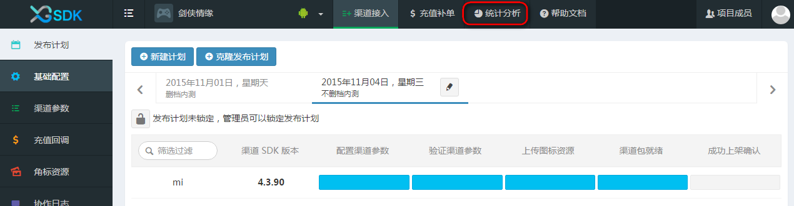

### 11. 接入交流
西瓜提供了QQ群以方便用户的交流反馈，感谢您对西瓜SDK的支持。

### 12. 打包工具（Android版本）使用说明

#### 12.1 环境要求
JDK1.8及以上版本

#### 12.2 使用步骤

12.2.1 下载&安装西瓜打包工具

前往<a href = "http://console.xgsdk.com/download.html">西瓜官网</a>，下载对应的版本安装包到本地进行安装。

12.2.2 西瓜打包工具主面板
点击刷新按钮从西瓜web控制台获得最新的发布计划以及渠道配置。

12.2.3 检查配置以及版本更新
在打包之前先检查是否有当前渠道版本是否有更新以及更新描述，渠道参数, 回调地址，角标资源是否配置就绪。

12.2.4 准备制作
确认配置参数完善后，根据需要选择需要打包的渠道。

- 制作渠道包

 需手动选择设置母包资源, 点击"制作渠道包" 打包工具开始对所选择的渠道以及已加载的配置进行打包, 可以通过底部的输出控制台查看打包运行状况,过程中可能需要从服务器下载对应的资源以及工具,请留意输出控制台的日志输出以更好的监测打包工具运行步骤以及状态

- 制作参数测试包

 不需要设置母包资源, 使用西瓜自带的原生demo母包进行打包(验证参数用)

12.2.5 开始制作

12.2.6 查看打包输出结果

主界面(上图)将会呈现打包结果(所选渠道的打包结果："制作成功"/"制作失败")， 点击"打开文件夹"以查看打包输出

 - 制作成功将会看到成功打包的程序安装包以及日志记录

 - 制作失败则只有日志文件输出

12.2.7 更新打包结果
回到主界面对不同渠道进行状态更新以标记渠道包是否就绪

12.2.8 本地打包历史记录

### 13 打包工具（ios版本）使用说明

#### 13.1 ios版本打包工具说明

打包工具是一个轻量级的出包工具，只需几秒即可完成资源注入。支持“界面版”和“命令行模式”，游戏可根据自己的实际情况选择。其中：

- 界面版，支持自动更新，适合多渠道同时打包，适合接入多个越狱渠道的情况。(**界面版还在测试中，敬请期待...**)

- 命令行模式，适合仅接入iOS正版的情况。更加轻量，直接双击脚本即可运行。游戏也方便集成到自己的ci中进行管理。

基本原理：以游戏指定的target为基础，先复制一个copy_target，再将xgsdk的所有资源（包括库，bundle，脚本，编译选项）注入到copy_target。 原来的target不会做任何修改，游戏最终需切换到copy_target，并从copy_target打包。

#### 13.2 配置运行环境  

通过命令行方式，配置mac机器的打包环境，步骤如下：
- 移除旧资源
gem sources –remove https://rubygems.org/

- 等有反应之后再敲入以下命令
gem sources -a http://ruby.taobao.org/

- 
用以下命令查看

 <code>gem sources -l</code>
- 
出现下面文字才表明上面的命令是成功的

<code>\*\*\* CURRENT SOURCES \*\*\*  
http://ruby.taobao.org/ </code> （注意，这里必须是 http://ruby.taobao.org才对！！！！）
- 
安装xcodeproj库

<code>sudo gem install xcodeproj</code>

等待安装完成。（***注:这一步会下载大量资源，需要耐心等待***）

整个执行过程如下图： 

#### 13.3 命令行打包

13.3.1 使用方法：

- 将xgsdk提供的zip包解压，得到xg_package资源目录。将其拷贝到本机的xcode工程目录。

- 依次展开，将config.yaml 和 run.command 使用文本编辑工具打开，修改里面的路径和 target名称（具体修改项，参考文件内的注释）。

- 双击command文件。

- 结束。mm

目录结构如下图：

执行过程如下图：

### 13.4 最终效果

每个target都是在原始的target复制过来（如游戏的原来的target是ios-bi-demo），然后注入了xgsdk的资源,生成新的target（如下图中的xg_ios_jinshanApple）。因此，原来的target仍然是独立的,打包工具不会修改原来target的任何配置。
游戏需使用新的target进行出包.

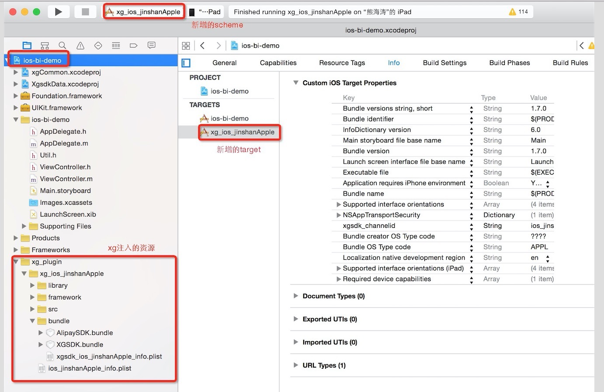
