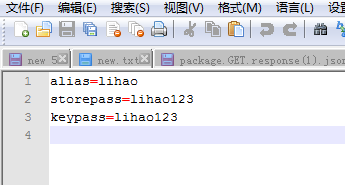

# 签名文件签名规则格式

### 1.签名文件格式
签名文件必须是以.zip为后缀的压缩文件。

### 2.签名文件内容
2.1 压缩文件中必须包含两个文件，即：xgsdk.properties文件和 xgsdk.keystore文件（文件名称必须为如上所示）
-  xgsdk.properties文件中必须包含三个属性：alias、storepass和keypass，如图所示  

  

-  xgsdk.keystore是通过xgsdk.properties文件中的信息生成的签名文件  

2.2 以上两个文件必须是在根目录下
### 3.签名文件大小
签名文件的大小不能超过10K。
