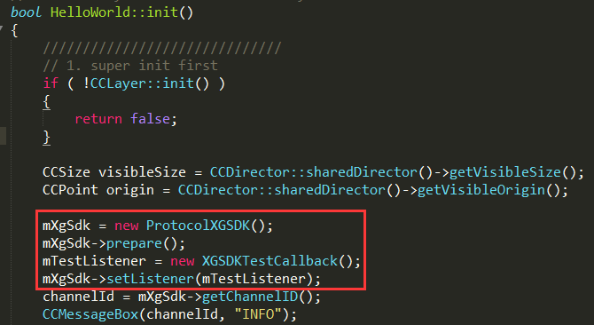
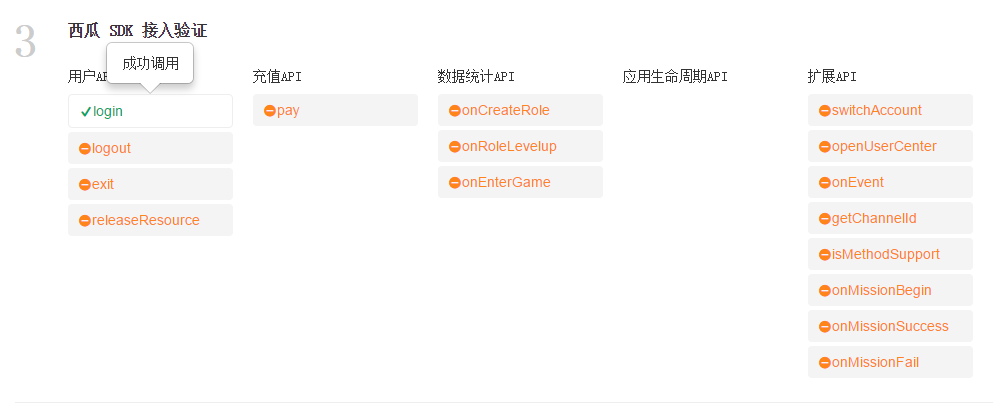
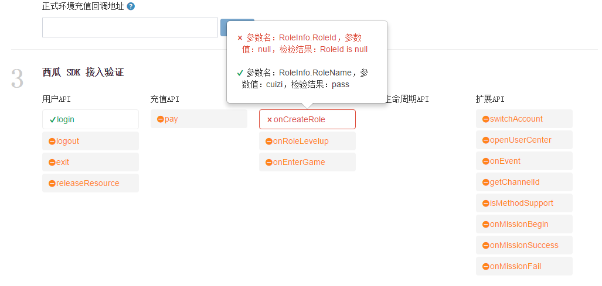

#Hello西瓜

- - -

###欢迎来到XGSDK，让我们一起开始西瓜的使用之旅！

西瓜SDK为游戏商提供一套完整的SDK接入方案,一次性解决游戏SDK接入问题,整个接入过程不会改变、影响任何SDK的功能、参数等,整个过程对于最终玩家而言是透明的.
游戏商只需专注于游戏不必为接入时渠道间的差异而苦恼,将这些烦恼都交给我们来解决.西瓜SDK包括了渠道SDK、支付系统、数据统计等等.
游戏商可以根据自身游戏的技术架构选择对应的SDK版本,并参考相应的接入指南.</br>
###快速接入
按照下面10个步骤，即可完成SDK的接入。
<ul>
<li><a href="#1">1. 注册账号</a></li>
<li><a href="#2">2. 创建游戏</a></li>
<li><a href="#3">3. 发布计划</a></li>
<li><a href="#4">4. SDK接入</a></li>
<li><a href="#5">5. 配置渠道参数</a></li>
<li><a href="#6">6. 配置充值回调地址</a></li>
<li><a href="#7">7. 上传图标资源</a></li>
<li><a href="#8">8. 下载打包工具打包</a></li>
<li><a href="#9">9. 提交渠道包</a></li>
<li><a href="#10">10. 上架确认</a></li>
</ul>


<a id="1"></a>

###1.注册账号


1.1西瓜SDK需要注册账号才可以进行登录的，登录后可以创建新游戏，所以使用前需要登录西瓜SDK主页进行账号注册（<a href="http://console.xgsdk.com/login">点击注册</a>）；</br>
 </br>
1.2在输入框中填入对应信息，点击免费注册即可；</br>
 </br>
1.3注册成功输入用户名、密码，进入如下页面即注册成功。</br>
 </br>

----

<a id="2"></a>

###2.创建游戏

2.1点击“创建”游戏；

2.2输入游戏名称、选择游戏平台、上传游戏图标（可选项），点击确认即可；</br>
 </br>
2.3创建游戏成功。


---

<a id="3"></a>


###3.发布计划

3.1为游戏创建发布计划，可以更好的跟进游戏的接入完成进度，避免影响上架时间，点击“新增计划”开始创建一个新的发布计划；

3.2输入计划中对应的计划名称（如删档内测版、不删档公测版等）、上线日期（游戏上架时间）、发布渠道（选择游戏上线渠道，至少要选择一个渠道），在选择渠道时可以选择所需的渠道SDK版本（默认版本是当前所支持的最新版本），点击创建即可；
</br>
 </br>
3.3创建好的发布计划如下：</br>


---

<a id="4"></a>


###4.SDK接入


4.1  选择菜单栏中“开发接入SDK”，在弹出窗口选择游戏引擎类型、屏幕样式.</br>


</br>
4.2      将西瓜接入参数配置到游戏中.</br>
&nbsp;1)新游戏如何获取接入参数:创建一个新游戏就可以获得西瓜分给游戏的接入参数：产品代码、服务端密钥、客户端密钥.
</br>
2)已创建的游戏如何获取接入参数:如果游戏已创建完成,则可以点击"开发接入SDK"查看分配给游戏的接入参数,具体如下:
</br>

4.3 Cocos2d-X接口接入  </br>  
4.3.1 点击下载"西瓜SDK下载包";</br>
渠道版SDK下载包包含：</br>
1. 西瓜SDK的Jar包：xgsdk-core.jar，xgsdk-data.jar，xgsdk-lib.jar，xgsdk-api.jar； </br>
2. 接口文件：ProtocolXGSDK.h和ProtocolXGSDK.cpp；</br>
3. Cocos2d-X的Android接入Demo；</br>
4. 西山居移动游戏-渠道SDK(Cocos2d-X Android)接入文档。

4.3.2 配置环境与快速接入简介
1） 开发和接入所需基本环境

Cocos2d-X开发环境：</br>
Cocos2d-X版本：Cocos2d-X 2.2.6</br>
Cocos2d-X开发工具：VS2012等</br>
Python版本：Python 2.7.10</br>

Java开发环境：</br>
Java版本：JAVA JDK 8 </br>

Android开发环境：</br>
Android版本：Android2.2 以上</br>
Android NDK版本：Android NDK r10</br>
Android开发工具：Android SDK和Android Eclipse等</br>

2） Cocos2d-X Android接入基本步骤简介

<ol type="1" start="1">
	<li>将Cocos2d-X Android工程导入到Eclipse或者Android Studio；</li>
	<li>将XGSDK的jar包放置到Android工程的libs目录下；</li>
	<li>修改游戏的MainActivity代码，让其继承XGCocos2dxActivity；</li>
	<li>将接口文件ProtocolXGSDK.h和ProtocolXGSDK.cpp文放置到jni/hellocpp目录下；</li>
	<li>修改Android.mk文件(具体修改内容见后文)；</li>
	<li>在游戏代码中引入ProtocolXGSDK.h头文件，并且继承实现XGSDKCallback回调接口类；</li>
	<li>在Cocos游戏代码中添加ProtocolXGSDK成员实例，并且在init()方法中初始化和调用prepare方法；</li>
	<li>在init()方法中初始化回调接口类，并且调用ProtocolXGSDK的setListener()成员方法；</li>
	<li>最后完成登录、支付、清理资源等必接接口的接入便完成了Cocos2d-X原生接入的所有步骤；</li>
	<li>编译打包测试通过。</li>
</ol>

4.3.3 导入Cocos2d-X的相应工程到开发工具

1) 导入Android工程
导入Android工程:Cocos2d-X的android工程位于游戏项目下的proj.android，将该工程导入到Eclipse或者Andorid Studio中。该文档主要讲解Eclipse开发工具，其他的开发工具类似，Eclipse导入android工程如下图所示：</br>


2) 导入后如果出现找不到Cocos2d-X相关类的错误的解决方法：

<ol type="1" start="1">
	<li>请在Cocos2d-X的安装路径中找到相应目录，如：D:\cocos2d-x-2.2.6\cocos2dx\platform\android\java，导入该工程并关联到Android工程；</li>
	<li>在Cocos2d-X安装目录下搜索libcocos2dx.jar，或者相应目录下，如：D:\cocos2d-x-2.2.6\cocos2dx\platform\android\java\bin找到libcocos2dx.jar并导入Android工程的libs目录下；</li>
</ol>


4.3.4 修改相应平台工程的配置信息

1) 复制SDK的Jar包

西瓜SDKV2的Jar包，xgsdk-core.jar，xgsdk-data.jar，xgsdk-lib.jar，xgsdk-api.jar，xgsdk-common-lib.jar，拷贝到Android工程的libs目录下：</br>


2) 复制接口文件

复制接口文件ProtocolXGSDK.h和ProtocolXGSDK.cpp到Android工程中的jni/hellocpp目录下，如图： </br>


3) 修改游戏的主Activity

找到游戏的主Activity（继承于Cocos2dxActivity的游戏主Activity），修改该Activity，让其继承XGCocos2dxActivity：</br>
修改前:</br>
</br>
修改后:</br>
</br>
修改后的代码如下：</br>
```

	public class CoCosDemo extends XGCocos2dxActivity

```
4) 修改Android项目的Android.mk文件

在Android.mk文件中添加如图所框的两行：</br>
</br>
添加的代码如下：


```
	LOCAL_LDLIBS :=-llog
	LOCAL_SRC_FILES := hellocpp/main.cpp \
                   ../../Classes/AppDelegate.cpp \
                   ../../Classes/XGCocosDemo.cpp \
                   hellocpp/ProtocolXGSDK.cpp
```

5) 在AndroidManifest.xml添加权限

在AndroidManifest.xml文件中添加如图所框的权限：</br>
</br>
添加的代码如下：


```

	<uses-permission android:name="android.permission.WRITE_EXTERNAL_STORAGE" />
    <uses-permission android:name="android.permission.ACCESS_NETWORK_STATE" />
    <uses-permission android:name="android.permission.READ_PHONE_STATE" />
    <uses-permission android:name="android.permission.INTERNET" />
    <uses-permission android:name="android.permission.GET_TASKS" />
    <uses-permission android:name="android.permission.ACCESS_WIFI_STATE" />

```

4.3.5 接入前的初始化工作

1)首先先确认ProtocolXGSDK.h头文件和ProtocolXGSDK.cpp源文件已经按照4.2拷贝到相应目录下。</br>
2)然后在使用到ProtocolXGSDK的地方首先导入头文件"ProtocolXGSDK.h"，例如在我们的Demo中添加如图中所示代码：</br>
 </br>
添加的代码是：

```

	#if(CC_TARGET_PLATFORM == CC_PLATFORM_ANDROID)

	#include "../proj.android/jni/hellocpp/ProtocolXGSDK.h"

	#endif
```

3)用户要继承并且实现回调类（可参考Demo），如图：</br>
</br>

4) 然后在游戏的类中声明一个指向ProtocolXGSDK的指针mXgSdk和指向XGSDKTestCallback的指针（可参考Demo），如图：</br>
</br>
添加的代码是：


```

	ProtocolXGSDK *mXgSdk;
	XGSDKTestCallback *mTestListener;
```

5)需要在层的init()函数中初始化ProtocolXGSDK和XGSDKTestCallback（可参考Demo），如图加入代码：</br>
</br>
添加的代码是：

```

	mXgSdk = new ProtocolXGSDK();
    mXgSdk->prepare();
    mTestListener = new XGSDKTestCallback();
    mXgSdk->setListener(mTestListener);
```

4.3.6 用户接口

1)初始化接口（废弃）

西瓜SDK此版本已经废弃初始化接口的接入，改为将游戏的Activity继承XGCocos2dxActivity。初始化失败仍有回调，需要实现初始化失败的回调方法。

2) 初始化回调接口

初始化失败后回调此回调方法，参考代码：

```

	void XGSDKTestCallback::onInitFail(int retCode, const char* msg){
    	//初始化失败，游戏此回调中实现初始化失败后的逻辑
	}
```

关于参数的说明：
<ul type='disc'>
	<li>retCode：返回的错误码，详情请见<a href="#errorCode">错误码表</a></li>
	<li>msg：返回的信息</li>
</ul>


4.3.7 充值接口

1) 支付接口

接口定义：void pay(PayInfo &);

接口说明：在相应的位置调用登出接口，调用位置可参考Demo中的XGCocosDemo.cpp，此接口将会发起用户充值，系统会调用对应渠道SDK充值界面，并将支付的结果回调通知游戏。支付接口需要传入类型为PayInfo的参数。

代码示例：


```

    PayInfo payInfo;
    payInfo.uid = "4fd0144f02840ae77b6f42346c90d8bd";
    payInfo.productId = "payment017";
    payInfo.productName = "大宝剑";
    payInfo.productDesc = "倚天不出谁与争锋";
    payInfo.productAmount = 1;
    payInfo.productUnit = "个";
    payInfo.productUnitPrice = 1;
    payInfo.totalPrice = 1;
    payInfo.originalPrice = 1;
    payInfo.currencyName = "CNY";
    payInfo.custom = "";
    payInfo.gameTradeNo = "12480";
    payInfo.gameCallbackUrl = "http://console.xgsdk.com/sdkserver/receivePayResult";
    payInfo.serverId = "11";
    payInfo.serverName = "zhengfuzhihai";
    payInfo.zoneId = "zoneId";
    payInfo.zoneName = "zoneName";
    payInfo.roleId = "1234";
    payInfo.roleName = "yeye";
    payInfo.level = 10;
    payInfo.vipLevel = 7;
	mXgSdk->pay(PayInfo &payInfo);

```


关于PayInfo的成员说明：
<table>
<tr>
	<th>输入参数</th>
	<th>数据类型</th>
	<th>说明</th>
	<th>备注</th>
</tr>
<tr>
	<td>uid</td>
	<td>const char *</td>
	<td>用户ID</td>
	<td>不可为空</td>
</tr>
<tr>
	<td>productId</td>
	<td>const char *</td>
	<td>商品ID</td>
	<td>不可为空</td>
</tr>
<tr>
	<td>productName</td>
	<td>const char *</td>
	<td>商品名称</td>
	<td>不可为空</td>
</tr>
<tr>
	<td>productDesc</td>
	<td>const char *</td>
	<td>商品描述</td>
	<td>不可为空</td>
</tr>
<tr>
	<td>productAmount</td>
	<td>int</td>
	<td>商品数目</td>
	<td>不可为空</td>
</tr>
<tr>
	<td>productUnit</td>
	<td>const char *</td>
	<td>商品单位</td>
	<td>不可为空</td>
</tr>
<tr>
	<td>productUnitPrice</td>
	<td>int</td>
	<td>商品单价</td>
	<td>不可为空</td>
</tr>
<tr>
	<td>totalPrice</td>
	<td>int</td>
	<td>商品总额</td>
	<td>不可为空</td>
</tr>
<tr>
	<td>originalPrice</td>
	<td>int</td>
	<td>商品原价</td>
	<td>不可为空</td>
</tr>
<tr>
	<td>currencyName</td>
	<td>const char *</td>
	<td>货币类别</td>
	<td>不可为空</td>
</tr>
<tr>
	<td>custom</td>
	<td>const char *</td>
	<td>扩展参数</td>
	<td>不可为空</td>
</tr>
<tr>
	<td>gameTradeNo</td>
	<td>const char *</td>
	<td>游戏订单ID</td>
	<td>不可为空</td>
</tr>
<tr>
	<td>gameCallbackUrl</td>
	<td>const char *</td>
	<td>游戏回调地址</td>
	<td>可为空</td>
</tr>
<tr>
	<td>serverId</td>
	<td>const char *</td>
	<td>服ID</td>
	<td>不可为空</td>
</tr>
<tr>
	<td>serverName</td>
	<td>const char *</td>
	<td>服名称</td>
	<td>不可为空</td>
</tr>
<tr>
	<td>zoneId</td>
	<td>const char *</td>
	<td>区ID</td>
	<td>不可为空</td>
</tr>
<tr>
	<td>zoneName</td>
	<td>int</td>
	<td>区名字</td>
	<td>不可为空</td>
</tr>
<tr>
	<td>roleId</td>
	<td>const char *</td>
	<td>角色ID</td>
	<td>不可为空</td>
</tr>
<tr>
	<td>roleName</td>
	<td>const char *</td>
	<td>角色名称</td>
	<td>不可为空</td>
</tr>
<tr>
	<td>level</td>
	<td>int</td>
	<td>角色等级</td>
	<td>不可为空</td>
</tr>
<tr>
	<td>vipLevel</td>
	<td>int</td>
	<td>角色VIP等级</td>
	<td>不可为空</td>
</tr>
</table>

4.3.8 统计接口

1) 创建角色

此接口用于游戏信息统计，当创建游戏角色时调用，要求传入UserInfo类型的参数，参考代码：
```
	mXgSdk->onCreateRole(UserInfo &userInfo);
```

类型UserInfo结构体定义在ProtocolXGSDK.h头文件中：


```

	struct UserInfo{
		const char *uid;
		const char *userName;
		const char *roleId;
		const char *roleName;
		const char *gender;
		const char *level;
		const char *vipLevel;
		const char *balance;
		const char *partyName;
		const char *serverId;
		const char *serverName;
	};

```


关于UserInfo的成员说明
<table>
<tr>
	<th>输入参数</th>
	<th>数据类型</th>
	<th>说明</th>
	<th>可空</th>
</tr>
<tr>
	<td>uid</td>
	<td>const char *</td>
	<td>用户ID</td>
	<td>N</td>
</tr>
<tr>
	<td>userName</td>
	<td>const char *</td>
	<td>用户名称</td>
	<td>Y</td>
</tr>
<tr>
	<td>roleId</td>
	<td>const char *</td>
	<td>角色ID</td>
	<td>N</td>
</tr>
<tr>
	<td>roleName</td>
	<td>const char *</td>
	<td>角色名字</td>
	<td>N</td>
</tr>
<tr>
	<td>gender</td>
	<td>const char *</td>
	<td>性别</td>
	<td>Y</td>
</tr>
<tr>
	<td>level</td>
	<td>const char *</td>
	<td>等级</td>
	<td>Y</td>
</tr>
<tr>
	<td>vipLevel</td>
	<td>const char *</td>
	<td>VIP等级</td>
	<td>Y</td>
</tr>
<tr>
	<td>balance</td>
	<td>const char *</td>
	<td>余额</td>
	<td>Y</td>
</tr>
<tr>
	<td>partyName</td>
	<td>const char *</td>
	<td>战队名称</td>
	<td>Y</td>
</tr>
<tr>
	<td>serverId</td>
	<td>const char *</td>
	<td>服ID</td>
	<td>Y</td>
</tr>
<tr>
	<td>serverName</td>
	<td>const char *</td>
	<td>服名称</td>
	<td>Y</td>
</tr>
</table>

4.3.9 扩展接口

1) 切换账号

接口定义：void switchAccount(const char *customParams = "");

接口说明：在相应的位置调用切换账号接口，调用位置可参考Demo中的XGCocosDemo.cpp，此接口将调用渠道的切换账号方法，并会产生登出回调来通知游戏。

代码示例：


```
	mXgSdk->switchAccount();
```


关于参数的说明：
<ul type='disc'>
	<li>customParams：该参数用于扩展，传输时使用json格式，接入时若不需要直接置空即可。
</li>
</ul>


4.3.10 接口接入校验

西瓜SDK接入校验主要通过在线检验，现说明如下：

在线校验主要通过XGSDK网站平台portal上提供的西瓜SDK接入校验功能来实现，如图当前所有的接口处于未激活状态：


当游戏方正确按照以上文档接入指定接口（例如login），并且触发login之后，可在西瓜SDK接入验证平台portal上观察到login按钮的激活（点亮）：


如果游戏方已经正确接入指定接口，但是由于参数配置不正确，可在西瓜SDK接入验证平台portal上观察到来自西瓜SDK的提示：



2)<!--参考<a href="../section2/README.md">客户端接入指南</a>和<a href="../section3/README.md">服务端接入指南</a>进行接入(客户端接入指南包括:cocos2d-x引擎接入指南、unity3d引擎接入指南、原生接口接入指南；服务端指南包括：session验证、支付通知、数据上报).</br>-->
4.4   配置测试环境充值回调地址（游戏测试时使用的充值回调地址）.</br>
4.5  接口验证： 对已经接入的各个的接口进行验证,如图中所示,验证中若接口未调用则显示为黄色;若接口调用成功则显示为绿色;若调用失败则显示为红色,将鼠标移至红色接口处可查看tops错误说明.</br>

---

<a id="5"></a>


###5.配置渠道参数

5.1此处配置的渠道参数为开发者在渠道申请得到的应用参数，渠道参数的具体申请步骤请参考<a href="../section4/README.md">参数申请指南</a>获取相应渠道的渠道参数，也可直接
点击“配置指南”；</br>
5.2将获取到的渠道参数填入对应渠道的参数表中；</br>
5.3去渠道后台配置游戏充值回调地址（可直接点击“去渠道后台配置”进行跳转），其中充值回调地址是渠道服务器通知西瓜SDK服务器支付订单信息的地址；</br>
5.4点击保存。</br>


---

<a id="6"></a>


###6.配置充值回调地址

6.1全局充值回调地址，即正式环境充值回调地址，此地址是游戏服务器接收订单支付信息的接口地址（可以是一个也可以是多个）；</br>

6.2渠道充值回调地址，有时游戏商为减轻服务器的压力，存在多个服务器的情况，此时就需要在渠道充值回调地址中添加不同的地址，如图：</br>


**注意：** 当渠道充值回调地址输入框中有地址时，优先取此地址；若渠道充值回调地址为空时，取全局充值回调地址即正式环境充值回调地址。

6.3配置完成后点击保存。</br>

---

<a id="7"></a>


###7.上传图标资源

7.1首先下载渠道相对应的角标、闪屏素材和制作要求，再参考** <a href="../section4/角标规范.md">角标制作规范</a>** 制作符合渠道要求的游戏图标资源进行上传；


7.2图标资源完成上传后进行提交。

---

<a id="8"></a>


###8.下载打包工具进行打包

8.1首先下载西瓜的打包工具，西瓜提供三种版本的打包工具，分别为：Mac OSX64位版本、windows 64位版本、Linux 64位版本，请选择相应版本的打包工具进行下载；

</br>
8.2参考** <a href="./dabaogongju.md">打包工具使用指南</a> ** 进行打包工具的安装及使用。</br>
8.3**备注** 西瓜提供的打包工具可以打出两种类型的包：参数demo包和渠道包；

参数demo包：通过登录、充值可以对渠道参数的正确性进行验证；</br>
渠道包：是最终提交给渠道的APK包。</br>

---

<a id="9"></a>


###9.提交渠道包


将通过测试的渠道包提交给对应的渠道进行审核。

---

<a id="10"></a>


###10.上架确认

渠道包审核通过后，在发布计划中点亮“上架完成”的进度条。
