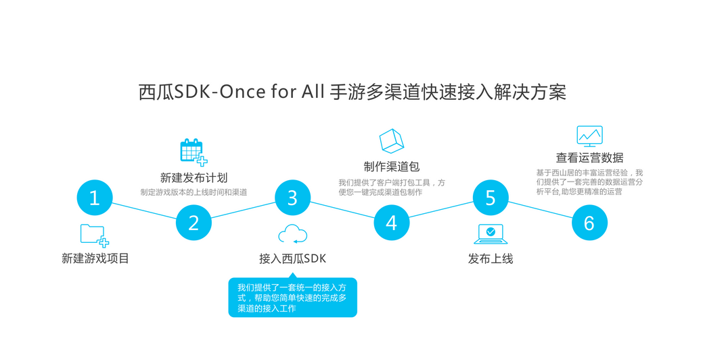
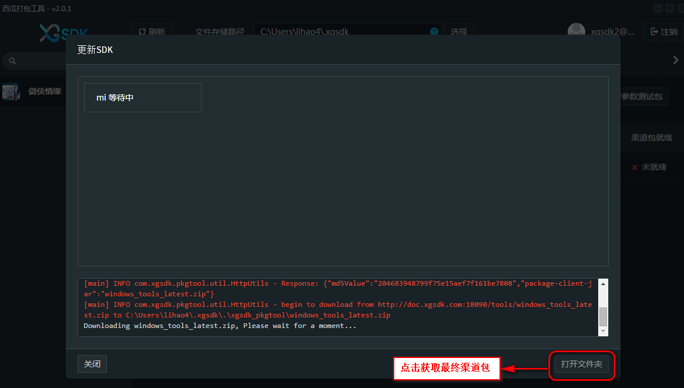
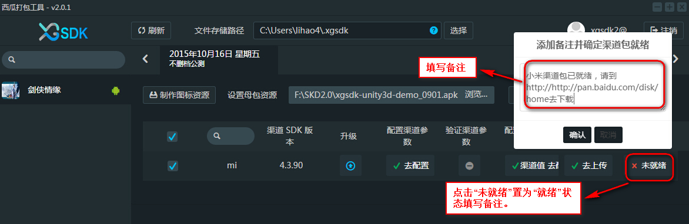

#快速入门西瓜SDK

####西瓜SDK — ONCE FOR ALL手游多渠道快速接入解决方案： 
####- 创建游戏
####- 创建发布计划：制定游戏版本的上线时间和渠道
####- 接入西瓜SDK
####- 制作渠道包：西瓜提供了客户端打包工具，实现一键完成多渠道包制作
####- 发布上线
####- 查看运营数据：西瓜提供了一套完善的数据运营分析平台

####本教程将带您快速掌握西瓜SDK，实现一键完成多渠道包制作的完美体验，从此渠道接入不再是难事，请一步步跟着我做。

##一. 准备阶段

###1.1 进入西瓜首页，点击注册按钮，进行免费注册。

###1.2 注册之后将自动登录进首页。

###1.3 进入首页可以看到新建游戏项目提示，点击新建新建游戏项目。然后填写游戏名称，选择游戏平台和游戏类型并上传游戏图标，点击确定。

###1.4 此时您已经创建了一个新的游戏，系统将提示您为此游戏创建发布计划，用来规划上线时间和接入渠道，便于追踪和管理版本发布阶段的工作进度。点击新建计划。

###1.5 填写计划名称，选择该计划的上线日期，在渠道列表中选择要发布的所有渠道及其版本号，本例为说明方便，只选择一个“mi”渠道，实际情况中可根据需要选择任意多的发布渠道。点击创建。

###1.6 新建完发布计划后，会看到关于此计划下所有渠道的进展情况，一个分为五个步骤的进度条用于追踪渠道的进展情况。

###1.7 点击左侧菜单栏的“开发接入SDK”，选择游戏引擎和横竖屏。

###1.8 进入开发接入SDK界面后，根据游戏具体情况下载相应的XGSDK打包工具和XGSDK客户端。

###1.9 接下来对接入基本信息就行配置，包括渠道参数、充值回调地址、角标资源。分别如下图所示。
####配置渠道参数

####配置充值回调地址

####上传渠道角标资源（如有需要）

###1.10 当接入基本信息配置完成之后，在发布计划面板上可以看到相应的进度条被点亮。

##二. 开发接入

##三. 验证

###3.1 打开准备阶段中下载的XGSDK打包工具。

###3.2 登陆打包工具后，可以看到portal上新建的游戏和发布计划。然后选择需要验证的渠道，点击制作参数测试包，制作参数测试包的目的是为了验证portal上配置的参数、回调地址、资源等是否正确，此时不需要选择游戏母包。

###3.3 点击制作参数渠道包之后，打包工具进入参数渠道包制作过程。

###3.4 将参数渠道包制作完成后生成的apk文件安装到手机，进行“登陆”，“充值”验证。

  

###3.5 如果登陆充值能够正常到账，说明参数配置正确，此时portal和打包工具进度条中的“验证渠道参数”会被点亮。

###3.6 接下来就可以选择游戏母包制作渠道包，制作步骤与参数渠道包相同，当游戏渠道包制作完成后，手动勾选进度条中的“渠道包就绪”，并填写备注。

###3.7 最后在portal进度条中进行成功上架确认，至此游戏在渠道发布成功。

