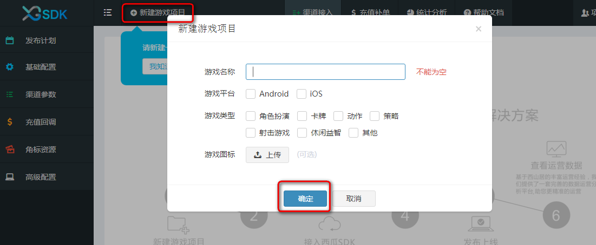
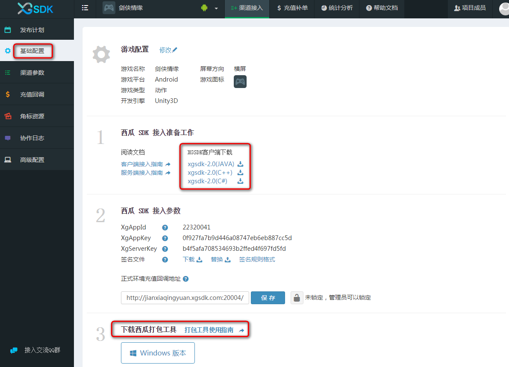
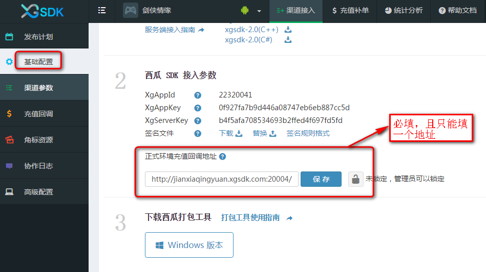
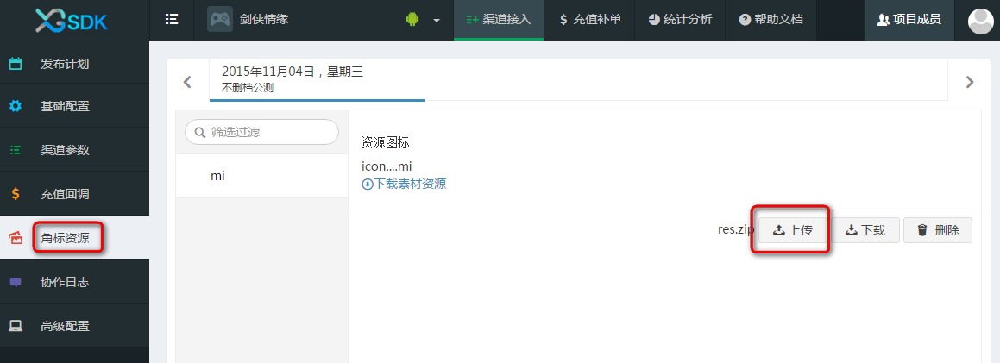

# 快速入门西瓜SDK(<a href = "http://console.xgsdk.com/download.html">点击下载相关资源</a>)
---
#### 西瓜SDK — ONCE FOR ALL手游多渠道快速接入解决方案：
 1. 准备阶段
  - 创建游戏
  - 创建发布计划：选择游戏版本的上线时间和渠道
 2. 接入西瓜SDK：接入登录、支付、统计功能
 3. 制作渠道包：西瓜提供了客户端打包工具，实现一键完成多渠道包制作
 4. 发布上线：游戏上线
 5. 查看运营数据：西瓜提供了一套完善的数据运营分析平台，点击“统计分析”进行查看

本教程将带您快速掌握西瓜SDK，实现一键完成多渠道包制作的完美体验，从此渠道接入不再是难事，整个过程需要西瓜web控制台和打包工具合作完成，请一步步跟着我做。

### 1. 准备阶段

##### 1.1 进入西瓜首页，点击注册按钮，进行免费注册

##### 1.2 注册之后将自动登录进首页

##### 1.3 进入首页可以看到新建游戏项目提示，点击“新建游戏项目”。然后填写游戏名称，选择游戏平台和游戏类型并上传游戏图标，点击确定

##### 1.4 此时您已经创建了一个新的游戏，系统将提示您为此游戏创建发布计划，用来规划上线时间和接入渠道，便于追踪和管理版本发布阶段的工作进度，点击新建计划

##### 1.5 填写计划名称，选择该计划的上线日期，在渠道列表中选择要发布的所有渠道及其版本号，本例为说明方便，只选择一个“mi”渠道，实际情况中可根据需要选择任意多的发布渠道，点击创建

##### 1.6 新建完发布计划后，会看到关于此计划下所有渠道的进展情况，一个分为五个步骤的进度条用于追踪渠道的进展情况

##### 1.7 点击左侧菜单栏的“基础配置”，选择游戏引擎和横竖屏（这两个选项为必选项）

##### 1.8 进入“基础配置”界面后，根据游戏具体情况下载相应的XGSDK打包工具和XGSDK客户端（<a href = "http://console.xgsdk.com/download.html">点击下载</a>）

##### 1.9 接下来对接入基本信息进行配置，包括渠道参数、充值回调地址、角标资源。分别如下图所示。
- 配置渠道参数  
图中的回调地址是渠道服务器通知西瓜SDK服务器支付订单信息的地址。

- 配置充值回调地址  
此地址是游戏服务器接收订单支付信息的接口地址，传递地址有三种方式（优先级为1>3>2）：  
1.游戏通过客户端代码传递此地址；  
2.选择“基础配置”在“正式环境充值回调地址”中填写（此处必填且只能填写一个地址）；  
3.选择“充值回调”，在对应的渠道中填写。

- 上传渠道角标资源（<a href="../section4/icon.html#jiaobiao" target="_blank" > 查看渠道角标要求 </a>  ）

##### 1.10 当接入基本信息配置完成之后，在发布计划面板上可以看到相应的进度条被点亮。

### 2. 开发接入

游戏可以根据引擎的不同选择对应的接入文档进行参考。
<a href="../section2/README.md" target="_blank">请移步这里！</a>

### 3. 制作渠道包

3.1 打开XGSDK打包工具(<a href = "http://console.xgsdk.com/download.html">我在这里等你下载！</a>)

 3.2 登录打包工具后，可以看到西瓜web控制台上新建的游戏和发布计划。上传游戏母包，然后选择渠道，点击“制作渠道包”

3.3 点击制作渠道包之后，打包工具进入渠道包制作过程，打包完成后点击“打开文件夹”获取最终渠道包

### 4. 发布上线

4.1 当游戏渠道包制作完成后，手动勾选进度条中的“渠道包就绪”，并填写备注

4.2 在西瓜web控制台对应的发布计划进度条中，将会看到“渠道包就绪”步骤被点亮，当鼠标置于该步骤时会看到其相应的备注信息

4.3 最后在西瓜web控制台“发布计划”中点击“成功上架”进度条，进行成功上架确认，至此游戏在渠道发布成功

### 5. 查看运营数据

5.1 游戏成功上架后，可点击“统计分析”查看游戏运营数据

5.2 在“统计分析”页面，用户可点击左侧菜单查看相应的运营数据

