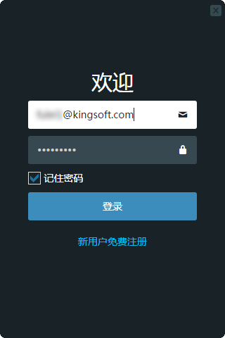
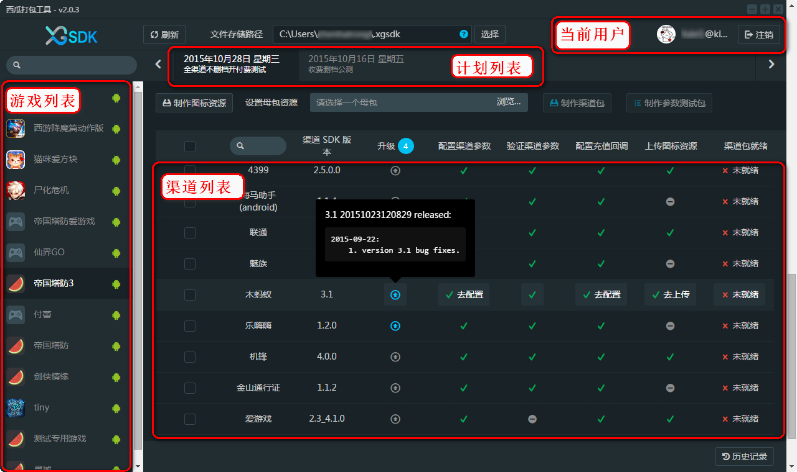
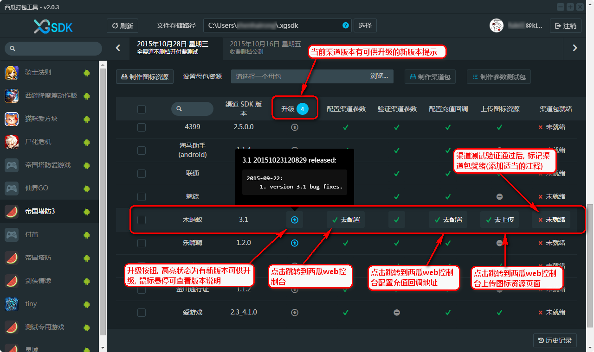
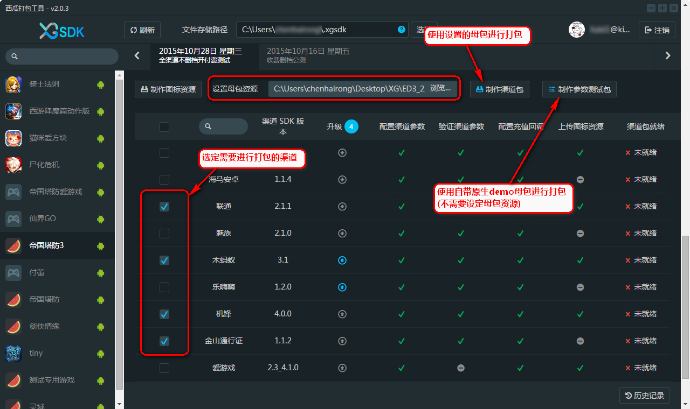
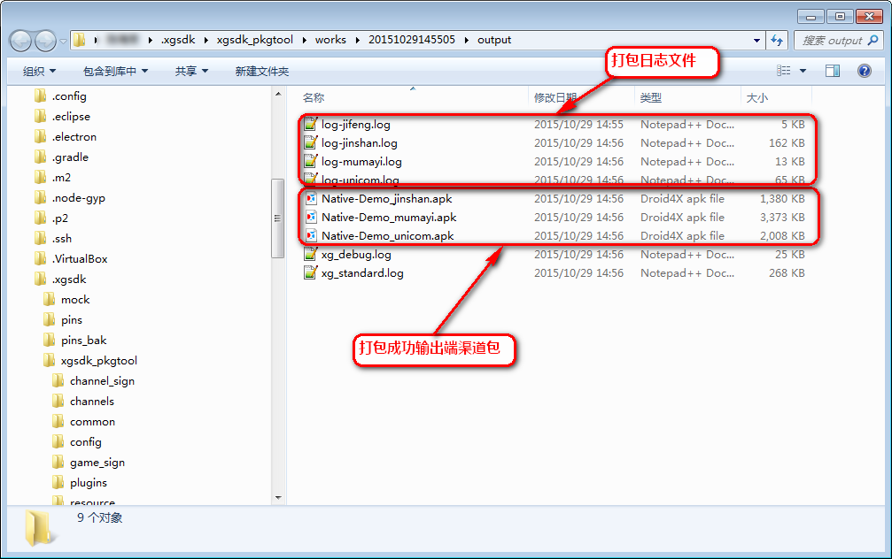
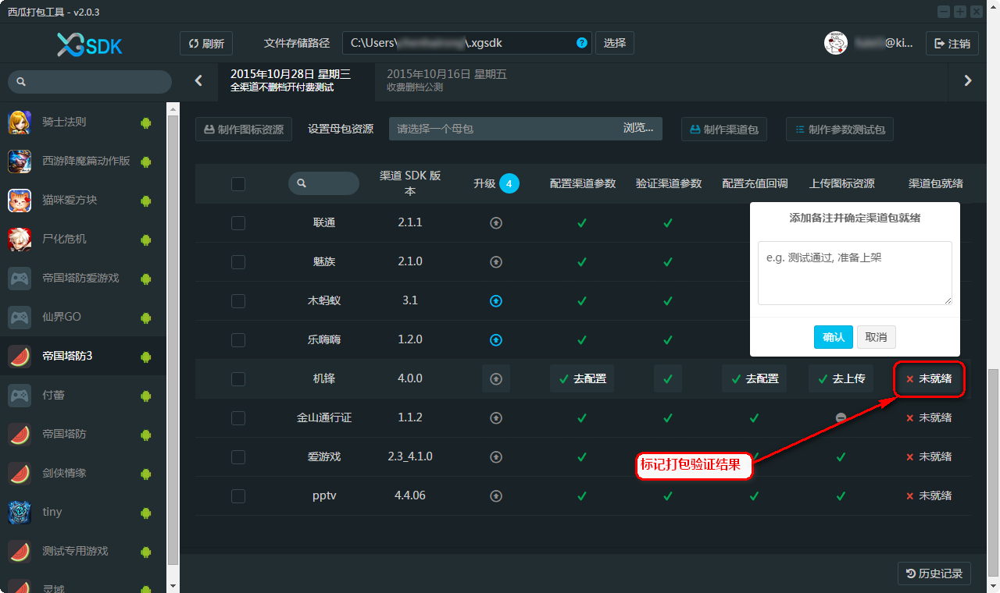
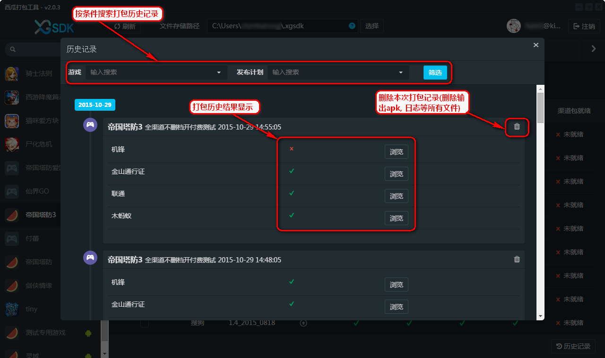

# 西瓜SDK打包工具客户端使用文档

## 1、文档概述

此文档是西瓜打包工具win32 v2.0.3版使用教程, 通过打包工具可以实现使用一个游戏母包打出多个渠道包,同时也可以将角标、闪屏等资源文件打入包中,实现真正的一键式打包.

## 2、环境要求
JDK1.8及以上版本

## 3、使用步骤

### 3.1 下载&安装西瓜打包工具

前往<a href="http://console.xgsdk.com/">西瓜官网</a>登录后，下载对应的版本安装包到本地进行安装。

### 3.2 西瓜打包工具主面板
点击刷新按钮从西瓜web控制台获得最新的发布计划以及渠道配置。

### 3.3 检查配置以及版本更新
在打包之前先检查是否有当前渠道版本是否有更新以及更新描述，渠道参数, 回调地址，角标资源是否配置就绪。

### 3.4 准备制作
确认配置参数完善后，根据需要选择需要打包的渠道。
 
- 制作渠道包

 需手动选择设置母包资源, 点击"制作渠道包" 打包工具开始对所选择的渠道以及已加载的配置进行打包, 可以通过底部的输出控制台查看打包运行状况,过程中可能需要从服务器下载对应的资源以及工具,请留意输出控制台的日志输出以更好的监测打包工具运行步骤以及状态

- 制作参数测试包

 不需要设置母包资源, 使用西瓜自带的原生demo母包进行打包(验证参数用)

 
###3.5开始制作

### 3.6 查看打包输出结果

主界面(上图)将会呈现打包结果(所选渠道的打包结果："制作成功"/"制作失败")， 点击"打开文件夹"以查看打包输出

 - 制作成功将会看到成功打包的程序安装包以及日志记录

 - 制作失败则只有日志文件输出

### 3.7 更新打包结果
回到主界面对不同渠道进行状态更新以标记渠道包是否就绪

### 3.8 本地打包历史记录
