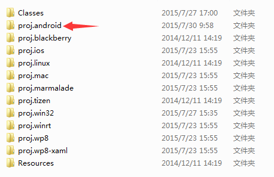
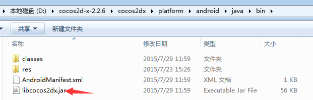
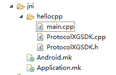
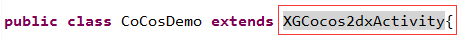
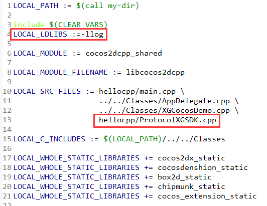
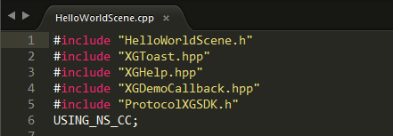
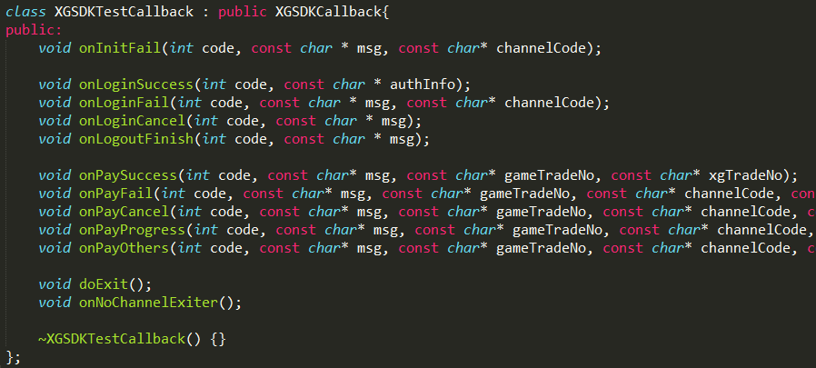
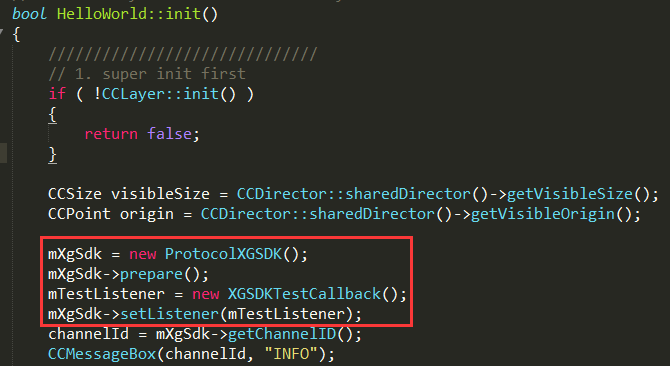

#西瓜SDK（Cocos2dx Android版）接入文档


****

<link rel="stylesheet" href="http://yandex.st/highlightjs/6.2/styles/googlecode.min.css">

<script src="http://code.jquery.com/jquery-1.7.2.min.js"></script>
<script src="http://yandex.st/highlightjs/6.2/highlight.min.js"></script>

<script>hljs.initHighlightingOnLoad();</script>
<script type="text/javascript">
 $(document).ready(function(){
      $("h2,h3,h4,h5,h6").each(function(i,item){
        var tag = $(item).get(0).localName;
        $(item).attr("id","wow"+i);
        $("#category").append('<a class="new'+tag+'" href="#wow'+i+'">'+$(this).text()+'</a></br>');
        $(".newh2").css("margin-left",0);
        $(".newh3").css("margin-left",20);
        $(".newh4").css("margin-left",40);
        $(".newh5").css("margin-left",60);
        $(".newh6").css("margin-left",80);
      });
 });
</script>


<div id="category" style="display:none"></div>

****
<!--
###文档信息

	渠道SDK Cocos2dx Android客户端接入文档
	作者：康洋
	SDK版本：2.0
	文档版本：1.0
	日期：2015.7.30
-->

###文档版本说明
<table>
<tr>
<td>SDK版本</td><td>文档版本</td> <td>DK修改内容</td> <td>文档修改内容</td> <td>修改日期</td>  
</tr>
<tr>
<td>2.0 </td><td>1.0</td> <td>初版</td> <td>初版</td> <td>2015.7.30</td>
</tr>
</table>

****

##1. 西山居渠道版SDK概述

	此文档为Cocosx2dx引擎Android游戏客户端接入文档。详细说明了接入渠道版SDK需要的资料和开发步骤


###1.1 SDK下载包
<p></p>
<div>
<b><font face="微软雅黑" size='3' color='#FF0000'>渠道版SDK下载包包含：</font></br></b>
<font face="微软雅黑" color='#0000FF'>&nbsp&nbsp&nbsp&nbsp 1. 西瓜SDKV2的Jar包：xgsdk-core.jar，xgsdk-data.jar，xgsdk-lib.jar，xgsdk-api.jar，xgsdk-common-lib.jar；</font> </br>
<font face="微软雅黑" color='0000FF'>&nbsp&nbsp&nbsp&nbsp 2. 接口文件：ProtocolXGSDK.h和ProtocolXGSDK.cpp；</font></br>
<font face="微软雅黑" color='0000FF'>&nbsp&nbsp&nbsp&nbsp 3. Cocos2dx的Android接入Demo；</font></br>
<font face="微软雅黑" color='0000FF'>&nbsp&nbsp&nbsp&nbsp 4. 西山居移动游戏-渠道SDK(Cocos2dx-Android)接入文档。</font>
</div>

##2. 配置环境与快速接入简介

###2.1 开发和接入所需基本环境

<p></p>
<div>
<b><font face="微软雅黑" size='3'color="#FF0000">Cocos2dx开发环境：</font> </b> </br>
<font face="微软雅黑" color="#0000FF"> &nbsp&nbsp&nbsp&nbsp Cocos2d-x版本：所有版本均可</font> </br>
<font face="微软雅黑" color="#0000FF"> &nbsp&nbsp&nbsp&nbsp Cocos2d-x开发工具：VS2012等</font> </br>
</div>
<p></p>
<div>
<b><font face="微软雅黑" size='3'color="#FF0000">Android开发环境：</font> </b> </br>
<font face="微软雅黑" color="#0000FF"> &nbsp&nbsp&nbsp&nbsp Android版本：Android2.2 以上</font> </br>
<font face="微软雅黑" color="#0000FF"> &nbsp&nbsp&nbsp&nbsp Android开发工具：Android SDK和Android Eclipse等</font> </br>
</div>

###2.2 Cocos2d-x Android接入基本步骤简介
<ol type="1" start="1">
<font face="微软雅黑">
	<li>将Cocos2d-x Android工程导入到Eclipse或者Android Studio；</li>
	<li>将XGSDK的jar包放置到Android工程的libs目录下；</li>
	<li>修改游戏的MainActivity代码，让其继承XGCocos2dxActivity；</li>
	<li>将接口文件ProtocolXGSDK.h和ProtocolXGSDK.cpp文放置到jni/hellocpp目录下；</li>
	<li>修改Android.mk文件(具体修改内容见后文)；</li>
	<li>在游戏代码中引入ProtocolXGSDK.h头文件，并且继承实现XGSDKCallback回调接口类；</li>
	<li>在Cocos游戏代码中添加ProtocolXGSDK成员实例，并且在init()方法中初始化和调用prepare方法；</li>
	<li>在init()方法中初始化回调接口类，并且调用ProtocolXGSDK的setListener()成员方法；</li>
	<li>最后完成登陆、支付、清理资源等必接接口的接入便完成了Cocos2d-x原生接入的所有步骤；</li>
	<li>编译打包测试通过。</li>
</font>
</ol>

##3. 导入Cocos2d-x的相应工程到开发工具

###3.1 导入Android工程
<div>
<font face="微软雅黑">
Cocos2d-x的android工程位于游戏项目下的proj.android，将该工程导入到Eclipse或者Andorid Studio中。该文档主要讲解Eclipse开发工具，其他的开发工具类似，Eclipse导入android工程如下图所示：</br>

</font>
</div>

###3.2 导入后如果出现找不到Cocos2d-x相关类的错误的解决方法：

<div>
<ol type="1" start="1">
<font face="微软雅黑">
	<li>请在Cocos2d-x的安装路径中找到相应目录，如：D:\cocos2d-x-2.2.6\cocos2dx\platform\android\java，导入该工程并关联到Android工程；</li>
	<li>在Cocos2d-x安装目录下搜索libcocos2dx.jar，或者相应目录下，如：D:\cocos2d-x-2.2.6\cocos2dx\platform\android\java\bin找到libcocos2dx.jar并导入Android工程的libs目录下；</li>
</font>
</ol>

</div>

##4. 修改相应平台工程的配置信息

###4.1 复制SDK的Jar包

<div>
<font face="微软雅黑">西瓜SDKV2的Jar包，xgsdk-core.jar，xgsdk-data.jar，xgsdk-lib.jar，xgsdk-api.jar，xgsdk-common-lib.jar，拷贝到Android工程的libs目录下：
</font></br>

</div>

###4.2 复制接口文件
<div>
<font face="微软雅黑">复制接口文件ProtocolXGSDK.h和ProtocolXGSDK.cpp到Android工程中的jni/hellocpp目录下，如图：</font> </br>

</div>

###4.3 修改游戏的主Activity
<div>
<font face="微软雅黑">找到游戏的主Activity（继承于Cocos2dxActivity的游戏主Activity），修改该Activity，让其继承XGCocos2dxActivity：
</font></br>
<font face="微软雅黑" color="0000FF" size='3'>修改前:</font></br>
</br>
<font face="微软雅黑" color="0000FF" size='3'>修改后:</font></br>
</br>
<b><font face="微软雅黑">修改后的代码如下：</font></br></b>
</div>

```
	public class CoCosDemo extends XGCocos2dxActivity
```

###4.4 修改Android项目的Android.mk文件

<div>
<font face="微软雅黑">在Android.mk文件中添加如图所框的两行：</font></br>
</br>
<b><font face="微软雅黑">添加的代码如下：</font></b>
</div>

```
	LOCAL_LDLIBS :=-llog
	LOCAL_SRC_FILES := hellocpp/main.cpp \
                   ../../Classes/AppDelegate.cpp \
                   ../../Classes/XGCocosDemo.cpp \
                   hellocpp/ProtocolXGSDK.cpp
```

##5.原生基本接口的接入

<div>
<b><font face="微软雅黑" color='ff0000'>1. 首先先确认ProtocolXGSDK.h头文件和ProtocolXGSDK.cpp源文件已经按照4.2拷贝到相应目录下。</font></b></br>
<b><font face="微软雅黑" color='ff0000'>2. 然后在使用到ProtocolXGSDK的地方首先导入头文件"ProtocolXGSDK.h"，例如在我们的Demo中添加如图中所示代码：</font></b></br>
</br>
<b><font face="微软雅黑">添加的代码是：</font></b>
</div>

```
	#if(CC_TARGET_PLATFORM == CC_PLATFORM_ANDROID)

	#include "../proj.android/jni/hellocpp/ProtocolXGSDK.h"

	#endif

```

<div>
<b><font face="微软雅黑" color='ff0000'>3. 用户要继承并且实现回调类（可参考Demo），如图：</font></b></br>
</br>
</div>

<div>
<b><font face="微软雅黑" color='ff0000'>4. 然后在游戏的类中声明一个指向ProtocolXGSDK的指针mXgSdk和指向XGSDKTestCallback的指针（可参考Demo），如图：</font></b></br>
</br>
<b><font face="微软雅黑">添加的代码是：</font></b>
</div>

```
	ProtocolXGSDK *mXgSdk;
	XGSDKTestCallback *mTestListener;
```

<div>
<b><font face="微软雅黑" color='ff0000'>5. 需要在层的init()函数中初始化ProtocolXGSDK和XGSDKTestCallback（可参考Demo），如图加入代码：</font></b></br>
</br>
<b><font face="微软雅黑">添加的代码是：</font></b>
</div>

```
	mXgSdk = new ProtocolXGSDK();
    mXgSdk->prepare();
    mTestListener = new XGSDKTestCallback();
    mXgSdk->setListener(mTestListener);
```

###5.1 初始化回调接口（必接）
<b><font face="微软雅黑">初始化失败后回调此回调方法，参考代码：</font></b>

```
	void XGSDKTestCallback::onInitFail(int retCode, const char* msg){
    	cocos2d::CCMessageBox(msg, "INFO");
	}
```

<div>
<b><font face="微软雅黑">关于参数的说明：</font></b>
<ul type='disc'>
	<li>retCode：返回的错误码</li>
	<li>msg：返回的信息</li>
</ul>
</div>

###5.2 登录接口（必接）

<div>
<b><font face='微软雅黑'>调用位置XGCocosDemo.cpp中，调出渠道的登陆界面</font></b>
</div>

```
	mXgSdk->login();
```

<div>
<font face='微软雅黑' color='ff0000'>请勿游戏启动后直接调用此接口，部分渠道初始化时间较长，初始化不成功调用登录接口会出现游戏崩溃等问题，建议添加用户登录界面，由用户点击触发登陆操作</font>
</div>

###5.3 登录回调（必接）
<b><font face="微软雅黑">登录后回调这些回调方法，参考代码：</font></b>

```
	void XGSDKTestCallback::onLoginSuccess(const char* msg){
    	cocos2d::CCMessageBox(msg, "INFO");
	}
	void XGSDKTestCallback::onLoginFail(int retCode, const char* msg){
    	cocos2d::CCMessageBox(msg, "INFO");
	}
	void XGSDKTestCallback::onLoginCancel(const char* msg){
    	cocos2d::CCMessageBox(msg, "INFO");
	}
```

<div>
<b><font face="微软雅黑">关于参数的说明：</font></b>
<ul type='disc'>
	<li>retCode：返回的错误码</li>
	<li>msg：返回的信息</li>
</ul>
</div>

###5.4 登出接口（必接）

<div>
<b><font face='微软雅黑'>调用位置XGCocosDemo.cpp中，调用该方法后将会调出渠道登出界面，并且回调onLogout方法</font></b>
</div>

```
	mXgSdk->logout();
```

###5.5 登出回调（必接）
<b><font face="微软雅黑">登录后回调这些回调方法，参考代码：</font></b>

```
	void XGSDKTestCallback::onLogoutSuccess(const char *msg){
    	cocos2d::CCMessageBox(msg, "INFO");
	}
	void XGSDKTestCallback::onLogoutFail(int retCode, const char *msg){
    	cocos2d::CCMessageBox(msg, "INFO");
	}

```

<div>
<b><font face="微软雅黑">关于参数的说明：</font></b>
<ul type='disc'>
	<li>retCode：返回的错误码</li>
	<li>msg：返回的信息</li>
</ul>
</div>

###5.6 支付接口（必接）

<div>
<b><font face='微软雅黑'>调用位置XGCocosDemo.cpp中，此接口将会发起用户充值，系统会调用对应渠道SDK充值界面。支付接口需要传入类型为PayInfo的参数。</font></b>
</div>

```
	mXgSdk->pay(PayInfo &payInfo);

```

<div>
<b><font face="微软雅黑">类型PayInfo结构体定义在ProtocolXGSDK.h头文件中：</font></b>
</div>

```
	struct PayInfo{
		const char *uid;
		int productTotalPirce;
		int productCount;
		int productUnitPrice;
		const char *productId;
		const char *productName;
		const char *productDesc;
		const char *currencyName;
		const char *serverId;
		const char *serverName;
		const char *zoneId;
		const char *zoneName;
		const char *roleId;
		const char *roleName;
		const char *balance;
		const char *gameOrderId;
		const char *ext;
		const char *notifyURL;
	};
```

<div>
<b><font face="微软雅黑">关于PayInfo的成员说明</font></b>
<table >
<tr>
	<th>输入参数</th>
	<th>数据类型</th>
	<th>说明</th>
	<th>可空</th>
</tr>
<tr>
	<td>uid</td>
	<td>const char *</td>
	<td>用户ID</td>
	<td>N</td>
</tr>
<tr>
	<td>productTotalPirce</td>
	<td>int</td>
	<td>产品价格</td>
	<td>N</td>
</tr>
<tr>
	<td>productCount</td>
	<td>int</td>
	<td>产品数量</td>
	<td>N</td>
</tr>
<tr>
	<td>productUnitPrice</td>
	<td>int</td>
	<td>产品单价</td>
	<td>N</td>
</tr>
<tr>
	<td>productId</td>
	<td>const char *</td>
	<td>产品ID</td>
	<td>N</td>
</tr>
<tr>
	<td>productName</td>
	<td>const char *</td>
	<td>产品名称</td>
	<td>N</td>
</tr>
<tr>
	<td>productDesc</td>
	<td>const char *</td>
	<td>产品描述</td>
	<td>N</td>
</tr>
<tr>
	<td>currencyName</td>
	<td>const char *</td>
	<td>游戏金额单位，如“元宝”</td>
	<td>N</td>
</tr>
<tr>
	<td>serverId</td>
	<td>const char *</td>
	<td>服ID</td>
	<td>N</td>
</tr>
<tr>
	<td>serverName</td>
	<td>const char *</td>
	<td>服名称</td>
	<td>N</td>
</tr>
<tr>
	<td>zoneId</td>
	<td>const char *</td>
	<td>区ID</td>
	<td>Y</td>
</tr>
<tr>
	<td>zoneName</td>
	<td>const char *</td>
	<td>区名称</td>
	<td>Y</td>
</tr>
<tr>
	<td>roleId</td>
	<td>const char *</td>
	<td>角色ID</td>
	<td>N</td>
</tr>
<tr>
	<td>roleName</td>
	<td>const char *</td>
	<td>角色名称</td>
	<td>N</td>
</tr>
<tr>
	<td>balance</td>
	<td>const char *</td>
	<td>余额</td>
	<td>N</td>
</tr>
<tr>
	<td>gameOrderId</td>
	<td>const char *</td>
	<td>游戏订单ID</td>
	<td>N</td>
</tr>
<tr>
	<td>ext</td>
	<td>const char *</td>
	<td>扩展字段</td>
	<td>Y</td>
</tr>
<tr>
	<td>notifyURL</td>
	<td>const char *</td>
	<td>支付通知URL地址</td>
	<td>Y</td>
</tr>
</table>
</div>

###5.7 支付回调（必接）
<b><font face="微软雅黑">支付完成回调这些回调方法，参考代码：</font></b>

```
	void XGSDKTestCallback::onPaySuccess(const char* msg){
    	cocos2d::CCMessageBox(msg, "INFO");
	}
	void XGSDKTestCallback::onPayFail(int retCode, const char *msg){
    	cocos2d::CCMessageBox(msg, "INFO");
	}
	void XGSDKTestCallback::onPayCancel(const char * msg){
    	cocos2d::CCMessageBox(msg, "INFO");
	}

```

<div>
<b><font face="微软雅黑">关于参数的说明：</font></b>
<ul type='disc'>
	<li>retCode：返回的错误码</li>
	<li>msg：返回的信息</li>
</ul>
</div>

###5.8 退出接口（必接）

<div>
<b><font face='微软雅黑'>调用位置XGCocosDemo.cpp中，退出接口，当用户在游戏中需要退出游戏时调用该接口。参考代码：</font></b>
</div>

```
	mXgSdk->exit();
```

###5.9 退出回调（必接）
<b><font face="微软雅黑">退出回调这些回调方法，如果有渠道的退出接口则调用渠道的退出接口，如果没有渠道的退出接口则调用游戏的退出。</font></b>

```
	void XGSDKTestCallback::onExit(){
    	cocos2d::CCMessageBox("Exit Success", "INFO");
		CCDirector::sharedDirector()->end();
	}
	void XGSDKTestCallback::onNoChannelExiter(){
    	cocos2d::CCMessageBox("Exit OnNoChannel", "INFO");
	}
	void XGSDKTestCallback::onCancel(){
    	cocos2d::CCMessageBox("Exit onCancel", "INFO");
	}
```

###5.10 资源释放接口（必接）
<b><font face="微软雅黑">释放资源，包括释放ProtocolXGSDK，释放XGSDKCallback等。请在最终游戏退出Kill游戏进程前调用该方法，参考代码：</font></b>

```
	mXgSdk->releaseResource();
```

<div>
<font face='微软雅黑' color='ff0000'>请在最终游戏退出Kill游戏进程前调用该方法。</font>
</div>

##6.统计接口

<!--
###2.配置AndroidManifext.xml文件
**配置权限**


	<uses-permission android:name="android.permission.ACCESS_NETWORK_STATE" />
    <uses-permission android:name="android.permission.ACCESS_WIFI_STATE" />
	<uses-permission android:name="android.permission.READ_PHONE_STATE" />
	<uses-permission android:name="android.permission.INTERNET" />
	<uses-permission android:name="android.permission.WRITE_EXTERNAL_STORAGE" />

**<application>标签的属性android:name必须配置成com.xsj.sdk.XSJApplication或其扩展的子类**

<application
        android:name="com.xsj.sdk.XSJApplication"
        android:icon="@drawable/ic_launcher" >

###3.增加闪屏

***（打包平台完成后，此部分将会简化）***

若需要增加闪屏，CP方可以将闪屏图片以xsj_s为前缀，后续跟数字命名，如：xsj_s0.png、xsj_s1.png，放入对应分辨率res/drawable目录。
AndroidManifext.xml中配置com.xsj.sdk.agent.splash.XSJSplashActivity为启动Activity，将原启动Activity的intent-filter重新配置，如下：


        <activity
            android:name="com.xsj.sdk.agent.splash.XSJSplashActivity"
            android:screenOrientation="sensorLandscape"
            android:theme="@android:style/Theme.NoTitleBar.Fullscreen" >
            <intent-filter>
                <action android:name="android.intent.action.MAIN" />

                <category android:name="android.intent.category.LAUNCHER" />
            </intent-filter>
        </activity>
        <activity
            android:name="com.xsj.sdk.agent.demo.MainActivity"
            android:configChanges="keyboardHidden|orientation|screenSize"
            android:label="@string/app_name"
            android:screenOrientation="sensorLandscape" >
            <intent-filter>
                <action android:name="XSJSDK.MAIN" />

                <category android:name="android.intent.category.DEFAULT" />
            </intent-filter>
        </activity>

###4.导入SDK及插件
    将下载包中xsjdata.jar和xsjsdkcore.jar合并到本地工程libs子目录下，ADT17以上会自动识别，ADT17以下，请在Eclipse中右键工程根
    目录，选择Properties->Java Build Path->Libraries，点击Add External JARs…选择指向jar的路径，点击OK，即可导入成功。将
    libdataglue文件夹复制到[COCOS2DX_ROOT]/cocos2dx/platform/third_party/android/prebuilt目录下（如果工程是
    cocos2dx3.0，libdataglue文件夹放到[PROJECT]/../cocos2d/external目录下）。
    修改你的工程Android.mk文件在LOCAL_WHOLE_STATIC_LIBRARIES := cocos2dx_static后添加
    LOCAL_WHOLE_STATIC_LIBRARIES +=xsjchannel_static，在$(call import-module,cocos2dx)
	后添加$(call import-module,libchannelglue)
###5.快速接入
**生命周期以及初始化接口在主Activity中接入，其他游戏相关接口封装成了C++接口:核心类ChannelSDK**

####5.1生命周期接口

**生命周期接口，需要确保在游戏主Activity中被调用**


	public void onCreate() {
    	super.onCreate();
    	GameAgent.getInstance().onCreate(activity);
	}

	public void onStop() {
    	super.onStop();
    	GameAgent.getInstance().onStop(activity);
	}

	public void onDestroy() {
    	super.onDestroy();
    	GameAgent.getInstance().onDestroy(activity);
	}

	public void onResume() {
    	super.onResume();
    	GameAgent.getInstance().onResume(activity);
	}

	public void onPause() {
    	super.onPause();
    	GameAgent.getInstance().onPause(activity);
	}

	public void onStart() {
    	super.onStart();
    	GameAgent.getInstance().onStart(activity);
	}

	public void onRestart() {
    	super.onStart();
    	GameAgent.getInstance().onRestart(activity);
	}

	protected void onActivityResult(int requestCode, int resultCode, Intent data) {
    	super.onActivityResult(requestCode, resultCode, data);
    	GameAgent.getInstance().onActivityResult(activity,requestCode,resultCode,data);
	}


####5.2 初始化

**以下方法请在游戏主Activity的 onCreate() 方法中调用**

	GameAgent.getInstance().setDebugMode(boolean debug);//debug模式开关，true为打开，false为关闭。默认为false。**注意：Debug模式会打出很多日志，在低端设备可能会影响游戏性能，因此游戏正式上线时一定要关闭。**

    GameAgent.getInstance().setStatisticEnable(boolean enable); //数据统计开关，true为打开，false为关闭。默认为false。若游戏已使用XSJDataAgent进行统计，此处应设为false，以免重复统计。统计接口参见本文档5.4

	JNIGameAgent.getInstance().doInit(this, new GLThreadRunner(){

            @Override
            public void runOnGLThread(Runnable runnable) {
            	MainActivity.this.runOnGLThread(runnable);
            }

        });//初始化JNIGameAgent方法，参数是主Acitiviy当前对象和GL线程运行器对象。直接复制此段代码，将MainActivity换成你的工程的主Activity类名即可。

####5.3 设置UserCallBack

	ChannelSDK::SetUserCallBack(new UserCallBackImpl());

**参数说明**
<table>
<tr>
<td>参数</td><td>类型</td><td>说明</td>
</tr>
<tr>
<td>userCallBack</td><td>UserCallBack</td><td>用户相关回调</td>
</tr></table>

#####5.3.1 UserCallBack 用户相关回调
**包含登录/登出/切换账号三种回调方法**


	class UserCallBackImpl: public UserCallBack {
	public:
		virtual void onLogin(Result *result) {

			CCLog("login success,result code %d msg %s", result->getCode(),result->getMsg().c_str());
			map<string,string> extras = result->getExtras();
			map<string,string>::iterator it=extras.begin();
			for(;it!=extras.end();++it){
				CCLog("result key %s,value %s", it->first.c_str(),it->second.c_str());
			}
			switch (result->getCode()) {
			case Result::CODE_SUCCESS:{
				//登录成功
				string sessionId = result->getMsg();
				// sessionId很重要，游戏服务器拿sessionId去向XSJ服务器验证登录，
				// 验证成功后，XSJ服务器会返回唯一的用户标识uid
			}
				break;
			case Result::CODE_ERROR:{

			}//登录出错
			case Result::CODE_FAIL:{//登录失败
				string reason = result->getMsg();
			}
				// 失败原因，不同渠道返回内容不同，建议写成日志，不要直接显示给用户
				break;
			case Result::CODE_CANCEL:{
				//登录取消
			}
				break;
			default:{}
				break;
			}
	    };
	    virtual void onLogout(Result *result) {
	    };
	    virtual void onChangeUser(Result* result){};
	};


#####5.3.2 Result 返回
**Result是所有callback的通用类型**

Result属性
<table>
<tr>
<td>属性名</td><td>类型</td><td>说明</td>  
</tr>
<tr>
<td>code</td><td>int</td><td>状态码</td>
</tr>
<tr>
<td>msg</td><td>string</td><td>失败原因或成功相关信息</td>
</tr>
<tr>
<td>extras</td><td>Map</td><td>扩展属性</td>
</tr>
</table>

状态码对应表
<table>
<tr>
<td>代码</td><td>值</td><td>含义</td>  
</tr>
<tr>
<td>CODE_SUCCESS</td><td>0</td><td>成功</td>
</tr>
<tr>
<td>CODE_UNKNOWN</td><td>100</td><td>未知</td>
</tr>
<tr>
<td>CODE_FAIL</td><td>101</td><td>失败</td>
</tr>
<tr>
<td>CODE_ERROR</td><td>102</td><td>错误</td>
</tr>
<tr>
<td>CODE_CANCEL</td><td>103</td><td>取消</td>
</tr>
<tr>
<td>CODE_PROGRESSING</td><td>104</td><td>进行中</td>
</tr>
</table>

####5.4 登录登出接口
#####5.4.1 登录

	ChannelSDK::DoLogin();

#####5.4.2 登出

渠道是否支持，可以通过ChannelSDK::IsMethodSupport(“doLogout”)方法判断。

	ChannelSDK::DoLogout();


####5.5 设置信息接口
#####5.5.1 进入游戏

当获得完整的用户信息、角色信息、区服信息后，进入游戏时调用。


    ChannelSDK::OnEnterGame(string accountId, string nickname, string roleId,
	string roleName, string gender, string level, string vipLevel,
	string balance, string partyName, string serverId, string serverName)；


**参数说明**
<table>
<tr>
<td>参数</td><td>类型</td><td>说明</td>  
</tr>
<tr>
<td>accountId</td><td>string</td><td>游戏账户Id(必要)</td>
</tr>
<tr>
<td>nickname</td><td>string</td><td>游戏账户昵称</td>
</tr>
<tr>
<td>roleId</td><td>string</td><td>角色Id(必要)</td>
</tr>
<tr>
<td>roleName</td><td>string</td><td>角色名(必要)</td>
</tr>
<tr>
<td>gender</td><td>string</td><td>角色性别</td>
</tr>
<tr>
<td>level</td><td>string</td><td>角色等级(必要)</td>
</tr>
<tr>
<td>vipLevel</td><td>string</td><td>角色vip等级</td>
</tr>
<tr>
<td>balance</td><td>string</td><td>角色账户余额</td>
</tr>
<tr>
<td>partyName</td><td>string</td><td>公会名称</td>
</tr>
<tr>
<td>serverId</td><td>string</td><td>服务器Id(必要)</td>
</tr>
<tr>
<td>serverName</td><td>string</td><td>服务器名称(必要)</td>
</tr></table>

#####5.5.2 创建角色
当角色被创建的时候调用


    ChannelSDK::OnCreateRole(string roleId, string roleName, string gender,
		string level, string vipLevel, string balance, string partyName)；


**参数说明**
<table>
<tr>
<td>参数</td><td>类型</td><td>说明</td>  
</tr>
<tr>
<td>roleId</td><td>string</td><td>角色Id</td>
</tr>
<tr>
<td>roleName</td><td>string</td><td>角色名</td>
</tr>
<tr>
<td>gender</td><td>string</td><td>角色性别</td>
</tr>
<tr>
<td>level</td><td>string</td><td>角色等级</td>
</tr>
<tr>
<td>vipLevel</td><td>string</td><td>角色vip等级</td>
</tr>
<tr>
<td>balance</td><td>string</td><td>角色账户余额</td>
</tr>
<tr>
<td>partyName</td><td>string</td><td>公会名称</td>
</tr></table>

#####5.5.3 角色升级
当角色升级时调用

	ChannelSDK::OnRoleLevelup(string level)；

**参数说明**

<table>
<tr>
<td>参数</td><td>类型</td><td>说明</td>  
</tr>
<tr>
<td>level</td><td>string</td><td>角色新等级</td>
</tr></table>


####5.6 支付接口

    ChannelSDK::DoPay(float money, int goodsCount, string coinName,
		string productId, string productName, string productDesc,
		int exchangeRate, string uid, string serverId, string roleId,
		string extraInfo);

**参数说明**
<table>
<tr>
<td>参数</td><td>类型</td><td>说明</td>  
</tr>
<tr>
<td>money</td><td>float</td><td>总金额（单位人民币元）</td>
</tr>
<tr>
<td>goodsCount</td><td>int</td><td>道具数量（默认填1）</td>
</tr>
<tr>
<td>coinName</td><td>string</td><td>游戏币名称</td>
</tr>
<tr>
<td>productId</td><td>string</td><td>道具id</td>
</tr>
<tr>
<td>productName</td><td>string</td><td>道具名称</td>
</tr>
<tr>
<td>productDesc</td><td>string</td><td>道具描述</td>
</tr>
<tr>
<td>exchangeRate</td><td>string</td><td>与渠道游戏币兑换比率（默认填1）</td>
</tr>
<tr>
<td>uid</td><td>string</td><td>xsj的uid</td>
</tr>
<tr>
<td>serverId</td><td>string</td><td>服务器id</td>
</tr>
<tr>
<td>roleId</td><td>string</td><td>角色id</td>
</tr>
<tr>
<td>extraInfo</td><td>string</td><td>扩展信息，充值成功或失败后会原文回传给游戏，游戏可以据此确定购买记录</td>
</tr></table>
#####5.6.1 设置支付回调

    ChannelSDK::SetPayCallBack(PayCallBack *_payback);

#####5.6.2 PayCallBack 支付回调
**Result前面已标注，不再赘述。**

	class PayCallBack {
	public:
		virtual void onPaySuccess(Result* result) = 0;//表示成功发起支付，不代表充值成功。充值真实结果以向游戏服务器发送的支付回调为准。
		virtual void onPayFail(Result* result) = 0;//支付失败
		virtual void onPayCancel(Result* result) = 0;//支付中
		virtual void onPayProgress(Result* result) = 0;//支付取消
	};

####5.7 退出接口
渠道是否支持，可以通过ChannelSDK::IsMethodSupport(“doExit”)方法判断。

	ChannelSDK::DoExit();

#####5.7.1 设置退出回调

	ChannelSDK::SetExitCallBack(ExitCallBack *_exitback);

#####5.7.2 ExitCallBack 退出回调

	class ExitCallBack {
	public:
		virtual void onExit() = 0;//当渠道提供退出提示窗口，会收到此回调，游戏可以直接退出
		virtual void onNoChannelExiter() = 0;//当渠道没有退出界面，需要游戏方提供退出确认界面时，会收到此回调
	};

####5.8 打开用户中心
有些渠道（安智、当乐、益玩、酷狗等）提供了打开用户中心方法，游戏中通过此方法提供玩家查看用户信息的功能。
渠道是否支持，可以通过ChannelSDK::IsMethodSupport(“openUserCenter”)方法判断。

	ChannelSDK::OpenUserCenter();

####5.9 获得渠道用户信息
有些渠道（当乐、OPPO等）支持获得用户信息，可以通过此方法获得。
渠道是否支持，可以通过ChannelSDK::IsMethodSupport(“getChannelUserInfo”)方法判断。

	ChannelSDK::GetChannelUserInfo();

#####5.9.1 设置渠道用户信息回调

	ChannelSDK::SetUserInfoCallBack(UserInfoCallBack *_infoback);


#####5.9.2 UserInfoCallBack 渠道用户信息回调

	class UserInfoCallBack {
	public:
		virtual void onSuccess(Result* result) = 0;//成功后，渠道用户信息会放在result的extras集合中，不同渠道返回信息内容不同
		virtual void onFail(Result* result) = 0;
	};

####5.10 切换账号
某些渠道提供了切换账号方法，可以使用此方法切换账号。

	ChannelSDK::DoChangeUser();//回调在UserCallBack的onChangeUser(Result* result)方法

###6.高级功能

####6.1 判断当前渠道是否支持此功能

各渠道提供的主要功能方法有登录/支付/登出/退出/切换用户/打开用户中心/得到用户信息等，不同渠道对某些方法不支持。

游戏开发可以使用此方法进行判断，当前渠道是否支持。

	ChannelSDK::IsMethodSupport(string methodName);

**返回值：**
<table>
<tr>
<td>类型</td><td>说明</td>
</tr>
<tr>
<td>bool</td><td>true：支持<br>false：不支持</td>
</tr>
</table>

**参数说明**
<table><tr>
<td>参数</td><td>类型</td><td>说明</td>
</tr>
<tr>
<td>methodName</td><td>string</td><td>GameAgent中对应的接口方法名</td>
</tr></table>

**功能与方法名对应表**
<table>
<tr>
<td>渠道功能</td><td>methodName</td>
</tr>
<tr>
<td>登录</td><td>doLogin</td>
</tr>
<tr>
<td>支付</td><td>doPay</td>
</tr>
<tr>
<td>登出</td><td>doLogout</td>
</tr>
<tr>
<td>退出</td><td>doExit</td>
</tr>
<tr>
<td>切换用户</td><td>doChangeUser</td>
</tr>
<tr>
<td>打开用户中心</td><td>openUserCenter</td>
</tr>
<tr>
<td>获得用户信息</td><td>getChannelUserInfo</td>
</tr></table>

**应用场景示例：**

有些渠道提供打开用户中心接口，需要在游戏内添加“打开用户中心”按钮。游戏可以使用IsMethodSupport方法在游戏中判断是否需要显示“打开用户中心”按钮。

####6.2 区分当前所处渠道

游戏客户端可以通过此方法，判断当前所处渠道。

	ChannelSDK::GetChannel();

**返回值**
<table>
<tr><td>类型</td><td>说明</td></tr>
<tr><td>string</td><td>渠道tag，渠道列表见《附录一》</td></tr>
</table>

####6.3 获得自定义参数
游戏CP可以在平台配置参数，游戏客户端获得参数。CP可以针对每个渠道配置不同的参数，方便做渠道特性开发。

	ChannelSDK::GetGameProperty(string key, string defaultValue);

**返回值**
<table>
<tr><td>类型</td><td>说明</td></tr>
<tr><td>string</td><td>返回在平台配置key对应的参数</td></tr>
</table>

**参数说明**
<table>
<tr><td>参数</td><td>类型</td><td>说明</td></tr>
<tr><td>key</td><td>string</td><td>自定义参数key</td></tr>
<tr><td>defaultValue</td><td>string</td><td>若值不存在，返回此默认值</td></tr>
</table>

####6.4 统计

**若需要完整统计游戏数据，请在游戏适当时机调用以下方法**

#####6.4.1 vip升级

	ChannelSDK::OnVipLevelup(string vipLevel);

**参数说明**
<table>
<tr><td>参数</td><td>类型</td><td>说明</td></tr>
<tr><td>vipLevel</td><td>string</td><td>vip等级</td></tr>
</table>

#####6.4.2 新手引导

	ChannelSDK::OnNewbieGuide(string step);

**参数说明**
<table>
<tr><td>参数</td><td>类型</td><td>说明</td></tr>
<tr><td>step</td><td>string</td><td>新手引导步骤</td></tr>
</table>

#####6.4.3 消费

	ChannelSDK::OnGameConsume(string consumeId, int number, int price,string category);

**参数说明**
<table>
<tr><td>参数</td><td>类型</td><td>说明</td></tr>
<tr><td>consumeId</td><td>string</td><td>消费id</td></tr>
<tr><td>number</td><td>int</td><td>购买数量</td></tr>
<tr><td>price</td><td>int</td><td>道具单价（单位：游戏币）</td></tr>
<tr><td>category</td><td>string</td><td>消费类别</td></tr>
</table>

#####6.4.4 自定义事件

	ChannelSDK::OnEvent(string eventId);

**参数说明**
<table>
<tr><td>参数</td><td>类型</td><td>说明</td></tr>
<tr><td>eventId</td><td>string</td><td>自定义事件id</td></tr>
</table>

#####6.4.5 错误日志

重载了两个方法

	ChannelSDK::OnError(string error);

**参数说明**
<table>
<tr><td>参数</td><td>类型</td><td>说明</td></tr>
<tr><td>error</td><td>string</td><td>错误信息</td></tr>
</table>

#####6.4.6 游戏退出或杀掉进程时，请务必调用此方法，以便保存数据

	ChannelSDK::OnExitOrKillProgress();


###7. 调试
####7.1 模拟登录
完成接入的基础游戏包，会包含一个测试渠道，可以输入任何username登录成功，方便游戏测试。

###8. 混淆

若需要混淆java代码，不要将SDK代码混淆，可在proguard中进行如下配置：

	-keep class com.xsj.sdk.**{*;}
	-keep class com.xsj.sdk.agent.** {*;}
	-keep class com.xsj.sdk.utils.** {*;}
	-keep class com.xsj.sdk.jnihelper.** {*;}
	-keep class com.xsj.core.**{*;}
	-keep class com.xsj.data.**{*;}
	-keep class com.xsj.upgrade.**{*;}


###附录一
渠道与channelTag对照表
<table>
<tr><td>渠道</td><td>channelTag</td></tr>
<tr><td>小米</td><td>xiaomi</td></tr>
<tr><td>百度</td><td>baidu</td></tr>
<tr><td>UC</td><td>uc</td></tr>
<tr><td>豌豆荚</td><td>wandoujia</td></tr>
<tr><td>安智</td><td>anzhi</td></tr>
<tr><td>PPS</td><td>pps</td></tr>
<tr><td>酷狗</td><td>kugou</td></tr>
<tr><td>当乐</td><td>downjoy</td></tr>
<tr><td>oppo</td><td>oppo</td></tr>
<tr><td>联想</td><td>lenovo</td></tr>
<tr><td>华为</td><td>huawei</td></tr>
<tr><td>金立</td><td>amigo</td></tr>
<tr><td>益玩</td><td>ewan</td></tr>
<tr><td>37玩</td><td>fgwan</td></tr>
<tr><td>拇指玩</td><td>mzw</td></tr>
<tr><td>vivo</td><td>vivo</td></tr>
<tr><td>PPTV</td><td>pptv</td></tr>
<tr><td>YY</td><td>yy</td></tr>
<tr><td>猎豹</td><td>liebao</td></tr>
<tr><td>酷派</td><td>coolpad</td></tr>
<tr><td>49游</td><td>sjyou</td></tr>
<tr><td>游族</td><td>youzu</td></tr>
<tr><td>木蚂蚁</td><td>mumayi</td></tr>
<tr><td>YY模拟器</td><td>yySimulator</td></tr>
<tr><td>斯凯</td><td>sikai</td></tr>
<tr><td>遥望</td><td>yaowang</td></tr>
<tr><td>YY公会</td><td>yyGonghui</td></tr>
<tr><td>手盟</td><td>shoumeng</td></tr>
</table>
-->
