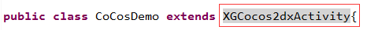
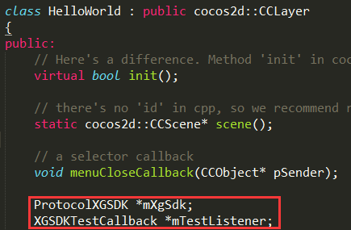

#西瓜SDK（Cocos2d-X Android版）接入文档






<a id="doc"></a>

##1. 文档概述

此文档为Cocos2d-X引擎Android游戏客户端接入文档。  
本文介绍如何在Cocos2d-X引擎平台下，Android游戏客户端快速接入西瓜SDK。
文档分成三大部分:接入环境下载/搭建，西瓜SDK接口说明以及参考代码。逐步细述了整个接入过程；同时罗列出了4种类型的接口，
分别为：用户接口、充值接口、统计接口、扩展接口，便于游戏方的接入人员可以按照需求更加快速便捷的进行接入。


<a id="docStructure"></a>

###1.1 文档结构
<ol type='1'>
	<li>
		<a href="#doc">文档概述</a>
			<ul type="disc">
				<li><a href="#docStructure">文档结构</a></li>
				<li><a href="#SDKDownload">SDK下载包</a></li>
			</ul>
	</li>
	<li>
		<a href="#configure">配置环境与快速接入简介</a>
			<ul type="disc">
				<li><a href="#conditions">开发和接入所需基本环境</a></li>
				<li><a href="#steps">Cocos2d-x Android接入基本步骤简介</a></li>
			</ul>
	</li>
	<li>
		<a href="#adjust">修改相应平台工程的配置信息</a>
			<ul type="disc">
				<li><a href="#copyJar">复制SDK的Jar包</a></li>
				<li><a href="#copyInterface">复制接口文件</a></li>
				<li><a href="#adjustActivity">修改游戏的主Activity</a></li>
				<li><a href="#androidMk">修改Android项目的Android.mk文件</a></li>
				<li><a href="#androidManifest">在AndroidManifest.xml添加权限</a></li>
				<li><a href="#application">在AndroidManifest.xml修改Application</a></li>
			</ul>
	</li>
	<li>
		<a href="#ready">接入前的初始化工作</a>
	</li>
	<li>
		<a href="#userInterface">用户接口</a>
			<ul type="disc">
				<li><a href="#initCallback">初始化回调接口</a></li>
				<li><a href="#login">登录接口</a></li>
				<li><a href="#loginCallback">登录回调</a></li>
				<li><a href="#logout">登出接口</a></li>
				<li><a href="#logoutCallback">登出回调</a></li>
				<li><a href="#exit">退出接口</a></li>
				<li><a href="#exitCallback">退出回调</a></li>
			</ul>
	</li>
	<li>
		<a href="#payInterface">充值接口</a>
			<ul type="disc">
				<li><a href="#pay">支付接口</a></li>
				<li><a href="#payCallback">支付回调</a></li>
			</ul>
	</li>

	<li>
		<a href="#statics">统计接口</a>
			<ul type="disc">
				<li><a href="#onCreateRole">创建角色</a></li>
				<li><a href="#onRoleLevelup">角色升级</a></li>
				<li><a href="#onEnterGame">进入游戏</a></li>
			</ul>
	</li>
	<li>
		<a href="#extraInterface">扩展接口</a>
			<ul type="disc">
				<li><a href="#switchAccount">切换账号</a></li>
				<li><a href="#getChannelId">获取渠道ID</a></li>
				<li><a href="#onEvent">自定义事件</a></li>
				<li><a href="#onMissionBegin">任务开始</a></li>
				<li><a href="#onMissionSuccess">任务成功</a></li>
				<li><a href="#onMissionFail">任务失败</a></li>
				<li><a href="#onVirtalCurrencyPurchase">购买虚拟货币</li>
				<li><a href="#onVirtalCurrencyReward">赠送虚拟货币</li>
				<li><a href="#onVirtualCurrencyConsume">消费虚拟货币</li>
			</ul>
	</li>
	<li>
		<a href="#version">错误码表和文档版本</a>
	</li>
</ol>


<a id="SDKDownload"></a>

###1.2 SDK下载包

渠道版SDK下载包包含：  
1. 西瓜SDK的Jar包：xgsdk-api.jar；   
2. 接口文件：ProtocolXGSDK.h和ProtocolXGSDK.cpp；  
3. Cocos2d-X的Android接入Demo；  
4. 西山居移动游戏-渠道SDK(Cocos2d-X Android)接入文档。  

<a href = "http://console.xgsdk.com/download.html">Cocos2dx SDK下载</a>

<a id="configure"></a>

##2. 配置环境与快速接入简介

<a id="conditions"></a>

###2.1 开发和接入所需基本环境

Cocos2d-X开发环境：  
Cocos2d-X版本：Cocos2d-X 2.2.6  
Cocos2d-X开发工具：VS2012等
Python版本：Python 2.7.10  




Java开发环境：  
Java版本：JAVA JDK 8   



Android开发环境：  
Android版本：Android2.2 以上  
Android NDK版本：Android NDK r10  
Android开发工具：Android SDK和Android Eclipse等  



<a id="steps"></a>

###2.2 Cocos2d-X Android接入基本步骤简介
<ol type="1" start="1">
	<li>将Cocos2d-X Android工程导入到Eclipse或者Android Studio；</li>
	<li>将XGSDK的jar包放置到Android工程的libs目录下；</li>
	<li>修改游戏的MainActivity代码，让其继承XGCocos2dxActivity</li>
	<li>将接口文件ProtocolXGSDK.h、ProtocolXGSDK.cpp复制工程的Classes目录下；</li>
	<li>将接口文件ProtocolXGSDKAndroid.h、ProtocolXGSDKAndroid.cpp复制到和ProtocolXGSDK_android_CallBack.h文放置到jni/hellocpp目录下；</li>
	<li>拷贝资源文件sdk_config.properties和xgsdk-channel.apk文件到assets目录下；</li>
	<li>修改Android.mk文件(具体修改内容见后文)；</li>
	<li>修改AndroidManifest.xml文件(具体修改内容见后文)</li>
	<li>在游戏代码中引入ProtocolXGSDK.h头文件，并且继承实现XGSDKCallback回调接口类；</li>
	<li>在Cocos游戏代码中添加ProtocolXGSDK成员实例；</li>
	<li>在init()方法中初始化回调接口类，并且调用ProtocolXGSDK的setListener()成员方法；</li>
	<li>最后完成登录、支付等必接接口的接入便完成了Cocos2d-X原生接入的所有步骤；</li>
	<li>编译打包测试通过。</li>
</ol>

##3. 修改相应平台工程的配置信息

<a id="copyJar"></a>

###3.1 复制SDK的Jar包

将西瓜SDK的xgsdk-api.jar和libcocos2dx.jar拷贝到Android工程的libs目录下：
  


<a id="copyInterface"></a>

###3.2 复制接口文件
复制接口文件ProtocolXGSDK.h,ProtocolXGSDK.cpp到工程的Classes目录.

复制接口文件ProtocolXGSDKAndroid.h，ProtocolXGSDKAndroid.cpp和ProtocolXGSDK_android_CallBack.h到Android工程中的jni/hellocpp目录下，如图：   



<a id="adjustActivity"></a>

###3.3 拷贝资源文件

复制资源文件xgsdk-channel.apk和sdk_config.properties到Cocos2d-X安卓工程中的Resources目录下，如图：  


###3.4 修改游戏的主Activity

拷贝xgsdk-cocos-2.0.X.jar文件到安卓工程目录下，如图：  
   
找到游戏的主Activity（继承于Cocos2dxActivity的游戏主Activity），修改该Activity，让其继承XGCocos2dxActivity，并且使用import语句导入XGCocos2dxActivity类：  
在这个类中，位于public class 和package之间的位置添加如下语句：
```

	import com.xgsdk.client.XGCocos2dxActivity;
```

父类修改前:  
  
父类修改后:  

  
修改后的代码如下：  


```

	import com.xgsdk.client.XGCocos2dxActivity;   
	public class CoCosDemo extends XGCocos2dxActivity
```

<a id="androidMk"></a>

###3.5 修改Android项目的Android.mk文件

在Android.mk文件中添加如图所框的两行：  
  
添加的代码如下：


```
	LOCAL_LDLIBS :=-llog
	LOCAL_SRC_FILES := hellocpp/main.cpp \
                   ../../Classes/AppDelegate.cpp \
                   ../../Classes/XGCocosDemo.cpp \
                   ../../Classes/ProtocolXGSDK.cpp \
                   hellocpp/ProtocolXGSDKAndroid.cpp

```

<a id="androidManifest"></a>

###3.6 在AndroidManifest.xml添加权限

在AndroidManifest.xml文件中添加如图所框的权限：  
  
添加的代码如下：


```

	<uses-permission android:name="android.permission.WRITE_EXTERNAL_STORAGE" />
    <uses-permission android:name="android.permission.ACCESS_NETWORK_STATE" />
    <uses-permission android:name="android.permission.READ_PHONE_STATE" />
    <uses-permission android:name="android.permission.INTERNET" />
    <uses-permission android:name="android.permission.GET_TASKS" />
    <uses-permission android:name="android.permission.ACCESS_WIFI_STATE" />

```

<a id="application"></a>

###3.7 在AndroidManifest.xml修改Application

在AndroidManifest.xml文件中修改Application，修改如下图：  
  
修改的代码如下：

```

	<application 
        android:name="com.xgsdk.client.api.XGApplication"
        android:label="@string/app_name"
        android:icon="@drawable/icon">

```
<a id="ready"></a>

### 3.8 在AndroidManifest.xml修改Activity：


```

    <activity android:name="com.xgsdk.client.CoCosDemo"
              android:label="@string/app_name"
              android:screenOrientation="landscape"
              android:theme="@android:style/Theme.NoTitleBar.Fullscreen"
              android:configChanges="orientation">
        <intent-filter>
            <action android:name="android.intent.action.MAIN" />
            <category android:name="android.intent.category.LAUNCHER" />
        </intent-filter>
    </activity>
```

##4.接入前的初始化工作

1.首先先确认ProtocolXGSDK.h头文件和ProtocolXGSDK.cpp源文件已经按照3.2拷贝到相应目录下。  
2.然后在使用到ProtocolXGSDK的地方首先导入头文件"ProtocolXGSDK.h"，例如在我们的Demo中添加如图中所示代码：  
  
添加的代码是：
```
	#include "ProtocolXGSDK.h"
```


3.用户要继承并且实现回调类（可参考Demo），如图：  
  



4.然后在游戏的类中声明一个指向ProtocolXGSDK的指针mXgSdk和指向XGSDKTestCallback的指针（可参考Demo），如图：  
  
添加的代码是：


```
	ProtocolXGSDK *mXgSdk;
	XGSDKTestCallback *mTestListener;
```


5.需要在层的init()函数中初始化ProtocolXGSDK和XGSDKTestCallback（可参考Demo），如图加入代码：  
  
添加的代码是：


```
    mXgSdk = ProtocolXGSDK::getInstance();
    
    if(mXgSdk)
    {
      mTestListener = new XGDemoCallback(mXgSdk);
      mXgSdk->setListener(mTestListener);
    }else
    {
        mTestListener = NULL;
    }
    
```

按文档完成第4和5节的所有配置和初始化步骤后即可开始接入西瓜的接口。

<a id="userInterface"></a>

##5.用户接口

<a id="initCallback"></a>

###5.1 初始化回调接口

初始化失败后回调此回调方法，参考代码：

```

	void XGSDKTestCallback::onInitSuccess(int code, const char * msg, const char* channelCode){
    	//初始化成功，游戏此回调中实现初始化失败后的逻辑
	}
	void XGSDKTestCallback::onInitFail(int code, const char * msg, const char* channelCode){
    	//初始化失败，游戏此回调中实现初始化失败后的逻辑
	}
```


关于参数的说明：
<ul type='disc'>
	<li>code：返回的错误码，详情请见<a href="#errorCode">错误码表</a></li>
	<li>msg：返回的信息</li>
	<li>channelCode：渠道的错误码</li>
</ul>


<a id="login"></a>

###5.2 登录接口

接口定义：void login(const char *customParams = "");
接口说明：在相应的位置调用登录接口，调用位置可参考XGCocosDemo.cpp，此接口将调出渠道的登录界面，并将登录的结果回调通知游戏。
代码示例：


```
	mXgSdk->login();
```


关于参数的说明：
<ul type='disc'>
	<li>customParams：该参数用于扩展，传输时使用json格式，接入时若不需要直接置空即可。
</li>
</ul>



请勿游戏启动后直接调用此接口，部分渠道初始化时间较长，初始化不成功调用登录接口会出现游戏崩溃等问题，建议添加用户登录界面，由用户点击触发登录操作


<a id="loginCallback"></a>

###5.3 登录回调

回调说明：游戏客户端调用西瓜SDK登录接口后,西瓜SDK处理完所有流程后回调。
代码示例：
```
	void XGSDKTestCallback::onLoginSuccess(int code, const char * authInfo){
    	//登录成功，游戏在此回调中实现登录成功后的逻辑
	}
	void XGSDKTestCallback::onLoginFail(int code, const char * msg, const char* channelCode){
    	//登录失败，游戏在此回调中实现登录失败后的逻辑
	}
	void XGSDKTestCallback::onLoginCancel(int code, const char * msg){
    	//登录取消，游戏在此回调中实现登录取消后的逻辑
	}
```


关于参数的说明：
<ul type='disc'>
	<li>code：返回的错误码，详情请见<a href="#errorCode">错误码表</a></li>
	<li>msg：返回的信息，登录成功返回的信息是Json格式的Base64编码的字符串，需要解码后使用，游戏需要从此处获得uid</li>
	<li>channelCode：渠道错误码</li>
	<li>authInfo：验证信息</li>
</ul>


<a id="logout"></a>

###5.4 登出接口

接口定义：void logout(const char *customParams = "");  
接口说明：在相应的位置调用登出接口，调用位置可参考Demo中的XGCocosDemo.cpp，此接口将调用渠道的登出方法，并将登出的结果回调通知游戏。
代码示例：


```
	mXgSdk->logout();
```


关于参数的说明：
<ul type='disc'>
	<li>customParams：该参数用于扩展，传输时使用json格式，接入时若不需要直接置空即可。
</li>
</ul>


<a id="logoutCallback"></a>

###5.5 登出回调
回调说明：游戏客户端调用西瓜退出帐号接口后，西瓜SDK处理完登出帐号流程后回调。
代码示例：
```

	void XGSDKTestCallback::onLogoutFinish(int code, const char * msg){
    	//登出完成，游戏在此回调中根据code来实现登出完成后的逻辑
	}
```


关于参数的说明：
<ul type='disc'>
	<li>code：返回的完成码，详情请见<a href="#errorCode">登出完成码表</a></li>
	<li>msg：返回的信息</li>
</ul>


<a id="exit"></a>


###5.6 退出接口

接口定义：void exit(const char *customParams = "");
接口说明：在相应的位置调用退出接口，调用位置可参考Demo中的XGCocosDemo.cpp，此接口将调用渠道的退出方法，会尝试退出游戏，并将结果通过退出回调通知游戏。
代码示例：


```

	mXgSdk->exit();
```

<a id="exitCallback"></a>

###5.7 退出回调
回调说明：游戏客户端调用退出游戏接口，西瓜SDK处理完退出帐号流程后回调。
代码示例：
```
	void XGSDKTestCallback::doExit(){
    	//退出游戏成功，游戏在此回调中实现退出游戏后的逻辑
	}
	void XGSDKTestCallback::onNoChannelExiter(){
    	//如果渠道没有退出方法，则使用游戏的退出，游戏需要在此回调实现退出游戏逻辑
	}
```

<a id="payInterface"></a>

###5.8 释放资源接口
接口定义：void releaseResource();
接口说明：用户退出游戏时释放资源接口
代码示例：
```

	mXgSdk->releaseResource();
```


##6.充值接口

<a id="pay"></a>

###6.1 支付接口

接口定义：void pay(PayInfo &);
接口说明：在相应的位置调用登出接口，调用位置可参考Demo中的XGCocosDemo.cpp，此接口将会发起用户充值，系统会调用对应渠道SDK充值界面，并将支付的结果回调通知游戏。支付接口需要传入类型为PayInfo的参数。
代码示例：


```
    PayInfo payInfo;
	payInfo.uid = "123456";
    payInfo.productId = "payment017";
    payInfo.productName = "大宝剑";
    payInfo.productDesc = "倚天不出谁与争锋";
    payInfo.productUnit = "个";
    payInfo.productUnitPrice = 1;
    payInfo.productQuantity = 1;
    payInfo.totalAmount = 1;
    payInfo.payAmount = 1;
    payInfo.currencyName = "CNY";
    payInfo.roleId = "1234";
    payInfo.roleName = "yeye";
    payInfo.roleLevel = "65";
    payInfo.roleVipLevel = "8";
    payInfo.serverId = "11";
    payInfo.zoneId = "33";
    payInfo.partyName = "丐帮";
	payInfo.customInfo = "customInfo";
    payInfo.virtualCurrencyBalance = "0";
    payInfo.gameTradeNo = "12480";
    payInfo.gameCallbackUrl = "http://console.xgsdk.com/sdkserver/receivePayResult";
    payInfo.additionalParams = "";
	mXgSdk->pay(payInfo);
```


关于PayInfo的成员说明：
<table>
<tr>
	<th>输入参数</th>
	<th>数据类型</th>
	<th>说明</th>
	<th>备注</th>
</tr>
<tr>
	<td>uid</td>
	<td>const char *</td>
	<td>用户ID</td>
	<td>不可为空</td>
</tr>
<tr>
	<td>productId</td>
	<td>const char *</td>
	<td>产品ID</td>
	<td>不可为空</td>
</tr>
<tr>
	<td>productName</td>
	<td>const char *</td>
	<td>产品名称</td>
	<td>不可为空</td>
</tr>
<tr>
	<td>productDesc</td>
	<td>const char *</td>
	<td>产品描述</td>
	<td>不可为空</td>
</tr>
<tr>
	<td>productUnit</td>
	<td>const char *</td>
	<td>商品单位</td>
	<td>不可为空</td>
</tr>
<tr>
	<td>productUnitPrice</td>
	<td>int</td>
	<td>产品单价,单位分</td>
	<td>不可为空</td>
</tr>
<tr>
	<td>productQuantity</td>
	<td>int</td>
	<td>产品数量</td>
	<td>不可为空</td>
</tr>
<tr>
	<td>totalAmount</td>
	<td>int</td>
	<td>产品总额,单位分</td>
	<td>不可为空</td>
</tr>
<tr>
	<td>payAmount</td>
	<td>int</td>
	<td>实际支付总价格,单位分</td>
	<td>不可为空</td>
</tr>
<tr>
	<td>currencyName</td>
	<td>const char *</td>
	<td>实际支付的国际标准货币代码,比如CNY(人民币)/USD(美元)</td>
	<td>不可为空</td>
</tr>
<tr>
	<td>roleId</td>
	<td>const char *</td>
	<td>角色ID</td>
	<td>不可为空</td>
</tr>
<tr>
	<td>roleName</td>
	<td>const char *</td>
	<td>角色名字</td>
	<td>不可为空</td>
</tr>
<tr>
	<td>roleLevel</td>
	<td>const char *</td>
	<td>角色等级</td>
	<td>可为空</td>
</tr>
<tr>
	<td>roleVipLevel</td>
	<td>const char *</td>
	<td>角色VIP等级</td>
	<td>不可为空</td>
</tr>
<tr>
	<td>serverId</td>
	<td>const char *</td>
	<td>服ID</td>
	<td>不可为空</td>
</tr>
<tr>
	<td>zoneId</td>
	<td>const char *</td>
	<td>区ID</td>
	<td>不可为空</td>
</tr>
<tr>
	<td>partyName</td>
	<td>const char *</td>
	<td>帮派名字</td>
	<td>不可为空</td>
</tr>
<tr>
	<td>virtualCurrencyBalance</td>
	<td>const char *</td>
	<td>虚拟货币余额</td>
	<td>不可为空</td>
</tr>
<tr>
	<td>gameTradeNo</td>
	<td>const char *</td>
	<td>游戏订单ID</td>
	<td>不可为空</td>
</tr>
<tr>
	<td>gameCallbackUrl</td>
	<td>const char *</td>
	<td>支付回调地址，如果为空，则后台配置的回调地址</td>
	<td>支付回调地址，如果为空，则后台配置的回调地址</td>
</tr>
<tr>
	<td>additionalParams</td>
	<td>const char *</td>
	<td>扩展参数</td>
	<td>扩展参数可以为空</td>
</tr>
</table>


<a id="payCallback"></a>

###6.2 支付回调
游戏客户端调用西瓜支付接口后，西瓜SDK处理完所有支付流程后回调。
```
	void XGSDKTestCallback::onPaySuccess(int code, const char* msg, const char* gameTradeNo, const char* xgTradeNo){
    	//支付成功，游戏在此回调中实现支付成功后的逻辑
	}
	void XGSDKTestCallback::onPayFail(int code, const char* msg, const char* gameTradeNo, const char* channelCode, const char* channelMsg){
    	//支付失败，游戏在此回调中实现支付失败后的逻辑
	}
	void XGSDKTestCallback::onPayProgress(int code, const char* msg, const char* gameTradeNo, const char* channelCode, const char* channelMsg){
    	//支付正在处理，游戏在此回调中实现支付正在处理的逻辑
	}
```

关于参数的说明：
<ul type='disc'>
	<li>code：返回的错误码，详情请见<a href="#errorCode">错误码表</a></li>
	<li>msg：返回的信息</li>
	<li>gameTradeNo：游戏的订单ID</li>
	<li>xgTradeNo：西瓜的订单ID</li>
	<li>channelCode：渠道错误码</li>
	<li>channelMsg：渠道错误信息</li>
</ul>


<a id="statics"></a>

##7.统计接口

<a id="onCreateRole"></a>

###7.1 创建角色
接口定义：void onCreateRole(RoleInfo &);
接口说明：统计接口在创建角色时调用该接口上传角色数据，创建角色需要传入类型为RoleInfo的参数。
代码示例：
```
	RoleInfo roleInfo;
    roleInfo.roleId = "1000";
    roleInfo.roleType = "弓箭手";
    roleInfo.roleName = "onCreateRole";
    roleInfo.roleLevel = "1";
    roleInfo.roleVipLevel = "13";
    roleInfo.serverId = "0";
    roleInfo.zoneId = "1";
    mXgSdk->onCreateRole(roleInfo);
```

类型RoleInfo结构体定义在ProtocolXGSDK.h头文件中：


```

	struct RoleInfo {
		const char *uid; 
		const char *roleId; 
		const char *roleName; 
		const char *roleType;
		const char *roleLevel; 
		const char *roleVipLevel; 
		const char *serverId; 
		const char *zoneId; 
		const char *serverName;
		const char *zoneName;
		const char *partyName;
		const char *gender;
	};

```


关于RoleInfo的成员说明
<table>
<tr>
	<th>输入参数</th>
	<th>数据类型</th>
	<th>说明</th>
	<th>可空</th>
</tr>
<tr>
	<td>uid</td>
	<td>const char *</td>
	<td>用户ID</td>
	<td>不可为空</td>
</tr>
<tr>
	<td>roleId</td>
	<td>const char *</td>
	<td>角色ID</td>
	<td>不可为空</td>
</tr>
<tr>
	<td>roleName</td>
	<td>const char *</td>
	<td>角色名字</td>
	<td>不可为空</td>
</tr>
<tr>
	<td>roleType</td>
	<td>const char *</td>
	<td>角色类型</td>
	<td>不可为空</td>
</tr>
<tr>
	<td>roleLevel</td>
	<td>const char *</td>
	<td>角色等级</td>
	<td>不可为空</td>
</tr>
<tr>
	<td>roleVipLevel</td>
	<td>const char *</td>
	<td>角色VIP等级</td>
	<td>不可为空</td>
</tr>
<tr>
	<td>serverId</td>
	<td>const char *</td>
	<td>服ID</td>
	<td>不可为空</td>
</tr>
<tr>
	<td>zoneId</td>
	<td>const char *</td>
	<td>区ID</td>
	<td>不可为空</td>
</tr>
<tr>
	<td>serverName</td>
	<td>const char *</td>
	<td>余额</td>
	<td>不可为空</td>
</tr>
<tr>
	<td>zoneName</td>
	<td>const char *</td>
	<td>区名字</td>
	<td>不可为空</td>
</tr>
<tr>
	<td>partyName</td>
	<td>const char *</td>
	<td>帮派名字</td>
	<td>不可为空</td>
</tr>
<tr>
	<td>gender</td>
	<td>const char *</td>
	<td>性别</td>
	<td>不可为空</td>
</tr>
</table>


<a id="onRoleLevelup"></a>

###7.2 角色升级
接口定义：void onRoleLevelup(RoleInfo &);
接口说明：统计接口在角色升级时调用该接口上传角色数据，角色升级需要传入类型为RoleInfo的参数。
代码示例：
```
	RoleInfo roleInfo;
    roleInfo.roleId = "1000";
    roleInfo.roleType = "弓箭手";
    roleInfo.roleName = "onRoleLevelUp";
    roleInfo.roleLevel = "1";
    roleInfo.roleVipLevel = "13";
    roleInfo.serverId = "0";
    roleInfo.zoneId = "1";
    mXgSdk->onRoleLevelUp(roleInfo);
```

类型RoleInfo结构体定义在ProtocolXGSDK.h头文件中：


```

	struct RoleInfo {
		const char *uid; 
		const char *roleId; 
		const char *roleName; 
		const char *roleType;
		const char *roleLevel; 
		const char *roleVipLevel; 
		const char *serverId; 
		const char *zoneId; 
		const char *serverName;
		const char *zoneName;
		const char *partyName;
		const char *gender;
	};

```


关于RoleInfo的成员说明
<table>
<tr>
	<th>输入参数</th>
	<th>数据类型</th>
	<th>说明</th>
	<th>可空</th>
</tr>
<tr>
	<td>uid</td>
	<td>const char *</td>
	<td>用户ID</td>
	<td>不可为空</td>
</tr>
<tr>
	<td>roleId</td>
	<td>const char *</td>
	<td>角色ID</td>
	<td>不可为空</td>
</tr>
<tr>
	<td>roleName</td>
	<td>const char *</td>
	<td>角色名字</td>
	<td>不可为空</td>
</tr>
<tr>
	<td>roleType</td>
	<td>const char *</td>
	<td>角色类型</td>
	<td>不可为空</td>
</tr>
<tr>
	<td>roleLevel</td>
	<td>const char *</td>
	<td>角色等级</td>
	<td>不可为空</td>
</tr>
<tr>
	<td>roleVipLevel</td>
	<td>const char *</td>
	<td>角色VIP等级</td>
	<td>不可为空</td>
</tr>
<tr>
	<td>serverId</td>
	<td>const char *</td>
	<td>服ID</td>
	<td>不可为空</td>
</tr>
<tr>
	<td>zoneId</td>
	<td>const char *</td>
	<td>区ID</td>
	<td>不可为空</td>
</tr>
<tr>
	<td>serverName</td>
	<td>const char *</td>
	<td>余额</td>
	<td>不可为空</td>
</tr>
<tr>
	<td>zoneName</td>
	<td>const char *</td>
	<td>区名字</td>
	<td>不可为空</td>
</tr>
<tr>
	<td>partyName</td>
	<td>const char *</td>
	<td>帮派名字</td>
	<td>不可为空</td>
</tr>
<tr>
	<td>gender</td>
	<td>const char *</td>
	<td>性别</td>
	<td>不可为空</td>
</tr>
</table>


<a id="onEnterGame"></a>

###7.3 进入游戏
接口定义：void onEnterGame(RoleInfo &);
接口说明：统计接口在角色升级时调用该接口上传角色数据，角色升级需要传入类型为RoleInfo的参数。
代码示例：
```
	RoleInfo roleInfo;
    roleInfo.roleId = "1000";
    roleInfo.roleType = "弓箭手";
    roleInfo.roleName = "onEnterGame";
    roleInfo.roleLevel = "1";
    roleInfo.roleVipLevel = "13";
    roleInfo.serverId = "0";
    roleInfo.zoneId = "1";
    mXgSdk->onEnterGame(roleInfo);
```

类型RoleInfo结构体定义在ProtocolXGSDK.h头文件中：


```

	struct RoleInfo {
		const char *uid; 
		const char *roleId; 
		const char *roleName; 
		const char *roleType;
		const char *roleLevel; 
		const char *roleVipLevel; 
		const char *serverId; 
		const char *zoneId; 
		const char *serverName;
		const char *zoneName;
		const char *partyName;
		const char *gender;
	};

```


关于RoleInfo的成员说明
<table>
<tr>
	<td>uid</td>
	<td>const char *</td>
	<td>用户ID</td>
	<td>不可为空</td>
</tr>
<tr>
	<td>roleId</td>
	<td>const char *</td>
	<td>角色ID</td>
	<td>不可为空</td>
</tr>
<tr>
	<td>roleName</td>
	<td>const char *</td>
	<td>角色名字</td>
	<td>不可为空</td>
</tr>
<tr>
	<td>roleType</td>
	<td>const char *</td>
	<td>角色类型</td>
	<td>不可为空</td>
</tr>
<tr>
	<td>roleLevel</td>
	<td>const char *</td>
	<td>角色等级</td>
	<td>不可为空</td>
</tr>
<tr>
	<td>roleVipLevel</td>
	<td>const char *</td>
	<td>角色VIP等级</td>
	<td>不可为空</td>
</tr>
<tr>
	<td>serverId</td>
	<td>const char *</td>
	<td>服ID</td>
	<td>不可为空</td>
</tr>
<tr>
	<td>zoneId</td>
	<td>const char *</td>
	<td>区ID</td>
	<td>不可为空</td>
</tr>
<tr>
	<td>serverName</td>
	<td>const char *</td>
	<td>余额</td>
	<td>不可为空</td>
</tr>
<tr>
	<td>zoneName</td>
	<td>const char *</td>
	<td>区名字</td>
	<td>不可为空</td>
</tr>
<tr>
	<td>partyName</td>
	<td>const char *</td>
	<td>帮派名字</td>
	<td>不可为空</td>
</tr>
<tr>
	<td>gender</td>
	<td>const char *</td>
	<td>性别</td>
	<td>不可为空</td>
</tr>
</table>

<a id="extraInterface"></a>

##8.扩展接口

<a id="switchAccount"></a>

###8.1 切换账号

接口定义：void switchAccount(const char *customParams = "");
接口说明：在相应的位置调用切换账号接口，调用位置可参考Demo中的XGCocosDemo.cpp，此接口将调用渠道的切换账号方法，并会产生登出回调来通知游戏。
代码示例：


```
	mXgSdk->switchAccount();
```


关于参数的说明：
<ul type='disc'>
	<li>customParams：该参数用于扩展，传输时使用json格式，接入时若不需要直接置空即可。
</li>
</ul>


<a id="getChannelId"></a>

###8.2 获取渠道ID

接口定义：char *getChannelId();
接口说明：获取channelId。channelId为渠道ID。
代码示例：


```
	char *channelId = mXgSdk->getChannelId();
```

<a id="onEvent"></a>

###8.3 自定义事件
接口定义：void onEvent(RoleInfo &, const char\* eventId, const char\* eventDesc,int eventValue, const char\* eventBody="");
接口说明：统计接口在游戏自定义事件时调用该接口上传角色数据，角色升级需要传入类型为RoleInfo等参数。
代码示例：

代码示例：
```
	RoleInfo roleInfo;
    roleInfo.roleId = "1000";
    roleInfo.roleType = "弓箭手";
    roleInfo.roleName = "onEvent";
    roleInfo.roleLevel = "1";
    roleInfo.roleVipLevel = "13";
    roleInfo.serverId = "0";
    roleInfo.zoneId = "1";
    mXgSdk->onEvent(roleInfo,"test.event","test/event/desc",1,"{\"prop1\":\"value1\"}");
```

类型RoleInfo结构体定义在ProtocolXGSDK.h头文件中：


```

	struct RoleInfo {
		const char *uid; 
		const char *roleId; 
		const char *roleName; 
		const char *roleType;
		const char *roleLevel; 
		const char *roleVipLevel; 
		const char *serverId; 
		const char *zoneId; 
		const char *serverName;
		const char *zoneName;
		const char *partyName;
		const char *gender;
	};

```


关于RoleInfo的成员说明
<table>
<tr>
	<th>输入参数</th>
	<th>数据类型</th>
	<th>说明</th>
	<th>可空</th>
</tr>
<tr>
	<td>uid</td>
	<td>const char *</td>
	<td>用户ID</td>
	<td>不可为空</td>
</tr>
<tr>
	<td>roleId</td>
	<td>const char *</td>
	<td>角色ID</td>
	<td>不可为空</td>
</tr>
<tr>
	<td>roleName</td>
	<td>const char *</td>
	<td>角色名字</td>
	<td>不可为空</td>
</tr>
<tr>
	<td>roleType</td>
	<td>const char *</td>
	<td>角色类型</td>
	<td>不可为空</td>
</tr>
<tr>
	<td>roleLevel</td>
	<td>const char *</td>
	<td>角色等级</td>
	<td>不可为空</td>
</tr>
<tr>
	<td>roleVipLevel</td>
	<td>const char *</td>
	<td>角色VIP等级</td>
	<td>不可为空</td>
</tr>
<tr>
	<td>serverId</td>
	<td>const char *</td>
	<td>服ID</td>
	<td>不可为空</td>
</tr>
<tr>
	<td>zoneId</td>
	<td>const char *</td>
	<td>区ID</td>
	<td>不可为空</td>
</tr>
<tr>
	<td>serverName</td>
	<td>const char *</td>
	<td>余额</td>
	<td>不可为空</td>
</tr>
<tr>
	<td>zoneName</td>
	<td>const char *</td>
	<td>区名字</td>
	<td>不可为空</td>
</tr>
<tr>
	<td>partyName</td>
	<td>const char *</td>
	<td>帮派名字</td>
	<td>不可为空</td>
</tr>
<tr>
	<td>gender</td>
	<td>const char *</td>
	<td>性别</td>
	<td>不可为空</td>
</tr>
<tr>
	<td>zoneName</td>
	<td>const char *</td>
	<td>区名字</td>
	<td>不可为空</td>
</tr>
<tr>
	<td>partyName</td>
	<td>const char *</td>
	<td>帮派名字</td>
	<td>不可为空</td>
</tr>
<tr>
	<td>gender</td>
	<td>const char *</td>
	<td>性别</td>
	<td>不可为空</td>
</tr>
</table>


<a id="onMissionBegin"></a>

###8.4 任务开始
接口定义：void onMissionBegin(RoleInfo& roleInfo, const char\* missionId, const char\* missionName, const char \*customParams="");
接口说明：统计接口在任务开始时调用该接口上传角色数据，角色升级需要传入类型为RoleInfo等参数。
代码示例：
```
	RoleInfo roleInfo;
    roleInfo.roleId = "1000";
    roleInfo.roleLevel = "1";
    roleInfo.roleVipLevel = "13";
    roleInfo.serverId = "0";
    roleInfo.zoneId = "1";
    roleInfo.roleName = "onMissionBegin";
    mXgSdk->onMissionBegin(roleInfo,"10001","第二章节－第四关");
```

类型RoleInfo结构体定义在ProtocolXGSDK.h头文件中：


```
	struct RoleInfo {
		const char *uid; 
		const char *roleId; 
		const char *roleName; 
		const char *roleType;
		const char *roleLevel; 
		const char *roleVipLevel; 
		const char *serverId; 
		const char *zoneId; 
		const char *serverName;
		const char *zoneName;
		const char *partyName;
		const char *gender;
	};

```


关于RoleInfo的成员和其他传入参数的说明：
<table>
<tr>
	<th>输入参数</th>
	<th>数据类型</th>
	<th>说明</th>
	<th>可空</th>
</tr>
<tr>
	<td>uid</td>
	<td>const char *</td>
	<td>用户ID</td>
	<td>不可为空</td>
</tr>
<tr>
	<td>roleId</td>
	<td>const char *</td>
	<td>角色ID</td>
	<td>不可为空</td>
</tr>
<tr>
	<td>roleName</td>
	<td>const char *</td>
	<td>角色名字</td>
	<td>不可为空</td>
</tr>
<tr>
	<td>roleType</td>
	<td>const char *</td>
	<td>角色类型</td>
	<td>不可为空</td>
</tr>
<tr>
	<td>roleLevel</td>
	<td>const char *</td>
	<td>角色等级</td>
	<td>不可为空</td>
</tr>
<tr>
	<td>roleVipLevel</td>
	<td>const char *</td>
	<td>角色VIP等级</td>
	<td>不可为空</td>
</tr>
<tr>
	<td>serverId</td>
	<td>const char *</td>
	<td>服ID</td>
	<td>不可为空</td>
</tr>
<tr>
	<td>zoneId</td>
	<td>const char *</td>
	<td>区ID</td>
	<td>不可为空</td>
</tr>
<tr>
	<td>serverName</td>
	<td>const char *</td>
	<td>余额</td>
	<td>不可为空</td>
</tr>
<tr>
	<td>zoneName</td>
	<td>const char *</td>
	<td>区名字</td>
	<td>不可为空</td>
</tr>
<tr>
	<td>partyName</td>
	<td>const char *</td>
	<td>帮派名字</td>
	<td>不可为空</td>
</tr>
<tr>
	<td>gender</td>
	<td>const char *</td>
	<td>性别</td>
	<td>不可为空</td>
</tr>
<tr>
	<td>missionId</td>
	<td>const char *</td>
	<td>任务ID</td>
	<td>不可为空</td>
</tr>
<tr>
	<td>missionName</td>
	<td>const char *</td>
	<td>任务名称</td>
	<td>不可为空</td>
</tr>
<tr>
	<td>customParams</td>
	<td>const char *</td>
	<td>扩展参数</td>
	<td>不可为空</td>
</tr>
</table>


<a id="onMissionSuccess"></a>

###8.5 任务成功
接口定义：void onMissionSuccess(RoleInfo& roleInfo, const char\* missionId, const char\* missionName, const char \*customParams="");
接口说明：统计接口在任务成功时调用该接口上传角色数据，角色升级需要传入类型为RoleInfo等参数。
代码示例：
```
	RoleInfo roleInfo;
    roleInfo.roleId = "1000";
    roleInfo.roleLevel = "1";
    roleInfo.roleVipLevel = "13";
    roleInfo.serverId = "0";
    roleInfo.zoneId = "1";
    roleInfo.roleName = "onMissionSuccess";
    mXgSdk->onMissionSuccess(roleInfo,"10001","第二章节－第四关");
```

类型RoleInfo结构体定义在ProtocolXGSDK.h头文件中：


```
	struct RoleInfo {
		const char *uid; 
		const char *roleId; 
		const char *roleName; 
		const char *roleType;
		const char *roleLevel; 
		const char *roleVipLevel; 
		const char *serverId; 
		const char *zoneId; 
		const char *serverName;
		const char *zoneName;
		const char *partyName;
		const char *gender;
	};

```


关于RoleInfo的成员和其他传入参数的说明：
<table>
<tr>
	<th>输入参数</th>
	<th>数据类型</th>
	<th>说明</th>
	<th>可空</th>
</tr>
<tr>
	<td>uid</td>
	<td>const char *</td>
	<td>用户ID</td>
	<td>不可为空</td>
</tr>
<tr>
	<td>roleId</td>
	<td>const char *</td>
	<td>角色ID</td>
	<td>不可为空</td>
</tr>
<tr>
	<td>roleName</td>
	<td>const char *</td>
	<td>角色名字</td>
	<td>不可为空</td>
</tr>
<tr>
	<td>roleType</td>
	<td>const char *</td>
	<td>角色类型</td>
	<td>不可为空</td>
</tr>
<tr>
	<td>roleLevel</td>
	<td>const char *</td>
	<td>角色等级</td>
	<td>不可为空</td>
</tr>
<tr>
	<td>roleVipLevel</td>
	<td>const char *</td>
	<td>角色VIP等级</td>
	<td>不可为空</td>
</tr>
<tr>
	<td>serverId</td>
	<td>const char *</td>
	<td>服ID</td>
	<td>不可为空</td>
</tr>
<tr>
	<td>zoneId</td>
	<td>const char *</td>
	<td>区ID</td>
	<td>不可为空</td>
</tr>
<tr>
	<td>serverName</td>
	<td>const char *</td>
	<td>余额</td>
	<td>不可为空</td>
</tr>
<tr>
	<td>zoneName</td>
	<td>const char *</td>
	<td>区名字</td>
	<td>不可为空</td>
</tr>
<tr>
	<td>partyName</td>
	<td>const char *</td>
	<td>帮派名字</td>
	<td>不可为空</td>
</tr>
<tr>
	<td>gender</td>
	<td>const char *</td>
	<td>性别</td>
	<td>不可为空</td>
</tr>
<tr>
	<td>missionId</td>
	<td>const char *</td>
	<td>任务ID</td>
	<td>不可为空</td>
</tr>
<tr>
	<td>missionName</td>
	<td>const char *</td>
	<td>任务名称</td>
	<td>不可为空</td>
</tr>
<tr>
	<td>customParams</td>
	<td>const char *</td>
	<td>扩展参数</td>
	<td>不可为空</td>
</tr>

</table>


<a id="onMissionFail"></a>

###8.6 任务失败
接口定义：void onMissionFail(RoleInfo& roleInfo, const char\* missionId, const char\* missionName, const char \*customParams="");  
接口说明：统计接口在任务成功时调用该接口上传角色数据，角色升级需要传入类型为RoleInfo等参数。  
代码示例：
```

	RoleInfo roleInfo;
    roleInfo.roleId = "1000";
    roleInfo.roleLevel = "1";
    roleInfo.roleVipLevel = "13";
    roleInfo.serverId = "0";
    roleInfo.zoneId = "1";
    roleInfo.roleName = "onMissionFail";
    mXgSdk->onMissionFail(roleInfo,"10001","第二章节－第四关");   
```

类型RoleInfo结构体定义在ProtocolXGSDK.h头文件中：


```
	struct RoleInfo {
		const char *uid; 
		const char *roleId; 
		const char *roleName; 
		const char *roleType;
		const char *roleLevel; 
		const char *roleVipLevel; 
		const char *serverId; 
		const char *zoneId; 
		const char *serverName;
		const char *zoneName;
		const char *partyName;
		const char *gender;
	};

```


关于RoleInfo的成员和传入参数的说明：
<table>
<tr>
	<th>输入参数</th>
	<th>数据类型</th>
	<th>说明</th>
	<th>可空</th>
</tr>
<tr>
	<td>uid</td>
	<td>const char *</td>
	<td>用户ID</td>
	<td>不可为空</td>
</tr>
<tr>
	<td>roleId</td>
	<td>const char *</td>
	<td>角色ID</td>
	<td>不可为空</td>
</tr>
<tr>
	<td>roleName</td>
	<td>const char *</td>
	<td>角色名字</td>
	<td>不可为空</td>
</tr>
<tr>
	<td>roleType</td>
	<td>const char *</td>
	<td>角色类型</td>
	<td>不可为空</td>
</tr>
<tr>
	<td>roleLevel</td>
	<td>const char *</td>
	<td>角色等级</td>
	<td>不可为空</td>
</tr>
<tr>
	<td>roleVipLevel</td>
	<td>const char *</td>
	<td>角色VIP等级</td>
	<td>不可为空</td>
</tr>
<tr>
	<td>serverId</td>
	<td>const char *</td>
	<td>服ID</td>
	<td>不可为空</td>
</tr>
<tr>
	<td>zoneId</td>
	<td>const char *</td>
	<td>区ID</td>
	<td>不可为空</td>
</tr>
<tr>
	<td>serverName</td>
	<td>const char *</td>
	<td>余额</td>
	<td>不可为空</td>
</tr>
<tr>
	<td>zoneName</td>
	<td>const char *</td>
	<td>区名字</td>
	<td>不可为空</td>
</tr>
<tr>
	<td>partyName</td>
	<td>const char *</td>
	<td>帮派名字</td>
	<td>不可为空</td>
</tr>
<tr>
	<td>gender</td>
	<td>const char *</td>
	<td>性别</td>
	<td>不可为空</td>
</tr>
<tr>
	<td>missionId</td>
	<td>const char *</td>
	<td>任务ID</td>
	<td>不可为空</td>
</tr>
<tr>
	<td>missionName</td>
	<td>const char *</td>
	<td>任务名称</td>
	<td>不可为空</td>
</tr>
<tr>
	<td>customParams</td>
	<td>const char *</td>
	<td>扩展参数</td>
	<td>不可为空</td>
</tr>

</table>

<a id="onVirtalCurrencyPurchase"></a>

###8.7 购买虚拟货币
接口定义：void onVirtalCurrencyPurchase(RoleInfo& roleInfo, int amount, const char \*customParams="");  
接口说明：统计接口在购买虚拟货币时调用该接口上传角色数据，角色升级需要传入类型为RoleInfo等参数。  
代码示例：
```
	RoleInfo roleInfo;
    roleInfo.roleId = "1000";    
    roleInfo.roleLevel = "1";
    roleInfo.roleVipLevel = "13";
    roleInfo.serverId = "0";
    roleInfo.zoneId = "1";
    roleInfo.roleName = "onVirtualCurrencyPurchase";
    mXgSdk->onVirtualCurrencyPurchase(roleInfo,100);
```

类型RoleInfo结构体定义在ProtocolXGSDK.h头文件中：


```
	struct RoleInfo {
		const char *uid; 
		const char *roleId; 
		const char *roleName; 
		const char *roleType;
		const char *roleLevel; 
		const char *roleVipLevel; 
		const char *serverId; 
		const char *zoneId; 
		const char *serverName;
		const char *zoneName;
		const char *partyName;
		const char *gender;
	};

```


关于RoleInfo的成员和传入参数的说明：
<table>
<tr>
	<th>输入参数</th>
	<th>数据类型</th>
	<th>说明</th>
	<th>可空</th>
</tr>
<tr>
	<td>uid</td>
	<td>const char *</td>
	<td>用户ID</td>
	<td>不可为空</td>
</tr>
<tr>
	<td>roleId</td>
	<td>const char *</td>
	<td>角色ID</td>
	<td>不可为空</td>
</tr>
<tr>
	<td>roleName</td>
	<td>const char *</td>
	<td>角色名字</td>
	<td>不可为空</td>
</tr>
<tr>
	<td>roleType</td>
	<td>const char *</td>
	<td>角色类型</td>
	<td>不可为空</td>
</tr>
<tr>
	<td>roleLevel</td>
	<td>const char *</td>
	<td>角色等级</td>
	<td>不可为空</td>
</tr>
<tr>
	<td>roleVipLevel</td>
	<td>const char *</td>
	<td>角色VIP等级</td>
	<td>不可为空</td>
</tr>
<tr>
	<td>serverId</td>
	<td>const char *</td>
	<td>服ID</td>
	<td>不可为空</td>
</tr>
<tr>
	<td>zoneId</td>
	<td>const char *</td>
	<td>区ID</td>
	<td>不可为空</td>
</tr>
<tr>
	<td>serverName</td>
	<td>const char *</td>
	<td>余额</td>
	<td>不可为空</td>
</tr>
<tr>
	<td>zoneName</td>
	<td>const char *</td>
	<td>区名字</td>
	<td>不可为空</td>
</tr>
<tr>
	<td>partyName</td>
	<td>const char *</td>
	<td>帮派名字</td>
	<td>不可为空</td>
</tr>
<tr>
	<td>gender</td>
	<td>const char *</td>
	<td>性别</td>
	<td>不可为空</td>
</tr>
<tr>
	<td>amount</td>
	<td>const char *</td>
	<td>虚拟币数目</td>
	<td>不可为空</td>
</tr>
<tr>
	<td>customParams</td>
	<td>const char *</td>
	<td>扩展参数</td>
	<td>不可为空</td>
</tr>

</table>

<a id="onVirtalCurrencyReward"></a>

###8.8 赠送虚拟货币
接口定义：void onVirtualCurrencyReward(RoleInfo& roleInfo, const char \*reason, int amount, const char \*customParams="");  
接口说明：统计接口在赠送虚拟货币时调用该接口上传角色数据，角色升级需要传入类型为RoleInfo等参数。  
代码示例：
```

	RoleInfo roleInfo;
    roleInfo.roleId = "1000";    
    roleInfo.roleLevel = "1";
    roleInfo.roleVipLevel = "13";
    roleInfo.serverId = "0";
    roleInfo.zoneId = "1";
    roleInfo.roleName = "onVirtualCurrencyReward";
    mXgSdk->onVirtualCurrencyReward(roleInfo,"登录奖励",100);

```

类型RoleInfo结构体定义在ProtocolXGSDK.h头文件中：


```
	struct RoleInfo {
		const char *uid; 
		const char *roleId; 
		const char *roleName; 
		const char *roleType;
		const char *roleLevel; 
		const char *roleVipLevel; 
		const char *serverId; 
		const char *zoneId; 
		const char *serverName;
		const char *zoneName;
		const char *partyName;
		const char *gender;
	};

```


关于RoleInfo的成员和传入参数的说明：
<table>
<tr>
	<th>输入参数</th>
	<th>数据类型</th>
	<th>说明</th>
	<th>可空</th>
</tr>
<tr>
	<td>uid</td>
	<td>const char *</td>
	<td>用户ID</td>
	<td>不可为空</td>
</tr>
<tr>
	<td>roleId</td>
	<td>const char *</td>
	<td>角色ID</td>
	<td>不可为空</td>
</tr>
<tr>
	<td>roleName</td>
	<td>const char *</td>
	<td>角色名字</td>
	<td>不可为空</td>
</tr>
<tr>
	<td>roleType</td>
	<td>const char *</td>
	<td>角色类型</td>
	<td>不可为空</td>
</tr>
<tr>
	<td>roleLevel</td>
	<td>const char *</td>
	<td>角色等级</td>
	<td>不可为空</td>
</tr>
<tr>
	<td>roleVipLevel</td>
	<td>const char *</td>
	<td>角色VIP等级</td>
	<td>不可为空</td>
</tr>
<tr>
	<td>serverId</td>
	<td>const char *</td>
	<td>服ID</td>
	<td>不可为空</td>
</tr>
<tr>
	<td>zoneId</td>
	<td>const char *</td>
	<td>区ID</td>
	<td>不可为空</td>
</tr>
<tr>
	<td>serverName</td>
	<td>const char *</td>
	<td>余额</td>
	<td>不可为空</td>
</tr>
<tr>
	<td>zoneName</td>
	<td>const char *</td>
	<td>区名字</td>
	<td>不可为空</td>
</tr>
<tr>
	<td>partyName</td>
	<td>const char *</td>
	<td>帮派名字</td>
	<td>不可为空</td>
</tr>
<tr>
	<td>gender</td>
	<td>const char *</td>
	<td>性别</td>
	<td>不可为空</td>
</tr>
<tr>
	<td>reason</td>
	<td>const char *</td>
	<td>奖励原因</td>
	<td>不可为空</td>
</tr>
<tr>
	<td>amount</td>
	<td>const char *</td>
	<td>虚拟币数目</td>
	<td>不可为空</td>
</tr>
<tr>
	<td>customParams</td>
	<td>const char *</td>
	<td>扩展参数</td>
	<td>不可为空</td>
</tr>

</table>

<a id="onVirtualCurrencyConsume"></a>

###8.9 消费虚拟货币
接口定义：void onVirtualCurrencyConsume(RoleInfo& roleInfo, const char \*itemName, int amount, const char \*customParams="");  
接口说明：统计接口在消费虚拟货币时调用该接口上传角色数据，角色升级需要传入类型为RoleInfo等参数。  
代码示例：
```
	RoleInfo roleInfo;
    roleInfo.roleId = "1000";    
    roleInfo.roleLevel = "1";
    roleInfo.roleVipLevel = "13";
    roleInfo.serverId = "0";
    roleInfo.zoneId = "1";
    roleInfo.roleName = "onVirtualCurrencyConsume";
    mXgSdk->onVirtualCurrencyConsume(roleInfo,"十连抽",200);
```

类型RoleInfo结构体定义在ProtocolXGSDK.h头文件中：


```
	struct RoleInfo {
		const char *uid; 
		const char *roleId; 
		const char *roleName; 
		const char *roleType;
		const char *roleLevel; 
		const char *roleVipLevel; 
		const char *serverId; 
		const char *zoneId; 
		const char *serverName;
		const char *zoneName;
		const char *partyName;
		const char *gender;
	};

```


关于RoleInfo的成员和传入参数的说明：
<table>
<tr>
	<th>输入参数</th>
	<th>数据类型</th>
	<th>说明</th>
	<th>可空</th>
</tr>
<tr>
	<td>uid</td>
	<td>const char *</td>
	<td>用户ID</td>
	<td>不可为空</td>
</tr>
<tr>
	<td>roleId</td>
	<td>const char *</td>
	<td>角色ID</td>
	<td>不可为空</td>
</tr>
<tr>
	<td>roleName</td>
	<td>const char *</td>
	<td>角色名字</td>
	<td>不可为空</td>
</tr>
<tr>
	<td>roleType</td>
	<td>const char *</td>
	<td>角色类型</td>
	<td>不可为空</td>
</tr>
<tr>
	<td>roleLevel</td>
	<td>const char *</td>
	<td>角色等级</td>
	<td>不可为空</td>
</tr>
<tr>
	<td>roleVipLevel</td>
	<td>const char *</td>
	<td>角色VIP等级</td>
	<td>不可为空</td>
</tr>
<tr>
	<td>serverId</td>
	<td>const char *</td>
	<td>服ID</td>
	<td>不可为空</td>
</tr>
<tr>
	<td>zoneId</td>
	<td>const char *</td>
	<td>区ID</td>
	<td>不可为空</td>
</tr>
<tr>
	<td>serverName</td>
	<td>const char *</td>
	<td>余额</td>
	<td>不可为空</td>
</tr>
<tr>
	<td>zoneName</td>
	<td>const char *</td>
	<td>区名字</td>
	<td>不可为空</td>
</tr>
<tr>
	<td>partyName</td>
	<td>const char *</td>
	<td>帮派名字</td>
	<td>不可为空</td>
</tr>
<tr>
	<td>gender</td>
	<td>const char *</td>
	<td>性别</td>
	<td>不可为空</td>
</tr>
<tr>
	<td>itemName</td>
	<td>const char *</td>
	<td>商品名字</td>
	<td>不可为空</td>
</tr>
<tr>
	<td>amount</td>
	<td>const char *</td>
	<td>商品数目</td>
	<td>不可为空</td>
</tr>
<tr>
	<td>customParams</td>
	<td>const char *</td>
	<td>扩展参数</td>
	<td>不可为空</td>
</tr>

</table>

****

<a id="errorCode"></a>
###错误码表
<table>
<tr>
	<th>错误码值</th>
	<th>错误码说明</th>
</tr>
<tr>
	<td>200</td>
	<td>成功</td>
</tr>
<tr>
	<td>1000</td>
	<td>客户端初始化失败</td>
</tr>
<tr>
	<td>1100</td>
	<td>客户端登录失败</td>
</tr>
<tr>
	<td>1200</td>
	<td>客户端切换账号失败</td>
</tr>
<tr>
	<td>1300</td>
	<td>客户端登出失败</td>
</tr>
<tr>
	<td>1400</td>
	<td>客户端退出失败</td>
</tr>
<tr>
	<td>2000</td>
	<td>支付失败</td>
</tr>
<tr>
	<td>2010</td>
	<td>创建订单失败</td>
</tr>
<tr>
	<td>2020</td>
	<td>订单金额错误</td>
</tr>
<tr>
	<td>2030</td>
	<td>UID错误</td>
</tr>
<tr>
	<td>2040</td>
	<td>产品数量错误</td>
</tr>
<tr>
	<td>2050</td>
	<td>扩展信息错误</td>
</tr>
<tr>
	<td>2060</td>
	<td>渠道反馈的支付失败</td>
</tr>
</table>

<a id="version"></a>
###文档版本说明
<table>
<tr>
<td>SDK版本</td><td>文档版本</td> <td>DK修改内容</td> <td>文档修改内容</td> <td>修改日期</td>  
</tr>
<tr>
<td>2.0 </td><td>1.0</td> <td>初版</td> <td>初版</td> <td>2015.7.30</td>
</tr>
</table>
