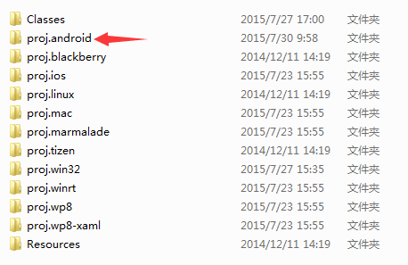

#西瓜SDK（Cocos2d-X Android版）接入文档



****

<link rel="stylesheet" href="http://yandex.st/highlightjs/6.2/styles/googlecode.min.css">

<script src="http://code.jquery.com/jquery-1.7.2.min.js"></script>
<script src="http://yandex.st/highlightjs/6.2/highlight.min.js"></script>

<script>hljs.initHighlightingOnLoad();</script>
<script type="text/javascript">
 $(document).ready(function(){
      $("h2,h3,h4,h5,h6").each(function(i,item){
        var tag = $(item).get(0).localName;
        $(item).attr("id","wow"+i);
        $("#category").append('<a class="new'+tag+'" href="#wow'+i+'">'+$(this).text()+'</a></br>');
        $(".newh2").css("margin-left",0);
        $(".newh3").css("margin-left",20);
        $(".newh4").css("margin-left",40);
        $(".newh5").css("margin-left",60);
        $(".newh6").css("margin-left",80);
      });
 });
</script>


<div id="category" style="display:none"></div>

<div id="doc"></div>

##1. 文档概述

<font face="微软雅黑">此文档为Cocos2d-X引擎Android游戏客户端接入文档。</br>
本文介绍如何在Cocos2d-X引擎平台下，Android游戏客户端快速接入西瓜SDK。
文档分成三大部分:接入环境下载/搭建，西瓜SDK接口说明以及参考代码。逐步细述了整个接入过程；同时罗列出了4种类型的接口，
分别为：用户中心接口、充值接口、统计接口、扩展接口，便于游戏方的接入人员可以按照需求更加快速便捷的进行接入。
</font>

<div id="docStructure"></div>

###1.1 文档结构
<div>
<ol type='1'>
	<li>
		<a href="#doc">文档概述</a>
			<ul type="disc">
				<li><a href="#docStructure">文档结构</a></li>
				<li><a href="#SDKDownload">SDK下载包</a></li>
			</ul>
	</li>
	<li>
		<a href="#configure">配置环境与快速接入简介</a>
			<ul type="disc">
				<li><a href="#conditions">开发和接入所需基本环境</a></li>
				<li><a href="#steps">Cocos2d-x Android接入基本步骤简介</a></li>
				<li><a href="#import">导入Cocos2d-x的相应工程到开发工具</a>
				<li><a href="#import_android">导入Android工程</a>
				<li><a href="#solutions">导入后如果出现找不到Cocos2d-x相关类的错误的解决方法</a>
			</ul>
	</li>
	<li>
		<a href="#adjust">修改相应平台工程的配置信息</a>
			<ul type="disc">
				<li><a href="#copyJar">复制SDK的Jar包</a></li>
				<li><a href="#copyInterface">复制接口文件</a></li>
				<li><a href="#adjustActivity">修改游戏的主Activity</a>
				<li><a href="#androidMk">修改Android项目的Android.mk文件</a>
			</ul>
	</li>
	<li>
		<a href="#ready">接入前的准备工作</a>
	</li>
	<li>
		<a href="#userInterface">用户接口</a>
			<ul type="disc">
				<li><a href="#init">初始化接口</a></li>
				<li><a href="#initCallback">初始化回调接口</a></li>
				<li><a href="#login">登录接口（必接）</a></li>
				<li><a href="#loginCallback">登录回调（必接）</a></li>
				<li><a href="#logout">登出接口（必接）</a></li>
				<li><a href="#logoutCallback">登出回调（必接）</a></li>
				<li><a href="#exit">退出接口（必接）</a></li>
				<li><a href="#exitCallback">退出回调（必接）</a></li>
				<li><a href="#releaseResource">资源释放接口（必接）</a></li>
			</ul>
	</li>
	<li>
		<a href="#payInterface">充值接口</a>
			<ul type="disc">
				<li><a href="#pay">支付接口（必接）</a></li>
				<li><a href="#payCallback">支付回调（必接）</a></li>
			</ul>
	</li>
	
	<li>
		<a href="#statics">统计接口</a>
			<ul type="disc">
				<li><a href="#onCreateRole">创建角色（必接）</a></li>
				<li><a href="#onRoleLevelup">角色升级（必接）</a></li>
				<li><a href="#onEnterGame">进入游戏（必接）</a></li>
			</ul>
	</li>
	<li>
		<a href="#extraInterface">扩展接口</a>
			<ul type="disc">
				<li><a href="#switchAccount">切换账号（选接）</a></li>
				<li><a href="#openUserCenter">进入用户中心（选接）</a></li>
				<li><a href="#getChannelId">获取渠道ID（选接）</a></li>
				<li><a href="#isMethodSupport">判断该渠道是否支持某方法（选接）</a></li>
				<li><a href="#init">自定义事件（选接）</a></li>
				<li><a href="#onEvent">获取渠道ID（选接）</a></li>
				<li><a href="#onMissionBegin">任务开始（选接）</a></li>
				<li><a href="#onMissionSuccess">任务成功（选接）</a></li>
				<li><a href="#onMissionFail">任务失败（选接）</a></li>
			</ul>
	</li>
	<li>
		<a href="#version">文档版本</a>
	</li>
</ol>
</div>

<div id="SDKDownload"></div>

###1.2 SDK下载包
<p></p>
<div>
<b><font face="微软雅黑" size='3'>渠道版SDK下载包包含：</font></br></b>
<font face="微软雅黑" >&nbsp&nbsp&nbsp&nbsp 1. 西瓜SDK的Jar包：xgsdk-core.jar，xgsdk-data.jar，xgsdk-lib.jar，xgsdk-api.jar；</font> </br>
<font face="微软雅黑" >&nbsp&nbsp&nbsp&nbsp 2. 接口文件：ProtocolXGSDK.h和ProtocolXGSDK.cpp；</font></br>
<font face="微软雅黑" >&nbsp&nbsp&nbsp&nbsp 3. Cocos2d-X的Android接入Demo；</font></br>
<font face="微软雅黑">&nbsp&nbsp&nbsp&nbsp 4. 西山居移动游戏-渠道SDK(Cocos2d-X Android)接入文档。</font>
</div>

<div id="configure"></div>

##2. 配置环境与快速接入简介

<div id="conditions"></div>

###2.1 开发和接入所需基本环境
<p></p>
<div>
<b><font face="微软雅黑" size='3'>Cocos2d-X开发环境：</font> </b> </br>
<font face="微软雅黑" > &nbsp&nbsp&nbsp&nbsp Cocos2d-X版本：所有版本均可</font> </br>
<font face="微软雅黑" > &nbsp&nbsp&nbsp&nbsp Cocos2d-X开发工具：VS2012等</font> </br>
</div>
<p></p>
<div>
<b><font face="微软雅黑" size='3'>Android开发环境：</font> </b> </br>
<font face="微软雅黑" > &nbsp&nbsp&nbsp&nbsp Android版本：Android2.2 以上</font> </br>
<font face="微软雅黑" > &nbsp&nbsp&nbsp&nbsp Android开发工具：Android SDK和Android Eclipse等</font> </br>
</div>

<div id="steps"></div>

###2.2 Cocos2d-X Android接入基本步骤简介
<ol type="1" start="1">
<font face="微软雅黑">
	<li>将Cocos2d-X Android工程导入到Eclipse或者Android Studio；</li>
	<li>将XGSDK的jar包放置到Android工程的libs目录下；</li>
	<li>修改游戏的MainActivity代码，让其继承XGCocos2dxActivity；</li>
	<li>将接口文件ProtocolXGSDK.h和ProtocolXGSDK.cpp文放置到jni/hellocpp目录下；</li>
	<li>修改Android.mk文件(具体修改内容见后文)；</li>
	<li>在游戏代码中引入ProtocolXGSDK.h头文件，并且继承实现XGSDKCallback回调接口类；</li>
	<li>在Cocos游戏代码中添加ProtocolXGSDK成员实例，并且在init()方法中初始化和调用prepare方法；</li>
	<li>在init()方法中初始化回调接口类，并且调用ProtocolXGSDK的setListener()成员方法；</li>
	<li>最后完成登陆、支付、清理资源等必接接口的接入便完成了Cocos2d-X原生接入的所有步骤；</li>
	<li>编译打包测试通过。</li>
</font>
</ol>

<div id="import"></div>

##3. 导入Cocos2d-X的相应工程到开发工具

<div id="import_android"></div>

###3.1 导入Android工程
<div>
<font face="微软雅黑">
Cocos2d-X的android工程位于游戏项目下的proj.android，将该工程导入到Eclipse或者Andorid Studio中。该文档主要讲解Eclipse开发工具，其他的开发工具类似，Eclipse导入android工程如下图所示：</br>

</font>
</div>

<div id="solutions"></div>

###3.2 导入后如果出现找不到Cocos2d-X相关类的错误的解决方法：
<div>
<ol type="1" start="1">
<font face="微软雅黑">
	<li>请在Cocos2d-X的安装路径中找到相应目录，如：D:\cocos2d-x-2.2.6\cocos2dx\platform\android\java，导入该工程并关联到Android工程；</li>
	<li>在Cocos2d-X安装目录下搜索libcocos2dx.jar，或者相应目录下，如：D:\cocos2d-x-2.2.6\cocos2dx\platform\android\java\bin找到libcocos2dx.jar并导入Android工程的libs目录下；</li>
</font>
</ol>

</div>

<div id="adjust"></div>

##4. 修改相应平台工程的配置信息

<div id="copyJar"></div>

###4.1 复制SDK的Jar包
<div>
<font face="微软雅黑">西瓜SDKV2的Jar包，xgsdk-core.jar，xgsdk-data.jar，xgsdk-lib.jar，xgsdk-api.jar，xgsdk-common-lib.jar，拷贝到Android工程的libs目录下：
</font></br>

</div>

<div id="copyInterface"></div>

###4.2 复制接口文件
<div>
<font face="微软雅黑">复制接口文件ProtocolXGSDK.h和ProtocolXGSDK.cpp到Android工程中的jni/hellocpp目录下，如图：</font> </br>

</div>

<div id="adjustActivity"></div>

###4.3 修改游戏的主Activity

<div>
<font face="微软雅黑">找到游戏的主Activity（继承于Cocos2dxActivity的游戏主Activity），修改该Activity，让其继承XGCocos2dxActivity：
</font></br>
<font face="微软雅黑" color="0000FF" size='3'>修改前:</font></br>
</br>
<font face="微软雅黑" color="0000FF" size='3'>修改后:</font></br>
</br>
<b><font face="微软雅黑">修改后的代码如下：</font></br></b>
</div>

```

	public class CoCosDemo extends XGCocos2dxActivity
```

<div id="androidMk"></div>

###4.4 修改Android项目的Android.mk文件
<div>
<font face="微软雅黑">在Android.mk文件中添加如图所框的两行：</font></br>
</br>
<b><font face="微软雅黑">添加的代码如下：</font></b>
</div>

```
	LOCAL_LDLIBS :=-llog
	LOCAL_SRC_FILES := hellocpp/main.cpp \
                   ../../Classes/AppDelegate.cpp \
                   ../../Classes/XGCocosDemo.cpp \
                   hellocpp/ProtocolXGSDK.cpp
```

<div id="ready"></div>

##5.接入前的准备工作
<div>
<b><font face="微软雅黑" >1. 首先先确认ProtocolXGSDK.h头文件和ProtocolXGSDK.cpp源文件已经按照4.2拷贝到相应目录下。</font></b></br>
<b><font face="微软雅黑" >2. 然后在使用到ProtocolXGSDK的地方首先导入头文件"ProtocolXGSDK.h"，例如在我们的Demo中添加如图中所示代码：</font></b></br>
</br>
<b><font face="微软雅黑">添加的代码是：</font></b>
</div>

```
	#if(CC_TARGET_PLATFORM == CC_PLATFORM_ANDROID)

	#include "../proj.android/jni/hellocpp/ProtocolXGSDK.h"

	#endif
```

<div>
<b><font face="微软雅黑" >3. 用户要继承并且实现回调类（可参考Demo），如图：</font></b></br>
</br>
</div>

<div>
<b><font face="微软雅黑" >4. 然后在游戏的类中声明一个指向ProtocolXGSDK的指针mXgSdk和指向XGSDKTestCallback的指针（可参考Demo），如图：</font></b></br>
</br>
<b><font face="微软雅黑">添加的代码是：</font></b>
</div>

```
	ProtocolXGSDK *mXgSdk;
	XGSDKTestCallback *mTestListener;
```

<div>
<b><font face="微软雅黑" >5. 需要在层的init()函数中初始化ProtocolXGSDK和XGSDKTestCallback（可参考Demo），如图加入代码：</font></b></br>
</br>
<b><font face="微软雅黑">添加的代码是：</font></b>
</div>

```
	mXgSdk = new ProtocolXGSDK();
    mXgSdk->prepare();
    mTestListener = new XGSDKTestCallback();
    mXgSdk->setListener(mTestListener);
```

<div id="userInterface"></div>

##6.用户接口

<div id="init"></div>

###6.1 初始化接口（废弃）

<div>
<b><font face='微软雅黑' color='ff0000'>西瓜SDK2.0版本已经废弃初始化接口的接入，但是初始化失败仍有回调，需要实现初始化失败的回调方法</font></b>
</div>

<div id="initCallback"></div>

###6.2 初始化回调接口（必接）

<b><font face="微软雅黑">初始化失败后回调此回调方法，参考代码：</font></b>

```
	void XGSDKTestCallback::onInitFail(int retCode, const char* msg){
    	cocos2d::CCMessageBox(msg, "INFO");
	}
```

<div>
<b><font face="微软雅黑">关于参数的说明：</font></b>
<ul type='disc'>
	<li>retCode：返回的错误码</li>
	<li>msg：返回的信息</li>
</ul>
</div>

<div id="login"></div>

###6.3 登录接口（必接）
<div>
<b><font face='微软雅黑'>在相应的位置调用登陆接口，调用位置可参考XGCocosDemo.cpp，此接口将调出渠道的登陆界面</font></b>
</div>

```
	mXgSdk->login();
```

<div>
<font face='微软雅黑' color='ff0000'>请勿游戏启动后直接调用此接口，部分渠道初始化时间较长，初始化不成功调用登录接口会出现游戏崩溃等问题，建议添加用户登录界面，由用户点击触发登陆操作</font>
</div>

<div id="loginCallback"></div>

###6.4 登录回调（必接）

<b><font face="微软雅黑">登录后回调这些回调方法，参考代码：</font></b>
```
	void XGSDKTestCallback::onLoginSuccess(const char* msg){
    	cocos2d::CCMessageBox(msg, "INFO");
	}
	void XGSDKTestCallback::onLoginFail(int retCode, const char* msg){
    	cocos2d::CCMessageBox(msg, "INFO");
	}
	void XGSDKTestCallback::onLoginCancel(const char* msg){
    	cocos2d::CCMessageBox(msg, "INFO");
	}
```
<div>

<b><font face="微软雅黑">关于参数的说明：</font></b>
<ul type='disc'>
	<li>retCode：返回的错误码</li>
	<li>msg：返回的信息</li>
</ul>
</div>

<div id="logout"></div>

###6.5 登出接口（必接）

<div>
<b><font face='微软雅黑'>调用位置XGCocosDemo.cpp中，调用该方法后将会调出渠道登出界面，并且回调onLogout方法</font></b>
</div>

```
	mXgSdk->logout();
```

<div id="logoutCallback"></div>

###6.6 登出回调（必接）
<b><font face="微软雅黑">登录后回调这些回调方法，参考代码：</font></b>
```
	void XGSDKTestCallback::onLogoutSuccess(const char *msg){
    	cocos2d::CCMessageBox(msg, "INFO");
	}
	void XGSDKTestCallback::onLogoutFail(int retCode, const char *msg){
    	cocos2d::CCMessageBox(msg, "INFO");
	}
```

<div>
<b><font face="微软雅黑">关于参数的说明：</font></b>
<ul type='disc'>
	<li>retCode：返回的错误码</li>
	<li>msg：返回的信息</li>
</ul>
</div>

<div id="exit"></div>


###6.7 退出接口（必接）
<div>
<b><font face='微软雅黑'>调用位置XGCocosDemo.cpp中，退出接口，当用户在游戏中需要退出游戏时调用该接口。参考代码：</font></b>
</div>

```
	mXgSdk->exit();
```

<div id="exitCallback"></div>

###6.8 退出回调（必接）
<b><font face="微软雅黑">退出回调这些回调方法，如果有渠道的退出接口则调用渠道的退出接口，如果没有渠道的退出接口则调用游戏的退出。</font></b>
```
	void XGSDKTestCallback::onExit(){
    	cocos2d::CCMessageBox("Exit Success", "INFO");
		CCDirector::sharedDirector()->end();
	}
	void XGSDKTestCallback::onNoChannelExiter(){
    	cocos2d::CCMessageBox("Exit OnNoChannel", "INFO");
	}
	void XGSDKTestCallback::onCancel(){
    	cocos2d::CCMessageBox("Exit onCancel", "INFO");
	}
```

<div id="releaseResource"></div>

###6.9 资源释放接口（必接）
<b><font face="微软雅黑">释放资源，包括释放ProtocolXGSDK，释放XGSDKCallback等。请在最终游戏退出Kill游戏进程前调用该方法，参考代码：</font></b>

```
	mXgSdk->releaseResource();
```
<div>
<font face='微软雅黑' color='ff0000'>请在最终游戏退出Kill游戏进程前调用该方法。</font>
</div>

<div id="payInterface"></div>

##7.充值接口

<div id="pay"></div>

###7.1 支付接口（必接）
<div>
<b><font face='微软雅黑'>调用位置XGCocosDemo.cpp中，此接口将会发起用户充值，系统会调用对应渠道SDK充值界面。支付接口需要传入类型为PayInfo的参数。</font></b>
</div>

```
	mXgSdk->pay(PayInfo &payInfo);
```
<div>
<b><font face="微软雅黑">类型PayInfo结构体定义在ProtocolXGSDK.h头文件中：</font></b>
</div>

```
	struct PayInfo{
		const char *uid;
		int productTotalPirce;
		int productCount;
		int productUnitPrice;
		const char *productId;
		const char *productName;
		const char *productDesc;
		const char *currencyName;
		const char *serverId;
		const char *serverName;
		const char *zoneId;
		const char *zoneName;
		const char *roleId;
		const char *roleName;
		const char *level;
		const char *vipLevel;
		const char *balance;
		const char *gameOrderId;
		const char *ext;
		const char *notifyURL;
	};
```
<div>
<b><font face="微软雅黑">关于PayInfo的成员说明</font></b>
<table>
<tr>
	<th>输入参数</th>
	<th>数据类型</th>
	<th>说明</th>
	<th>可空</th>
</tr>
<tr>
	<td>uid</td>
	<td>const char *</td>
	<td>用户ID</td>
	<td>N</td>
</tr>
<tr>
	<td>productTotalPirce</td>
	<td>int</td>
	<td>产品价格</td>
	<td>N</td>
</tr>
<tr>
	<td>productCount</td>
	<td>int</td>
	<td>产品数量</td>
	<td>N</td>
</tr>
<tr>
	<td>productUnitPrice</td>
	<td>int</td>
	<td>产品单价</td>
	<td>N</td>
</tr>
<tr>
	<td>productId</td>
	<td>const char *</td>
	<td>产品ID</td>
	<td>N</td>
</tr>
<tr>
	<td>productName</td>
	<td>const char *</td>
	<td>产品名称</td>
	<td>N</td>
</tr>
<tr>
	<td>productDesc</td>
	<td>const char *</td>
	<td>产品描述</td>
	<td>N</td>
</tr>
<tr>
	<td>currencyName</td>
	<td>const char *</td>
	<td>游戏金额单位，如“元宝”</td>
	<td>Y</td>
</tr>
<tr>
	<td>serverId</td>
	<td>const char *</td>
	<td>服ID</td>
	<td>Y</td>
</tr>
<tr>
	<td>serverName</td>
	<td>const char *</td>
	<td>服名称</td>
	<td>Y</td>
</tr>
<tr>
	<td>zoneId</td>
	<td>const char *</td>
	<td>区ID</td>
	<td>Y</td>
</tr>
<tr>
	<td>zoneName</td>
	<td>const char *</td>
	<td>区名称</td>
	<td>Y</td>
</tr>
<tr>
	<td>roleId</td>
	<td>const char *</td>
	<td>角色ID</td>
	<td>Y</td>
</tr>
<tr>
	<td>roleName</td>
	<td>const char *</td>
	<td>角色名称</td>
	<td>Y</td>
</tr>
<tr>
	<td>level</td>
	<td>const char *</td>
	<td>角色等级</td>
	<td>Y</td>
</tr>
<tr>
	<td>vipLevel</td>
	<td>const char *</td>
	<td>VIP等级</td>
	<td>Y</td>
</tr>
<tr>
	<td>balance</td>
	<td>const char *</td>
	<td>余额</td>
	<td>Y</td>
</tr>
<tr>
	<td>gameOrderId</td>
	<td>const char *</td>
	<td>游戏订单ID</td>
	<td>Y</td>
</tr>
<tr>
	<td>ext</td>
	<td>const char *</td>
	<td>扩展字段</td>
	<td>Y</td>
</tr>
<tr>
	<td>notifyURL</td>
	<td>const char *</td>
	<td>支付通知URL地址</td>
	<td>Y</td>
</tr>
</table>
</div>

<div id="payCallback"></div>

###7.2 支付回调（必接）
<b><font face="微软雅黑">支付完成回调这些回调方法，参考代码：</font></b>
```
	void XGSDKTestCallback::onPaySuccess(const char* msg){
    	cocos2d::CCMessageBox(msg, "INFO");
	}
	void XGSDKTestCallback::onPayFail(int retCode, const char *msg){
    	cocos2d::CCMessageBox(msg, "INFO");
	}
	void XGSDKTestCallback::onPayCancel(const char * msg){
    	cocos2d::CCMessageBox(msg, "INFO");
	}
```
<div>
<b><font face="微软雅黑">关于参数的说明：</font></b>
<ul type='disc'>
	<li>retCode：返回的错误码</li>
	<li>msg：返回的信息</li>
</ul>
</div>

<div id="statics"></div>

##8.统计接口

<div id="onCreateRole"></div>

###8.1 创建角色（必接）
<b><font face="微软雅黑">此接口用于游戏信息统计，当创建游戏角色时调用，要求传入UserInfo类型的参数，参考代码：</font></b>
```
	mXgSdk->onCreateRole(UserInfo &userInfo);
```
<div>
<b><font face="微软雅黑">类型UserInfo结构体定义在ProtocolXGSDK.h头文件中：</font></b>
</div>

```

	struct UserInfo{
		const char *uid;
		const char *userName;
		const char *roleId;
		const char *roleName;
		const char *gender;
		const char *level;
		const char *vipLevel;
		const char *balance;
		const char *partyName;
		const char *serverId;
		const char *serverName;
	};

```

<div>
<b><font face="微软雅黑">关于UserInfo的成员说明</font></b>
<table>
<tr>
	<th>输入参数</th>
	<th>数据类型</th>
	<th>说明</th>
	<th>可空</th>
</tr>
<tr>
	<td>uid</td>
	<td>const char *</td>
	<td>用户ID</td>
	<td>N</td>
</tr>
<tr>
	<td>userName</td>
	<td>const char *</td>
	<td>用户名称</td>
	<td>Y</td>
</tr>
<tr>
	<td>roleId</td>
	<td>const char *</td>
	<td>角色ID</td>
	<td>N</td>
</tr>
<tr>
	<td>roleName</td>
	<td>const char *</td>
	<td>角色名字</td>
	<td>N</td>
</tr>
<tr>
	<td>gender</td>
	<td>const char *</td>
	<td>性别</td>
	<td>Y</td>
</tr>
<tr>
	<td>level</td>
	<td>const char *</td>
	<td>等级</td>
	<td>Y</td>
</tr>
<tr>
	<td>vipLevel</td>
	<td>const char *</td>
	<td>VIP等级</td>
	<td>Y</td>
</tr>
<tr>
	<td>balance</td>
	<td>const char *</td>
	<td>余额</td>
	<td>Y</td>
</tr>
<tr>
	<td>partyName</td>
	<td>const char *</td>
	<td>战队名称</td>
	<td>Y</td>
</tr>
<tr>
	<td>serverId</td>
	<td>const char *</td>
	<td>服ID</td>
	<td>Y</td>
</tr>
<tr>
	<td>serverName</td>
	<td>const char *</td>
	<td>服名称</td>
	<td>Y</td>
</tr>
</table>
</div>

<div id="onRoleLevelup"></div>

###8.2 角色升级（必接）
<b><font face="微软雅黑">此接口用于游戏信息统计，当角色升级时调用，要求传入UserInfo类型的参数，参考代码：</font></b>
```
	mXgSdk->onRoleLevelup(UserInfo &userInfo);
```
<div>
<b><font face="微软雅黑">类型UserInfo结构体定义在ProtocolXGSDK.h头文件中：</font></b>
</div>

```

	struct UserInfo{
		const char *uid;
		const char *userName;
		const char *roleId;
		const char *roleName;
		const char *gender;
		const char *level;
		const char *vipLevel;
		const char *balance;
		const char *partyName;
		const char *serverId;
		const char *serverName;
	};

```

<div>
<b><font face="微软雅黑">关于UserInfo的成员说明</font></b>
<table>
<tr>
	<th>输入参数</th>
	<th>数据类型</th>
	<th>说明</th>
	<th>可空</th>
</tr>
<tr>
	<td>uid</td>
	<td>const char *</td>
	<td>用户ID</td>
	<td>N</td>
</tr>
<tr>
	<td>userName</td>
	<td>const char *</td>
	<td>用户名称</td>
	<td>Y</td>
</tr>
<tr>
	<td>roleId</td>
	<td>const char *</td>
	<td>角色ID</td>
	<td>N</td>
</tr>
<tr>
	<td>roleName</td>
	<td>const char *</td>
	<td>角色名字</td>
	<td>N</td>
</tr>
<tr>
	<td>gender</td>
	<td>const char *</td>
	<td>性别</td>
	<td>Y</td>
</tr>
<tr>
	<td>level</td>
	<td>const char *</td>
	<td>等级</td>
	<td>Y</td>
</tr>
<tr>
	<td>vipLevel</td>
	<td>const char *</td>
	<td>VIP等级</td>
	<td>Y</td>
</tr>
<tr>
	<td>balance</td>
	<td>const char *</td>
	<td>余额</td>
	<td>Y</td>
</tr>
<tr>
	<td>partyName</td>
	<td>const char *</td>
	<td>战队名称</td>
	<td>Y</td>
</tr>
<tr>
	<td>serverId</td>
	<td>const char *</td>
	<td>服ID</td>
	<td>Y</td>
</tr>
<tr>
	<td>serverName</td>
	<td>const char *</td>
	<td>服名称</td>
	<td>Y</td>
</tr>
</table>
</div>

<div id="onEnterGame"></div>

###8.3 进入游戏（必接）
<b><font face="微软雅黑">此接口用于游戏信息统计，当进入游戏时调用，要求传入UserInfo类型的参数，参考代码：</font></b>
```
	mXgSdk->onEnterGame(UserInfo &userInfo);
```
<div>
<b><font face="微软雅黑">类型UserInfo结构体定义在ProtocolXGSDK.h头文件中：</font></b>
</div>

```

	struct UserInfo{
		const char *uid;
		const char *userName;
		const char *roleId;
		const char *roleName;
		const char *gender;
		const char *level;
		const char *vipLevel;
		const char *balance;
		const char *partyName;
		const char *serverId;
		const char *serverName;
	};

```

<div>
<b><font face="微软雅黑">关于UserInfo的成员说明</font></b>
<table>
<tr>
	<th>输入参数</th>
	<th>数据类型</th>
	<th>说明</th>
	<th>可空</th>
</tr>
<tr>
	<td>uid</td>
	<td>const char *</td>
	<td>用户ID</td>
	<td>N</td>
</tr>
<tr>
	<td>userName</td>
	<td>const char *</td>
	<td>用户名称</td>
	<td>Y</td>
</tr>
<tr>
	<td>roleId</td>
	<td>const char *</td>
	<td>角色ID</td>
	<td>N</td>
</tr>
<tr>
	<td>roleName</td>
	<td>const char *</td>
	<td>角色名字</td>
	<td>N</td>
</tr>
<tr>
	<td>gender</td>
	<td>const char *</td>
	<td>性别</td>
	<td>Y</td>
</tr>
<tr>
	<td>level</td>
	<td>const char *</td>
	<td>等级</td>
	<td>Y</td>
</tr>
<tr>
	<td>vipLevel</td>
	<td>const char *</td>
	<td>VIP等级</td>
	<td>Y</td>
</tr>
<tr>
	<td>balance</td>
	<td>const char *</td>
	<td>余额</td>
	<td>Y</td>
</tr>
<tr>
	<td>partyName</td>
	<td>const char *</td>
	<td>战队名称</td>
	<td>Y</td>
</tr>
<tr>
	<td>serverId</td>
	<td>const char *</td>
	<td>服ID</td>
	<td>Y</td>
</tr>
<tr>
	<td>serverName</td>
	<td>const char *</td>
	<td>服名称</td>
	<td>Y</td>
</tr>
</table>
</div>

<div id="extraInterface"></div>

##9.扩展接口

<div id="switchAccount"></div>

###9.1 切换账号（选接）
<b><font face="微软雅黑">此接口用于游戏切换账号，游戏需要支持切换用户功能，点击切换用户按钮时调用。参考代码：</font></b>
```
	mXgSdk->switchAccount();
```

<div id="openUserCenter"></div>

###9.1 进入用户中心（选接）
<b><font face="微软雅黑">此接口用于游戏进入渠道的用户中心，点击用户中心按钮时调用。参考代码：</font></b>
```
	mXgSdk->openUserCenter();
```

<div id="getChannelId"></div>

###9.2 获取渠道ID（选接）
<b><font face="微软雅黑">获取channelId。channelId为渠道ID，参考代码：</font></b>
```
	char *getChannelId();
```

<div id="isMethodSupport"></div>

###9.2 判断该渠道是否支持某方法（选接）
<b><font face="微软雅黑">判断该渠道是否支持某方法，返回布尔类型，参考代码：</font></b>
```
	bool isMethodSupport();
```

<div id="onEvent"></div>

###9.3 自定义事件（选接）
<b><font face="微软雅黑">此接口用于游戏的自定义事件，要求传入EventInfo类型的参数，参考代码：</font></b>
```
	mXgSdk->onEvent(EventInfo &eventInfo);
```
<div>
<b><font face="微软雅黑">类型EventInfo结构体定义在ProtocolXGSDK.h头文件中：</font></b>
</div>

```

	struct EventInfo {
		const char *uid;
		const char *userName;
		const char *roleId;
		const char *roleName;
		const char *gender;
		const char *level;
		const char *vipLevel;
		const char *balance;
		const char *partyName;
		const char *serverId;
		const char *serverName;
		const char *eventId; //事件id
		const char *eventDesc; //事件描述
		int eventVal; //事件值
		const char *eventBody; //事件内容 必须是json格式
		const char *customParams; //扩展字段 必须是json格式
	};

```

<div>
<b><font face="微软雅黑">关于EventInfo的成员说明</font></b>
<table>
<tr>
	<th>输入参数</th>
	<th>数据类型</th>
	<th>说明</th>
	<th>可空</th>
</tr>
<tr>
	<td>uid</td>
	<td>const char *</td>
	<td>用户ID</td>
	<td>N</td>
</tr>
<tr>
	<td>userName</td>
	<td>const char *</td>
	<td>用户名称</td>
	<td>Y</td>
</tr>
<tr>
	<td>roleId</td>
	<td>const char *</td>
	<td>角色ID</td>
	<td>N</td>
</tr>
<tr>
	<td>roleName</td>
	<td>const char *</td>
	<td>角色名字</td>
	<td>N</td>
</tr>
<tr>
	<td>gender</td>
	<td>const char *</td>
	<td>性别</td>
	<td>Y</td>
</tr>
<tr>
	<td>level</td>
	<td>const char *</td>
	<td>等级</td>
	<td>Y</td>
</tr>
<tr>
	<td>vipLevel</td>
	<td>const char *</td>
	<td>VIP等级</td>
	<td>Y</td>
</tr>
<tr>
	<td>balance</td>
	<td>const char *</td>
	<td>余额</td>
	<td>Y</td>
</tr>
<tr>
	<td>partyName</td>
	<td>const char *</td>
	<td>战队名称</td>
	<td>Y</td>
</tr>
<tr>
	<td>serverId</td>
	<td>const char *</td>
	<td>服ID</td>
	<td>Y</td>
</tr>
<tr>
	<td>serverName</td>
	<td>const char *</td>
	<td>服名称</td>
	<td>Y</td>
</tr>
<tr>
	<td>eventId</td>
	<td>const char *</td>
	<td>事件ID</td>
	<td>Y</td>
</tr>
<tr>
	<td>eventDesc</td>
	<td>const char *</td>
	<td>事件描述</td>
	<td>Y</td>
</tr>
<tr>
	<td>eventVal</td>
	<td>const char *</td>
	<td>事件值</td>
	<td>Y</td>
</tr>
<tr>
	<td>eventBody</td>
	<td>const char *</td>
	<td>事件内容</td>
	<td>Y</td>
</tr>
<tr>
	<td>customParams</td>
	<td>const char *</td>
	<td>扩展字段</td>
	<td>Y</td>
</tr>

</table>
</div>

<div id="onMissionBegin"></div>

###9.4 任务开始（选接）
<b><font face="微软雅黑">此接口用于数据统计，在任务开始时要求传入MissionInfo类型的参数，参考代码：</font></b>
```
	mXgSdk->onMissionBegin(MissionInfo &missionInfo);
```
<div>
<b><font face="微软雅黑">类型MissionInfo结构体定义在ProtocolXGSDK.h头文件中：</font></b>
</div>

```
	struct MissionInfo{
    	const char *uid;
    	const char *username;
    	const char *roleId;
    	const char *roleName;
    	const char *gender;
    	const char *level;
    	const char *vipLevel;
    	const char *balance;
    	const char *partyName;
    	const char *serverId;
    	const char *serverName;
    	const char *missionName; //任务名称
    	const char *customParams; //扩展参数，必须是json
	};

```

<div>
<b><font face="微软雅黑">关于MissionInfo的成员说明</font></b>
<table>
<tr>
	<th>输入参数</th>
	<th>数据类型</th>
	<th>说明</th>
	<th>可空</th>
</tr>
<tr>
	<td>uid</td>
	<td>const char *</td>
	<td>用户ID</td>
	<td>N</td>
</tr>
<tr>
	<td>userName</td>
	<td>const char *</td>
	<td>用户名称</td>
	<td>Y</td>
</tr>
<tr>
	<td>roleId</td>
	<td>const char *</td>
	<td>角色ID</td>
	<td>N</td>
</tr>
<tr>
	<td>roleName</td>
	<td>const char *</td>
	<td>角色名字</td>
	<td>N</td>
</tr>
<tr>
	<td>gender</td>
	<td>const char *</td>
	<td>性别</td>
	<td>Y</td>
</tr>
<tr>
	<td>level</td>
	<td>const char *</td>
	<td>等级</td>
	<td>Y</td>
</tr>
<tr>
	<td>vipLevel</td>
	<td>const char *</td>
	<td>VIP等级</td>
	<td>Y</td>
</tr>
<tr>
	<td>balance</td>
	<td>const char *</td>
	<td>余额</td>
	<td>Y</td>
</tr>
<tr>
	<td>partyName</td>
	<td>const char *</td>
	<td>战队名称</td>
	<td>Y</td>
</tr>
<tr>
	<td>serverId</td>
	<td>const char *</td>
	<td>服ID</td>
	<td>Y</td>
</tr>
<tr>
	<td>serverName</td>
	<td>const char *</td>
	<td>服名称</td>
	<td>Y</td>
</tr>
<tr>
	<td>missionName</td>
	<td>const char *</td>
	<td>任务名字</td>
	<td>Y</td>
</tr>
<tr>
	<td>customParams</td>
	<td>const char *</td>
	<td>扩展参数</td>
	<td>Y</td>
</tr>
</table>
</div>

<div id="onMissionSuccess"></div>

###9.4 任务成功（选接）
<b><font face="微软雅黑">此接口用于数据统计，在任务成功时要求传入MissionInfo类型的参数，参考代码：</font></b>
```
	mXgSdk->onMissionSuccess(MissionInfo &missionInfo);
```
<div>
<b><font face="微软雅黑">类型MissionInfo结构体定义在ProtocolXGSDK.h头文件中：</font></b>
</div>

```
	struct MissionInfo{
    	const char *uid;
    	const char *username;
    	const char *roleId;
    	const char *roleName;
    	const char *gender;
    	const char *level;
    	const char *vipLevel;
    	const char *balance;
    	const char *partyName;
    	const char *serverId;
    	const char *serverName;
    	const char *missionName; //任务名称
    	const char *customParams; //扩展参数，必须是json
	};

```

<div>
<b><font face="微软雅黑">关于MissionInfo的成员说明</font></b>
<table>
<tr>
	<th>输入参数</th>
	<th>数据类型</th>
	<th>说明</th>
	<th>可空</th>
</tr>
<tr>
	<td>uid</td>
	<td>const char *</td>
	<td>用户ID</td>
	<td>N</td>
</tr>
<tr>
	<td>userName</td>
	<td>const char *</td>
	<td>用户名称</td>
	<td>Y</td>
</tr>
<tr>
	<td>roleId</td>
	<td>const char *</td>
	<td>角色ID</td>
	<td>N</td>
</tr>
<tr>
	<td>roleName</td>
	<td>const char *</td>
	<td>角色名字</td>
	<td>N</td>
</tr>
<tr>
	<td>gender</td>
	<td>const char *</td>
	<td>性别</td>
	<td>Y</td>
</tr>
<tr>
	<td>level</td>
	<td>const char *</td>
	<td>等级</td>
	<td>Y</td>
</tr>
<tr>
	<td>vipLevel</td>
	<td>const char *</td>
	<td>VIP等级</td>
	<td>Y</td>
</tr>
<tr>
	<td>balance</td>
	<td>const char *</td>
	<td>余额</td>
	<td>Y</td>
</tr>
<tr>
	<td>partyName</td>
	<td>const char *</td>
	<td>战队名称</td>
	<td>Y</td>
</tr>
<tr>
	<td>serverId</td>
	<td>const char *</td>
	<td>服ID</td>
	<td>Y</td>
</tr>
<tr>
	<td>serverName</td>
	<td>const char *</td>
	<td>服名称</td>
	<td>Y</td>
</tr>
<tr>
	<td>missionName</td>
	<td>const char *</td>
	<td>任务名字</td>
	<td>Y</td>
</tr>
<tr>
	<td>customParams</td>
	<td>const char *</td>
	<td>扩展参数</td>
	<td>Y</td>
</tr>
</table>
</div>

<div id="onMissionFail"></div>

###9.4 任务失败（选接）
<b><font face="微软雅黑">此接口用于数据统计，在任务失败时要求传入MissionInfo类型的参数，参考代码：</font></b>
```
	mXgSdk->onMissionFail(MissionInfo &missionInfo);
```
<div>
<b><font face="微软雅黑">类型MissionInfo结构体定义在ProtocolXGSDK.h头文件中：</font></b>
</div>

```
	struct MissionInfo{
    	const char *uid;
    	const char *username;
    	const char *roleId;
    	const char *roleName;
    	const char *gender;
    	const char *level;
    	const char *vipLevel;
    	const char *balance;
    	const char *partyName;
    	const char *serverId;
    	const char *serverName;
    	const char *missionName; //任务名称
    	const char *customParams; //扩展参数，必须是json
	};

```

<div>
<b><font face="微软雅黑">关于MissionInfo的成员说明</font></b>
<table>
<tr>
	<th>输入参数</th>
	<th>数据类型</th>
	<th>说明</th>
	<th>可空</th>
</tr>
<tr>
	<td>uid</td>
	<td>const char *</td>
	<td>用户ID</td>
	<td>N</td>
</tr>
<tr>
	<td>userName</td>
	<td>const char *</td>
	<td>用户名称</td>
	<td>Y</td>
</tr>
<tr>
	<td>roleId</td>
	<td>const char *</td>
	<td>角色ID</td>
	<td>N</td>
</tr>
<tr>
	<td>roleName</td>
	<td>const char *</td>
	<td>角色名字</td>
	<td>N</td>
</tr>
<tr>
	<td>gender</td>
	<td>const char *</td>
	<td>性别</td>
	<td>Y</td>
</tr>
<tr>
	<td>level</td>
	<td>const char *</td>
	<td>等级</td>
	<td>Y</td>
</tr>
<tr>
	<td>vipLevel</td>
	<td>const char *</td>
	<td>VIP等级</td>
	<td>Y</td>
</tr>
<tr>
	<td>balance</td>
	<td>const char *</td>
	<td>余额</td>
	<td>Y</td>
</tr>
<tr>
	<td>partyName</td>
	<td>const char *</td>
	<td>战队名称</td>
	<td>Y</td>
</tr>
<tr>
	<td>serverId</td>
	<td>const char *</td>
	<td>服ID</td>
	<td>Y</td>
</tr>
<tr>
	<td>serverName</td>
	<td>const char *</td>
	<td>服名称</td>
	<td>Y</td>
</tr>
<tr>
	<td>missionName</td>
	<td>const char *</td>
	<td>任务名字</td>
	<td>Y</td>
</tr>
<tr>
	<td>customParams</td>
	<td>const char *</td>
	<td>扩展参数</td>
	<td>Y</td>
</tr>
</table>
</div>

****

<div id="version"></div>

###文档版本说明
<table>
<tr>
<td>SDK版本</td><td>文档版本</td> <td>DK修改内容</td> <td>文档修改内容</td> <td>修改日期</td>  
</tr>
<tr>
<td>2.0 </td><td>1.0</td> <td>初版</td> <td>初版</td> <td>2015.7.30</td>
</tr>
</table>
