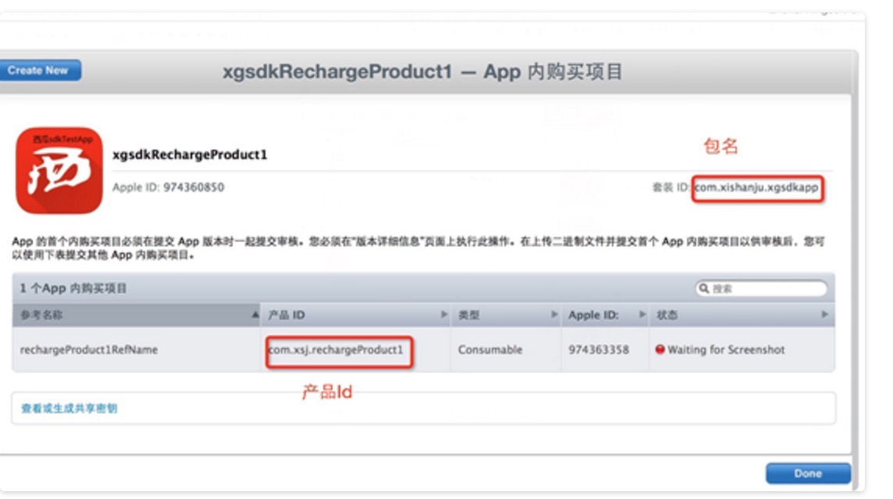
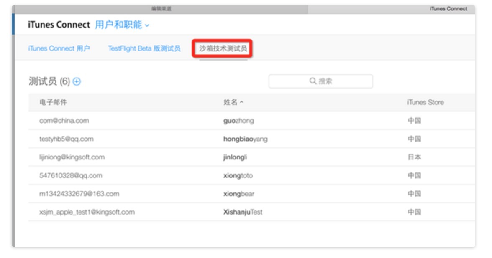
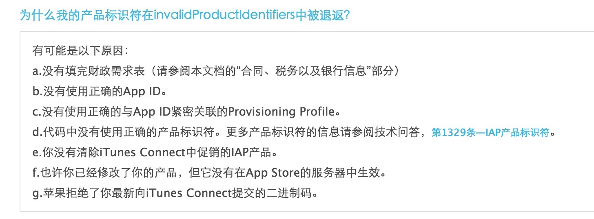
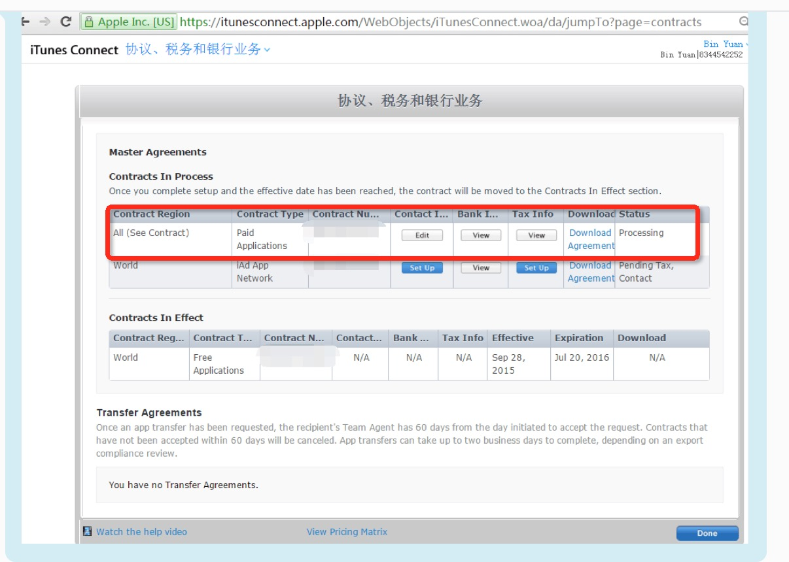

# 正版支付必读

根据以往游戏接入的经验和教训，汇总了部分问题，以下内容请务必认真阅读.

## 1. 什么是包名和产品ID？

包名和产品ID必须正确提供给西瓜，否则会导致无法测试支付功能。
**特别提醒：包名中不能含有下划线"_" 。**

打开itunes,登陆开发者账号查看如下： 

## 2. 什么是沙箱账号？

沙箱账号用于游戏测试支付，只要是xcode生成的包，均可使用沙箱账号测试（即使游戏已经在AppStore上架）。
但是从AppStore上下载的包，无法使用沙箱账号支付。

打开itunes,登陆开发者账号查看如下： 

## 3. 是否屏蔽了玩家连续点击支付按钮的行为？
玩家点击支付时，因网络缘故，访问AppStore的时间较长，导致界面响应较慢。玩家有可能在此期间连续下单，影响支付结果。游戏请务必做好屏蔽连续支付，以防玩家重复点击。处理方法：
游戏在调用xgsdk支付接口前，拉起一个模态窗口，**待xgsdk返回支付结果后**，关闭该模态窗口。

## 4. 需要提供哪些注册信息？
- 在iTunes上注册的产品bundleId。
- itunes注册的产品ID列表。
- apple沙箱充值的测试账号。

## 5. 弹不出apple的支付对话框？
- 请确认xcode中配置的bundleid正确
- 请确认支付时传入的productId正确
- 请确认“设置-iTunes账户” 正确（沙箱测试时，填写沙箱测试账号）。
- 请确认“设置-iTunes账户” 正确。（若账号处于灰色状态，即不可编辑，也不可注销。说明本地网络有误，需重启设备）。
- 设备是越狱机器。请用非越狱机测试正版支付。
- 请检查注册iTunes中产品的信息,<a href = "http://www.cocoachina.com/special/iap.html">为什么我的产品标识符在invalidProductIdentifiers中被退返？</a>： 

- 请检查税务信息是否填写完整。 

## 文档版本说明
<table>
<tr>
<td>SDK版本</td><td>文档版本</td> <td>SDK修改内容</td> <td>文档修改内容</td> <td>修改日期</td>  
</tr>
<tr>
<td>2.0.0 </td><td>1.0</td> <td>初版</td> <td>初版</td> <td>2015.10.28</td>
</tr>
</table>
