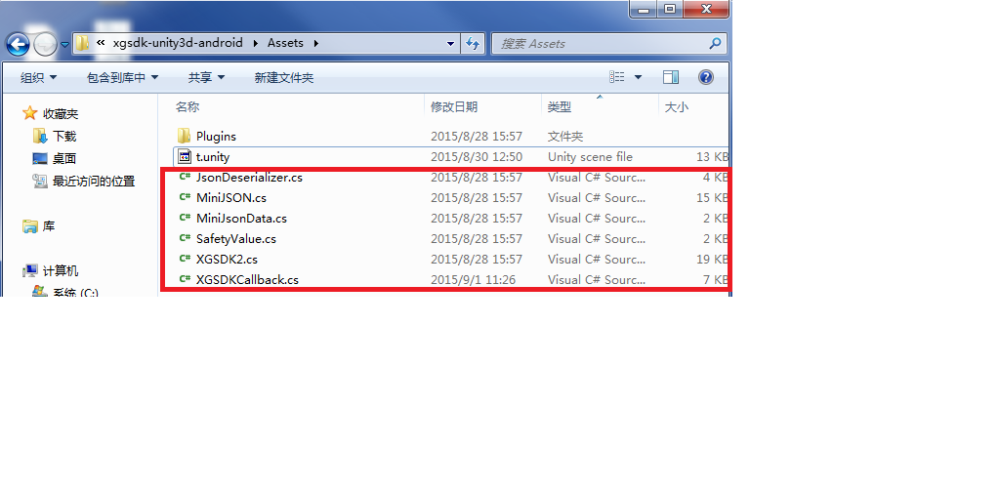
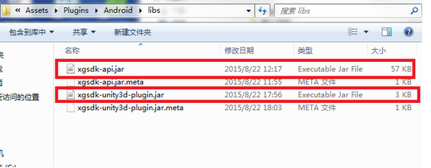
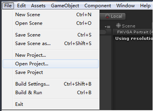
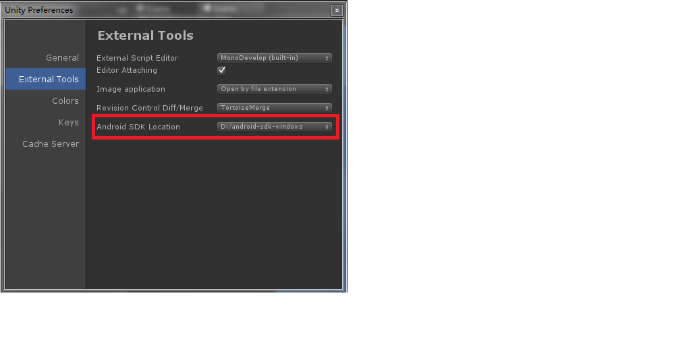
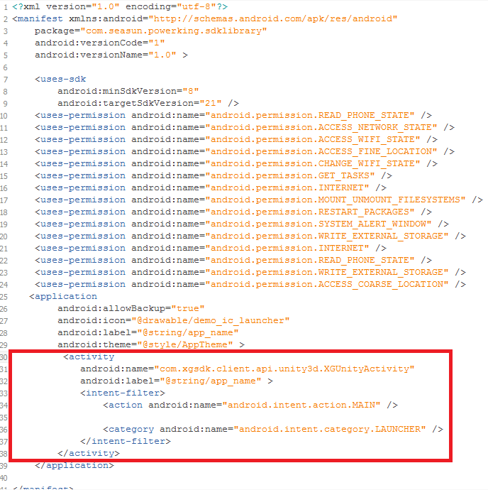
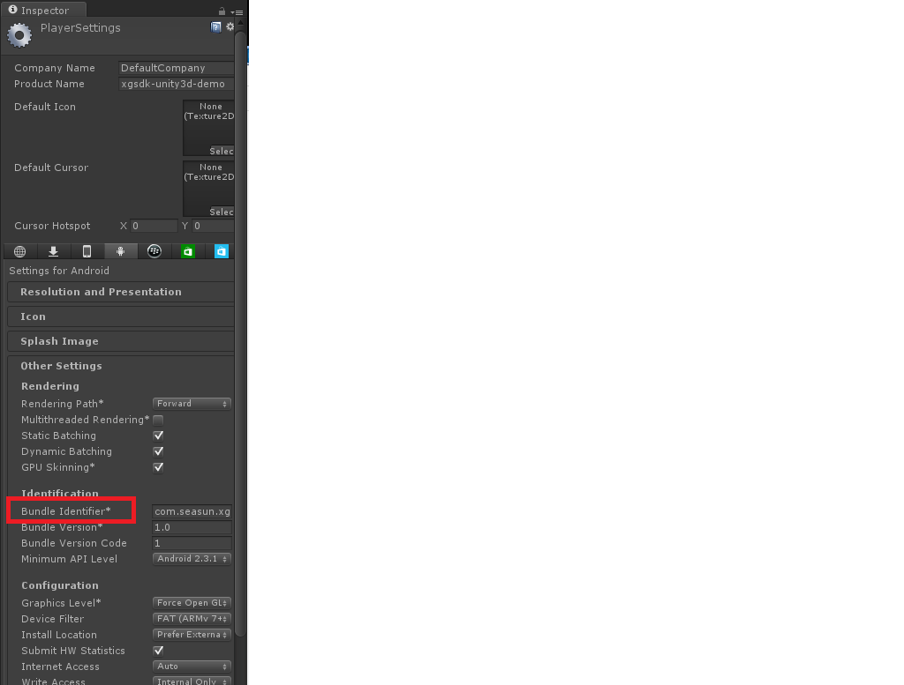
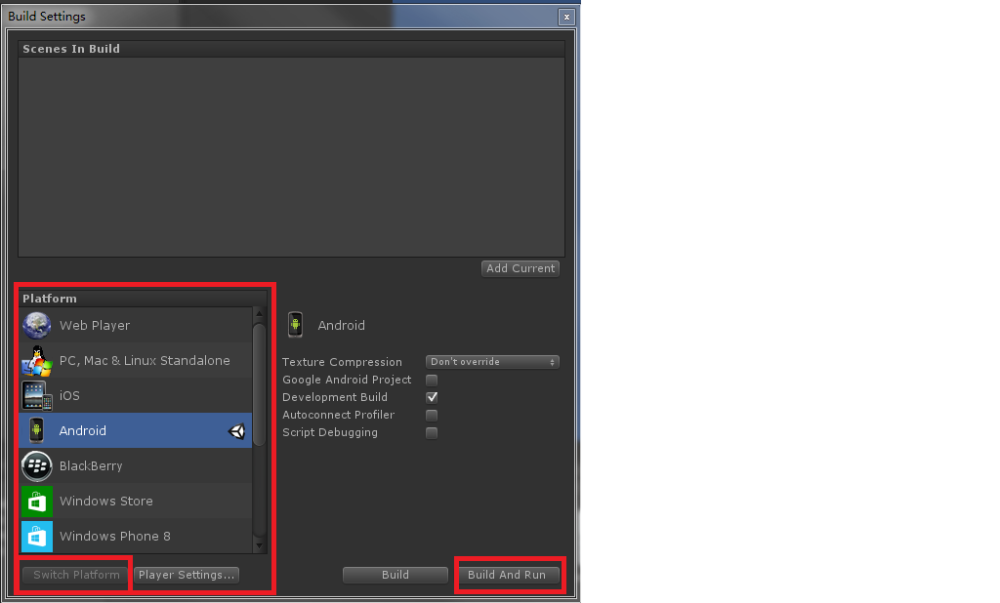

#西瓜SDK（Unity3d Android版）接入文档


<a name = "docSummary"></a>
##1、文档概述
此文档为Unity3d引擎Android游戏客户端接入文档。</br>
本文介绍如何在Unity3d引擎平台下，Android游戏客户端快速接入西瓜SDK。
文档分成三大部分:接入环境下载/搭建，西瓜SDK接口说明以及参考代码。逐步细述了整个接入过程；同时罗列出了4种类型的接口，
分别为：用户相关接口、充值接口、统计接口、扩展接口，便于游戏方的接入人员可以按照需求更加快速便捷的进行接入。

<a name = "docStructure"></a>
###1.1 文档结构


<ol type = '1'>
	<li>
		<a href = "docSummary">文档概述</a>
			<ul type = "disc">
				<li><a href="#docStructure">文档结构</a></li>
			</ul>
	</li>
	<li>
		<a href = "#configure">环境搭建</a>
			<ul type = "disc">
				<li><a href = "#environment">开发环境</a></li>
				<li><a href = "#tools">开发工具</a></li>
				<li><a href = "#SDKDownload">SDk下载</a></li>
				<li><a href = "#steps">接入步骤</a></li>
			</ul>
	</li>
	<li>
		<a href = "#SDKIn">接口接入</a>
			<ul type = "disc">
				<li><a href = "#user&roleInterface">用户及角色相关接口</a>
					<ul type = "circle">
						<li><a href = "#init">初始化接口</a></li>
						<li><a href = "#login">登录接口</a></li>
						<li><a href = "#logout">登出接口</a></li>
						<li><a href = "#exit">退出接口</a></li>
						
					</ul>
				</li>
				<li><a href = "#rechargeInterface">充值接口</a>
					<ul type = "circle">
						<li><a href = "#pay">支付接口</a></li>
					</ul>
				</li>
				<li><a href = "#statisticsInterface">统计接口</a>
					<ul type = "circle">
						<li><a href = "#missionBegin">任务开始</a></li>
						<li><a href = "#missionSuccess">任务成功</a></li>
						<li><a href = "#missionFail">任务失败</a></li>
						<li><a href = "#onVirtalCurrencyPurchase">统计充值获得的虚拟货币</a></li>
						<li><a href = "#onVirtualCurrencyReward">统计赠送的虚拟货币</a></li>
						<li><a href = "#onVirtalCurrencyConsume">统计跟踪虚拟货币的消费</a></li>
					</ul>
				</li>
				<li><a href = "#extraInterface">扩展接口</a>
					<ul type = "circle">
						<li><a href = "#enterGame">进入游戏</a></li>
						<li><a href = "#createRole">创建角色</a></li>
						<li><a href = "#roleLevelUp">角色升级</a></li>
						<li><a href = "#onEvent">自定义事件</a></li>
						<li><a href = "switchAccount">切换账号</a></li>
						<li><a href = "getChannelId">获取渠道ID</a></li>
					</ul>
				</li>
			</ul>
	</li>
	<li><a href = "#errorCode">错误码</a></li>
</ol>


<a name = "configure"></a>
##2、环境搭建
<a name = "environment"></a>
###2.1 开发环境


开发环境： </br>
JDK版本：JDK6以上 </br>
Android版本：Android4.0.3以上</br>

<a name = "tools"></a>
###2.2开发工具
开发工具：</br>
Unity4.6.2f1</br>
Android SDK和Android Eclipse等</br>


<a name = "SDKDownload"></a>
###2.3 SDK下载包


渠道版SDK下载包包含：</br>
1. 西瓜SDKV2的Jar包：xgsdk-api.jar、xgsdk-unity3d-plugin.jar。</br>
2. 脚本文件：XGSDK2.cs、XGSDKCallback.cs、JsonDeserializer.cs、MiniJSON.cs、MiniJsonData.cs、XgsdkDemo.cs。</br>
其中XGSDK2.cs为西瓜SDK2.0版本接口，XGSDKCallback.cs为回调方法。</br>


<a name = "steps"></a>
###2.4 接入步骤
####2.4.1.将下载的jar包全部拷贝至<项目目录>\Assets\Plugins\Android\libs，将下载的cs脚本文件全部拷贝至<项目目录>\Assets中<br/>








注意：导入的cs脚本文件名称不可修改。

####2.4.2导入文件

打开Unity,点击File->Open Project->Open Other... ， 打开文件所在的目录，将工程导入。





####2.4.3配置SDK路径

点击Edit->Preferences，打开Unity Preferences窗口,点击External Tools，在Android SDK Location配置自己的Android SDK路径




####2.4.4.配置AndroidMainfest.xml文件<br/>


**配置权限**

```

	<uses-permission android:name="android.permission.WRITE_EXTERNAL_STORAGE" />  
    <uses-permission android:name="android.permission.ACCESS_NETWORK_STATE" />
    <uses-permission android:name="android.permission.READ_PHONE_STATE" />
    <uses-permission android:name="android.permission.INTERNET" />
    <uses-permission android:name="android.permission.GET_TASKS" />
    <uses-permission android:name="android.permission.ACCESS_WIFI_STATE" />
```


**application标签中的android:name必须配置com.xgsdk.client.api.XGApplication**  
**activity标签中的android:name必须配置com.xgsdk.client.unity3d.XGUnityActivity**

```

	<application
		android:name="com.xgsdk.client.api.XGApplication"
        android:allowBackup="true"
        android:icon="@drawable/demo_ic_launcher"
        android:label="@string/app_name"
        android:theme="@style/AppTheme" >
         <activity
            android:name="com.xgsdk.client.unity3d.XGUnityActivity"
            android:label="@string/app_name" >
            <intent-filter>
                <action android:name="android.intent.action.MAIN" />
                <category android:name="android.intent.category.LAUNCHER" />
            </intent-filter>
        </activity>
    </application>
```



**配置文件**  

若要执行西瓜SDK的Unity3D demo，需要连接西瓜SDK提供的测试渠道，需要将sdk_config.properties配置文件拷贝至<项目目录>\Assets\Plugins\Android\assets。  
其中，sdk_config.properties中的XgAppId、XgAppKey以及XgPlanId需要在西瓜portal上获取对应的参数。


####2.4.5 运行

首先点击Main Camera，确认是否关联脚本，若还未关联，则将脚本添加上去。


然后点击File->Build Setting->Player Settings，在Other Settings中，配置Bundle Identifier，设置Company Name和Product Name。





接下来点击Build Settings中Platform的Android，然后点击Switch Platform,再执行build and run，这样，demo就能在手机上运行了。





<a name = "SDKIn"></a>
##3、接口接入

<a name = "user&roleInterface"></a>
###3.1 用户及角色相关接口

<a name = "init"></a>
####3.1.1 初始化接口

西瓜SDK2.0不提供初始化接口，只提供初始化失败回调方法。

**回调方法：**

#####3.1.1.1初始化成功回调

```
	public void onInitSuccess(string initResult){
		//游戏在此实现初始化成功回调的逻辑
	}
```

**回调说明：**
当游戏初始化成功时，会收到初始化成功回调,游戏在此回调中实现初始化成功后的逻辑。

**参数说明：**返回的参数initResult是一个json,解析之后有如下参数：
<ul type='disc'>
	<li>code(int)：返回的错误码，详情请见<a href="#errorCode">错误码表</a></li>
	<li>msg(string)：返回的信息</li>
	<li>channelCode(string)：渠道的错误码</li>
</ul>

#####3.1.1.2初始化失败回调

```
	public void onInitFail(string initResult){
		//游戏在此实现初始化失败回调的逻辑
	}
```

**回调说明：**
当游戏初始化失败时，会收到初始化失败回调,游戏在此回调中实现初始化失败后的逻辑。

**参数说明：**返回的参数initResult是一个json,解析之后有如下参数：
<ul type='disc'>
	<li>code(int)：返回的错误码，详情请见<a href="#errorCode">错误码表</a></li>
	<li>msg(string)：返回的信息</li>
	<li>channelCode(string)：渠道的错误码</li>
</ul>

<a name = "login"></a>
####3.1.2 登录接口

```
	public static void login(string customParams)
```


**接口说明：**
登录时调用，此接口将调出渠道的登陆界面。

**参数说明：**
该参数用于扩展，传输时使用json格式，接入时若不需要直接置空即可。

**回调方法:**<br/>

#####3.1.2.1 登录成功回调：

```
	public void onLoginSuccess(string loginResult) {
		//游戏在此实现登录成功回调的逻辑；
	}
```

**回调说明：**
登录成功之后，会收到登录成功回调，游戏在此回调中实现登录成功后的逻辑。

**参数说明：**返回的参数loginResult是一个json,解析之后有如下参数：
<ul type='disc'>
	<li>code(int)：返回的错误码，详情请见<a href="#errorCode">错误码表</a></li>
	<li>authInfo(string)：用户验证信息</li>
</ul>

#####3.1.2.2 登录取消回调：

```
	public void onLoginCancel(string loginResult){
		//游戏在此实现登录取消回调的逻辑
	}
```

**回调说明：**
当用户取消登录之后，会受到登录取消的回调，游戏在此回调中实现登录取消后的逻辑。

**参数说明：**
返回参数loginResult是一个json，解析之后又如下参数：
<ul type='disc'>
	<li>code(int)：返回的错误码，详情请见<a href="#errorCode">错误码表</a></li>
	<li>msg(string)：返回的信息</li>
</ul>

#####3.1.2.3 登录失败回调:

```
	public void onLoginFail(string loginResult){
		//游戏在此实现登录失败回调的逻辑
	}
```

**回调说明：**
登录失败后，会收到登录失败的回调，游戏在此回调中实现登录失败后的逻辑。

**参数说明：**返回的参数loginResult是一个json,解析之后有如下参数：
<ul type='disc'>
	<li>code(int)：返回的错误码，详情请见<a href="#errorCode">错误码表</a></li>
	<li>msg(string)：返回的信息</li>
	<li>channelCode(string)：渠道错误码</li>
</ul>


<a name = "logout"></a>
####3.1.3 登出接口
```
       public static void logout(string customParams)
```

**接口说明：**
登出时调用，此接口将调用渠道的登出方法。

**参数说明：**
该参数用于扩展，传输时使用json格式，接入时若不需要直接置空即可。

**回调方法：**


#####3.1.3.1 登出成功回调

```
	public void onLogoutFinish(string logoutResult){
		//游戏在此实现登出成功回调的逻辑
	}
```

**回调说明：**
登出成功后，会收到登出成功的回调，游戏在此回调中实现登出成功后的逻辑。

**参数说明：**返回的参数logoutResult是一个json,解析之后有如下参数：
<ul type='disc'>
	<li>code(int)：返回的完成码，详情请见<a href="#errorCode">登出完成码表</a></li>
	<li>msg(string)：返回的信息</li>
</ul>


<a name = "exit"></a>
####3.1.4 退出接口
```
		public static void exit(string customParams)
```

**接口说明：**
退出时调用，此接口将调用渠道的退出方法，会尝试退出游戏，并将结果通过退出回调通知游戏。

**参数说明：**
customParams参数用于扩展，传输时使用json格式，接入时若不需要直接置空即可。

**回调方法：**

#####3.1.4.1 直接退出回调

```
	public void doExit(string msg)
	{
		//游戏在此实现直接退出游戏回调的逻辑
	}
```  

**回调说明：**
直接退出游戏成功时，会收到直接退出的回调，游戏在此回调中实现退出游戏后的逻辑。

**参数说明：**
参数msg无意义。

#####3.1.4.2 使用游戏方退出回调

```
	public void onNoChannelExiter(string msg)
	{
		//游戏在此实现使用游戏方退出游戏回调的逻辑
	}
```

**回调说明：**
使用游戏方退出时，会收到使用游戏方退出的回调，游戏需要在此回调实现退出游戏逻辑。

**参数说明：**
参数msg无意义。


<a name = "rechargeInterface"></a>
###3.2 充值接口

<a name = "pay"></a>
####3.2.1 支付接口
```
		public static void pay(PayInfo payInfo)
```

**接口说明：**
支付时调用，此接口将会发起用户充值，系统会调用对应渠道SDK充值界面。

**参数说明(PayInfo成员变量)**
<table>
<tr>
	<th>输入参数</th>
	<th>数据类型</th>
	<th>说明</th>
	<th>备注</th>
</tr>
<tr>
	<td>uid</td>
	<td>string</td>
	<td>用户ID</td>
	<td>不可为空</td>
</tr>
<tr>
	<td>productId</td>
	<td>string</td>
	<td>商品ID</td>
	<td>不可为空</td>
</tr>
<tr>
	<td>productName</td>
	<td>string</td>
	<td>商品名称</td>
	<td>不可为空</td>
</tr>
<tr>
	<td>productDesc</td>
	<td>string</td>
	<td>商品描述</td>
	<td>不可为空</td>
</tr>
<tr>
	<td>productUnit</td>
	<td>string</td>
	<td>商品单位</td>
	<td>不可为空</td>
</tr>
<tr>
	<td>productUnitPrice</td>
	<td>int</td>
	<td>商品单价(单位:分)</td>
	<td>不可为空</td>
</tr>
<tr>
	<td>productQuantity</td>
	<td>int</td>
	<td>商品数量</td>
	<td>不可为空</td>
</tr>
<tr>
	<td>totalAmount</td>
	<td>int</td>
	<td>支付价格(单位:分)</td>
	<td>不可为空</td>
</tr>
<tr>
	<td>payAmount</td>
	<td>int</td>
	<td>实际支付总价格(单位:分)</td>
	<td>不可为空</td>
</tr>
<tr>
	<td>currencyName</td>
	<td>string</td>
	<td>货币类别</td>
	<td>不可为空</td>
</tr>
<tr>
	<td>roleId</td>
	<td>string</td>
	<td>角色ID</td>
	<td>不可为空</td>
</tr>
<tr>
	<td>roleName</td>
	<td>string</td>
	<td>角色名称</td>
	<td>不可为空</td>
</tr>
<tr>
	<td>roleLevel</td>
	<td>string</td>
	<td>角色等级</td>
	<td>可为空</td>
</tr>
<tr>
	<td>roleVipLevel</td>
	<td>string</td>
	<td>角色VIP等级</td>
	<td>不可为空</td>
</tr>
<tr>
	<td>serverId</td>
	<td>string</td>
	<td>服ID</td>
	<td>不可为空</td>
</tr>
<tr>
	<td>zoneId</td>
	<td>string</td>
	<td>区ID</td>
	<td>不可为空</td>
</tr>
<tr>
	<td>partyName</td>
	<td>string</td>
	<td>帮会名称</td>
	<td>不可为空</td>
</tr>
<tr>
	<td>virtualCurrencyBalance</td>
	<td>string</td>
	<td>虚拟货币余额</td>
	<td>不可为空</td>
</tr>
<tr>
	<td>gameTradeNo</td>
	<td>string</td>
	<td>游戏订单ID</td>
	<td>不可为空</td>
</tr>
<tr>
	<td>gameCallbackUrl</td>
	<td>string</td>
	<td>游戏充值回调URL</td>
	<td>不可为空</td>
</tr>
<tr>
	<td>additionalParams</td>
	<td>string</td>
	<td>扩展参数</td>
	<td>不可为空</td>
</tr>
</table>


**回调方法：**

#####3.2.1.1 支付成功回调

```
	public void onPaySuccess(string payResult){
		游戏再次实现支付成功后回调的逻辑
	}
```

**回调说明：**
支付成功后，会收到支付成功的回调，游戏在此回调中实现支付成功后的逻辑。

**参数说明：**返回的参数payResult是一个json,解析之后有如下参数：
<ul type='disc'>
	<li>code：返回的支付结果，详情请见<a href="#errorCode">错误码表</a></li>
	<li>msg：错误信息</li>
	<li>xgTradeNo:西瓜创建的支付订单ID</li>
	<li>gameTradeNo：游戏传入的订单ID</li>
	<li>channelCode：渠道支付结果</li>
	<li>channelMsg：渠道错误信息</li>
</ul>


#####3.2.1.2 支付取消回调

```
	public void onPayCancel(string payResult){
		//游戏在此实现支付取消后回调的逻辑
	}
```

**回调说明：**
支付取消后，会收到支付取消回调，游戏在此回调中实现支付取消后的逻辑。

**参数说明：**返回的参数payResult是一个json,解析之后有如下参数：
<ul type='disc'>
	<li>code：返回的支付结果，详情请见<a href="#errorCode">错误码表</a></li>
	<li>msg：错误信息</li>
	<li>xgTradeNo:西瓜创建的支付订单ID</li>
	<li>gameTradeNo：游戏传入的订单ID</li>
	<li>channelCode：渠道支付结果</li>
	<li>channelMsg：渠道错误信息</li>
</ul>


#####3.2.1.3 支付失败回调

```
	public void onPayFail(string payResult){
		//游戏在此实现支付失败后回调的逻辑
	}
```

**回调说明：**
支付失败后，会收到支付失败的回调，游戏在此回调中实现支付失败后的逻辑。

**参数说明：**返回的参数payResult是一个json,解析之后有如下参数：
<ul type='disc'>
	<li>code：返回的支付结果，详情请见<a href="#errorCode">错误码表</a></li>
	<li>msg：错误信息</li>
	<li>xgTradeNo:西瓜创建的支付订单ID</li>
	<li>gameTradeNo：游戏传入的订单ID</li>
	<li>channelCode：渠道支付结果</li>
	<li>channelMsg：渠道错误信息</li>
</ul>


#####3.2.1.4 支付结果未知回调

```
	public void onPayOthers(string payResult){
		//游戏在此实现支付失败后回调的逻辑
	}
```

**回调说明：**
当支付结果未知的时候，会收到支付结果未知的回调，游戏在此实现支付结果未知时的逻辑。

**参数说明：**返回的参数payResult是一个json，解析之后有如下参数：
<ul type='disc'>
	<li>code：返回的支付结果，详情请见<a href="#errorCode">错误码表</a></li>
	<li>msg：错误信息</li>
	<li>xgTradeNo:西瓜创建的支付订单ID</li>
	<li>gameTradeNo：游戏传入的订单ID</li>
	<li>channelCode：渠道支付结果</li>
	<li>channelMsg：渠道错误信息</li>
</ul>

#####3.2.1.5 支付过程中回调

```
	public void onPayProgress(string payResult){
		//游戏在此实现支付失败后回调的逻辑
	}
```

**回调说明：**
当支付过程仍未结束的时候，会收到支付过程中的回调，游戏在此实现支付过程中的逻辑。

**参数说明：**返回的参数是一个json，解析之后有如下参数：
<ul type='disc'>
	<li>code：返回的支付结果，详情请见<a href="#errorCode">错误码表</a></li>
	<li>msg：错误信息</li>
	<li>xgTradeNo:西瓜创建的支付订单ID</li>
	<li>gameTradeNo：游戏传入的订单ID</li>
	<li>channelCode：渠道支付结果</li>
	<li>channelMsg：渠道错误信息</li>
</ul>


<a name = "statisticsInterface"></a>
###3.3 统计相关接口

<a name = "missionBegin"></a>
####3.3.1 任务开始

```
	public void onMissionBegin(RoleInfo roleInfo, string missionId, string missionName, string customParams)
```

**接口说明：**
此接口用于数据统计，任务开始时调用。

**参数说明：**
<table>
<tr>
	<th>输入参数</th>
	<th>数据类型</th>
	<th>说明</th>
	<th>可空</th>
</tr>
<tr>
	<td>uid</td>
	<td>string</td>
	<td>用户ID</td>
	<td>不可为空</td>
</tr>
<tr>
	<td>roleId</td>
	<td>string</td>
	<td>角色ID</td>
	<td>不可为空</td>
</tr>
<tr>
	<td>roleType</td>
	<td>string</td>
	<td>角色类型</td>
	<td>不可为空</td>
</tr>
<tr>
	<td>roleLevel</td>
	<td>string</td>
	<td>角色等级</td>
	<td>不可为空</td>
</tr>
<tr>
	<td>roleVipLevel</td>
	<td>string</td>
	<td>角色VIP等级</td>
	<td>不可为空</td>
</tr>
<tr>
	<td>serverId</td>
	<td>string</td>
	<td>服ID</td>
	<td>不可为空</td>
</tr>
<tr>
	<td>zoneId</td>
	<td>string</td>
	<td>区ID</td>
	<td>不可为空</td>
</tr>
<tr>
	<td>roleName</td>
	<td>string</td>
	<td>角色名称</td>
	<td>不可为空</td>
</tr>
<tr>
	<td>serverName</td>
	<td>string</td>
	<td>余额</td>
	<td>不可为空</td>
</tr>
<tr>
	<td>zoneName</td>
	<td>string</td>
	<td>区名称</td>
	<td>不可为空</td>
</tr>
<tr>
	<td>partyName</td>
	<td>string</td>
	<td>帮会名称</td>
	<td>不可为空</td>
</tr>
<tr>
	<td>gender</td>
	<td>string</td>
	<td>性别</td>
	<td>不可为空</td>
</tr>
<tr>
	<td>missionId</td>
	<td>string</td>
	<td>任务ID</td>
	<td>不可为空</td>
</tr>
<tr>
	<td>missionName</td>
	<td>string</td>
	<td>任务名称</td>
	<td>不可为空</td>
</tr>
<tr>
	<td>customParams</td>
	<td>string</td>
	<td>扩展参数</td>
	<td>不可为空</td>
</tr>
</table>

<a name = "missionSuccess"></a>
####3.3.2 任务成功

```
	public void onMissionSuccess(RoleInfo roleInfo, string missionId, string missionName, string customParams)
```

**接口说明：**
此接口用于数据统计，任务成功时调用。

**参数说明：**
<table>
<tr>
	<th>输入参数</th>
	<th>数据类型</th>
	<th>说明</th>
	<th>可空</th>
</tr>
<tr>
	<td>uid</td>
	<td>string</td>
	<td>用户ID</td>
	<td>不可为空</td>
</tr>
<tr>
	<td>roleId</td>
	<td>string</td>
	<td>角色ID</td>
	<td>不可为空</td>
</tr>
<tr>
	<td>roleType</td>
	<td>string</td>
	<td>角色类型</td>
	<td>不可为空</td>
</tr>
<tr>
	<td>roleLevel</td>
	<td>string</td>
	<td>角色等级</td>
	<td>不可为空</td>
</tr>
<tr>
	<td>roleVipLevel</td>
	<td>string</td>
	<td>角色VIP等级</td>
	<td>不可为空</td>
</tr>
<tr>
	<td>serverId</td>
	<td>string</td>
	<td>服ID</td>
	<td>不可为空</td>
</tr>
<tr>
	<td>zoneId</td>
	<td>string</td>
	<td>区ID</td>
	<td>不可为空</td>
</tr>
<tr>
	<td>roleName</td>
	<td>string</td>
	<td>角色名称</td>
	<td>不可为空</td>
</tr>
<tr>
	<td>serverName</td>
	<td>string</td>
	<td>余额</td>
	<td>不可为空</td>
</tr>
<tr>
	<td>zoneName</td>
	<td>string</td>
	<td>区名称</td>
	<td>不可为空</td>
</tr>
<tr>
	<td>partyName</td>
	<td>string</td>
	<td>帮会名称</td>
	<td>不可为空</td>
</tr>
<tr>
	<td>gender</td>
	<td>string</td>
	<td>性别</td>
	<td>不可为空</td>
</tr>
<tr>
	<td>missionId</td>
	<td>string</td>
	<td>任务ID</td>
	<td>不可为空</td>
</tr>
<tr>
	<td>missionName</td>
	<td>string</td>
	<td>任务名称</td>
	<td>不可为空</td>
</tr>
<tr>
	<td>customParams</td>
	<td>string</td>
	<td>扩展参数</td>
	<td>不可为空</td>
</tr>
</table>

<a name = "missionFail"></a>
####3.3.3 任务失败

```
	public void onMissionFail(RoleInfo roleInfo, string missionId, string missionName, string customParams)
```

**接口说明：**
此接口用于数据统计，任务失败时调用。

**参数说明：**
<table>
<tr>
	<th>输入参数</th>
	<th>数据类型</th>
	<th>说明</th>
	<th>可空</th>
</tr>
<tr>
	<td>uid</td>
	<td>string</td>
	<td>用户ID</td>
	<td>不可为空</td>
</tr>
<tr>
	<td>roleId</td>
	<td>string</td>
	<td>角色ID</td>
	<td>不可为空</td>
</tr>
<tr>
	<td>roleType</td>
	<td>string</td>
	<td>角色类型</td>
	<td>不可为空</td>
</tr>
<tr>
	<td>roleLevel</td>
	<td>string</td>
	<td>角色等级</td>
	<td>不可为空</td>
</tr>
<tr>
	<td>roleVipLevel</td>
	<td>string</td>
	<td>角色VIP等级</td>
	<td>不可为空</td>
</tr>
<tr>
	<td>serverId</td>
	<td>string</td>
	<td>服ID</td>
	<td>不可为空</td>
</tr>
<tr>
	<td>zoneId</td>
	<td>string</td>
	<td>区ID</td>
	<td>不可为空</td>
</tr>
<tr>
	<td>roleName</td>
	<td>string</td>
	<td>角色名称</td>
	<td>不可为空</td>
</tr>
<tr>
	<td>serverName</td>
	<td>string</td>
	<td>余额</td>
	<td>不可为空</td>
</tr>
<tr>
	<td>zoneName</td>
	<td>string</td>
	<td>区名称</td>
	<td>不可为空</td>
</tr>
<tr>
	<td>partyName</td>
	<td>string</td>
	<td>帮会名称</td>
	<td>不可为空</td>
</tr>
<tr>
	<td>gender</td>
	<td>string</td>
	<td>性别</td>
	<td>不可为空</td>
</tr>
<tr>
	<td>missionId</td>
	<td>string</td>
	<td>任务ID</td>
	<td>不可为空</td>
</tr>
<tr>
	<td>missionName</td>
	<td>string</td>
	<td>任务名称</td>
	<td>不可为空</td>
</tr>
<tr>
	<td>customParams</td>
	<td>string</td>
	<td>扩展参数</td>
	<td>不可为空</td>
</tr>
</table>

<a name = "onVirtalCurrencyPurchase"></a>
####3.3.4 充值获得虚拟货币
```
	public void onVirutalCurrencyPurchase(RoleInfo roleInfo, int amount, string customParams)
```  

**接口说明**
此接口用于游戏信息统计，充值获得虚拟货币时调用。

**参数说明：**
<table>
<tr>
	<th>输入参数</th>
	<th>数据类型</th>
	<th>说明</th>
	<th>可空</th>
</tr>
<tr>
	<td>uid</td>
	<td>string</td>
	<td>用户ID</td>
	<td>不可为空</td>
</tr>
<tr>
	<td>roleId</td>
	<td>string</td>
	<td>角色ID</td>
	<td>不可为空</td>
</tr>
<tr>
	<td>roleType</td>
	<td>string</td>
	<td>角色类型</td>
	<td>不可为空</td>
</tr>
<tr>
	<td>roleLevel</td>
	<td>string</td>
	<td>角色等级</td>
	<td>不可为空</td>
</tr>
<tr>
	<td>roleVipLevel</td>
	<td>string</td>
	<td>角色VIP等级</td>
	<td>不可为空</td>
</tr>
<tr>
	<td>serverId</td>
	<td>string</td>
	<td>服ID</td>
	<td>不可为空</td>
</tr>
<tr>
	<td>zoneId</td>
	<td>string</td>
	<td>区ID</td>
	<td>不可为空</td>
</tr>
<tr>
	<td>roleName</td>
	<td>string</td>
	<td>角色名称</td>
	<td>不可为空</td>
</tr>
<tr>
	<td>serverName</td>
	<td>string</td>
	<td>余额</td>
	<td>不可为空</td>
</tr>
<tr>
	<td>zoneName</td>
	<td>string</td>
	<td>区名称</td>
	<td>不可为空</td>
</tr>
<tr>
	<td>partyName</td>
	<td>string</td>
	<td>帮会名称</td>
	<td>不可为空</td>
</tr>
<tr>
	<td>gender</td>
	<td>string</td>
	<td>性别</td>
	<td>不可为空</td>
</tr>
<tr>
<tr>
	<td>amount</td>
	<td>int</td>
	<td>虚拟币数目</td>
	<td>不可为空</td>
</tr>
<tr>
	<td>customParams</td>
	<td>string</td>
	<td>扩展参数</td>
	<td>不可为空</td>
</tr>
</table>

<a name = "onVirtualCurrencyReward"></a>
####3.3.5 赠送的虚拟货币


```
	public void onVirtualCurrencyReward(RoleInfo roleInfo, int amount, string customParams)
```

**接口说明：**
此接口用于游戏信息统计，玩家可以在任务奖励、登录奖励、成就奖励等环节获得赠送的虚拟货币时调用

**参数说明：**
<table>
<tr>
	<th>输入参数</th>
	<th>数据类型</th>
	<th>说明</th>
	<th>可空</th>
</tr>
<tr>
	<td>uid</td>
	<td>string</td>
	<td>用户ID</td>
	<td>不可为空</td>
</tr>
<tr>
	<td>roleId</td>
	<td>string</td>
	<td>角色ID</td>
	<td>不可为空</td>
</tr>
<tr>
	<td>roleType</td>
	<td>string</td>
	<td>角色类型</td>
	<td>不可为空</td>
</tr>
<tr>
	<td>roleLevel</td>
	<td>string</td>
	<td>角色等级</td>
	<td>不可为空</td>
</tr>
<tr>
	<td>roleVipLevel</td>
	<td>string</td>
	<td>角色VIP等级</td>
	<td>不可为空</td>
</tr>
<tr>
	<td>serverId</td>
	<td>string</td>
	<td>服ID</td>
	<td>不可为空</td>
</tr>
<tr>
	<td>zoneId</td>
	<td>string</td>
	<td>区ID</td>
	<td>不可为空</td>
</tr>
<tr>
	<td>roleName</td>
	<td>string</td>
	<td>角色名称</td>
	<td>不可为空</td>
</tr>
<tr>
	<td>serverName</td>
	<td>string</td>
	<td>余额</td>
	<td>不可为空</td>
</tr>
<tr>
	<td>zoneName</td>
	<td>string</td>
	<td>区名称</td>
	<td>不可为空</td>
</tr>
<tr>
	<td>partyName</td>
	<td>string</td>
	<td>帮会名称</td>
	<td>不可为空</td>
</tr>
<tr>
	<td>gender</td>
	<td>string</td>
	<td>性别</td>
	<td>不可为空</td>
</tr>
<tr>
	<td>reason</td>
	<td>string</td>
	<td>获得虚拟货币的原因(登录奖励、新手礼包等)</td>
	<td>不可为空</td>
</tr>
<tr>
	<td>amount</td>
	<td>int</td>
	<td>虚拟币数目</td>
	<td>不可为空</td>
</tr>
<tr>
	<td>customParams</td>
	<td>string</td>
	<td>扩展参数</td>
	<td>不可为空</td>
</tr>
</table>

<a name = "onVirtalCurrencyConsume"></a>
####3.3.6 跟踪虚拟货币的消费
```
	public void onVirtualCurrencyConsume(RoleInfo roleInfo, string itemName, int amount, string customParams)
```

**接口说明：**
此接口用于游戏信息统计，跟踪虚拟货币的消费(建议只跟踪有价值的虚拟货币，普通游戏币的消耗不建议在此跟踪)。
**参数说明：**
<table>
<tr>
	<th>输入参数</th>
	<th>数据类型</th>
	<th>说明</th>
	<th>可空</th>
</tr>
<tr>
	<td>uid</td>
	<td>string</td>
	<td>用户ID</td>
	<td>不可为空</td>
</tr>
<tr>
	<td>roleId</td>
	<td>string</td>
	<td>角色ID</td>
	<td>不可为空</td>
</tr>
<tr>
	<td>roleType</td>
	<td>string</td>
	<td>角色类型</td>
	<td>不可为空</td>
</tr>
<tr>
	<td>roleLevel</td>
	<td>string</td>
	<td>角色等级</td>
	<td>不可为空</td>
</tr>
<tr>
	<td>roleVipLevel</td>
	<td>string</td>
	<td>角色VIP等级</td>
	<td>不可为空</td>
</tr>
<tr>
	<td>serverId</td>
	<td>string</td>
	<td>服ID</td>
	<td>不可为空</td>
</tr>
<tr>
	<td>zoneId</td>
	<td>string</td>
	<td>区ID</td>
	<td>不可为空</td>
</tr>
<tr>
	<td>roleName</td>
	<td>string</td>
	<td>角色名称</td>
	<td>不可为空</td>
</tr>
<tr>
	<td>serverName</td>
	<td>string</td>
	<td>余额</td>
	<td>不可为空</td>
</tr>
<tr>
	<td>zoneName</td>
	<td>string</td>
	<td>区名称</td>
	<td>不可为空</td>
</tr>
<tr>
	<td>partyName</td>
	<td>string</td>
	<td>帮会名称</td>
	<td>不可为空</td>
</tr>
<tr>
	<td>gender</td>
	<td>string</td>
	<td>性别</td>
	<td>不可为空</td>
</tr>
<tr>
	<td>itemName</td>
	<td>string</td>
	<td>消费点(比如十连抽、购买体力等)</td>
	<td>不可为空</td>
</tr>
<tr>
	<td>amount</td>
	<td>int</td>
	<td>虚拟币数目</td>
	<td>不可为空</td>
</tr>
<tr>
	<td>customParams</td>
	<td>string</td>
	<td>扩展参数</td>
	<td>不可为空</td>
</tr>
</table>

<a name = "extraInterface"></a>
###3.4 扩展接口

<a name = "enterGame"></a>
####3.4.1 进入游戏

```
	public static void onEnterGame(RoleInfo roleInfo)
```

**接口说明**
此接口用于游戏信息统计，当进入游戏时调用。

**参数说明（RoleInfo的成员变量）**

<table>
<tr>
	<th>输入参数</th>
	<th>数据类型</th>
	<th>说明</th>
	<th>可空</th>
</tr>
<tr>
	<td>uid</td>
	<td>string</td>
	<td>用户ID</td>
	<td>不可为空</td>
</tr>
<tr>
	<td>roleId</td>
	<td>string</td>
	<td>角色ID</td>
	<td>不可为空</td>
</tr>
<tr>
	<td>roleType</td>
	<td>string</td>
	<td>角色类型</td>
	<td>不可为空</td>
</tr>
<tr>
	<td>roleLevel</td>
	<td>string</td>
	<td>角色等级</td>
	<td>不可为空</td>
</tr>
<tr>
	<td>roleVipLevel</td>
	<td>string</td>
	<td>角色VIP等级</td>
	<td>不可为空</td>
</tr>
<tr>
	<td>serverId</td>
	<td>string</td>
	<td>服ID</td>
	<td>不可为空</td>
</tr>
<tr>
	<td>zoneId</td>
	<td>string</td>
	<td>区ID</td>
	<td>不可为空</td>
</tr>
<tr>
	<td>roleName</td>
	<td>string</td>
	<td>角色名称</td>
	<td>不可为空</td>
</tr>
<tr>
	<td>serverName</td>
	<td>string</td>
	<td>余额</td>
	<td>不可为空</td>
</tr>
<tr>
	<td>zoneName</td>
	<td>string</td>
	<td>区名称</td>
	<td>不可为空</td>
</tr>
<tr>
	<td>partyName</td>
	<td>string</td>
	<td>帮会名称</td>
	<td>不可为空</td>
</tr>
<tr>
	<td>gender</td>
	<td>string</td>
	<td>性别</td>
	<td>不可为空</td>
</tr>
</table>

<a name = "createRole"></a>
####3.4.2 创建角色

```
		public static void onCreateRole(RoleInfo roleInfo)
```

**接口说明：**
此接口用于游戏信息统计，当创建游戏角色时调用。

**参数说明（RoleInfo的成员变量）**

<table>
<tr>
	<th>输入参数</th>
	<th>数据类型</th>
	<th>说明</th>
	<th>可空</th>
</tr>
<tr>
	<td>uid</td>
	<td>string</td>
	<td>用户ID</td>
	<td>不可为空</td>
</tr>
<tr>
	<td>roleId</td>
	<td>string</td>
	<td>角色ID</td>
	<td>不可为空</td>
</tr>
<tr>
	<td>roleType</td>
	<td>string</td>
	<td>角色类型</td>
	<td>不可为空</td>
</tr>
<tr>
	<td>roleLevel</td>
	<td>string</td>
	<td>角色等级</td>
	<td>不可为空</td>
</tr>
<tr>
	<td>roleVipLevel</td>
	<td>string</td>
	<td>角色VIP等级</td>
	<td>不可为空</td>
</tr>
<tr>
	<td>serverId</td>
	<td>string</td>
	<td>服ID</td>
	<td>不可为空</td>
</tr>
<tr>
	<td>zoneId</td>
	<td>string</td>
	<td>区ID</td>
	<td>不可为空</td>
</tr>
<tr>
	<td>roleName</td>
	<td>string</td>
	<td>角色名称</td>
	<td>不可为空</td>
</tr>
<tr>
	<td>serverName</td>
	<td>string</td>
	<td>余额</td>
	<td>不可为空</td>
</tr>
<tr>
	<td>zoneName</td>
	<td>string</td>
	<td>区名称</td>
	<td>不可为空</td>
</tr>
<tr>
	<td>partyName</td>
	<td>string</td>
	<td>帮会名称</td>
	<td>不可为空</td>
</tr>
<tr>
	<td>gender</td>
	<td>string</td>
	<td>性别</td>
	<td>不可为空</td>
</tr>
</table>

<a name = "roleLevelUp"></a>
####3.4.3 角色升级

```
		public static void onRoleLevelup(RoleInfo roleInfo)
```

**接口说明：**
此接口用于游戏信息统计，当角色升级时调用。

**参数说明（RoleInfo的成员变量）**

<table>
<tr>
	<th>输入参数</th>
	<th>数据类型</th>
	<th>说明</th>
	<th>可空</th>
</tr>
<tr>
	<td>uid</td>
	<td>string</td>
	<td>用户ID</td>
	<td>不可为空</td>
</tr>
<tr>
	<td>roleId</td>
	<td>string</td>
	<td>角色ID</td>
	<td>不可为空</td>
</tr>
<tr>
	<td>roleType</td>
	<td>string</td>
	<td>角色类型</td>
	<td>不可为空</td>
</tr>
<tr>
	<td>roleLevel</td>
	<td>string</td>
	<td>角色等级</td>
	<td>不可为空</td>
</tr>
<tr>
	<td>roleVipLevel</td>
	<td>string</td>
	<td>角色VIP等级</td>
	<td>不可为空</td>
</tr>
<tr>
	<td>serverId</td>
	<td>string</td>
	<td>服ID</td>
	<td>不可为空</td>
</tr>
<tr>
	<td>zoneId</td>
	<td>string</td>
	<td>区ID</td>
	<td>不可为空</td>
</tr>
<tr>
	<td>roleName</td>
	<td>string</td>
	<td>角色名称</td>
	<td>不可为空</td>
</tr>
<tr>
	<td>serverName</td>
	<td>string</td>
	<td>余额</td>
	<td>不可为空</td>
</tr>
<tr>
	<td>zoneName</td>
	<td>string</td>
	<td>区名称</td>
	<td>不可为空</td>
</tr>
<tr>
	<td>partyName</td>
	<td>string</td>
	<td>帮会名称</td>
	<td>不可为空</td>
</tr>
<tr>
	<td>gender</td>
	<td>string</td>
	<td>性别</td>
	<td>不可为空</td>
</tr>
</table>

<a name = "onEvent"></a>
####3.4.4 自定义事件

```
		public static void onEvent(RoleInfo roleInfo, string eventId, string eventDesc, int eventVal, string eventBody)
```

**接口说明：**
传递事件时使用，此接口用于游戏的自定义事件。

**参数说明：**

<table>
<tr>
	<th>输入参数</th>
	<th>数据类型</th>
	<th>说明</th>
	<th>可空</th>
</tr>
<tr>
	<td>uid</td>
	<td>string</td>
	<td>用户ID</td>
	<td>不可为空</td>
</tr>
<tr>
	<td>roleId</td>
	<td>string</td>
	<td>角色ID</td>
	<td>不可为空</td>
</tr>
<tr>
	<td>roleType</td>
	<td>string</td>
	<td>角色类型</td>
	<td>不可为空</td>
</tr>
<tr>
	<td>roleLevel</td>
	<td>string</td>
	<td>角色等级</td>
	<td>不可为空</td>
</tr>
<tr>
	<td>roleVipLevel</td>
	<td>string</td>
	<td>角色VIP等级</td>
	<td>不可为空</td>
</tr>
<tr>
	<td>serverId</td>
	<td>string</td>
	<td>服ID</td>
	<td>不可为空</td>
</tr>
<tr>
	<td>zoneId</td>
	<td>string</td>
	<td>区ID</td>
	<td>不可为空</td>
</tr>
<tr>
	<td>roleName</td>
	<td>string</td>
	<td>角色名称</td>
	<td>不可为空</td>
</tr>
<tr>
	<td>serverName</td>
	<td>string</td>
	<td>余额</td>
	<td>不可为空</td>
</tr>
<tr>
	<td>zoneName</td>
	<td>string</td>
	<td>区名称</td>
	<td>不可为空</td>
</tr>
<tr>
	<td>partyName</td>
	<td>string</td>
	<td>帮会名称</td>
	<td>不可为空</td>
</tr>
<tr>
	<td>gender</td>
	<td>string</td>
	<td>性别</td>
	<td>不可为空</td>
</tr>
<tr>
	<td>eventId</td>
	<td>string</td>
	<td>事件Id</td>
	<td>不可为空</td>
</tr>
<tr>
	<td>eventDesc</td>
	<td>string</td>
	<td>事件描述</td>
	<td>不可为空</td>
</tr>
<tr>
	<td>eventVal</td>
	<td>int</td>
	<td>事件值</td>
	<td>不可为空</td>
</tr>
<tr>
	<td>eventBody</td>
	<td>string</td>
	<td>事件内容</td>
	<td>不可为空</td>
</tr>
</table>

<a name = "switchAccount"></a>
####3.4.5 切换账号

```
		public static void switchAccount(string customParams)
```

**接口说明：**
切换账号时调用，此接口将调用渠道的切换账号方法。

**参数说明：**
customParams参数用于扩展，传输时使用json格式，接入时若不需要直接置空即可。

<a name = "getChannelId"></a>
####3.4.6 获取渠道ID

```
		public static string getChannelId()
```

**接口说明：**
获取渠道ID时使用。

**返回值**
<table>
<tr>
<td>参数</td><td>类型</td><td>说明</td>
</tr>
<tr>
<td>channelId</td><td>stirng</td><td>渠道ID</td>
</tr>
</table>


<a name = "errorCode"></a>
##4.错误码
<table>
<tr>
<td>错误码</td><td>错误信息</td>
</tr>
<tr>
<td>200</td><td>成功</td>
</tr>
<tr>
<td>1000</td><td>客户端初始化失败</td>
</tr>
<tr>
<td>1100</td><td>客户端登录失败</td>
</tr>
<tr>
<td>1200</td><td>客户端切换账号失败</td>
</tr>
<tr>
<td>1300</td><td>客户端登出失败</td>
</tr>
<tr>
<td>1400</td><td>客户端退出失败</td>
</tr>
<tr>
<td>2000</td><td>支付失败</td>
</tr>
<tr>
<td>2010</td><td>创建订单失败</td>
</tr>
<tr>
<td>2020</td><td>订单金额错误</td>
</tr>
<tr>
<td>2030</td><td>uid错误</td>
</tr>
<tr>
<td>2040</td><td>产品数量错误</td>
</tr>
<tr>
<td>2050</td><td>扩展信息错误</td>
</tr>
<tr>
<td>2060</td><td>渠道反馈的支付失败</td>
</tr>
<tr>
<td>2070</td><td>短时间内重复支付（2秒内）</td>
</tr>
<tr>
<td>2080</td><td>正在支付中</td>
</tr>
<tr>
<td>2090</td><td>支付结果未知，需要服务端进一步确认</td>
</tr>
<tr>
<td>9999</td><td>其它错误</td>
</tr>
</table>


****

###文档版本说明
<table>
<tr>
<td>SDK版本</td><td>文档版本</td> <td>DK修改内容</td> <td>文档修改内容</td> <td>修改日期</td>  
</tr>
<tr>
<td>2.0 </td><td>1.0</td> <td>初版</td> <td>初版</td> <td>2015.7.29</td>
</tr>
</table>
