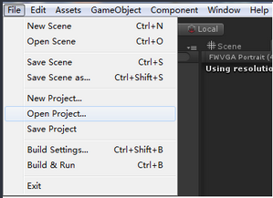
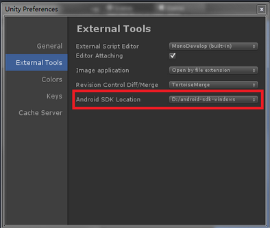

#西瓜SDK（Unity3d Android版）接入文档

****
<link rel="stylesheet" href="http://yandex.st/highlightjs/6.2/styles/googlecode.min.css">

##一、文档概述
此文档为Unity3d引擎Android游戏客户端接入文档。 
本文介绍如何在Unity3d引擎平台下，Android游戏客户端快速接入西瓜SDK。
文档分成三大部分:接入环境下载/搭建，西瓜SDK接口说明以及参考代码。逐步细述了整个接入过程；同时罗列出了4种类型的接口，
分别为：用户相关接口、充值接口、统计接口、扩展接口，便于游戏方的接入人员可以按照需求更加快速便捷的进行接入。

##二、环境搭建

###2.1 开发环境

	JDK6以上
	Android4.0.3以上

###2.2开发工具
	Unity4.6.2f1
	Android SDK

###2.3 SDK下载包

<b>渠道版SDK下载包包含： </b>
&nbsp&nbsp&nbsp&nbsp 1. 西瓜SDKV2的Jar包：xgsdk-api.jar、xgsdk-core.jar，xgsdk-data.jar，xgsdk-common-lib.jar，xgsdk-lib.jar。  
&nbsp&nbsp&nbsp&nbsp 2. 脚本文件：XGSDK2.cs、XGSDKCallback.cs、JsonDeserializer.cs、MiniJSON.cs、MiniJsonData.cs、SafetyValue.cs、XgsdkDemo.cs。 
&nbsp&nbsp&nbsp&nbsp 其中XGSDK2.cs为西瓜SDK2.0版本接口，XGSDKCallback.cs为回调方法。 
M

###2.4 接入步骤
####2.4.1.将下载的jar包全部拷贝至<项目目录>\Assets\Plugins\Android\libs，将下载的cs脚本文件全部拷贝至<项目目录>\Assets中 

注意：导入的cs脚本文件名称不可修改。

####2.4.2导入文件

打开Unity,点击File->Open Project->Open Other... ， 打开文件所在的目录，将工程导入。

####2.4.3配置SDK路径

点击Edit->Preferences，打开Unity Preferences窗口,点击External Tools，在Android SDK Location配置自己的Android SDK路径

####2.4.4.配置AndroidMainfest.xml文件 

**配置权限**

	<uses-permission android:name="android.permission.READ_PHONE_STATE" />
    <uses-permission android:name="android.permission.ACCESS_NETWORK_STATE" />
    <uses-permission android:name="android.permission.ACCESS_WIFI_STATE" />
    <uses-permission android:name="android.permission.ACCESS_FINE_LOCATION" />
    <uses-permission android:name="android.permission.CHANGE_WIFI_STATE" />
    <uses-permission android:name="android.permission.GET_TASKS" />
    <uses-permission android:name="android.permission.INTERNET" />
    <uses-permission android:name="android.permission.MOUNT_UNMOUNT_FILESYSTEMS" />
    <uses-permission android:name="android.permission.RESTART_PACKAGES" />
    <uses-permission android:name="android.permission.SYSTEM_ALERT_WINDOW" />
    <uses-permission android:name="android.permission.WRITE_EXTERNAL_STORAGE" />
    <uses-permission android:name="android.permission.INTERNET" />
    <uses-permission android:name="android.permission.READ_PHONE_STATE" />
    <uses-permission android:name="android.permission.WRITE_EXTERNAL_STORAGE" />
    <uses-permission android:name="android.permission.ACCESS_COARSE_LOCATION" />

**<application>标签中<activity>标签的属性android:name必须配置成com.xgsdk.client.unity3d.XGUnityActivity**

	<application
        android:allowBackup="true"
        android:icon="@drawable/demo_ic_launcher"
        android:label="@string/app_name"
        android:theme="@style/AppTheme" >
         <activity
            android:name="com.xgsdk.client.unity3d.XGUnityActivity"
            android:label="@string/app_name" >
            <intent-filter>
                <action android:name="android.intent.action.MAIN" />

                <category android:name="android.intent.category.LAUNCHER" />
            </intent-filter>
        </activity>
    </application>

####2.4.5 运行

首先点击Main Camera，是否关联脚本，若还未关联，则将脚本添加上去。

然后点击File->Build Setting->Player Settings，在Other Settings中，配置Bundle Identifier，设置Company Name和Product Name。

接下来点击Build Settings中Platform的Android，然后点击Switch Platform,再执行build and run，这样，demo就能在手机上运行了。

##三、接口接入

###3.1 用户相关接口

####3.1.1 初始化

西瓜SDK2.0不提供初始化接口，只提供初始化失败回调方法。

**回调方法：**

#####3.1.1.1初始化失败回调

	public void onInitFail(string json){
		Dictionary<string, object> retTable = MiniJSON.Json.Deserialize(json) as Dictionary<string, object>;
		int code = Convert.ToInt32(retTable ["code"]);
		string msg = retTable ["msg"] as String;
		Debug.Log ("InitFail,code: " + code + " message:" + msg);

	}

**回调说明：**
当游戏初始化失败时，会收到初始化失败回调。

**参数说明：**
返回的参数是一个json，解析之后会有code和msg，code是错误码，msg是初始化失败的信息。

####3.1.2 登录接口（必接）

	public static void login(string customParams)
        {
            #if UNITY_ANDROID
            callSdkApi("login", customParams);
            #endif
        }

**接口说明：**
登录时调用。

**参数说明：**
customParams参数用于扩展，接入时直接置空即可。

**回调方法:** 

#####3.1.2.1 登录成功回调：

	public void onLoginSuccess(string msg) {
		Debug.Log ("LoginSuccess, authinfo is:" + msg);
	}

**回调说明：**
登录成功之后，会收到登录成功回调。

**参数说明：**
返回的参数msg是用户登录成功后的用户信息。

#####3.1.2.2 登录取消回调：

	public void onLoginCancel(string msg){
		Debug.Log ("LoginCancel, message: " + msg);
	}

**回调说明：**
当用户取消登录之后，会受到登录取消的回调。

**参数说明：**
返回参数msg是登录取消的信息。

#####3.1.2.3 登录失败回调:

	public void onLoginFail(string json){
		Dictionary<string, object> retTable = MiniJSON.Json.Deserialize(json) as Dictionary<string, object>;
		int code = Convert.ToInt32(retTable ["code"]);
		string msg = retTable ["msg"] as String;
		Debug.Log ("LoginFail,code: " + code + " message:" + msg);
	}

**回调说明：**
登录失败后，会收到登录失败的回调。

**参数说明：**
返回的参数是一个json，解析之后会有code和msg，code是错误码，msg是登录失败的信息。

####3.1.3 登出接口（必接）
       public static void logout(string customParams)
       {
           Debug.Log("call xgsdk logout...");
           #if UNITY_ANDROID
           callSdkApi("logout", customParams);
           #endif
       }

**接口说明：**
登出时调用。

**参数说明：**
customParams参数用于扩展，接入时直接置空即可。

**回调方法：**

#####3.1.3.1 登出成功回调

	public void onLogoutSuccess(string msg){
		Debug.Log ("LogoutSuccess");
		authinfo = "";
	}

**回调说明：**
登出成功后，会收到登出成功的回调。

**参数说明：**
返回的msg无意义。

#####3.1.3.2 登出失败回调

	public void onLogoutFail(string json){
		Dictionary<string, object> retTable = MiniJSON.Json.Deserialize(json) as Dictionary<string, object>;
		int code = Convert.ToInt32(retTable ["code"]);
		string msg = retTable ["msg"] as String;
		Debug.Log ("LogoutFail,code: " + code + " message:" + msg);
	}

**回调说明：**
登出失败后，会收到登出失败的回调。

**参数说明：**
返回的参数是一个json，解析之后会有code和msg，code是错误码，msg是登出失败的信息。

####3.1.4 退出接口（必接）
		public static void exit(string customParams)
		{
			Debug.Log("call xgsdk exit...");
			#if UNITY_ANDROID
			callSdkApi("exit", customParams);
			#endif
		}

**接口说明：**
退出时调用。

**参数说明：**
customParams参数用于扩展，接入时直接置空即可。

**回调方法：**

#####3.1.4.1 直接退出回调

	public void onExit(string msg){
		Debug.Log ("Exit");
	}

**回调说明：**
直接退出时，会收到直接退出的回调。

**参数说明：**
参数msg无意义。

#####3.1.4.2 使用游戏方退出回调

	public void onNoChannelExiter(string msg){
		Debug.Log ("No ChannelExiter");
	}

**回调说明：**
使用游戏方退出时，会收到使用游戏方退出的回调。

**参数说明：**
参数msg无意义。

#####3.1.4.3 取消退出回调

	public void onExitCancel(string msg){
		Debug.Log("ExitCancel");
	}

**回调说明：**
取消退出时，会收到取消退出的回调。

**参数说明：**
参数msg无意义。

###3.2 充值接口

####3.2.1 支付接口（必接）
		public static void pay(string userid, int productTotalPirce, int productCount,
		                       int productUnitPrice,string productId,
		                       string productName,string productDesc,
		                       string currencyName,string serverId,string serverName,string zoneId, string zoneName,
		                       string roleId,string roleName,string balance,string gameOrderId, string ext, string notifyURL)
        {
            Debug.Log("call xgsdk pay...");
            #if UNITY_ANDROID
			Debug.Log("call xgsdk set messageObj..." + userid + productTotalPirce + productCount +
			          productUnitPrice + productId +
			          productName + productDesc +
			          currencyName + serverId + serverName + zoneId + zoneName +
			          roleId + roleName + balance + gameOrderId + ext + notifyURL);
			callSdkApi("pay",userid,productTotalPirce,productCount,
			           productUnitPrice,productId,
			           productName,productDesc,
			           currencyName,serverId,serverName,zoneId,zoneName,
			           roleId,roleName,balance,gameOrderId,ext,notifyURL);
            #endif
        }

或者

		public static void pay(PayInfo pay)
		{
			Debug.Log("call xgsdk pay...");
			#if UNITY_ANDROID
			Debug.Log("call xgsdk set messageObj..." + pay.UserID + pay.ProductTotalprice + pay.ProductCount +
			          pay.ProductUnitPrice + pay.ProductId +
			          pay.ProductName + pay.ProductDesc +
			          pay.CurrencyName + pay.ServerId + pay.ServerName + pay.ZoneId + pay.ZoneName +
			          pay.RoleId + pay.RoleName + pay.Balance + pay.GameOrderId + pay.Ext + pay.NotifyURL);
			callSdkApi("pay",pay.UserID, pay.ProductTotalprice, pay.ProductCount,
			           pay.ProductUnitPrice, pay.ProductId,
			           pay.ProductName, pay.ProductDesc,
			           pay.CurrencyName, pay.ServerId, pay.ServerName,pay.ZoneId, pay.ZoneName,
			           pay.RoleId, pay.RoleName, pay.Balance, pay.GameOrderId, pay.Ext, pay.NotifyURL);
			#endif
		}

**接口说明：**
支付时调用，支付接口提供两种传参方式，一种是直接将参数传给pay方法，另一种是使用XGSDK2脚本文件中的PayParameters类封装后进行传参。

**参数说明**
<table>
<tr>
<td>参数</td><td>类型</td><td>说明</td>  
</tr>
<tr>
<td>UserID</td><td>string</td><td>用户ID</td>
</tr>
<tr>
<td>productTotalprice</td><td>int</td><td>商品总价</td>
</tr>
<tr>
<td>productCount</td><td>int</td><td>商品数量</td>
</tr>
<tr>
<td>productUnitPrice</td><td>int</td><td>商品单价</td>
</tr>
<tr>
<td>productId</td><td>string</td><td>商品ID</td>
</tr>
<tr>
<td>productName</td><td>string</td><td>商品名称</td>
</tr>
<tr>
<td>productDesc</td><td>string</td><td>商品描述</td>
</tr>
<tr>
<td>currencyName</td><td>string</td><td>货币名称</td>
</tr>
<tr>
<td>serverId</td><td>string</td><td>服务器ID</td>
</tr>
<tr>
<td>serverName</td><td>string</td><td>服务器名称</td>
</tr>
<tr>
<td>zoneId</td><td>string</td><td>区ID</td>
</tr>
<tr>
<td>zoneName</td><td>string</td><td>区名称</td>
</tr>
<tr>
<td>roleId</td><td>string</td><td>角色ID</td>
</tr>
<tr>
<td>roleName</td><td>string</td><td>角色名称</td>
</tr>
<tr>
<td>balance</td><td>string</td><td>余额</td>
</tr>
<tr>
<td>gameOrderId</td><td>string</td><td>游戏订单ID</td>
</tr>
<tr>
<td>ext</td><td>string</td><td>扩展参数</td>
</tr>
<tr>
<td>notifyURL</td><td>string</td><td>西瓜服务器通知游戏方支付结果的地址，若不配，将以西瓜服务器配置为准，建议作为测试用</td>
</tr>
</table>

**回调方法：**

#####3.2.1.1 支付成功回调

	public void onPaySuccess(string msg){
		Debug.Log ("PaySuccess, message:" + msg);
	}

**回调说明：**
支付成功后，会收到支付成功的回调。

**参数说明**
返回的参数是支付成功的信息。

#####3.2.1.2 支付取消回调

	public void onPayCancel(string msg){
		Debug.Log ("PayCancel, message:" + msg);
	}

**回调说明：**
支付取消后，会收到支付取消回调。

**参数说明：**
返回的参数是支付取消的信息。

#####3.2.1.3 支付失败回调

	public void onPayFail(string json){
		Dictionary<string, object> retTable = MiniJSON.Json.Deserialize(json) as Dictionary<string, object>;
		int code = Convert.ToInt32(retTable ["code"]);
		string msg = retTable ["msg"] as String;
		Debug.Log ("PayFail,code: " + code + " message:" + msg);
	}

**回调说明：**
支付失败后，会收到支付失败的回调。

**参数说明：**
返回的参数是一个json，解析之后会有code和msg，code是错误码，msg是支付失败的信息。

###3.3 统计相关接口

####3.3.1 进入游戏（必接）

	public static void onEnterGame(string userId, string username, string roleId,
		                              string roleName, string gender, string level, string vipLevel,
		                              string balance, string partyName, string serverId, string serverName)
	{
		Debug.Log("call xgsdk enterGame...");
		#if UNITY_ANDROID
		callSdkApi("onEnterGame",userId, username, roleId,
		           roleName, gender, level, vipLevel,
		           balance, partyName, serverId, serverName);
		#endif
	}

**接口说明**
进入游戏时调用

**参数说明**

<table>
<tr>
<td>参数</td><td>类型</td><td>说明</td>  
</tr>
<tr>
<td>userId</td><td>string</td><td>用户ID</td>
</tr>
<tr>
<td>username</td><td>string</td><td>用户名</td>
</tr>
<tr>
<td>roleId</td><td>string</td><td>角色ID</td>
</tr>
<tr>
<td>roleName</td><td>string</td><td>角色名称</td>
</tr>
<tr>
<td>gender</td><td>string</td><td>性别</td>
</tr>
<tr>
<td>level</td><td>string</td><td>等级</td>
</tr>
<tr>
<td>vipLevel</td><td>string</td><td>Vip等级</td>
</tr>
<tr>
<td>balance</td><td>string</td><td>余额</td>
</tr>
<tr>
<td>partyName</td><td>string</td><td>公会名称</td>
</tr>
<tr>
<td>serverId</td><td>string</td><td>服务器ID</td>
</tr>
<tr>
<td>serverName</td><td>string</td><td>服务器名称</td>
</tr></table>

####3.3.2 创建角色

		public static void onCreateRole(RoleInfo roleInfo)
		{
			Debug.Log("call xgsdk createRole...");
			#if UNITY_ANDROID
			callSdkApi("onCreateRole", roleInfo.RoleID, roleInfo.RoleName, roleInfo.Gender,
			           roleInfo.Level, roleInfo.VipLevel, roleInfo.Balance, roleInfo.PartyName);
			#endif
		}

**接口说明：**
创建角色时调用。

**参数说明**
<table>
<tr>
<td>参数名</td><td>类型</td><td>说明</td>
</tr>
<tr>
<td>roleId</td><td>string</td><td>角色ID</td>
</tr>
<tr>
<td>eoleName</td><td>string</td><td>角色名称</td>
</tr>
<tr>
<td>gender</td><td>string</td><td>性别</td>
</tr>
<tr>
<td>level</td><td>string</td><td>等级</td>
</tr>
<tr>
<td>vipLevel</td><td>string</td><td>VIP等级</td>
</tr>
<tr>
<td>balance</td><td>string</td><td>余额</td>
</tr>
<tr>
<td>partyName</td><td>string</td><td>公会名称</td>
</tr>
</table>

####3.3.3 角色升级

		public static void onRoleLevelup(RoleInfo roleInfo)
		{
			Debug.Log("call xgsdk onRoleLevelup");
			#if UNITY_ANDROID
			callSdkApi("onRoleLevelup", roleInfo.RoleID, roleInfo.RoleName, roleInfo.Gender,
			           roleInfo.Level, roleInfo.VipLevel, roleInfo.Balance, roleInfo.PartyName);
			#endif
		}

**接口说明：**
角色升级时调用。

**参数说明**
<table>
<tr>
<td>参数名</td><td>类型</td><td>说明</td>
</tr>
<tr>
<td>roleId</td><td>string</td><td>角色ID</td>
</tr>
<tr>
<td>eoleName</td><td>string</td><td>角色名称</td>
</tr>
<tr>
<td>gender</td><td>string</td><td>性别</td>
</tr>
<tr>
<td>level</td><td>string</td><td>等级</td>
</tr>
<tr>
<td>vipLevel</td><td>string</td><td>VIP等级</td>
</tr>
<tr>
<td>balance</td><td>string</td><td>余额</td>
</tr>
<tr>
<td>partyName</td><td>string</td><td>公会名称</td>
</tr>
</table>

####3.3.4 自定义事件

		public static void onEvent(string eventID, string content)
		{
			Debug.Log("call xgsdk onEvent...");
			#if UNITY_ANDROID
			callSdkApi("onEvent",eventID, content);
			#endif
		}

**接口说明：**
传递事件时使用。

**参数说明**
<table>
<tr>
<td>参数名</td><td>类型</td><td>说明</td>
</tr>
<tr>
<td>eventID</td><td>string</td><td>事件ID</td>
</tr>
<tr>
<td>content</td><td>string</td><td>内容</td>
</tr>
</table>

###3.4 扩展接口

####3.4.1 切换账号

		public static void switchAccount()
		{
			Debug.Log("call xgsdk switchAccount...");
			#if UNITY_ANDROID
			callSdkApi("switchAccount");
			#endif
		}

**接口说明：**
切换账号时调用。

####3.4.2 访问用户中心

		public static void openUserCenter()
		{
			Debug.Log("call xgsdk openUserCenter...");
			#if UNITY_ANDROID
			callSdkApi("openUserCenter");
			#endif
		}

**接口说明：**
访问用户中心时使用。

####3.4.3 判断当前渠道是否提供该接口

		public static bool isMethodSupport(string methodName)
		{
			Debug.Log("call xgsdk isMethodSupport...");
			bool retMsg = false;
			#if UNITY_ANDROID
			using (AndroidJavaClass cls = new AndroidJavaClass(SDK_JAVA_CLASS)) {
				AndroidJavaObject instance = cls.CallStatic<AndroidJavaObject> ("getInstance");
				retMsg = instance.Call<bool>("isMethodSupport",methodName);
			}
			#endif
			return retMsg;
		}

**接口说明：**
判断当前渠道是否提供该接口时调用。

**参数说明**
<table>
<tr>
<td>参数名</td><td>类型</td><td>说明</td>
</tr>
<td>methodName</td><td>string</td><td>接口名称</td>
</table>

**返回值**
<table>
<tr>
<td>类型</td><td>说明</td>
</tr>
<tr>
<td>bool</td><td>true：支持 false：不支持</td>
</tr>
</table>

####3.4.4 获取渠道tag

		public static string getChannelId()
		{
			Debug.Log ("call sgsdk getChannelId...");
			string channel = "";
			#if UNITY_ANDROID
			channel = callRetSdkApi("getChannelId");
			#endif
			Debug.Log ("The channel tag is: " + channel);
			return channel;
		}

**接口说明：**
获取渠道tag时使用。

**返回值**
<table>
<tr>
<td>类型</td><td>说明</td>
</tr>
<tr>
<td>stirng</td><td>渠道tag</td>
</tr>
</table>

####3.4.5 提示接口

		public static void showAndroidToast(string msg)
		{
			Debug.Log("call xgsdk showAndroidToast...");
			#if UNITY_ANDROID
			callSdkApi("showAndroidToast", msg);
			#endif
		}

**接口说明：**
用于显示一个Android平台的toast提示。

**参数说明**
<table>
<tr>
<td>参数名</td><td>类型</td><td>说明</td>
</tr>
<td>msg</td><td>string</td><td>待显示的提示信息</td>
</table>

****

###文档版本说明
<table>
<tr>
<td>SDK版本</td><td>文档版本</td> <td>DK修改内容</td> <td>文档修改内容</td> <td>修改日期</td>  
</tr>
<tr>
<td>2.0 </td><td>1.0</td> <td>初版</td> <td>初版</td> <td>2015.7.29</td>
</tr>
</table>
