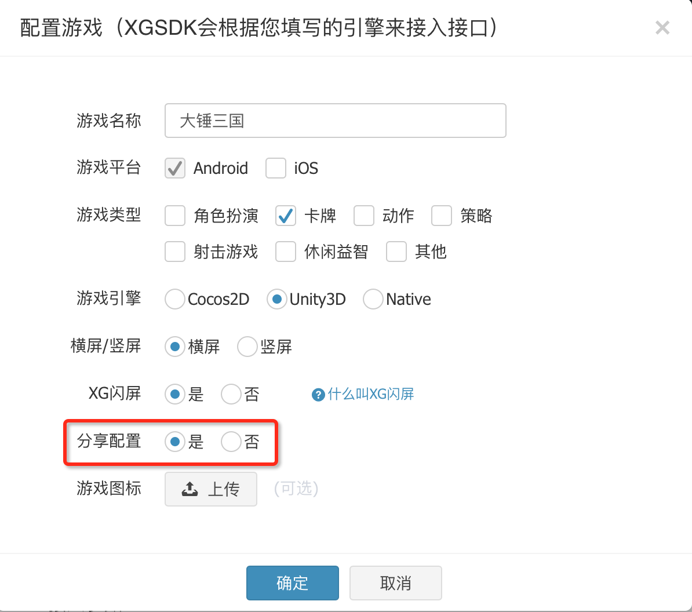

# 西瓜SDK（ShareSDK Android版）接入文档
<a id="doc"></a>
## 文档概述
此文档为ShareSDK_Android客户端接入文档。
本文介绍如何在Android台下，快速接入西瓜ShareSDK。
文档分成三大部分:

1.接入准备工作。

2.接口说明。

3.接口调试已经注意事项。
  
### 文档结构
<ol type='1'>
<li>
		<a href="#doc">接入准备工作</a>
			<ul type="disc">
				<li><a href="#SDKDownload">SDK下载包</a></li>
				<li><a href="#ShareConfig">后台配置</a></li>
			</ul>
	</li>
		<a href="#doc">接口说明</a>
			<ul type="disc">
				<li><a href="#API1">分享相册图片接口</a></li>
				<li><a href="#API2">分享本地图片</a></li>
			</ul>
	</li>
			<a href="#doc">接口调试已经注意事项</a>
			<ul type="disc">
				<li><a href="#API3">接口调试已经注意事项</a></li>
			</ul>
	</li>
</ol>

<a id="SDKDownload"></a>

### 1.1 SDK下载包
渠道版SDK下载包包含：
ShareSDK作为XGSDK的插件包，接口已经集成到了xgsdk-api中，在需要使用的时候，程序需要在程序里面先调用ShareSDK的接口.  
西瓜SDK的Jar包：xgsdk-api_2.0.3.jar
<a href = "http://console.xgsdk.com/download.html">Share SDK下载</a>

在AndroidManifest.xml添加如下代码:

```xml
    <uses-permission android:name="android.permission.INTERNET" />
    <uses-permission android:name="android.permission.ACCESS_NETWORK_STATE" />
    <uses-permission android:name="android.permission.ACCESS_WIFI_STATE" />
    <uses-permission android:name="android.permission.INTERNET" />
    <uses-permission android:name="android.permission.ACCESS_WIFI_STATE" />
    <uses-permission android:name="android.permission.ACCESS_NETWORK_STATE" />
    <uses-permission android:name="android.permission.WRITE_EXTERNAL_STORAGE" />
    <uses-permission android:name="android.permission.READ_PHONE_STATE" />  
```

### 1.2 后台配置
<a id="ShareConfig"></a>
需要在XG后台配置勾选使用分享功能,具体如下图.


### 2.1 分享相册图片
<a id="API1"></a>
接口:xgPhotoShareActivity((Activity activity, String title,
			String description, String targeturl);

参数：

1.当前活动的Activity

2.分享的标题

3.分享的描述

4.点击分享跳转的Url(只有QQ和QQ空间可以使用)

**以上参数都不能为空,而且Url必要按照格式传入，否者无法拉起分享**
			
```java
	XGSDK.getInstance().xgPhotoShareActivity(ShareActivity.this,
						"asdasd", "asdasd", "http://www.baidu.com");
```

### 2.2 分享本地图片
<a id="API2"></a>
接口:xgShareLocalImage(shareChannle,
				imagename, title, description, targeturl);
参数：
1.分享的渠道类型(目前支持的传入的渠道类型为: 
     微信好友 = "weichatfriend";
	 朋友圈 = "weichatzone";
	 新浪微博 = "weibo";
	 QQ好友 = "qq";
	 QQ空间 = "qqzone";)
	 
2.分享的本地图片名字(改图片打包前,由游戏手动放入在Android的Assets目录下面)

3.分享的标题

4.分享的描述

5.点击分享跳转的Url(只有QQ和QQ空间可以使用)

**以上参数都不能为空,而且Url必要按照格式传入，否者无法拉起分享**

```java
		XGShareController.getInstance().xgShareLocalImage("weichatfriend",
				"imagename.png", "asdasd", "asdasd", "http://www.baidu.com");
```

### 3 接口调试已经注意事项
注意微信分享和新浪微博分享，分享时候的包名和APK签名必须要和微信，新浪后台填写的一致。并且需要手机提前安装好微信和新浪微博。新浪微博客户端必须为正式版。

