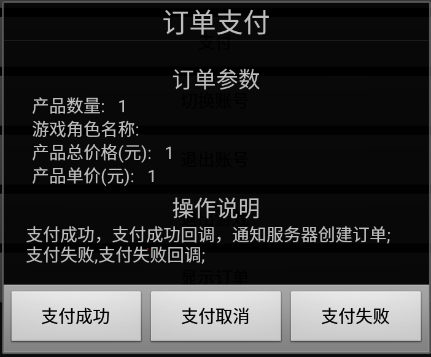
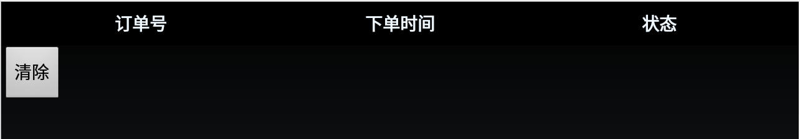
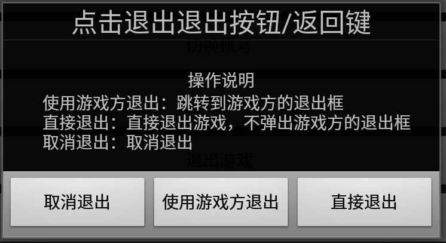
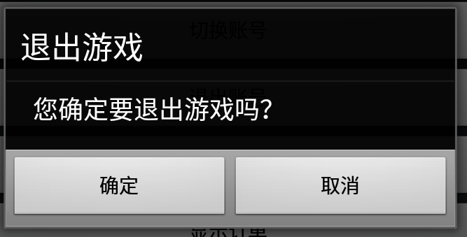

# 西瓜SDK 测试渠道说明文档

## 文档概述

此文档是游戏在接入完成后进行客户端接入验证的测试文档。  
文档分成两大部分：开发环境下载/搭建，测试渠道使用介绍。游戏开发人员在客户端接入完成后请根据本文档进行测试，用以检查游戏接入西瓜SDK的接口、接口参数是否正确以及能否正常实现登陆和充值等功能。

### 目录结构
<ul>
	<li><a href="#download">SDK下载</a></li>
	<li><a href="#deploy">配置环境</a></li>
	<li><a href="#function">测试渠道作用</a></li>
	<li><a href="#useQuickly">快速使用</a>
		<ul>
			<li><a href="#login">模拟登录</a></li>
			<li><a href="#pay">模拟支付</a></li>
			<li><a href="#showOrder">显示订单</a></li>
			<li><a href="#switchAccount">切换账号</a></li>
			<li><a href="#createOrder">创建角色</a></li>
			<li><a href="#roleLevelUp">角色升级</a></li>
			<li><a href="#exit">退出游戏</a></li>
			<li><a href="#userCenter">个人中心</a></li>
		</ul>
	</li>

</ul>

### 1.SDK 下载

**渠道版SDK下载包包含：**
1. 西瓜SDKV2的Jar包：xgsdk-core.jar，xgsdk-data.jar，xgsdk-lib.jar，xgsdk-api.jar  
2. xgsdk-demo  
3. XGSDK 原生Android版 客户端接入文档  

## 2. 配置环境

### 2.1 开发和接入所需基本环境

**Android开发环境： **

Android版本：Android2.2 以上  
Android开发工具：Android SDK和Android Eclipse

## 3. 测试渠道的作用
作用：使游戏开发商能够进入游戏界面，检查游戏接入XGSDK的接口及接口参数是否正确。

## 4. 测试渠道的使用概览
- 模拟登录
- 模拟支付
- 模拟退出
- 显示订单
- 切换账号
- 创建角色
- 角色升级
- 退出游戏
- 个人中心

## 5. 快速使用
### 测试渠道初始界面

#### 5.1 模拟登录

登录成功：记录用户名和密码，启动悬浮窗,如果没有输入用户名和密码则再次输入  

登录取消：回调登录失败方法onLogoutFail  

登录失败：取消登录，登录框消失，悬浮窗不出现  

#### 5.2 模拟支付

点击主界面的支付按钮出现商品订单界面，然后点击确认，进入支付界面

支付成功：支付成功回调，通知服务器创建订单  
支付取消：执行支付取消回调  
支付失败：支付失败回调

#### 5.4 显示订单
点击显示订单按钮，弹出具体的订单列表。  

清除按钮可以清除所有订单

#### 5.5 切换账号
点击切换账号按钮，toast会提示登出成功。

#### 5.6 创建角色
点击创建角色按钮。

#### 5.7 角色升级
点击角色升级按钮。

#### 5.8 退出游戏

取消退出：取消退出  
使用游戏方退出：跳转到游戏方的退出框  
直接退出：直接退出游戏，不弹出游戏方的退出框

点击确认退出游戏

#### 5.9 个人中心

点击悬浮窗的个人中心弹出个人中心

****

###文档版本说明
<table>
<tr>
<td>SDK版本</td><td>文档版本</td> <td>SDK修改内容</td> <td>文档修改内容</td> <td>修改日期</td>  
</tr>
<tr>
<td>2.0 </td><td>1.0</td> <td>初版</td> <td>初版</td> <td>2015.8.1</td>
</tr>
</table>
