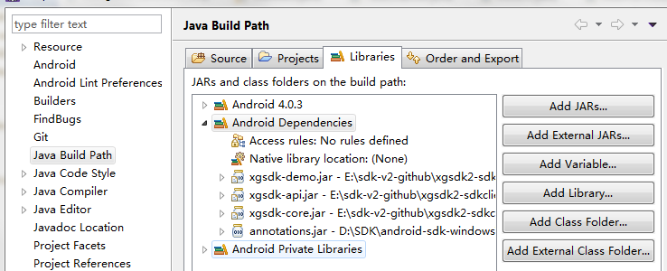

# 西瓜SDK（原生Android版 ）接入文档


<div id="category" style="display:none"></div>


## 1. 文档概述

此文档为使用原生 android 引擎游戏客户端的接入文档。  
本文介绍如何在原生引擎平台下，Android 游戏客户端快速接入西瓜SDK。
文档分成三大部分:西瓜 SDK 下载，配置环境，各个接口的接入说明和样例代码。逐步细述了整个接入过程；  
同时罗列出了4种类型的接口：分别为：**用户与角色接口、充值接口、统计接口、扩展接口** ，便于游戏方的接入人员可以按照需求更加快速便捷的进行接入。


### 1.1 SDK下载包

**渠道版 SDK 下载包包含：**
1. 西瓜 SDKV2 的 Jar 包：
 xgsdk-channel-core.jar，xgsdk-demo.jar,xgsdk-api.jar
2. xgsdk-test-1.0.zip  
3. 西瓜sdk（原生Android版)接入文档
<a href="http://doc.xgsdk.com/files/2.0/packages/native_android_demo.zip">原生SDK下载</a>

注：解压文件，导入eclipse，右键项目
 选择Properties,在右边选项中选择Java build path，在右边的Libraries导入以上提供的jar,即可运行。  
**此工程是一个demo测试项目，游戏商可以用原生游戏jar替换xgsdk.demo.jar即可。**


 注：解压文件，导入 eclipse ，右键项目
 选择 Properties ,在右边选项中选择 Java build path，在右边的 Libraries导入以上提供的jar,即可运行。  
此工程是一个 demo 测试项目，游戏商可以用原生游戏 jar 替换xgsdk.demo.jar即可。


  </img>


## 2. 配置环境与快速接入简介

### 2.1 开发和接入所需基本环境

Android 开发环境如下：  
Android 版本：Android2.2 以上  
Android 开发工具：Android SDK 和 Android Eclipse 等
### 2.2 接入步骤简介
<ol type=“1”>
<li><a href="#permission">配置 android权限 (AndroidManifest.xml文件)</a></li>
	<li><a href="#splash">增加闪屏</a></li>
	<li><a href="#lifecyle">接入生命周期接口</a></li>
    <li><a href="#userAndRole">接入用户和角色接口</a></li>
	<li><a href="#pay">接入充值接口</a></li>

	<li><a href="#statistics">接入统计接口</a></li>
	<li><a href="#extend">接入扩展接口</a></li>
</ol>

### 2.3 快速接入
<a id="permission"></a>
#### 2.3.1. 配置AndroidManifest.xml文件

```xml
<uses-permission android:name="android.permission.WRITE_EXTERNAL_STORAGE" />
<uses-permission android:name="android.permission.ACCESS_NETWORK_STATE" />
<uses-permission android:name="android.permission.READ_PHONE_STATE" />
<uses-permission android:name="android.permission.INTERNET" />
<uses-permission android:name="android.permission.GET_TASKS" />
<uses-permission android:name="android.permission.ACCESS_WIFI_STATE" />
```

<a id="splash"></a>
#### 2.3.2. 增加闪屏

1.游戏母包中AndroidManifest.xml增加 XGSplashActivity 作为启动 Activity 的声明，根据游戏朝向设定android:screenOrientation

```xml
<activity
	 android:name="com.xgsdk.client.api.splash.XGSplashActivity"
	 android:screenOrientation="portrait"
	 android:theme="@android:style/Theme.NoTitleBar.Fullscreen" >
	 <intent-filter>
		 <action android:name="android.intent.action.MAIN" />
		 <category android:name="android.intent.category.LAUNCHER" />
	 </intent-filter>
</activity>
```

2.AndroidManifest.xml中将游戏原启动 Activity 的 intent-filter 修改为

	<intent-filter>
		 <action android:name="xg.game.MAIN" />
		 <category android:name="android.intent.category.DEFAULT" />
	 </intent-filter>

<a id="lifecyle"></a>
#### 2.3.3 接入生命周期接口
在游戏各个 Activity 生命周期中调用SDK生命周期接口，样例代码如下：

```java
    @Override
    protected void onPause() {
        super.onPause();
        XGSDK.getInstance().onPause(this);
		//第一行调用父类方法，第二行调用西瓜的方法，顺序固定
		//然后再执行贵游戏的自己的代码逻辑，下面方法类同
    }

    @Override
    protected void onResume() {
        super.onResume();
        XGSDK.getInstance().onResume(this);
    }

    @Override
    protected void onStart() {
        super.onStart();
        XGSDK.getInstance().onStart(this);
    }

    @Override
    protected void onStop() {
        super.onStop();
        XGSDK.getInstance().onStop(this);
    }

    @Override
    protected void onRestart() {
        super.onRestart();
        XGSDK.getInstance().onRestart(this);
    }

	@Override
    protected void onDestroy() {
        super.onDestroy();
        XGSDK.getInstance().onDestory(this);
    }
	@Override
    protected void onNewIntent(Intent intent) {
        super.onNewIntent(intent);
        XGSDK.getInstance().onNewIntent(this, intent);
    }
	@Override
    protected void onActivityResult(int requestCode, int resultCode, Intent data) {
        super.onActivityResult(requestCode, resultCode, data);
        XGSDK.getInstance().onActivityResult(this, requestCode, resultCode,
                data);
    }

	@Override
	public void onBackPressed() {
	    super.onBackPressed();
	    XGSDK.getInstance().onBackPressed(this);
	    
	}
	@Override
	public void onConfigurationChanged(Configuration newConfig) {
	    super.onConfigurationChanged(newConfig);
	    XGSDK.getInstance().onConfigurationChanged(this, newConfig);
	}
	
    @Override
	public void onSaveInstanceState(Bundle outState,
	        PersistableBundle outPersistentState) {
	    super.onSaveInstanceState(outState, outPersistentState);
	    XGSDK.getInstance().onSaveInstanceState(this, outState);
	}
```

onCreate 生命周期方法比较特殊。  
注： setUserCallBack 在 init 之前调用，onCreate 方法执行之后，三者的顺序不能改变

```java
@Override
    protected void onCreate(Bundle savedInstanceState) {
		super.onCreate(savedInstanceState);
        XGSDK.getInstance().onCreate(this);
        XGSDK.getInstance().setUserCallBack(new UserCallBack() {})；
	}
```
XGSDK.getInstance().setUserCallBack(new UserCallBack() {})；  
以上代码的表示的意思是实现一个匿名的 UserCallBack 对象，该对象中实现了登录成功、失败、取消，登出成功、失败，初始化失败接口，<a href="#usercallback">详见这里描述</a>


<a id="userAndRole"></a>

#### 2.3.4 接入用户和角色接口
<a name="userAndRole" ></a>
##### 登录接口
```java
login(Activity activity, String customParams)
```
接口说明：用户登录接口，传入扩展参数。  
<table>
  <tr>
  <td>参数</td>
  <td>说明</td>
  </tr>
	<tr>
	<td>customParams</td>
  <td>该参数用于扩展，传输时使用json格式，接入时若不需要直接置空即可</td>
	</tr>
</table>


<a name="usercallback" ></a>  
在 UserCallBack 中实现登录 callback 接口（登录成功、失败、取消，登出成功、失败，初始化失败接口）  
例如登陆成功，游戏在此回调中实现登陆成功后的逻辑,其余的 callback 接口类似  
注：在登录成功 callback 中，调用 xgsdk 的 onEnterGame 接口  
样例代码：

		XGSDK.getInstance().setUserCallBack(new UserCallBack() {

            @Override
            public void onLogoutSuccess(String msg) {
                ToastUtil.showToast(MainActivity.this, "logout success." + msg);

            }

            @Override
            public void onLogoutFail(int code, String msg) {
                ToastUtil.showToast(MainActivity.this, "logout fail." + code
                        + " " + msg);

            }

            @Override
            public void onLoginSuccess(final String authInfo) {
                Log.w(TAG, "authInfo: \n" + authInfo);
                 XGSDK.getInstance().onEnterGame(
                                        MainActivity.this, mUser, mRoleInfo,
                                        mServerInfo);
            }

            @Override
            public void onLoginFail(int code, String msg) {
                ToastUtil.showToast(MainActivity.this, "login fail." + code
                        + " " + msg);

            }

            @Override
            public void onInitFail(int code, String msg) {
                ToastUtil.showToast(MainActivity.this, "init fail." + code
                        + " " + msg);

            }

            @Override
            public void onLoginCancel(String msg) {
                ToastUtil.showToast(MainActivity.this, "login cancel." + msg);

            }
        });

##### 登出接口
logout(Activity activity, String customParams)

接口说明：用户登出接口，登出传入扩展参数 customParams
<table>
<tr>
<td>参数</td>
<td>说明</td>
</tr>
  <tr>
  <td>customParams</td>
  <td>该参数用于扩展，传输时使用json格式，接入时若不需要直接置空即可</td>
  </tr>
</table>

注：登出回调接口（onLogoutFail，onLogoutSuccess）要在 UserCallBack 中实现

##### 退出接口
exit(Activity activity, ExitCallBack exitCallBack,String customParams)

接口说明：用户退出接口，传入 exitCallback 和扩展参数 customParams
<table>
<tr>
<td>参数</td>
<td>说明</td>
</tr>
  <tr>
  <td>exitCallBack</td>
  <td>退出回调</td>
  </tr>
  <tr>
  <td>customParams</td>
  <td>该参数用于扩展，传输时使用 json 格式，接入时若不需要直接置空即可</td>
  </tr>
  </table>

调用案例代码：

	findViewById(RUtil.getId(getApplicationContext(), "xg_exit"))
                .setOnClickListener(new OnClickListener() {

                    @Override
                    public void onClick(View v) {
                        XGSDK.getInstance().exit(MainActivity.this,
                                new ExitCallBack() {}，null)}}）；


##### 退出接口回调
在退出接口 exit 有 exitCallBack 参数，需要实现该接口的各个回调方法  
三个回调方法：  
1. onNoChannelExiter 使用游戏方退出框
2. onExit 直接退出
3. onCancel 取消退出

样例代码：

	new ExitCallBack() {

            @Override
            public void onNoChannelExiter() {
                Dialog dialog = new AlertDialog.Builder(
                        MainActivity.this) ).create();
                      //调用游戏方退出框
                dialog.show();

            }

            @Override
            public void onExit() {
                finish();

            }

            @Override
            public void onCancel() {
                ToastUtil.showToast(MainActivity.this,
                        "回到游戏");

            }
     }

##### 释放资源接口
void releaseResource(Activity activity, String customParams);
接口说明：用户退出游戏是释放资源接口，传入 扩展参数 customParams
<table>
<tr>
<td>参数</td>
<td>说明</td>
</tr> 
  <tr>
  <td>customParams</td>
  <td>该参数用于扩展，传输时使用 json 格式，接入时若不需要直接置空即可</td>
  </tr>
</table>
调用案例代码：与退出接口类似

##### 进入游戏接口

onEnterGame(RoleInfo roleInfo)


<table>
<tr>
<td>参数</td>
<td>说明</td>
</tr>
<tr>
<td>RoleInfo</td>
<td>角色信息</td>
</tr>
</table>  

注：此接口在调用登录成功 callback 的时候调用
调用案例代码：

	@Override
    public void onLoginSuccess(final String authInfo) {
        Log.w(TAG, "authInfo: \n" + authInfo);
         XGSDK.getInstance().onEnterGame(mRoleInfo);
    }


**关于 RoleInfo 的成员说明**
<table>
<tr>
	<th>输入参数</th>
	<th>数据类型</th>
	<th>说明</th>
	<th>参数说明</th>
</tr>
<tr>
	<td>uid</td>
	<td>String</td>
	<td>用户ID</td>
	<td>用户ID</td>
</tr>
<tr>
	<td>roleId</td>
	<td>string</td>
	<td>角色ID</td>
	<td>角色ID</td>
</tr>
<tr>
	<td>roleType</td>
	<td>string</td>
	<td>角色类型</td>
	<td>角色类型</td>
</tr>
<tr>
	<td>roleName</td>
	<td>string</td>
	<td>角色名称</td>
	<td>角色名称</td>
</tr>
<tr>
	<td>roleLevel</td>
	<td>String</td>
	<td>角色等级</td>
	<td>角色等级</td>
</tr>

<tr>
	<td>roleVipLevel</td>
	<td>String</td>
	<td>vip角色等级</td>
	<td>vip角色等级</td>
</tr>
<tr>
	<td>serverId</td>
	<td>string</td>
	<td>服务器ID</td>
	<td>服务器ID</td>
</tr>
<tr>
	<td>serverName</td>
	<td>string</td>
	<td>服务器名称</td>
	<td>服务器名称</td>
</tr>
<tr>
	<td>zoneId</td>
	<td>string</td>
	<td>区ID</td>
	<td>区ID</td>
</tr>
<tr>
	<td>zoneName</td>
	<td>string</td>
	<td>区名称</td>
	<td>区名称</td>
</tr>
<tr>
	<td>partyName</td>
	<td>string</td>
	<td>工会名</td>
	<td>工会名</td>
</tr>
<tr>
	<td>gender</td>
	<td>string</td>
	<td>性别</td>
	<td>性别</td>
</tr>
</table>


##### 创建角色接口
onCreateRole(RoleInfo roleInfo)

接口说明：使用 roleInfo 来创建角色  

<table>
<tr>
<td>参数</td>
<td>说明</td>
</tr>
<tr>
<td>roleInfo</td>
<td>角色信息</td>
</tr>
</table>

调用案例代码

	findViewById(RUtil.getId(getApplicationContext(), "xg_create_role"))
                .setOnClickListener(new OnClickListener() {
                    @Override
                    public void onClick(View v) {
                        mRoleInfo.setRoleId("1112");
                        mRoleInfo.setRoleName("cuizi");
                        XGSDK.getInstance().onCreateRole(MainActivity.this,
                                mRoleInfo);
                    }
                });

##### 角色等级接口
onRoleLevelup(RoleInfo roleInfo)

接口说明：角色等级接口，角色等级提升时调用
<table>
<tr>
  <td>参数</td>
  <td>说明</td>  
</tr>
<tr>
  <td>roleInfo</td>
  <td>角色信息</td>
</tr>
</table>


调用案例代码

	findViewById(RUtil.getId(getApplicationContext(), "xg_role_levelup"))
                .setOnClickListener(new OnClickListener() {

                    @Override
                    public void onClick(View v) {
                        mRoleInfo.setRoleId("1112");
                        mRoleInfo.setLevel(2);
                        XGSDK.getInstance().onRoleLevelup(mRoleInfo);
                    }
                });


<a id="pay"></a>
#### 2.3.5 接入充值接口（必接）
##### 支付接口
pay(final Activity activity, PayInfo payInfo,PayCallBack payCallBack)

接口说明：充值接口  
<table>
<tr>
<td>参数</td>
<td>说明</td>
</tr>
<tr>
<td>payInfo</td>
<td>支付信息对象，包含产品ID、名称和数量等</td>
</tr>
<tr>
<td>paycallback</td>
<td>支付回调</td>
</tr>
</table>

调用案例代码：

	//payInfo 初始化
	.......
	payment.setTotalPrice(totalPrice);
    payment.setProductUnitPrice(1);
    XGSDK.getInstance().pay(MainActivity.this, payment,
            new PayCallBack() {})

#### 支付场景
某个初级玩家，碰到了商品打折优惠，买100个元宝（价值50元）可享受8折优惠，这样其实他是用40元买了100个元宝，那么他的支付清单是：  
<table>
<tr>
<td>商品id</td>
<td>11111 </td>
</tr>
<tr>
<td>产品名称</td>
<td>100个元宝 </td>
</tr>
<tr>
<td>产品描述</td>
<td>100个元宝 </td>
</tr>
<tr>
<td>商品单位</td>
<td>元宝 </td>
</tr>
<tr>
<td>产品打折后价格</td>
<td>100 </td>
</tr>
<tr>
<td>产品打折前价格</td>
<td>100 </td>
</tr>
<tr>
<td>产品单价</td>
<td>50 </td>
</tr>
<tr>
<td>产品总量</td>
<td>1 </td>
</tr>
</table>


**关于 PayInfo 的成员说明**

<table>
<tr>
	<th>输入参数</th>
	<th>数据类型</th>
	<th>说明</th>
	<th>参数说明</th>
</tr>
<tr>
	<td>uid</td>
	<td>String</td>
	<td>用户ID</td>
	<td>用户ID</td>
</tr>
<tr>
	<td>productId</td>
	<td>String</td>
	<td>产品ID</td>
	<td>产品ID</td>
</tr>
<tr>
	<td>productName</td>
	<td>String</td>
	<td>产品名称</td>
	<td>N</td>
</tr>
<tr>
	<td>productDesc</td>
	<td>String</td>
	<td>产品描述</td>
	<td>N</td>
</tr>
<tr>
	<td>productUnit</td>
	<td>String</td>
	<td>商品单位</td>
	<td>商品单位</td>
</tr>
<tr>
	<td>productUnitPrice</td>
	<td>int</td>
	<td>产品单价,单位分</td>
	<td>产品单价,单位分</td>
</tr>
<tr>
	<td>productQuantity</td>
	<td>int</td>
	<td>产品数量</td>
	<td>产品数量</td>
</tr>
<tr>
	<td>totalAmount</td>
	<td>int</td>
	<td>产品总额,单位分</td>
	<td>产品总额,单位分</td>
</tr>
<tr>
	<td>payAmount</td>
	<td>int</td>
	<td>付费总额</td>
	<td>付费总额</td>
</tr>
<tr>
	<td>currencyName</td>
	<td>String</td>
	<td>实际支付的国际标准货币代码,比如CNY(人民币)/USD(美元)</td>
	<td>实际支付的国际标准货币代码,比如CNY(人民币)/USD(美元)</td>
</tr>
<tr>
	<td>roleId</td>
	<td>String</td>
	<td>角色ID</td>
	<td>角色ID</td>
</tr>
<tr>
	<td>roleName</td>
	<td>String</td>
	<td>角色名称</td>
	<td>角色名称</td>
</tr>
<tr>
	<td>roleLevel</td>
	<td>int</td>
	<td>角色等级</td>
	<td>角色等级</td>
</tr>
<tr>
	<td>roleVipLevel</td>
	<td>String</td>
	<td>角色vip等级</td>
	<td>角色vip等级</td>
</tr>
<tr>
	<td>serverId</td>
	<td>String</td>
	<td>服ID</td>
	<td>服ID</td>
</tr>
<tr>
	<td>zoneId</td>
	<td>String</td>
	<td>区ID</td>
	<td>区ID</td>
</tr>
<tr>
	<td>partyName</td>
	<td>String</td>
	<td>帮会名称</td>
	<td>帮会名称</td>
</tr>
<tr>
	<td>virtualCurrencyBalance</td>
	<td>String</td>
	<td>虚拟货币余额</td>
	<td>虚拟货币余额</td>
</tr>
<tr>
	<td>customInfo</td>
	<td>String</td>
	<td>扩展字段，订单支付成功后，透传给游戏</td>
	<td>扩展字段，订单支付成功后，透传给游戏</td>
</tr>
<tr>
	<td>gameTradeNo</td>
	<td>String</td>
	<td>游戏订单ID，支付成功后，透传给游戏</td>
	<td>游戏订单ID，支付成功后，透传给游戏</td>
</tr>
<tr>
	<td>gameCallbackUrl</td>
	<td>String</td>
	<td>支付回调地址，如果为空，则后台配置的回调地址</td>
	<td>支付回调地址，如果为空，则后台配置的回调地址</td>
</tr>
<tr>
	<td>additionalParams</td>
	<td>String</td>
	<td>扩展参数</td>
	<td>扩展参数</td>
</tr>
</table>


#### 常用的国际货币


<table>
<tr>
	<th>国家</th>
	<th>货币中文名</th>
	<th>货币英文名</th>
	<th>货币代码</th>
</tr>
<tr>
	<td>中国</td>
	<td>人民币元</td>
	<td>RenminbiYuan</td>
	<td>CNY</td>
</tr>
<tr>
	<td>韩国</td>
	<td>韩圆</td>
	<td>Korean Won</td>
	<td>KRW</td>
</tr>
<tr>
	<td>日本</td>
	<td>日元</td>
	<td>Japanese Yen</td>
	<td>JPY</td>
</tr>
<tr>
	<td>美国</td>
	<td>美元</td>
	<td>U.S.Dollar</td>
	<td>USD</td>
</tr>
</table>


##### 支付回调接口
在调用 pay 接口时，需要实现 pay 支付 callback (支付的四种状态：支付成功，支付失败，支付取消,支付其他状态）

实现的案例代码

 	XGSDK.getInstance().pay(MainActivity.this, payment, new PayCallBack() {

			@Override
			public void onPaySuccess(PayInfo payInfo,PayResult payResult) {
				ToastUtil.showToastLong(MainActivity.this, "pay success, result is "+payResult.toJson());
				OrderUtils.storeOrder(MainActivity.this, GameInfo.getInstance().getUid(),payResult.getXgTradeNo(),payment);
			}

			@Override
			public void onPayFail(PayInfo payInfo,PayResult payResult) {
				ToastUtil.showToastLong(MainActivity.this, "pay failed, result is "+payResult.toJson());
			}

			@Override
			public void onPayCancel(PayInfo payInfo,PayResult payResult) {
				ToastUtil.showToastLong(MainActivity.this, "pay canceled, result is "+payResult.toJson());
			}

			@Override
			public void onPayOthers(PayInfo payInfo, PayResult payResult) {
				ToastUtil.showToastLong(MainActivity.this, "onPayOthers, result is "+payResult.toJson());
			}

			@Override
			public void onPayProgress(PayInfo payInfo, PayResult payResult) {
				ToastUtil.showToastLong(MainActivity.this, "onPayProgress, result is "+payResult.toJson());
			}
		});

<a id="statistics"></a>
##### 2.3.6 接入统计接口

##### 自定义事件接口
public void onEvent(RoleInfo roleInfo, String eventId, String eventDesc, int eventVal, Map<String, Object> eventBody)

接口说明：自定义事件，传入事件id以及事件内容  
<table>
<tr>
<td>参数</td>
<td>说明</td>
</tr>
<tr>
	<td>roleInfo</td>
	<td>角色信息</td>
</tr>
<tr>
	<td>eventId</td>
	<td>事件id</td>
</tr>
<tr>
	<td>eventDesc</td>
	<td>事件描述</td>
</tr>
<tr>
	<td>eventVal</td>
	<td>事件内容</td>
</tr>
<tr>
	<td>eventBody</td>
	<td>key-value 事件体</td>
</tr>
</table>

##### 任务开始接口

public void onMissionBegin(RoleInfo roleInfo, String missionId, String missionName, String customParams)  

接口说明：任务开始接口  
<table>
<tr>
<td>参数</td>
<td>说明</td>
</tr>
	<tr>
		<td>roleInfo</td>
		<td>对象信息</td>
	</tr>
	<tr>
		<td>missionId</td>
		<td>任务ID</td>
	</tr>
	<tr>
		<td>missionName</td>
		<td>任务名称</td>
	</tr>
	<tr>
		<td>customParams</td>
		<td>该参数用于扩展，传输时使用json格式，接入时若不需要直接置空即可</td>
	</tr>
</table>


##### 任务执行成功接口
public void onMissionSuccess(RoleInfo roleInfo, String missionId, String missionName, String customParams)

接口说明：任务执行成功接口  
<table>
<tr>
<td>参数</td>
<td>说明</td>
</tr>
	<tr>
		<td>roleInfo</td>
		<td>对象信息</td>
	</tr>
	<tr>
		<td>missionId</td>
		<td>任务ID</td>
	</tr>
	<tr>
		<td>missionName</td>
		<td>任务名称</td>
	</tr>
	<tr>
		<td>customParams</td>
		<td>该参数用于扩展，传输时使用json格式，接入时若不需要直接置空即可</td>
	</tr>
</table>


##### 任务失败接口
public void onMissionFail(RoleInfo roleInfo, String missionId, String missionName, String customParams)

接口说明：任务失败  
<table>
<tr>
<td>参数</td>
<td>说明</td>
</tr>
	<tr>
		<td>roleInfo</td>
		<td>对象信息</td>
	</tr>
	<tr>
		<td>missionId</td>
		<td>任务ID</td>
	</tr>
	<tr>
		<td>missionName</td>
		<td>任务名称</td>
	</tr>
	<tr>
		<td>customParams</td>
		<td>该参数用于扩展，传输时使用json格式，接入时若不需要直接置空即可</td>
	</tr>
</table>


##### 充值获得的虚拟货币
public void onVirtalCurrencyPurchase(RoleInfo roleInfo, int amount, String customParams)

接口说明：充值获得的虚拟货币  
<table>
<tr>
<td>参数</td>
<td>说明</td>
</tr>
	<tr>
		<td>roleInfo</td>
		<td>对象信息</td>
	</tr>
	<tr>
		<td>amount</td>
		<td>数量</td>
	</tr>
	<tr>
		<td>customParams</td>
		<td>扩展参数</td>
	</tr>
  </table>


##### 赠送的虚拟货币
public void onVirtualCurrencyReward(RoleInfo roleInfo, String reason, int amount, String customParams)

接口说明：玩家可以在任务奖励、登录奖励、成就奖励等环节获得赠送的虚拟货币  
<table>
<tr>
<td>参数</td>
<td>说明</td>
</tr>
	<tr>
		<td>roleInfo</td>
		<td>对象信息</td>
	</tr>
	<tr>
		<td>reason</td>
		<td>获得虚拟货币的原因(登录奖励、新手礼包等)</td>
	</tr>
	<tr>
		<td>amount</td>
		<td>数量</td>
	</tr>
	<tr>
		<td>customParams</td>
		<td>扩展参数</td>
	</tr>
</table>


##### 跟踪虚拟货币的消费
public void onVirtalCurrencyConsume(RoleInfo roleInfo,String itemName, int amount, String customParams)  

接口说明：建议只跟踪有价值的虚拟货币，普通游戏币的消耗不建议在此跟踪  
<table>
<tr>
<td>参数</td>
<td>说明</td>
</tr>
	<tr>
		<td>roleInfo</td>
		<td>对象信息</td>
	</tr>
	<tr>
		<td>itemName</td>
		<td>消费点(比如十连抽、购买体力等)</td>
	</tr>
	<tr>
		<td>amount</td>
		<td>数量</td>
	</tr>
	<tr>
		<td>customParams</td>
		<td>扩展参数</td>
	</tr>
</table>


<a id="extend"></a>

#### 2.3.6 接入扩展接口
##### 切换账号接口
switchAccount(Activity activity, String customParams)
接口说明：切换账号，传入扩展参数 customParams  
<table>
<tr>
<td>参数</td>
<td>说明</td>
</tr>
	<tr>
		<td>customParams</td>
		<td>该参数用于扩展，传输时使用 json 格式，接入时若不需要直接置空即可</td>
	</tr>
</table>


****

###文档版本说明
<table>
<tr>
<td>SDK 版本</td><td>文档版本</td> <td>SDK 修改内容</td> <td>文档修改内容</td> <td>修改日期</td>  
</tr>
<tr>
<td>2.0 </td><td>1.0</td> <td>初版</td> <td>初版</td> <td>2015.8.1</td>
</tr>
</table>
