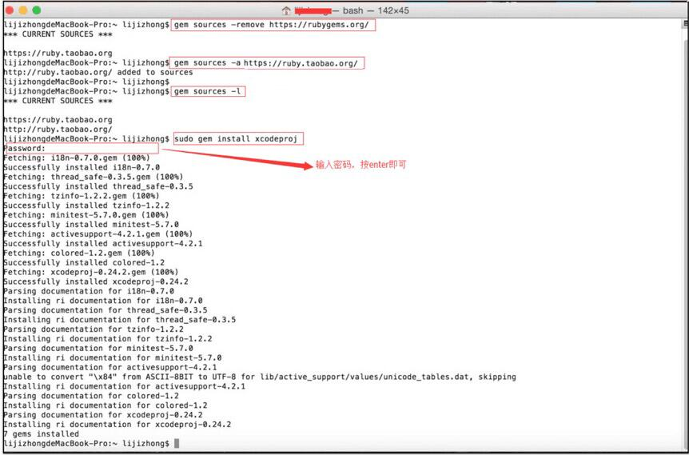

# 打包工具iOS版使用指南

打包工具是一个轻量级的出包工具，只需几秒即可完成资源注入。支持“界面版”和“命令行模式”，游戏可根据自己的实际情况选择。其中：

- 界面版，支持自动更新，适合多渠道同时打包，适合接入多个越狱渠道的情况。(***界面版还在测试中，敬请期待...***)

- 命令行模式，适合仅接入iOS正版的情况。更加轻量，直接双击脚本即可运行。游戏也方便集成到自己的ci中进行管理。

**基本原理**：以游戏指定的target为基础，先复制一个copy_target，再将xgsdk的所有资源（包括库，bundle，脚本，编译选项）注入到copy_target。 原来的target不会做任何修改，游戏最终需切换到copy_target，并从copy_target打包。

## 1. 配置运行环境  

通过命令行方式，配置mac机器的打包环境，步骤如下：

- 
移除旧资源

<code>gem sources –-remove https://rubygems.org/</code>

- 等有反应之后再敲入以下命令(注意：由于淘宝镜向，近期基于http的服务停止，若安装提示“Unable to download data from http://ruby.taobao.org/ - bad response”，则需要切换到https才行.) 
<code>gem sources -a https://ruby.taobao.org/</code>

- 
用以下命令查看

 <code>gem sources -l</code>
- 
出现下面文字才表明上面的命令是成功的

<code>\*\*\* CURRENT SOURCES \*\*\*  
https://ruby.taobao.org/ </code> （注意，这里必须是 https://ruby.taobao.org才对！！！！）
- 
安装xcodeproj库

<code>sudo gem install xcodeproj</code>

等待安装完成。（***注:这一步会下载大量资源，需要耐心等待***）

整个执行过程如下图： 

## 2. 命令行打包
 
视频链接：<http://pan.baidu.com/s/1qWCbkNa>
### 使用方法：

- 将xgsdk提供的zip包解压，得到xg_package资源目录。将其拷贝到本机的xcode工程目录。

- 将config.yaml使用文本编辑工具打开，修改里面的target名称（具体修改项，参考文件内的注释）。

- 双击command文件。

- 结束。

目录结构如下图：

执行过程如下图：

### 最终效果:

每个target都是在原始的target复制过来（如游戏的原来的target是ios-bi-demo），然后注入了xgsdk的资源,生成新的target（如下图中的xg_ios_jinshanApple）。因此，原来的target仍然是独立的,打包工具不会修改原来target的任何配置。
游戏需使用新的target进行出包.

### 文档版本说明
<table>
<tr>
<td>SDK版本</td><td>文档版本</td> <td>SDK修改内容</td> <td>文档修改内容</td> <td>修改日期</td>  
</tr>
<tr>
<td>2.0 </td><td>1.0</td> <td>初版</td> <td>初版</td> <td>2015.10.28</td>
</tr>
</table>
