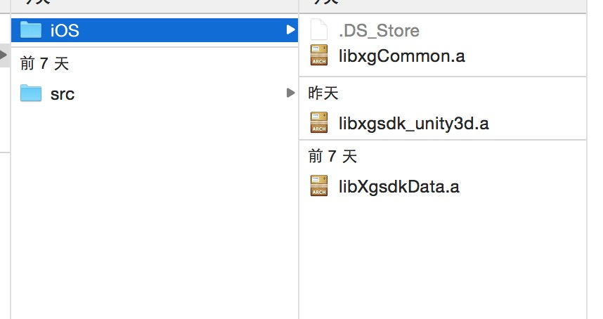
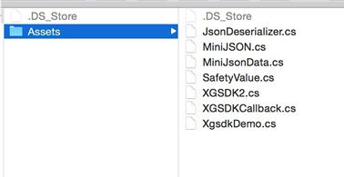
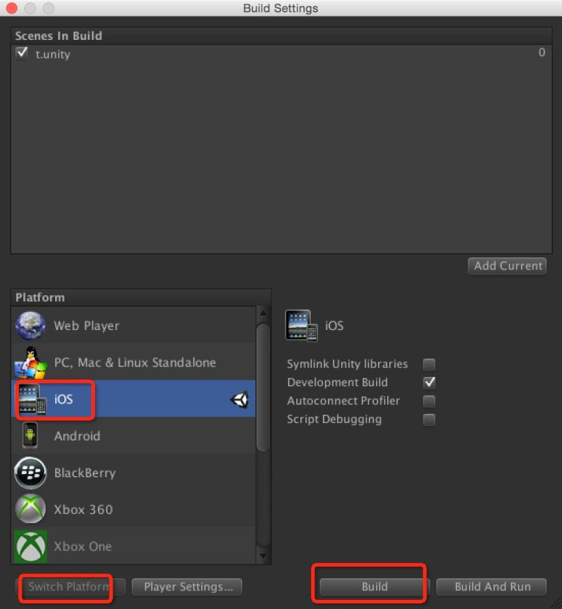

# 西瓜SDK（Unity3d iOS版）接入文档

## 1. 文档概述
此文档为 Unity3d 引擎 iOS 游戏客户端接入文档。  
本文介绍如何在 Unity3d 引擎平台下，iOS 游戏客户端快速接入西瓜 SDK。
文档分成三大部分:接入环境下载/搭建，西瓜SDK接口说明以及参考代码。逐步细述了整个接入过程；同时罗列出了4种类型的接口，
分别为：用户相关接口、充值接口、统计接口、扩展接口，便于游戏方的接入人员可以按照需求更加快速便捷的进行接入。  
**注意：Android 和 iOS 的接口一致，其中：  
    public static void onEnterGame(RoleInfo roleInfo)接口在iOS中必须调用。**

### 1.1 文档结构

<ol type = '1'>
	<li>
		<a href = "docSummary">文档概述</a>
			<ul type = "disc">
				<li><a href="#docStructure">文档结构</a></li>
			</ul>
	</li>
	<li>
		<a href = "#configure">环境搭建</a>
			<ul type = "disc">
				<li><a href = "#tools">开发工具</a></li>
				<li><a href = "#SDKDownload">SDK下载</a></li>
				<li><a href = "#steps">接入步骤</a></li>
			</ul>
	</li>
	<li>
		<a href = "../section2/Unity3d.html#SDKIn">接口接入</a>
			<ul type = "disc">
				<li><a href = "../section2/Unity3d.html#user&roleInterface">用户及角色相关接口</a>
					<ul type = "circle">
						<li><a href = "../section2/Unity3d.html#init">初始化接口</a></li>
						<li><a href = "../section2/Unity3d.html#login">登录接口</a></li>
						<li><a href = "../section2/Unity3d.html#logout">登出接口</a></li>
						<li><a href = "../section2/Unity3d.html#exit">退出接口</a></li>

					</ul>
				</li>
				<li><a href = "../section2/Unity3d.html#rechargeInterface">充值接口</a>
					<ul type = "circle">
						<li><a href = "../section2/Unity3d.html#pay">支付接口</a></li>
					</ul>
				</li>
				<li><a href = "../section2/Unity3d.html#statisticsInterface">统计接口</a>
					<ul type = "circle">
						<li><a href = "../section2/Unity3d.html#missionBegin">任务开始</a></li>
						<li><a href = "../section2/Unity3d.html#missionSuccess">任务成功</a></li>
						<li><a href = "../section2/Unity3d.html#missionFail">任务失败</a></li>
						<li><a href = "../section2/Unity3d.html#onVirtalCurrencyPurchase">统计充值获得的虚拟货币</a></li>
						<li><a href = "../section2/Unity3d.html#onVirtualCurrencyReward">统计赠送的虚拟货币</a></li>
						<li><a href = "../section2/Unity3d.html#onVirtalCurrencyConsume">统计跟踪虚拟货币的消费</a></li>
					</ul>
				</li>
				<li><a href = "../section2/Unity3d.html#extraInterface">扩展接口</a>
					<ul type = "circle">
						<li><a href = "../section2/Unity3d.html#enterGame">进入游戏</a></li>
						<li><a href = "../section2/Unity3d.html#createRole">创建角色</a></li>
						<li><a href = "../section2/Unity3d.html#roleLevelUp">角色升级</a></li>
						<li><a href = "../section2/Unity3d.html#onEvent">自定义事件</a></li>
						<li><a href = "../section2/Unity3d.htmlswitchAccount">切换账号</a></li>
						<li><a href = "../section2/Unity3d.htmlgetChannelId">获取渠道ID</a></li>
					</ul>
				</li>
			</ul>
	</li>
	<li><a href = "../section2/error.md">错误码</a></li>
</ol>

## 2. 环境搭建

### 2.1开发工具
开发工具：  
Unity4.6.2f1

### 2.2 SDK下载包

<a href = "http://console.xgsdk.com/download.html">iOS_Unity3D SDK下载</a>  
**SDK包中有两个文件夹iOS和src。**  
目录说明：  
iOS：接入依赖的iOS库  
src：接入依赖的源码  

### 2.3 接入步骤
2.3.1 将iOS目录中的内容拷贝到<项目目录>\Assets\Plugins\iOS下（若没有Plugins目录或者iOS目录则创建一个）； 
***注意：libxgCommon.a, libxgsdk_unity3d.a, libXgsdkData.a 这三个库文件会在每次unity导出xcode工程的时候自动注入到xcode工程。这三个库是xg的公共库文件，后续如果更新，请直接在此替换。  其他sdk相关的库将由xg打包工具注入，该文件夹请勿放置任何sdk相关的库。否则，由于库引用顺序的原因，导致打包工具注入的sdk库无法生效。***

**2.3.2 将src目录中的cs脚本文件全部拷贝至<项目目录>\Assets中；**

**src文件功能说明：**  

- JsonDeserializer.cs--工具类  
- MiniJSON.cs        --工具类  
- MiniJsonData.cs    --工具类  
- SafetyValue.cs     --工具类  
- XGSDK2.cs          --主动调用类  
- XGSDKCallback.cs   --回调类  
- XgsdkDemo.cs       --demo界面  

**注意：导入的cs脚本文件名称不可修改。**  

**2.3.3 参考Xgsdkdemo.CS，XGSDKCallback.cs 进行接入。**

**2.3.4 运行测试**  
- 首先点击Main Camera，确认是否关联脚本，若还未关联，则将脚本添加上去；  
- 然后点击File->Build Setting->Player Settings，在Other Settings中，配置Bundle Identifier，设置Company Name和Product Name；  
- 接下来点击Build Settings中Platform的iOS，然后点击Switch Platform,再执行build and run，这样，Unity工程就能在iPhone手机上运行了。

## 3.接口接入（iOS 与 Android 接口一致）

**注意：public static void onEnterGame(RoleInfo roleInfo)接口在iOS中必须调用。**

**<a href="../section2/Unity3d.html#SDKIn">跳转查看接口说明</a>**

---

### 文档版本说明
<table>
<tr>
<td>SDK版本</td><td>文档版本</td> <td>SDK修改内容</td> <td>文档修改内容</td> <td>修改日期</td>  
</tr>
<tr>
<td>2.0 </td><td>1.0</td> <td>初版</td> <td>初版</td> <td>2015.7.30</td>
</tr>
</table>
