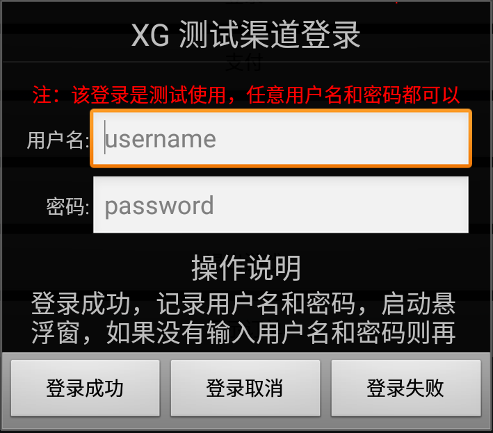
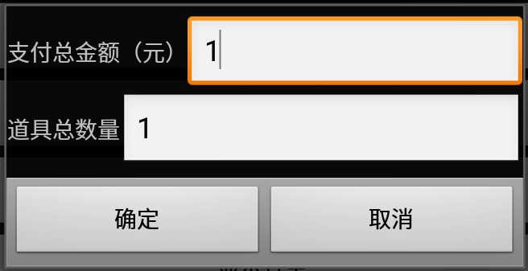
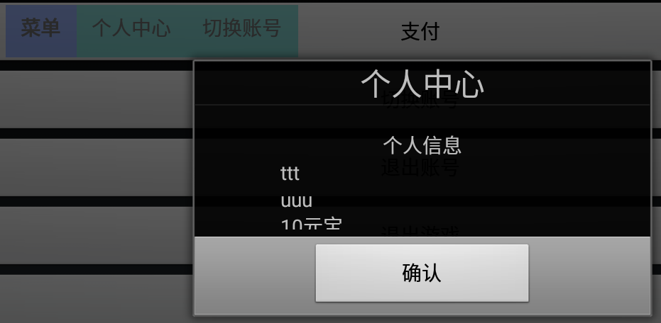

#XGSDK 测试渠道使用说明文档

****
<link rel="stylesheet" href="http://yandex.st/highlightjs/6.2/styles/googlecode.min.css" />

****

<!--
###文档信息
	文档名：原生Android版 客户端接入文档
	作者：周海兵
	SDK版本：2.0
	文档版本：1.0
	日期：2015.8.1
-->

###文档版本说明

<table>
<tr>
<td>SDK版本</td><td>文档版本</td> <td>SDK修改内容</td> <td>文档修改内容</td> <td>修改日期</td>  
</tr>
<tr>
<td>2.0 </td><td>1.0</td> <td>初版</td> <td>初版</td> <td>2015.8.1</td>
</tr>
</table>

****

##1. 西山居渠道版SDK概述

	此文档为使用原生android引擎游戏客户端的接入文档。详细说明了接入渠道版SDK需要的资料和开发步骤

###1.1 SDK下载包
	渠道版SDK下载包包含：
	1. 西瓜SDKV2的Jar包：xgsdk-core.jar，xgsdk-data.jar，xgsdk-lib.jar，xgsdk-api.jar
	2. xgsdk-demo
	3. XGSDK 原生Android版 客户端接入文档

##2. 配置环境

###2.1 开发和接入所需基本环境
Android开发环境：

	Android版本：Android2.2 以上
	Android开发工具：Android SDK和Android Eclipse等

##3. 测试渠道的作用
	1.检查游戏接入XGSDK的接口及接口参数是否正确
	2.使CP能进入游戏

##4. 测试渠道的使用概览
	1.模拟登入
	2.模拟支付
	3.模拟退出
	4.用户中心
	5.切换账号
##5. 快速使用
###测试渠道初始界面：

 

####5.1 模拟登入

 

登录成功：记录用户名和密码，启动悬浮窗,如果没有输入用户名和密码则再次输入
 

登录取消：回调登录失败方法onLogoutFail
 

登录失败：取消登录，登录框消失，悬浮窗不出现

####5.2 模拟支付

点击主界面的支付按钮出现商品订单界面，然后点击确认，进入支付界面

支付成功：支付成功回调，通知服务器创建订单
 

支付取消：执行支付取消回调
 

支付失败：支付失败回调

####5.3 模拟退出

取消退出：取消退出
 

使用游戏方退出：跳转到游戏方的退出框
 

直接退出：直接退出游戏，不弹出游戏方的退出框

点击确认退出游戏。

####5.4 用户中心#

点击悬浮窗的个人中心弹出个人中心

####5.5 切换账号

点击悬浮窗的切换账号，进入模拟登入的登入界面。
