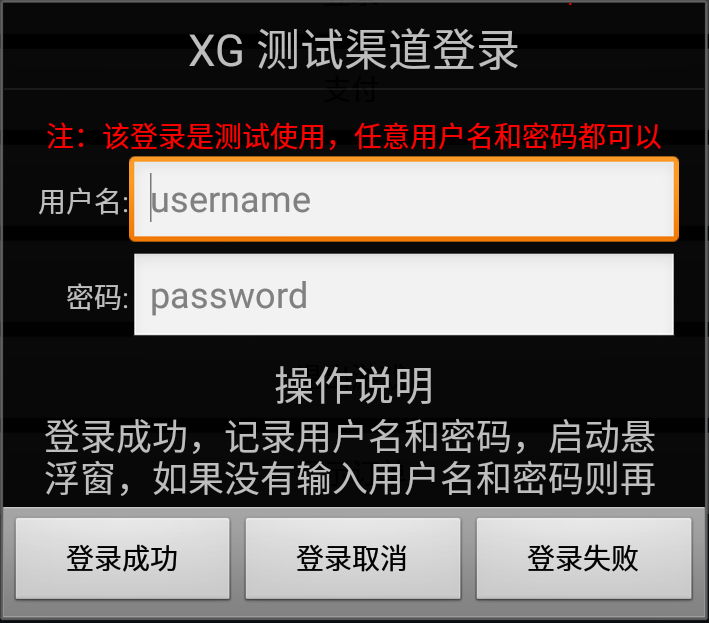
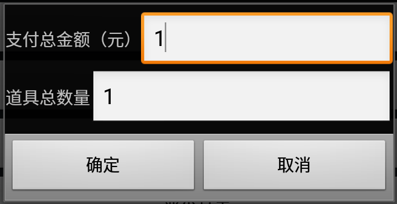
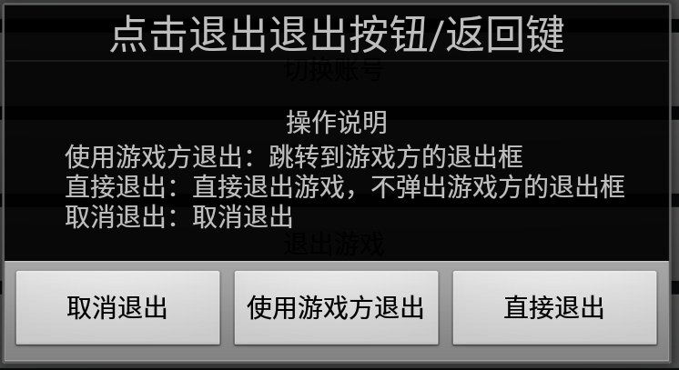
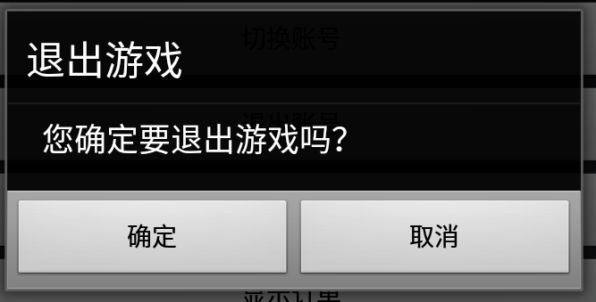
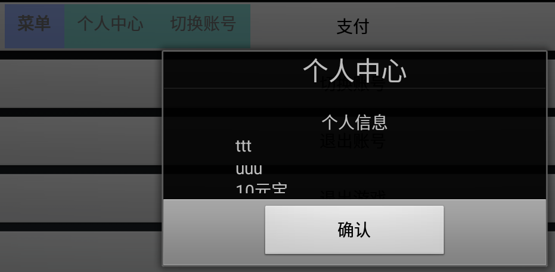

#西瓜SDK 测试渠道说明文档

****

##1. 文档概述

此文档是游戏在接入完成后进行客户端接入验证的测试文档。 
文档分成两大部分：开发环境下载/搭建，测试渠道使用介绍。游戏开发人员在客户端接入完成后请根据本文档进行测试，用以检查游戏接入西瓜SDK的接口、接口参数是否正确以及能否正常实现登陆和充值等功能。

###1.1 SDK下载包

**渠道版SDK下载包包含： **
1. 西瓜SDKV2的Jar包：xgsdk-core.jar，xgsdk-data.jar，xgsdk-lib.jar，xgsdk-api.jar 
2. xgsdk-demo 
3. XGSDK 原生Android版 客户端接入文档 

##2. 配置环境

###2.1 开发和接入所需基本环境

**Android开发环境： **

Android版本：Android2.2 以上 
Android开发工具：Android SDK和Android Eclipse 

##3. 测试渠道的作用
	1.使游戏开发商能够进入游戏界面，检查游戏接入XGSDK的接口及接口参数是否正确

##4. 测试渠道的使用概览
	1.模拟登录
	2.模拟支付
	3.模拟退出
	4.个人中心
	5.切换账号
##5. 快速使用
###测试渠道初始界面：

 

####5.1 模拟登录

 

登录成功：记录用户名和密码，启动悬浮窗,如果没有输入用户名和密码则再次输入
 

登录取消：回调登录失败方法onLogoutFail
 

登录失败：取消登录，登录框消失，悬浮窗不出现

####5.2 模拟支付

点击主界面的支付按钮出现商品订单界面，然后点击确认，进入支付界面

支付成功：支付成功回调，通知服务器创建订单
 
支付取消：执行支付取消回调
 
支付失败：支付失败回调

####5.3 模拟退出

取消退出：取消退出
 
使用游戏方退出：跳转到游戏方的退出框
 
直接退出：直接退出游戏，不弹出游戏方的退出框

点击确认退出游戏

####5.4 个人中心

点击悬浮窗的个人中心弹出个人中心

####5.5 切换账号
点击悬浮窗的切换账号，进入模拟登录的登录界面。

****

###文档版本说明
<table>
<tr>
<td>SDK版本</td><td>文档版本</td> <td>SDK修改内容</td> <td>文档修改内容</td> <td>修改日期</td>  
</tr>
<tr>
<td>2.0 </td><td>1.0</td> <td>初版</td> <td>初版</td> <td>2015.8.1</td>
</tr>
</table>
