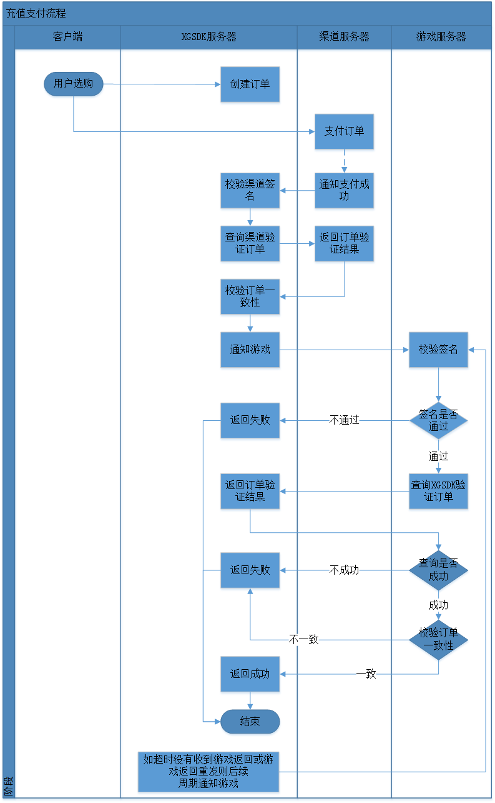

# 西瓜SDK 支付通知接口

## 1 文档概述
此文档是西瓜SDK支付通知接口接入文档。包括如下2个接口：  

 1. 支付通知接口
 2. 二次查询验证订单接口

西瓜订单服务器在收到渠道的订单成功支付通知时,会主动调用支付通知接口通知游戏服务器订单信息。
游戏服务器在接受到通知请求时,应同时调用充值验证接口向西瓜订单服务器查询订单信息是否正确。
如果只接入支付通知接口,当服务端密钥泄露后，有可能遭受伪造订单信息攻击。  
**注意：** 如游戏无支付要求，则无需接入。

### 1.1 文档结构
<ol>
  <li>
    <a href="#doc">文档概述</a>
    <ul type="disc">
      <li><a href="#doc_structure">文档结构</a></li>
    </ul>
  </li>
  <li>
    <a href="#interface_pay_notify">支付通知接口</a>
    <ul type="disc">
      <li><a href="#pay_notify_function">功能</a></li>
      <li><a href="#pay_notify_step_input">输入</a></li>
      <li><a href="#pay_notify_step_output">输出</a></li>
      <li><a href="#pay_notify_step_sample">请求样例</a></li>
      <li><a href="#pay_notify_step_sample_return">返回值样例</a></li>
      <li><a href="#pay_notify_errcode">错误码</a></li>
      <li><a href="#pay_notify_sign">签名和验签</a></li>
      <li><a href="#pay_notify_suggestion">游戏逻辑处理建议</a></li>
    </ul>
  </li>
  <li>
    <a href="#interface_order_query">二次查询验证订单</a>
      <ul type="disc">
        <li><a href="#order_query_function">功能</a></li>
        <li><a href="#order_query_step_input">输入</a></li>
        <li><a href="#order_query_step_output">输出</a></li>
        <li><a href="#order_query_step_sample">请求样例</a></li>
        <li><a href="#order_query_step_sample_return">返回值样例</a></li>
        <li><a href="#order_query_errcode">错误码</a></li>
      </ul>
  </li>
  <li>
    <a href="#demo">服务端接入xgsdk样例代码</a>
  </li>
</ol>

## 2 支付通知接口（通知游戏支付结果）

### 2.1 功能
<table>
<tr>
<td>发起方</td><td>XGSDK服务端</td>
</tr>
<tr>
<td>接收方</td><td>游戏服务器</td>
</tr>
<tr>
<td>接口类型</td><td>HTTP POST  
 Content-Type: application/json;charset=UTF-8</td>
</tr>
<tr>
<td nowrap>字符集编码</td><td>UTF-8</td>
</tr>
<tr>
<td>安全机制</td><td>签名</td>
</tr>
<tr>
<td>请求地址</td><td>游戏方提供URL，XGSDK服务器主动调用</td>
</tr>
<tr>
<td>功能描述</td><td>当接收到渠道的支付结果回调信息后，XGSDK服务端会对订单支付信息进行确认，完成后，XGSDK服务端会将订单支付结果信息推送到游戏服务器提供的支付订单回调地址。</td>
</table>

### 2.2 输入

**参数说明：** 参数为一个json的字符串

<table>
<tr>
<td>参数</td><td nowrap>参数类型</td><td nowrap>最大长度</td><td>说明</td><td nowrap>必须</td>
</tr>
<tr>
<td>type</td><td>String</td><td>32</td><td>接口类型，固定为notify-game</td><td>是</td>
</tr>
<tr>
<td>xgAppId</td><td>String</td><td>64</td><td>XGSDK分配的游戏编号<a href="https://console.xgsdk.com/">去西瓜WEB控制台查看我的xgAppId</a></td><td>是</td>
</tr>
<tr>
<td>channelId</td><td>String</td><td>32</td><td>运营渠道编号</td><td>是</td>
</tr>
<tr>
<td>uid</td><td>String</td><td>128</td><td>渠道的用户编号</td><td>是</td>
</tr>
<tr>
<td>zoneId</td><td>String</td><td>32</td><td>游戏区编号</td><td>否</td>
</tr>
<tr>
<td>serverId</td><td>String</td><td>32</td><td>游戏服编号</td><td>否</td>
</tr>
<tr>
<td>roleId</td><td>String</td><td>32</td><td>角色编号</td><td>是</td>
</tr>
<tr>
<td>roleName</td><td>String</td><td>64</td><td>角色名称</td><td>否</td>
</tr>
<tr>
<td>roleLevel</td><td>String</td><td>32</td><td>角色等级</td><td>否</td>
</tr>
<tr>
<td>roleVipLevel</td><td>String</td><td>32</td><td>角色VIP等级</td><td>否</td>
</tr>
<tr>
<td>currencyName</td><td>String</td><td>64</td><td>支付货币名称</td><td>否</td>
</tr>
<tr>
<td>productId</td><td>String</td><td>64</td><td>商品编号</td><td>是</td>
</tr>
<tr>
<td>productName</td><td>String</td><td>64</td><td>商品名称</td><td>否</td>
</tr>
<tr>
<td>productDesc</td><td>String</td><td>128</td><td>商品描述</td><td>否</td>
</tr>
<tr>
<td>productQuantity</td><td>int</td><td>10</td><td>商品数量</td><td>否</td>
</tr>
<tr>
<td>productUnitPrice</td><td>int</td><td>10</td><td>商品单价(单位分)</td><td>否</td>
</tr>
<tr>
<td>totalAmount</td><td>int</td><td>10</td><td>总面额(单位分)</td><td>是</td>
</tr>
<tr>
<td>paidAmount</td><td>int</td><td>10</td><td>总支付金额(单位分)</td><td>是</td>
</tr>
<tr>
<td>customInfo</td><td>String</td><td>2000</td><td>游戏方自定义字段，支付成功后回调的时候，透传原样返回</td><td>否</td>
</tr>
<tr>
<td>ts</td><td>String</td><td>14</td><td>当前时间戳，秒级，如20150723150028  
对应2015/7/23 15:00:28</td><td>是</td>
</tr>
<tr>
<td>gameTradeNo</td><td>String</td><td>64</td><td>游戏侧订单号</td><td>否</td>
</tr>
<tr>
<td>sign</td><td>String</td><td>40</td><td>签名，签名算法参见签名章节，使用游戏服务端密钥</td><td>是</td>
</tr>
<tr>
<td>tradeNo</td><td>String</td><td>64</td><td>Xgsdk分配的订单号</td><td>是</td>
</tr>
<tr>
<td>paidTime</td><td>String</td><td>14</td><td>支付时间 yyyyMMddHHmmss</td><td>是</td>
</tr>
<tr>
<td>payStatus</td><td>String</td><td>1</td><td>订单支付状态  
1 支付成功  
2 支付失败</td><td>是</td>
</tr>
</table>

### 2.3 输出
**返回结果为JSON格式的字符串，分别有如下几个字段：**

<table>
<tr>
<td>参数</td><td>说明</td>
</tr>
<tr>
<td>code</td><td>返回码，参见<a href="#pay_notify_errcode">错误码</a>章节</td>
</tr>
<tr>
<td>msg</td><td>接口调用信息提示</td>
</tr>
</table>

### 2.4 请求样例
**请求参数:**  
type=notify-game  
xgAppId=2018  
channelId=mi  
uid=30854  
serverId=1  
roleId=224455  
productId=productId1  
productName=productName1  
productDesc=productDesc1  
productQuantity=1  
totalAmount=9800  
paidAmount=9800  
customInfo=2323423413412351251245  
gameTradeNo=99887766  
tradeNo=2984456  
paidTime=20150723145928  
payStatus=1  

**当前时间戳ts:** 20150723150028  

**游戏服务端密钥:** 654321<a href="https://console.xgsdk.com/">去西瓜WEB控制台查看我的游戏服务端密钥XgServerKey</a>

**则请求签名源串为：**
channelId=mi&customInfo=2323423413412351251245&gameTradeNo=99887766&paidAmount=9800&paidTime=20150723150128&payStatus=1&productDesc=productDesc1&productId=productId1&productName=productName1&productQuantity=1&roleId=224455&serverId=1&totalAmount=9800&tradeNo=2984456&ts=20150723150028&type=notify-game&uid=30854&xgAppId=2018

**请求签名为：**  
554a8e31e0d5a48e0fc867234454af75fcf21820  

**请求样例：**  
http://172.63.55.62:18888/moon/pay  
postBody:  
{"channelId":"mi","customInfo":"2323423413412351251245","gameTradeNo":"99887766","paidAmount":"9800","paidTime":"20150723150128","payStatus":"1","productDesc":"productDesc1","productId":"productId1","productName":"productName1","productQuantity":"1","roleId":"224455","serverId":"1","totalAmount":"9800","tradeNo":"2984456","ts":"20150723150028","type":"notify-game","uid":"30854","xgAppId":"2018","sign":"554a8e31e0d5a48e0fc867234454af75fcf21820"}

### 2.5 返回值样例

	{
	    "code": "0",
	    "msg": "success"
	}

### 2.6 错误码
<table>
<tr>
<td nowrap>错误码</td> <td>备注</td>
</tr>
<tr>
<td>0</td> <td>成功</td>
</tr>
<tr>
<td>-1</td> <td>签名失败</td>
</tr>
<tr>
<td>1</td> <td>请求重发，表示游戏服前置机收到xg服务器通知，但是由于游戏服务器正在升级，不能处理响应，请求延后重新发送</td>
</tr>
<tr>
<td>2</td> <td>重复订单，表示游戏服务器之前已收到了同样订单的通知，为避免因网络等原因导致道具或者游戏代币重复到账，建议游戏做订单排重
</td>
</tr>
<tr>
<td>-2</td> <td>xgAppId不存在</td>
</tr>
<tr>
<td>-3</td> <td>channelId不存在</td>
</tr>
<tr>
<td>-4</td> <td>区服不存在</td>
</tr>
<tr>
<td>-5</td> <td>账号不存在</td>
</tr>
<tr>
<td>-6</td> <td>订单号不存在</td>
</tr>
<tr>
<td>-98</td> <td>请求参数疑似被篡改</td>
</tr>
<tr>
<td>-99</td> <td>服务器内部错误</td>
</tr>
</table>

### 2.7 签名和验签

**签名算法采用HmacSHA1**

1. 传入参数key按字母排序；
2. 按key1=value1&key2=value2&...来拼接签名源串，将值为空的参数和sign签名字段去掉，不加入签名源串，key和value不进行任何编码（如不进行URLEncoder）；
3. 然后对最后生成的字符串进行HmacSHA1计算，得到签名串。

### 2.8 游戏处理注意事项
为了避免被人网络截包篡改充值数据，需要游戏服务器收到充值通知后，按如下逻辑来实现校验充值数据，并到xgsdk服务器再次验证。

1. 如果有游戏升级不能响应，则需返回String ERR_RESEND = "1"；
2. 先要进行验证签名，不通过则需返回String ERR_SIGN = "-1"；
3. 如果游戏保留了游戏订单但找不到对应订单时，则需返回String ERR_ORDERID_NOTEXIST = "-6"；
4. 做订单排重，如果重复则需返回String ERR_REPEAT = "2"；
5. 如果游戏保留了游戏订单，最好能够验证XG订单消息和游戏订单消息的一致性，如productId、productQuantity、paidAmount、uid、roleId，保证人、财、物是否一致，避免有人在网络截获包，同时密钥泄露时，冒充发送通知，这时需返回String ERR_EXCEPTION = "-98"；
6. 发送验证请求到xg的sdkserver服务器，验证订单，如果订单不存在或者需再次验证订单一致性时，需返回String ERR_EXCEPTION = "-98"；
7. 如果系统发生内部异常，则需返回String ERR_SYSTEM = "-99"。  

若以上7步都正常，则返回String SUCCESS = "0"。

## 3 二次查询验证订单

### 3.1 功能
**发起方：** 游戏服务器  
**接收方：** XGSDK服务端  
**接口类型：** HTTP POST  
**字符集编码：** UTF-8  
**安全机制：** 签名  
**请求地址：**  
http://p2.xgsdk.com/pay/verify-order/{xgAppId}  <a href="https://console.xgsdk.com/">去西瓜WEB控制台查看我的xgAppId</a>

其中xgAppId是XGSDK分配的游戏编号，如剑侠情缘是2018。
p2.xgsdk.com是金山云上的xgsdk服务器域名，接入XGSDK不同的云环境有不同的域名，具体值请参考在XGSDK Portal配置界面里的西瓜 SDK 接入参数。

**功能描述：** 用于游戏服务器验证收到的订单通知是否有效。

### 3.2 输入
**参数说明：**
<table>
<tr>
<td nowrap>参数名称</td><td nowrap>参数类型</td><td nowrap>最大长度</td><td nowrap>说明</td><td nowrap>必须</td>
</tr>
<tr>
<td>type</td><td>String</td><td>32</td><td>接口类型，固定为verify-order</td><td>是</td>
</tr>
<tr>
<td>tradeNo</td><td>String</td><td>32</td><td>订单编号</td><td>是</td>
</tr>
<tr>
<td>ts</td><td>String</td><td>14</td><td>当前时间戳，秒级，如20150723150028对应2015/7/23 15:00:28</td><td>是</td>
</tr>
<tr>
<td>sign</td><td>String</td><td>40</td><td>签名，签名算法参见签名章节，使用游戏服务端密钥</td><td>是</td>
</tr>
</table>

### 3.3 输出
**返回结果为JSON格式的字符串，分别有如下几个字段：**
<table>
<tr>
<td>字段</td><td>说明</td>
</tr>
<tr>
<td>code</td><td>返回码，参见<a href="#order_query_errcode">错误码</a>章节</td>
</tr>
<tr>
<td>msg</td><td>接口调用信息提示</td>
</tr>
<tr>
<td>data</td><td>接口返回数据</td>
</tr>
</table>

**data字段具体说明：**  
参数说明：
<table>
<tr>
<td nowrap>参数名称</td><td nowrap>参数类型</td><td nowrap>最大长度</td><td nowrap>说明</td><td nowrap>必须</td>
</tr>
<tr>
<td>type</td><td>String</td><td>32</td><td>接口类型，固定为verify-order</td><td>是</td>
</tr>
<tr>
<td>xgAppId</td><td>String</td><td>64</td><td>XGSDK分配的游戏编号<a href="https://console.xgsdk.com/">去西瓜WEB控制台查看我的xgAppId</a></td><td>是</td>
</tr>
<tr>
<td>channelId</td><td>String</td><td>32</td><td>运营渠道编号</td><td>是</td>
</tr>
<tr>
<td>uid</td><td>String</td><td>128</td><td>渠道的用户编号</td><td>是</td>
</tr>
<tr>
<td>zoneId</td><td>String</td><td>32</td><td>游戏区编号</td><td>否</td>
</tr>
<tr>
<td>serverId</td><td>String</td><td>32</td><td>游戏服编号</td><td>否</td>
</tr>
<tr>
<td>roleId</td><td>String</td><td>32</td><td>角色编号</td><td>是</td>
</tr>
<tr>
<td>roleName</td><td>String</td><td>64</td><td>角色名称</td><td>否</td>
</tr>
<tr>
<td>roleLevel</td><td>String</td><td>32</td><td>角色等级</td><td>否</td>
</tr>
<tr>
<td>roleVipLevel</td><td>String</td><td>32</td><td>角色VIP等级</td><td>否</td>
</tr>
<tr>
<td>currencyName</td><td>String</td><td>64</td><td>支付货币名称</td><td>否</td>
</tr>
<tr>
<td>productId</td><td>String</td><td>64</td><td>商品编号</td><td>是</td>
</tr>
<tr>
<td>productName</td><td>String</td><td>64</td><td>商品名称</td><td>否</td>
</tr>
<tr>
<td>productDesc</td><td>String</td><td>128</td><td>商品描述</td><td>否</td>
</tr>
<tr>
<td>productQuantity</td><td>int</td><td>10</td><td>商品数量</td><td>否</td>
</tr>
<tr>
<td>productUnitPrice</td><td>int</td><td>10</td><td>商品单价(单位分)</td><td>否</td>
</tr>
<tr>
<td>totalAmount</td><td>int</td><td>10</td><td>总面额(单位分)</td><td>是</td>
</tr>
<tr>
<td>paidAmount</td><td>int</td><td>10</td><td>总支付金额(单位分)</td><td>是</td>
</tr>
<tr>
<td>customInfo</td><td>String</td><td>2000</td><td>游戏方自定义字段，支付成功后回调的时候，透传原样返回</td><td>否</td>
</tr>
<tr>
<td>ts</td><td>String</td><td>14</td><td>当前时间戳，秒级，如20150723150028  
对应2015/7/23 15:00:28</td><td>是</td>
</tr>
<tr>
<td>gameTradeNo</td><td>String</td><td>64</td><td>游戏侧订单号</td><td>否</td>
</tr>
<tr>
<td>sign</td><td>String</td><td>40</td><td>签名，签名算法参见签名章节，使用游戏服务端密钥</td><td>是</td>
</tr>
<tr>
<td>tradeNo</td><td>String</td><td>32</td><td>Xgsdk分配的订单号</td><td>是</td>
</tr>
<tr>
<td>paidTime</td><td>String</td><td>14</td><td>支付时间 yyyyMMddHHmmss</td><td>是</td>
</tr>
<tr>
<td>payStatus</td><td>String</td><td>1</td><td>订单支付状态  
1 支付成功  
2 支付失败</td><td>是</td>
</tr>
</table>

### 3.4 请求样例
**请求参数:**

**tradeNo:** 2984456

**当前时间戳ts:** 20150723150028  

**游戏服务端密钥: 654321**
<a href="https://console.xgsdk.com/">去西瓜WEB控制台查看我的游戏服务端密钥XgServerKey</a>

**则请求签名源串为：**  tradeNo=2984456&ts=20150723150028&type=verify-order  

**请求签名为：**
86e396a999e9673731be6609c4dc7bca8945ada6  

**请求样例：**  
http://p2.xgsdk.com/pay/verify-order/2018?tradeNo=2984456&sign=86e396a999e9673731be6609c4dc7bca8945ada6&ts=20150723150028&type=verify-order

### 3.5 返回值样例
**响应签名源串为：**
channelId=mi&customInfo=2323423413412351251245&gameTradeNo=99887766&paidAmount=9800&paidTime=20150723150128&payStatus=1&productDesc=productDesc1&productId=productId1&productName=productName1&productQuantity=1&roleId=224455&serverId=1&totalAmount=9800&tradeNo=2984456&ts=20150723150028&type=verify-order&uid=30854&xgAppId=2018

**响应验签密钥为游戏服务端验签密钥：** 654321<a href="https://console.xgsdk.com/">去西瓜WEB控制台查看我的游戏服务端密钥XgServerKey</a>

**响应签名为：**
4fd1e65c65fe12c46f0a8d2bc559c56c830cd205

**最终返回为：**

	{
	    "code": "0",
	    "msg": "success",
	    "data": {
		    "channelId": "mi",
		    "customInfo": "2323423413412351251245",
		    "gameTradeNo": "99887766",
		    "paidAmount": "9800",
		    "paidTime": "20150723150128",
		    "payStatus": "1",
		    "productDesc": "productDesc1",
		    "productId": "productId1",
		    "productName": "productName1",
		    "productQuantity": "1",
		    "roleId": "224455",
		    "serverId": "1",
		    "totalAmount": "9800",
		    "tradeNo": "2984456",
		    "ts": "20150723150028",
		    "type": "verify-order",
		    "uid": "30854",
		    "xgAppId": "2018",
		    "sign": "4fd1e65c65fe12c46f0a8d2bc559c56c830cd205"
		}
	}

### 3.6 错误码
<table>
<tr>
<td nowrap>错误码</td> <td>备注</td>
</tr>
<tr>
<td>0</td> <td>成功</td>
</tr>
<tr>
<td>-1</td> <td>签名失败</td>
</tr>
<tr>
<td>-6</td> <td>订单号不存在</td>
</tr>
<tr>
<td>-99</td> <td>XG系统内部服务器错误</td>
</tr>
</table>

## 4 服务端接入xgsdk样例代码

[xgsdk服务端接入样例代码（Java）](https://console.xgsdk.com/download/pack_tools/gameserver-demo.zip)
