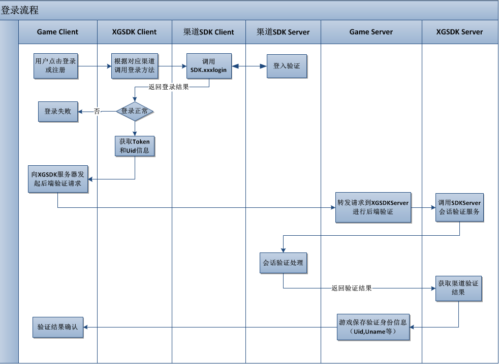

# 西瓜SDK session验证文档

## 1. 快速接入
向西瓜发送验证请求：
    
    http://a2.xgsdk.com/account/verify-session/{xgAppId}?authInfo={客户端上传的authInfo字符串}&ts={当前时间戳}&type=verify-session

    示例：
	http://a2.xgsdk.com/account/verify-session/2008?authInfo=eyJhdXRoVG9rZW4iOiJhdXRoVG9rZW4iLCJjaGFubmVsSWQiOiJtaSIsImRldmljZUlkIjoiZGV2aWNlSWQiLCJuYW1lIjoibmFtZSIsInBsYW5JZCI6IjEiLCJ4Z0FwcElkIjoiMTAyNGFwcGlkIiwic2lnbiI6ImZhMzQzODFkYzU4NGY2MzFhODdhMDQzNmU0OWVmNGQzYTcxZWU1NWQiLCJ0cyI6IjIwMTUwNzIzMTUwMDI4IiwidWlkIjoidWlkIn0=&ts=20150723150028&type=verify-session

验证成功返回结果：

    {
    	"code": "0", // 0:代表成功
    	"msg": "success",
	    "data": {
			"xgAppId": "2008",
    	    "planId": "1",
			"channelId": "mi",
			"deviceId": "imei_867323027683257",
    	    "sessionId": "oVG9rZW4iOiJhdXRoVG9rZW4iLCJjaGFubmVsSWQiOiJ"，
    	    "uid": "mi__3099245"，
    	    "userName": "渠道用户名"
    	}
    }

验证失败返回结果：

	{
		"code": {错误码} // -1:签名错误，-103:渠道告知用户未登录，更多请参考文档底部的错误码表
    }

## 2. 接入详细说明
### 1. 文档概述

此文档是西瓜SDK服务端接入登录验证文档。介绍游戏服务器如何验证用户登录信息，游戏客户端在接收到西瓜登录成功的回调后，
将对应的信息发送到游戏服务器，游戏服务器使用登录认证接口向西瓜登录服务器验证并获取用户登录信息。  
**注意：** 登录认证接口为登录流程必接接口。



#### 1.1 文档结构
<ol>
	<li>
		<a href="#doc">文档概述</a>
			<ul>
				<li><a href="#docStructure">文档结构</a></li>
			</ul>
	</li>
	<li>
		<a href="#configure">登录认证接口</a>
		<ul>
			<li><a href="#conditions">功能</a></li>
			<li><a href="#steps">输入</a></li>
			<li><a href="#import">输出</a>
			<li><a href="#import_android">请求示例</a>
            <li><a href="#import_1">返回值样例</a>
            <li><a href="#errcode">错误码</a>
		</ul>
	</li>
	<li>
		<a href="#version">文档版本</a>
	</li>
</ol>


<div id="configure"></div>

### 2. 登录认证接口

<div id="conditions"></div>

#### 2.1 功能

<table>
<tr>
<td>发起方</td><td>游戏服务器</td>
</tr>
<tr>
<td>接收方</td><td>XGSDK服务端</td>
</tr>
<tr>
<td>接口类型</td><td>HTTP GET</td>
</tr>
<tr>
<td>字符集编码</td><td>UTF-8</td>
</tr>
<tr>
<td>请求地址</td><td>http://a2.xgsdk.com/account/verify-session/{xgAppId}</td>
</tr>
</table>

```
其中xgAppId是游戏在XGSDK的唯一标示，如西游伏魔是1024。
```

**功能描述:**
游戏服务器向XGSDK服务端发送请求，确认客户端发过来的sessionId是有效的，并获取准确的渠道账号。

<div id="steps"></div>

#### 2.2 输入

参数说明：
<table>
<tr>
<td>参数</td><td nowrap="nowrap">是否必需</td><td>类型</td><td>说明</td>
</tr>
<tr>
<td>type</td><td>是</td><td>String</td><td>接口类型，固定为verify-session</td>
</tr>
<tr>
<td>authInfo</td><td>是</td><td>String</td><td>会话验证数据，xgsdk客户端负责生成，通过onLoginSuccess回调反馈给游戏客户端，游戏客户端提交给游戏服务器后，游戏服务器拿这个参数到xgsdk服务器验证登录会话是否有效</td>
</tr>
<tr>
<td>ts</td><td>是</td><td>String</td><td>当前时间戳，秒级，如20150723150028对应2015/7/23 15:00:28</td>
</tr>
</table>

<div id="import"></div>


#### 2.3 输出
返回结果为JSON格式的字符串，分别有如下几个字段：
<table>
<tr>
<td>字段</td><td >是否必需</td><td>类型</td><td>说明</td>
</tr>
<tr>
<td>code</td><td>是</td><td>字符串</td><td>返回码，参见错误码章节</td>
</tr>
<tr>
<td>msg</td><td>是</td><td>字符串</td><td>接口调用信息提示</td>
</tr>
<tr>
<td>data</td><td>是</td><td>JSONObject</td><td>当Code为0时候该字段才有意义，否则为空</td>
</tr>
</table>

**data数据：**
<table>
<tr>
<td>参数</td><td >是否必需</td><td>类型</td><td>说明</td>
</tr>
<tr>
<td>xgAppId</td><td>是</td><td>String</td><td>xgsdk分配给游戏的ID</td>
</tr>
<tr>
<td>planId</td><td>是</td><td>String</td><td>发布计划编号</td>
</tr>
<tr>
<td>channelId</td><td>是</td><td>String</td><td>渠道Id</td>
</tr>
<tr>
<td>deviceId</td><td>是</td><td>String</td><td>设备Id</td>
</tr>
<tr>
<td>sessionId</td><td>否</td><td>String</td><td>
会话编号
</td>
</tr>
<tr>
<td>uid</td><td>是</td><td>String</td><td>用户编号</td>
</tr>
<tr>
<td>userName</td><td>否</td><td>String</td><td>用户名 </td>
</tr>
</table>

<div id="import_android"></div>

#### 2.4 请求示例

**客户端上报的authInfo：**
eyJhdXRoVG9rZW4iOiJhdXRoVG9rZW4iLCJjaGFubmVsSWQiOiJtaSIsImRldmljZUlkIjoiZGV2aWNlSWQiLCJuYW1lIjoibmFtZSIsInBsYW5JZCI6IjEiLCJ4Z0FwcElkIjoiMTAyNGFwcGlkIiwic2lnbiI6ImZhMzQzODFkYzU4NGY2MzFhODdhMDQzNmU0OWVmNGQzYTcxZWU1NWQiLCJ0cyI6IjIwMTUwNzIzMTUwMDI4IiwidWlkIjoidWlkIn0=

**当前时间戳ts为：**
20150723150028

**请求样例：**  
http://a2.xgsdk.com/account/verify-session/2008?authInfo=eyJhdXRoVG9rZW4iOiJhdXRoVG9rZW4iLCJjaGFubmVsSWQiOiJtaSIsImRldmljZUlkIjoiZGV2aWNlSWQiLCJuYW1lIjoibmFtZSIsInBsYW5JZCI6IjEiLCJ4Z0FwcElkIjoiMTAyNGFwcGlkIiwic2lnbiI6ImZhMzQzODFkYzU4NGY2MzFhODdhMDQzNmU0OWVmNGQzYTcxZWU1NWQiLCJ0cyI6IjIwMTUwNzIzMTUwMDI4IiwidWlkIjoidWlkIn0=&ts=20150723150028&type=verify-session

<div id="import_1"></div>
#### 2.5 返回值样例

	{
    	"code": "0",
    	"msg": "success",
	    "data": {
			"xgAppId": "2008",
    	    "planId": "1",
			"channelId": "mi",
			"deviceId": "imei_867323027683257",
    	    "sessionId": "oVG9rZW4iOiJhdXRoVG9rZW4iLCJjaGFubmVsSWQiOiJ"，
    	    "uid": "mi__3099245"，
    	    "userName": "渠道用户名"
    	}
    }

<div id="errcode"></div>
#### 2.6 错误码

<table>
<tr>
<td>错误码</td> <td>备注</td>
</tr>
<tr>
<td>0</td> <td>成功</td>
</tr>
<tr>
<td>-1</td> <td>签名失败</td>
</tr>
<tr>
<td>-2</td> <td>xgAppId不存在</td>
</tr>
<tr>
<td>-3</td> <td>channelId不存在</td>
</tr>
<tr>
<td>-98</td> <td>请求参数疑似被篡改</td>
</tr>
<tr>
<td>-99</td> <td>XG系统内部服务器错误</td>
</tr>
<tr>
<td>-100</td> <td>获取登录验证参数失败</td>
</tr>
<tr>
<td>-101</td> <td>获取渠道参数失败</td>
</tr>
<tr>
<td>-102</td> <td>连接渠道登陆验证接口失败</td>
</tr>
<tr>
<td>-103</td> <td>渠道登陆验证结果失败</td>
</tr>
</table>

#### 2.7 服务端接入xgsdk样例代码

[https://console.xgsdk.com/download/pack_tools/gameserver-demo.zip](https://console.xgsdk.com/download/pack_tools/gameserver-demo.zip](https://console.xgsdk.com/download/pack_tools/gameserver-demo.zip](https://console.xgsdk.com/download/pack_tools/gameserver-demo.zip "xgsdk样例代码（Java）")

---
