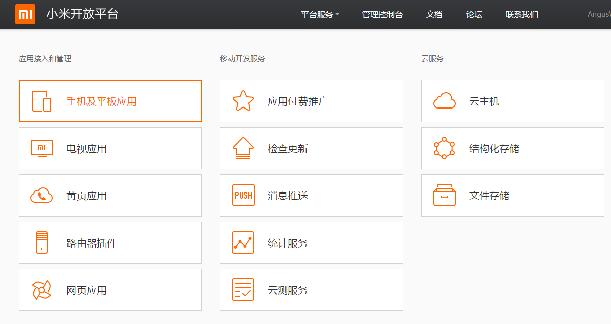
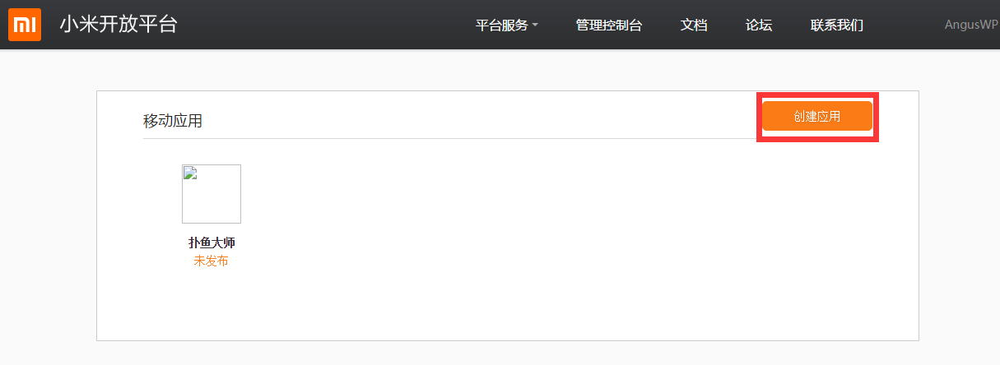
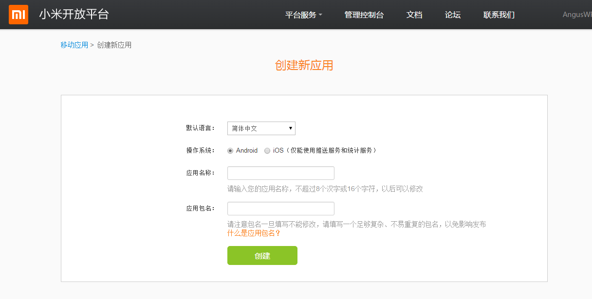
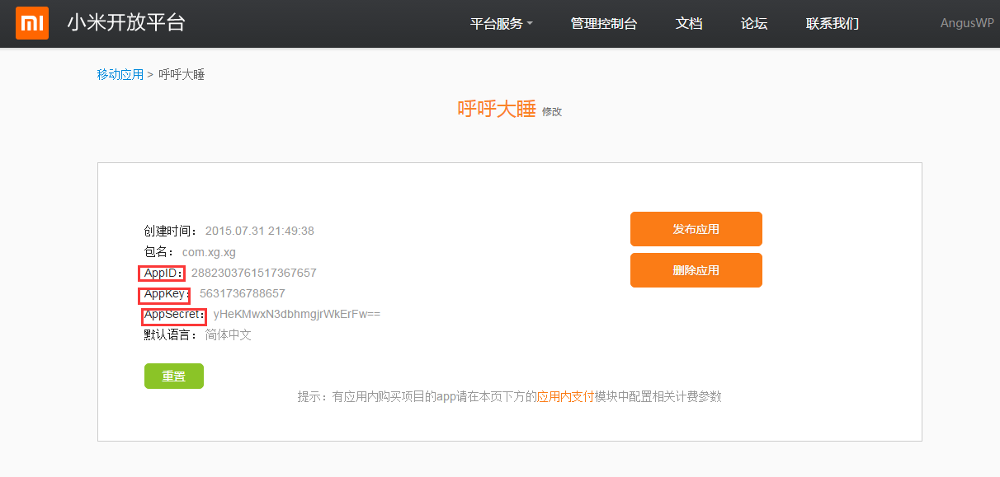

# 渠道参数申请指南

渠道参数申请指南是为了方便游戏运营可以更清晰的了解不同渠道的申请步骤。西瓜提供了每个渠道的渠道地址和详细的申请步骤，以帮助游戏运营在参数申请时更加快速便捷。  
在渠道列表中点击某一渠道地址跳转到相应的渠道官网申请账号；点击渠道名称可查看详细的参数申请步骤。

#### Android渠道参数申请渠道地址：

<table>
 <tr>
	<td>渠道名称</td>
	<td>后台地址</td>
	<td>渠道名称</td>
	<td>后台地址</td>
	<td>渠道名称</td>
	<td>后台地址</td>
 </tr>
 <tr>
	<td><a href="./application/jinli.html" target="_blank">金立</td>
	<td><a href="http://dev.game.gionee.com/" target="_parent">渠道地址</a></td>
	<td><a href="./application/aiyouxi.html" target="_blank">百度</a></td>
	<td><a href="http://app.baidu.com" target="_parent">渠道地址</a></td>
	<td>应用宝—联运</td>
	<td><a href="http://open.qq.com/" target="_parent" title="http://open.qq.com/">渠道地址</a></td>
 </tr>
 <tr>
	<td>酷狗</td>
	<td>无后台，需联系渠道人员获取参数</td>
	<td><a href="./application/huawei.html" target="_blank">华为</a></td>
	<td><a href="http://developer.huawei.com/" target="_parent">渠道地址</a></td>
	<td>应用汇</td>
	<td><a href="http://dev.appchina.com/" target="_parent" title="http://dev.appchina.com/">渠道地址</a></td>
 </tr>
 <tr>
	<td><a href="./application/oppo.html" target="_blank">oppo</a></td>
	<td><a href="http://open.oppomobile.com/" target="_parent">渠道地址</a></td>
	<td>当乐</td>
	<td>无后台，需联系渠道人员获取参数</td>
	<td>魅族</td>
	<td><a href="https://member.meizu.com/" target="_parent" title="https://member.meizu.com/">渠道地址</a></td>
 </tr>
 <tr>
	<td>PPTV</td>
	<td>无后台，需联系渠道人员获取参数</td>
	<td>拇指玩</td>
	<td><a href="http://open.muzhiwan.com/" target="_parent">渠道地址</a></td>
	<td><a href="./application/kupai.html" target="_blank">酷派</td>
	<td><a href="http://appdev.coolyun.com/ylra/" target="_parent">渠道地址</a></td>
 </tr>
 <tr>
	<td><a href="./application/leshi.html" target="_blank">联想</a></td>
	<td><a href="https://passport.lenovo.com" target="_parent" title="https://passport.lenovo.com">渠道地址</a></td>
	<td>搜狗</td>
	<td>无后台，需联系渠道人员获取参数</td>
	<td>暴风</td>
	<td>无后台，需联系渠道人员获取参数</td>
 </tr>
 <tr>
	<td>pps</td>
	<td>无后台，需联系渠道人员获取参数</td>
	<td><a href="./application/wandoujia.html" target="_blank">豌豆荚</a></td>
	<td><a href="http://open.wandoujia.com/home" target="_parent">渠道地址</a></td>
	<td><a href="./application/4399.html" target="_blank">4399</a></td>
	<td><a href="http://opensj.4399api.net" target="_parent">渠道地址</a></td>
 </tr>
 <tr>
	<td>酷我游戏</td>
	<td>无后台，需联系渠道人员获取参数</td>
	<td><a href="#xiaomi">小米</a></td>
	<td><a href="https://account.xiaomi.com" target="_parent">渠道地址</a></td>
	<td><a href="./application/uc.html" target="_blank">UC</a></td>
	<td><a href="http://game.open.uc.cn/" target="_parent">渠道地址</a></td>
 </tr>
 <tr>
	<td>优酷</td>
	<td>无后台，需联系渠道人员获取参数</td>
	<td>今日头条</td>
	<td>无后台，需联系渠道人员获取参数</td>
	<td><a href="./application/vivo.html" target="_blank">vivo</a></td>
	<td><a href="https://developer.vivo.com.cn/" target="_parent">渠道地址</a></td>
 </tr>
 <tr>
	<td>37玩</td>
	<td><a href="http://my.37.com/" target="_parent" title="http://my.37.com/">渠道地址</a></td>
	<td><a href="./application/aiyouxi.html" target="_blank">爱游戏</a></td>
	<td><a href="http://open.play.cn/dev/" target="_parent">渠道地址</a></td>
	<td>安智</td>
	<td><a href="http://dev.anzhi.com/" target="_parent">渠道地址</a></td>
 </tr>
 <tr>
	<td>蜗牛</td>
	<td><a href="http://dev.snail.com/" target="_parent" title="http://dev.snail.com/">渠道地址</a></td>
	<td>豆米</td>
	<td><a href="http://www.doumi.cn" target="_parent" title="http://www.doumi.cn">渠道地址</a></td>
	<td><a href="./application/leshi.html" target="_blank">乐视商店</a></td>
	<td><a href="http://open.letv.com" target="_parent">渠道地址</a></td>
 </tr>
 <tr>
	<td><a href="./application/jifeng.html" target="_blank">机锋</a></td>
	<td><a href="http://dev.gfan.com/" target="_parent" title="http://dev.gfan.com/">渠道地址</a></td>
	<td><a href="./application/haima.html" target="_blank">海马</td>
	<td>无后台，需联系渠道人员获取参数</td>
	<td><a href="./application/mumayi.html" target="_blank">木蚂蚁</td>
	<td><a href="http://dev.mumayi.com/" target="_parent" title="http://dev.mumayi.com/">渠道地址</a></td>
 </tr>
 <tr>
	<td>新浪</td>
	<td>无后台，需联系渠道人员获取参数</td>
	<td>联通沃游戏</td>
	<td><a href="http://dev.wo.com.cn/" target="_parent" title="http://dev.wo.com.cn/">渠道地址</a></td>
	<td>滴滴</td>
	<td>无后台，需联系渠道人员获取参数</td>
 </tr>
 <tr>
	<td>YY多玩</td>
	<td>无后台，需联系渠道人员获取参数</td>
	<td>九城</td>
	<td>无后台，需联系渠道人员获取参数</td>
	<td>益玩</td>
	<td>无后台，需联系渠道人员获取参数</td>
 </tr>
 <tr>
	<td>乐嗨嗨</td>
	<td>无后台，需联系渠道人员获取参数</td>
	<td></td>
 </tr>
</table>

#### iOS渠道参数申请渠道地址：

<table>
 <tr>
	<td>渠道名称</td>
	<td>申请指南</td>
	<td>后台地址</td>
 </tr>
 <tr>
	<td><a href="./application/kuaiyong.html" target="_blank">快用</td>
	<td>有</td>
	<td><a href="http://shoulu.7659.com" target="_parent">渠道地址</a></td>
 </tr>
 <tr>
	<td>xy</td>
	<td>无</td>
	<td><a href="http://dev.xyzs.com" target="_parent">渠道地址</a></td>
 </tr>
 <tr>
	<td>爱思</td>
	<td>有</td>
	<td><a href="http://dev.i4.cn" target="_parent">渠道地址</a></td>
 </tr>
 <tr>
	<td>海马爱贝</td>
	<td>无</td>
	<td><a href="http://www.iapppay.com" target="_parent">渠道地址</a></td>
 </tr>
 <tr>
	<td>同步推</td>
	<td>无</td>
	<td><a href="http://dev.tongbu.com/game/" target="_parent">渠道地址</a></td>
 </tr>
 <tr>
	<td>金山通行证</td>
	<td>无</td>
	<td><a href="http://www.xgsdk.com:18080/" target="_parent">渠道地址</a></td>
 </tr>
 <tr>
	<td>pp助手</td>
	<td>有</td>
	<td><a href="http://pay.25pp.com" target="_parent" title="http://pay.25pp.com">渠道地址</a></td>
 </tr>
 <tr>
	<td>itools</td>
	<td>有</td>
	<td>渠道地址</a></td>
 </tr>
 <tr>
	<td>海马</td>
	<td>有</td>
	<td><a href="http://pay.haima.me" target="_parent" title="http://pay.haima.me  ">渠道地址</a></td>
 </tr>
 <tr>
	<td>AppStore</td>
	<td>有</td>
	<td><a href="https://itunesconnect.apple.com" target="_parent" title="https://itunesconnect.apple.com">渠道地址</a></td>
 </tr>
 <tr>
	<td>掌趣</td>
	<td>无</td>
	<td></td>
 </tr>
 <tr>
	<td>xoyobox</td>
	<td>无</td>
	<td></td>
 </tr>
</table>

## 小米渠道

西瓜SDK平台上所需的appid、appkey、appsecret均在小米后台获取。

### 获取步骤如下：

1. **在小米官方后台注册`小米开发者账号`（<a href="http://dev.xiaomi.com">请点击这里</a>）；**

 ** 登陆账号后点击管理控制台进入如下页面，点击“手机及平板应用”；**

    

2. ** 点击“创建应用”；**

    

3.** 填写完整下图中的信息，点击创建；**

  

4.** 成功申请到应用所需要的appid、appkey、appsecret，如下图；**

  

### 文档版本说明
<table >
<tr>
<td >SDK版本</td><td>文档版本</td> <td>SDK修改内容</td> <td>文档修改内容</td> <td>修改日期</td>  
</tr>
<tr>
<td>2.0 </td><td>1.0</td> <td>初版</td> <td>初版</td> <td>2015.7.30</td>
</tr>
</table>
