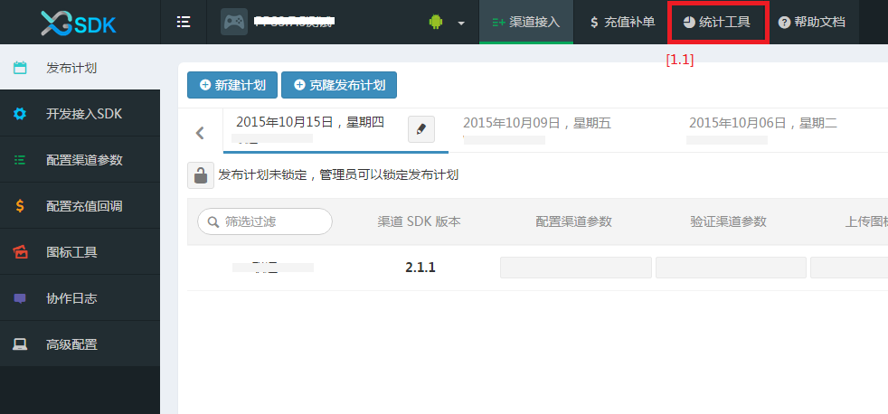
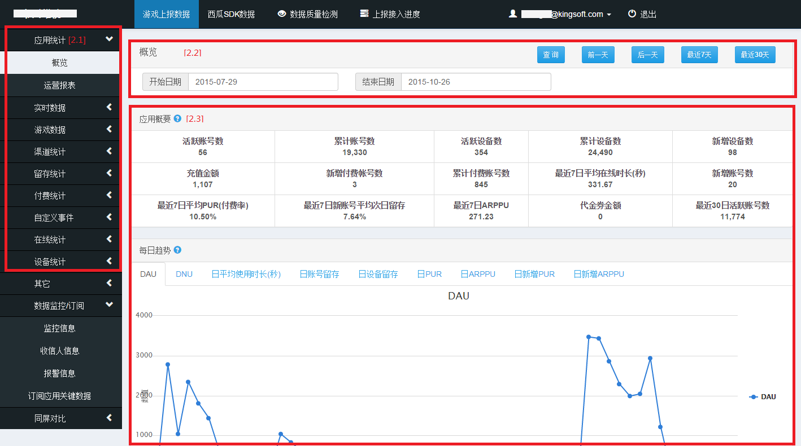
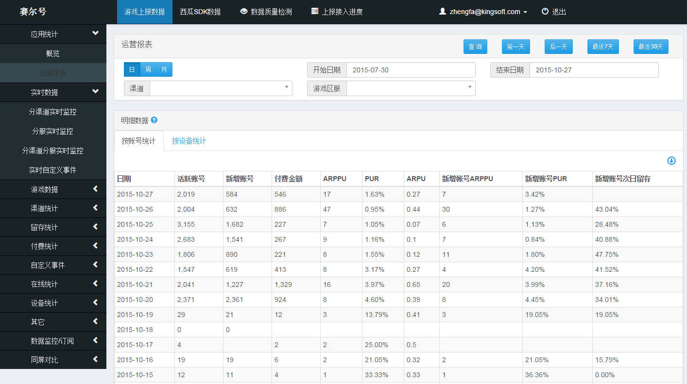

数据平台使用指南
====================================

1. 入口
------------------------------------

运营人员要去数据平台，统一入口在Portal上，如下图所示：

从[1.1]处进来，来到数据平台首页

运营人员主要使用这个页面[1.2]，查询订阅各种统计数据。以下章节就主要说明该功能的主要内容与使用方法。

2. 查询统计数据
------------------------------------

该章节主要说明，查询统计数据页面的组成，以“应用统计-概览”页面为例：

如图中标出，查询统计数据页面主要分为四部分，下面逐一说明：

[2.1] 数据统计页面菜单区

红框部分的页面都是某个领域的数据统计查询页面。

[2.2] 查询条件输入区

页面初始化时会给查询条件初始化默认条件，并在下面显示查询出的具体统计数据。
用户可以根据自己的需要修改查询条件，然后点击查询，进行统计数据的自定义查询。查询结果也会显示在下面的查询结果显示区中。

[2.3] 查询结果显示区

如图所示，
下面具体的统计数据可能分组显示，每组上部都有一个问号，鼠标放上去会给出统计指标的说明。
如果使用者对指标不了解，可以参见附件：<a href="./operationindex.md" target="_blank">《统计指标说明》</a>

3. 订阅统计数据
--------------------------------------

订阅统计数据功能，是为了能把一些关键数据及时发送给需要关注的人而设计的。
主要由四个子功能组成：

	[3.1] 监控信息
该页面用于维护要订阅的指标条件。

	[3.2] 订阅人管理
该页面用于维护可订阅信息的人员联系信息。

	[3.3] 订阅数据汇总
该页面用于显示所有满足订阅条件的指标信息。

	[3.4] 订阅关键数据
该页面用于设定给哪些人员发送订阅信息。

因为功能比较简单，详细说明略。

4. 常用指标查询示例
------------------------------------
根据运营人员反馈，把现在运营人员经常使用的两个功能说明如下：

### 4.1. 运营报表
运营报表中包含运营关注的主要核心指标，是运营人员经常访问的数据，具体位置如下图：

### 4.2. 实时数据
实时数据以外的其他统计数据查询结果都只能查询前一天及其以前的数据，实时数据可以查看当前的实时情况，运营人员经常使用，又分为4个子页面，分别为：

#### 4.2.1 分渠道实时监控

#### 4.2.2 分服实时监控

#### 4.2.3 分渠道分服实时监控

#### 4.2.4 实时自定义事件

以上几个页面内容与逻辑相对清晰，详细说明略。

### 4.3. 其他统计指标
因为数据平台的页面设计风格一致，其他统计指标的页面说明略。
菜单项目与页面主要内容表格，可以参见《数据统计查询页面详细说明》

5. 附录
------------------------------------

5.1. <a href="./operationindex.md" target="_blank">统计指标说明</a>
