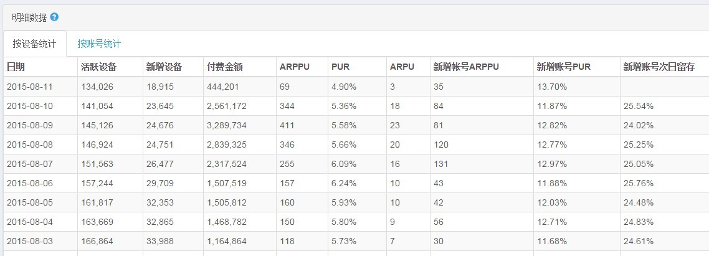
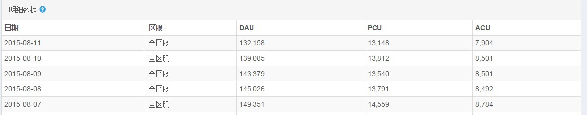
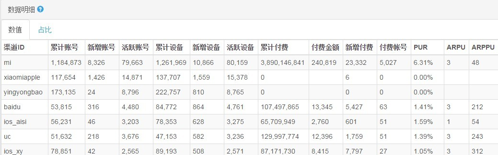
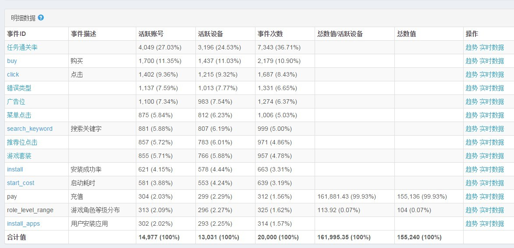

# 数据统计运营指标

西瓜数据统计中包含四大类指标：基本指标、在线指标、新用户指标、自定义指标。以下对所有运营指标进行详细分析。
### 1. 基本指标

<table>
 <tr>
<td>活跃账号</td>  
 <td>
 当天登录过应用的活跃的账号                                                                                                                             </td>
</tr>
<tr>
 <td>活跃设备</td>
  <td>                 当天登录过应用的活跃设备
</td>
</tr> <tr>
<td>消息次数</td>
 <td>                 消息次数
</td>
 </tr> <tr>
 <td>ACU</td>
 <td>                      统计当日游戏平均在线
</td>

 </tr> <tr>
 <td>ARPPU</td>
  <td>                    付费总额 / 有付费行为的账号数（排重）
</td>
</tr> <tr> <td>ARPU</td>
 <td>                     每账号平均付费金额
</td>
</tr> <tr>
<td>PUR</td>
<td>                      有付费行为的账号数（排重）/ 活跃账号数
</td>
 </tr> <tr>
 <td>平均数值</td>
  <td>                 平均数值
</td>
</tr>  <tr> <td>持续上线</td> <td>                 上一个统计周期（自然日、周、月）内活跃，在当前统计周期仍有登录过游戏的账号（账号或设备）
</td> </tr> <tr> <td>DAU</td> <td>                      统计当日登录过游戏的账号数
</td> </tr> <tr> <td>DNU</td> <td>                      统计当日游戏新增的账号数
</td> </tr> <tr> <td>累计账号</td> <td>                 截止当天游戏累计新增账号数
</td> </tr> <tr> <td>累计设备</td> <td>                 截止当天游戏累计新增设备数
</td> </tr> <tr> <td>累计付费</td> <td>                 截止当天游戏产生的付费金额
</td> </tr> <tr> <td>累计付费账号</td> <td>             截止当天游戏累计付费账号数
</td> </tr> <tr> <td>付费金额</td> <td>                 当天产生的付费金额
</td> </tr> <tr> <td>付费账号数</td> <td>               有付费的账号数（排重）
</td> </tr> <tr> <td>付费率</td> <td>                   付费账号/活跃账号  
</td> </tr> <tr> <td>滚服新增账号</td> <td>             一个账号首次登录一款游戏的一台服务器，则记为滚服新增
</td> </tr> <tr> <td>留存率</td> <td>                   统计周期内（自然日、周、月）有登录过游戏的账号，在下一个统计周期内- 还有登录游戏的比例
</td> </tr> <tr> <td>回归账号</td> <td>                 上一个统计周期（自然日、周、月）没有登录过游戏，在当前统计周期重新登录游戏的老账号（账号或设备）
</td> </tr> <tr> <td>LTV_N</td> <td>                    账号生命周期价值，平均每个新增账号在N天内的付费金额

</table>

示例图片：

### 2. 在线指标

<table>

 <tr>
 <td>最高在线</td>
  <td>  当天最高在线账号  </td>
</tr>
<tr>
<td>PCU</td>
<td>   统计当日游戏最高在线    </td>
</tr>
<tr>
<td>每日使用时长分布</td>
<td>         每个账号每日使用时长的数值分布    </td>
</tr>

</table>

示例图片：

### 3. 新用户指标

<table>

 <tr>
 <td>新账号ARPPU</td>
  <td>  付费总额 / 有付费行为的新账号数（排重） </td>
</tr>

<tr>
 <td>新增账号</td>
<td> 当天从未登录过应用的新账号 </td>
</tr>

<tr>
<td>新账号PUR</td>
<td>有付费行为的新账号数（排重）/ 活跃账号数 </td>
</tr>

<tr>
<td>新账号ARPPU</td>
<td> 付费总额 / 有付费行为的新账号数（排重） </td>
 </tr>

 <tr>
 <td>新增设备</td>
 <td> 当天从未登录过应用的新设备  </td>
</tr>

<tr>
<td>新增设备PUR</td>
<td>当日新增且有付费行为的设备数（排重）/ 新增设备数 </td>
</tr>

<tr>
<td>新增设备</td>
 <td> 当天从未登录过应用的新设备
</td>
 </tr>

  <tr>
  <td>新账号PUR</td>
   <td> 有付费行为的新账号数（排重）/ 活跃账号数
</td>
 </tr>

  <tr>

  <td>新账号充值</td>
   <td>
  新账号充值

</td>

</tr>

</table>

示例图片：

### 4. 自定义事件指标

<table>

<tr>
<td>总数值</td>
<td> 事件上报的数值求和 </td>
</tr>
<tr>
<td>总数值/活跃设备</td>
<td> 事件上报的数值求和 / 该事件的活跃设备数</td>
</tr>
</table>

示例图片：

