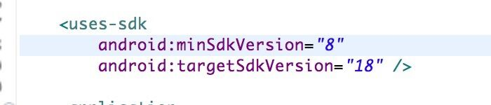

#渠道接入须知
---

|** <a href="#1">uc</a> **| ** <a href="#2">安智</a> **     |** <a href="#3">4399</a> ** |** <a href="#4">滴滴</a>  **| ** <a href="#5">酷狗</a>** | ** <a href="#6">当乐</a> **|**  <a href="#7">酷派</a>  **   |**  <a href="#8">华为</a>  **    |** <a href="#9">小米</a> ** |** <a href="#10" >酷我</a> **|** <a href="#11">联想</a>**
| :-------------: | :------------- :|:----:|:---:|:----:|:----:|:--:|:--:|:--:|:--:|:--:|
 |** <a href="#12">拇指玩</a> ** | ** <a href="#13">爱游戏</a>** | ** <a href="#14">应用宝</a> ** |** <a href="#15">vivo</a> ** |** <a href="#16">金立</a> ** | ** <a href="#17">魅族</a> ** |<a href="#18"></a>|<a href="#19"></a> |<a href="#20"></a> |<a href="#21"></a>|<a href="#21"></a>


```
uc
```

<p id="2">1.充值功能开通：</br>需要签署合同才能开通充值功能；</br>
2.成功打开充值页面：需合同签署后才能成功打开，否则打开页面报错。</p>

---


```
安智
```

<p id="2">1.支付功能开通：无需签合同，但是需要完成以下流程(3-5步骤在讨论组进行)：</br>
(1)请确认应用评测通过(即进入QA阶段)；若未通过，请联系安智商务协调处理;</br>
(2)请先在开发者后台自行配置应用的支付回调地址（把回调地址填完之后，在进行第三步和第四步）；</br>
(3)请发出游戏的appKey(appId即appKey);</br>
(4)请发出游戏接入支付SDK的版本。</br>
(5)请发出游戏的名称。</p>


---

```
4399
```

<p id="3">1.支付功能开通：</br>(1)测试模式需要使用指定的4399账号进行测试，提供一个4399的账号给渠道接口人进行配置;</br>
(2)测试模式调用充值接口不会弹出充值界面，是直接模拟充值，与服务器端进行联调。如果充值已通，会提示已获得商品；</br>
(3)充值通过后，在讨论组通知4399工作人员，开通正式支付功能，即可使用RMB进行测试;</p>

**注意：** 4399最新的参数只有appkey和通信密钥，西瓜portal上的登录密钥不填，支付密钥填通信密钥。


---


```
滴滴
```

<p id="4">1.支付功能开通：需要通知渠道方面进行充值配置。
</p>


---

```
酷狗
```
<p id="5">1.支付功能开通：在讨论组提供充值回调地址后，渠道返回paykey。</br>
2.酷狗渠道独特要求:</br>
签名HASH获取步骤：</br>
(1)手机安装签名的游戏安装包；</br>
(2)手机安装SDK发布包里的GetSignature.apk应用；</br>
(3)打开应用GetSignature.apk，输入游戏的包名即可以获取到签名hash。</br>
对接完成前，请先提供包名和hash值给西瓜运营，西瓜运营要申请相关的参数给游戏使用。</br>
务必提供包名和签名HASH（如果同一款游戏之前已经提供过包名和签名HASH值，则不需要重复提供）。</br>
3.在酷狗渠道的接入中android:targetSdkVersion不能超过20，否则会在5.0设备上出现问题。</br>
如图：

</p>

---

```
当乐
```
<p id="6">1.渠道特殊要求：</br>(1)要求使用渠道自己的签名文件</br>
(2)keystore文件需要从渠道的后台下载
(3)密码是 downjoy_游戏的厂商id
(4)alias是 游戏的厂商id
(5)alias密码是 downjoy_游戏的厂商id
</p>

---

```
小米
```
<p id="9">1.如何开通小米子账号功能：需要商务向小米申请开通；</br>
2.小米渠道独特要求:必须配置支付参数，才能登陆。
</p>

---

```
酷派
```
<p id="7">1.酷派渠道参数配置注意事项：</br>
（1）填写参数时，需去掉全部换行；</br>
（2）支付私钥，需要使用酷派提供的工具进行转换后，再填写到西瓜的参数配置页面。</br>
2.需要配置商品ID：</br>
需要游戏运营在渠道后台申请参数时，进行商品的配置，配置好后，请将商品ID与其他参数一起发送给西瓜接口人，由西瓜接口人填写到西瓜的参数配置后台。</p>

**注意：**  商品配置，建议只配置一种商品，设置为开放价格。由于多商品情况的处理十分复杂，目前西瓜后台不支持多个商品ID的配置，请谅解！</br>
3.支付私钥：需要使用酷派提供的工具进行转换后，再填写到西瓜的参数配置页面。


---

```
酷我
```
<p id="10">1.酷我渠道注意事项：渠道没有提供自测文档。</br>
2.出包注意事项：</br>
（1）包名必须加.kuwo；</br>
（2）icon必须加角标；</br>
（3）游戏开启添加酷我logo,即品牌露出；</br>
（4）有首发活动的，连同文档一同发来；</br>
（5）文档内广告图部分三个尺寸，有活动的直接做成活动图；</br>
（6）icon做二个，白边和蓝边
</p>

---

```
拇指玩
```
<p id="12">1.渠道注意事项：
portal参数debug为true时，充值一律为1元，上线前必须改为false。
</p>

---

```
联想
```
<p id="11">1.渠道注意事项：
填写参数时，需去掉全部换行。</br>
2.需要配置商品ID：</br>
需要游戏运营在渠道后台申请参数时，进行商品的配置，配置好后，请将商品ID与其他参数一起发送给西瓜接口人，由西瓜接口人填写到西瓜的参数配置后台。</p>

**注意：** 商品配置，建议只配置一种商品，设置为开放价格。由于多商品情况的处理十分复杂，目前西瓜后台不支持多个商品ID的配置，请谅解！


---

```
应用宝
```
<p id="14">1.关于充值页面：
需要安装特殊的支付控件。</br>
2.在应用宝渠道的接入中android:targetSdkVersion不能超过20，否则会在5.0设备上出现问题。</br>
如图：</br>

</p>

---

```
爱游戏
```
<p id="13">1.关于充值页面：
需要从渠道后台开通。
</p>

---

```
vivo
```
<p id="15">1.充值回调地址：无需在西瓜portal配置，直接从代码传入。
</p>

---

```
金立
```
<p id="16">1.在金立渠道的接入中android:targetSdkVersion不能超过20，否则会在5.0设备上出现问题。</br>
如图：
</p>

---

```
魅族
```
<p id="17">1.需要通过西瓜提供的充值回调地址获取参数；</br>
2.获取参数后需要让渠道开启“联调模式”的开关才可以进行参数验证。
</p>

---
