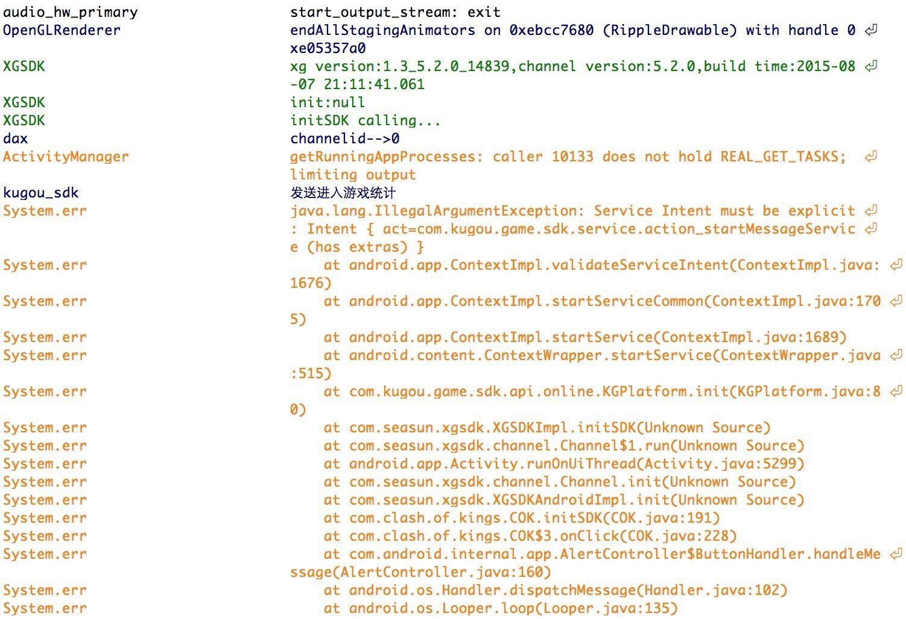

# 渠道接入须知

|** <a href="#1">uc</a> **| ** <a href="#2">安智</a> ** |** <a href="#3">4399</a> ** |** <a href="#4">滴滴</a>  **| ** <a href="#5">酷狗</a>** | ** <a href="#6">当乐</a> **|**  <a href="#7">酷派</a>  **   |**  <a href="#8">华为</a>  **    |** <a href="#mi">小米</a> ** |** <a href="#10" >酷我</a> **|** <a href="#11">联想</a>**
| :-------------: | :------------- :|:----:|:---:|:----:|:----:|:--:|:--:|:--:|:--:|:--:|
 |** <a href="#12">拇指玩</a> ** | ** <a href="#13">爱游戏</a>** | ** <a href="#14">应用宝</a> ** |** <a href="#15">vivo</a> ** |** <a href="#16">金立</a> ** | ** <a href="#17">魅族</a> ** |** <a href="#18">pps</a> ** |** <a href="#oppo">OPPO</a> ** |** <a href="#haima">海马</a> ** ||

#### 
 uc

1.充值功能开通：需要签署合同才能开通充值功能；  
2.成功打开充值页面：需合同签署后才能成功打开，否则打开页面报错。  

---

#### 
安智

1.支付功能开通：无需签合同，但是需要完成以下流程(3-5步骤在讨论组进行)：  
(1)请确认应用评测通过(即进入QA阶段)；若未通过，请联系安智商务协调处理；  
(2)请先在开发者后台自行配置应用的支付回调地址（把回调地址填完之后，再进行第三步和第四步）；  
(3)请发出游戏的appKey(appId即appKey)；  
(4)请发出游戏接入支付SDK的版本；  
(5)请发出游戏的名称。

---

#### 
4399

1.支付功能开通：  
(1)测试模式需要使用指定的4399账号进行测试，提供一个4399的账号给渠道接口人进行配置；  
(2)测试模式调用充值接口不会弹出充值界面，是直接模拟充值，与服务器端进行联调。如果充值已通，会提示已获得商品；  
(3)充值通过后，在讨论组通知4399工作人员，开通正式支付功能，即可使用RMB进行测试。  

---

#### 
滴滴

1.支付功能开通：需要通知渠道方面进行充值配置。  
2.微信支付功能：需要在微信公众平台上注册，并且需要填签名。

---

#### 
酷狗

1.支付功能开通：在讨论组提供充值回调地址后，渠道返回paykey。  
2.酷狗渠道需要游戏提供渠道包的包名和签名HASH（如果同一款游戏之前已经提供过包名和签名HASH值，则不需要重复提供）：  
签名HASH获取步骤：  
(1)手机安装带有签名的游戏包；  
(2)手机安装SDK发布包里的GetSignature.apk应用（酷狗的SDK包中有提供）；

  

(3)打开应用GetSignature.apk，输入游戏的包名即可以获取到签名hash。  

3.在酷狗渠道的接入中android:targetSdkVersion不能超过20，否则会在5.0设备上出现问题。  
如图：  

    

4.酷狗SDK5.2.0会初始化失败？  
AndroidManifest.xml中的android:targetSdkVersion必须配19，不能配太高，否则在android5.0以上手机上，酷狗SDK5.2.0会初始化失败。相应报错日志：

---

#### 
当乐

1.要求使用渠道自己的签名文件，获取步骤：
- 登录当乐后台，首页有账号信息介绍；
- 信息介绍中有【签名】信息，点击下载即可。

  

- 手动创建.properties文件，其中包含三个属性，分别如下：   
keypass=downjoy\_ 游戏的厂商id；  
storepass=downjoy\_游戏的厂商id；  
alias=游戏的厂商id。

2.游戏厂商id即在渠道获取的参数之一，merchantId即游戏的厂商id，如图：

  

3.西瓜web后台所填参数中的“服务器序号”，是需要先去当乐渠道后台进行配置的，步骤如下：
- 登录当乐渠道后台，选择游戏，在游戏信息下方有4个操作选项，选择“添加服务器”；

  

- 应用、服务器序号、支付回调地址为必填：  
选择游戏名称；  
服务器序号建议填1，若1被使用即可填2，以此类推；  
支付回调地址即西瓜web控制台的参数配置中当乐渠道的充值回调地址。

  

此处配置的服务器序号要与西瓜web控制台中所填的“服务器序号”保持一致。

---

#### 
小米

1. 小米渠道必须配置支付参数（计费代码 和 回调URL），才能登陆。

2. 如何开通小米子账号功能？    
   需要商务向小米申请开通。

---

#### 
酷派

1.填写参数时，需去掉全部换行。  
2.支付私钥填写时，需要使用酷派提供的工具进行转换后，再填写到西瓜的参数配置页面，转换步骤如下：  
- 酷派的SDK包中提供了PKCS1/PCKS8的转换工具，在“03-接入必看-服务端接口说明及范例.zip”中；
  

- 使用方法：cptools在windows下是个windows窗口小程序，实际使用的时候，在输入数据之前，最好编辑窗口属性，开启QuickEdit Mode （快速编辑模式），这样就可以将私钥复制进去；
- Cptools工具使用说明：运行cptools.exe，输入支付私钥，按enter键。
公钥不需要转换，只需要转换支付私钥。

2.需要配置商品ID：  
- 在酷派渠道后台配置渠道商品ID：在酷派首页点击支付系统，进入创建计费点的界面

  

  跳转到计费点添加页面后点修改应用信息

    

  跳转至下图页面后即可对计费点、应用信息、支付方式进行编辑；

      

- 在西瓜web控制台“基础配置”中进行商品参数的配置，有4项：商品名称、商品ID、商品价格和商品描述，此处的商品ID是游戏制定的ID而非在渠道后台配置的；

      

    

    

- 在“渠道参数”中选择酷派渠道，点击商品ID映射的“配置按钮”进行映射配置。

    

    
---

#### 
酷我

1.酷我渠道注意事项：渠道没有提供自测文档。  
2.出包注意事项：  
（1）包名必须加.kuwo；  
（2）icon必须加角标；  
（3）游戏开启添加酷我logo，即品牌露出；  
（4）有首发活动的，连同文档一同发来；  
（5）文档内广告图部分三个尺寸，有活动的直接做成活动图；  
（6）icon做二个，分别为白边和蓝边。

---

#### 
拇指玩

1.渠道注意事项：
portal参数debug为true时，充值一律为1元，上线前必须改为false。

---

#### 
联想

1.渠道注意事项：
填写参数时，需去掉全部换行。  
2.需要配置商品ID：  
- 在联想渠道后台配置渠道商品ID，配置好的商品如下所示：

  

- 游戏方提供一份商品列表，如图：  

      
- 在西瓜web控制台“基础配置”中进行商品参数的配置，有4项：商品名称、商品ID、商品价格和商品描述，此处的商品ID是游戏制定的ID而非在渠道后台配置的；

    

    

- 在“渠道参数”中选择联想渠道，点击商品ID映射的“配置按钮”进行映射配置。

    

    

    

3.联想悬浮框未见？
开完论坛，等游戏上架后，会自动出现。

---

#### 
应用宝

1.支付需要先进行开通，开通步骤<a href="http://wiki.mg.open.qq.com/index.php?title=Android%E6%94%AF%E4%BB%98%E6%8E%A5%E5%85%A5%E6%B5%81%E7%A8%8B">点击查看</a>。  
2.签名文件：申请参数时提交的demo所用的签名文件要与正式渠道包的签名文件一致，否则无法登录。  
3.支付分区配置：  
- 如果应用不分区（即只有一个分区，则分区ID必须为1），沙箱环境和现网环境要一致；

    

- 如果有多个分区，则需进行配置，如图：

    

- 修改分区配置后，请到“联调测试”中“更新沙箱”、“更新现网”，并验证修正分区的支付功能。

    

4.应用宝测试环境和现网环境的AppKey是不一样的，在测试结束正式上线前，需要在西瓜后台将AppKey填为现网环境的AppKey，否则支付会有问题。

  

5.在西瓜后台配置的”汇率”一定要与在应用宝后台配置的汇率一致，应用宝后台如果不配置则默认为1：10 。

6.在应用宝渠道的接入中android:targetSdkVersion不能超过20，否则会在5.0设备上出现问题。  
如图：

   

---

#### 
爱游戏

1.需要在爱游戏渠道后台取计费文件feeinfo.dat，并将其在西瓜后台的高级配置中上传，若无此计费文件无法拉起充值页面。  
2.需要在渠道后台配置充值回调地址。

---

#### 
vivo

1.充值回调地址：无需在西瓜portal配置，直接从代码传入。

---

#### 
金立

1.在金立渠道的接入中android:targetSdkVersion不能超过20，否则会在5.0设备上出现问题。 
如图：  

---  

#### 
魅族

1.需要通过西瓜提供的充值回调地址获取参数；  
2.获取参数后需要让渠道开启“联调模式”的开关才可以进行参数验证。

---

#### 
pps

1.pps返回键没有调出渠道退出框，直接finish？  
需要渠道后台进行配置。

---

#### 
华为

1.在给渠道提交渠道包之前，需要提前提供给渠道资料进行审核，避免影响游戏上架时间。  

2.华为渠道的支付私钥、支付公钥、支付ID ，浮标秘钥这些参数获取参考：<a href="http://developer.huawei.com/wiki/index.php?title=%E8%BF%90%E8%90%A5%E6%93%8D%E4%BD%9C%E6%8C%87%E5%8D%97">点击查看</a>

---

#### 
OPPO

1.Oppo从1.7.3开始提供了自己的安全支付客户端，游戏每次充值打开Oppo支付客户端的时候总是为竖屏。如果游戏是横屏，那么支付成功后返回游戏时（横屏），游戏会发生一个横竖屏切换，此时如果重新创建Activity的话，原来注册的支付回调就不会调用到。    

为了避免支付成功后游戏的横竖屏切换，需要在游戏充值的Activity添加下面的配置(AndroidManifest.xml)：

	android:configChanges="fontScale|orientation|keyboardHidden|locale|navigation|screenSize|uiMode"

实例：  

	<activity
	    android:name="com.xgsdk.client.testdemo.MainActivity"
	    android:launchMode="singleTop"
	    android:configChanges="orientation|keyboard|keyboardHidden|screenSize"
	    android:screenOrientation="landscape"
	    android:theme="@android:style/Theme.NoTitleBar.Fullscreen" >
	    <intent-filter>
	        <action android:name="xg.game.MAIN" />
	        <category android:name="android.intent.category.DEFAULT" />
	    </intent-filter>
	</activity>

---

### 
海马

1.海马的登录是横屏的，为了不避免发生转屏游戏Activity重新初始化，需要为游戏的每个Activity添加如下属性：

AndroidManifest.xml:

	android:configChanges="fontScale|orientation|keyboardHidden|locale|navigation|screenSize|uiMode"
