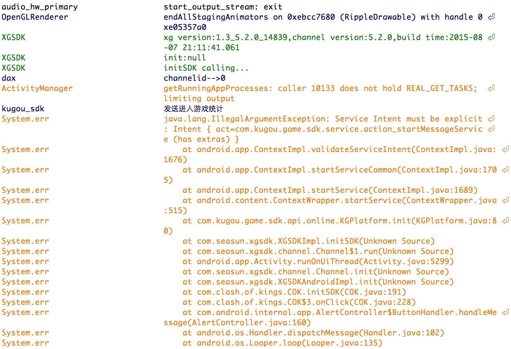

#接入常见问题

**<a href="#1">角标问题</a>**                **<a href="#2">闪屏问题</a>**
**<a href="#4">登录问题</a>**
**<a href="#5">支付问题</a>**
**<a href="#6">其他问题</a>**


```
角标
```

**<h5 id="1">Q：如何加入不同渠道的角标呢？</h5>**

A：不同的渠道角标资源文件和角标说明文件均可以在官网（<a href="http://doc.xgsdk.com/guide/index.php/channels/">西瓜</a>）进行下载，并且通过打包工具打入。

**Q：部分渠道并没提供角标文件，并且在官网没发现有角标文件下载，是否意味着该渠道不需要加入角标呢？**

A：我们会时刻确认更新到渠道最新版本，若在官网没发现有角标文件下载，代表该渠道并不要求加入角标。如果发现有误，请及时联系西瓜运营（<a href="mailto:FULEI1@kingsoft.com">联系我们</a>）。

**Q：为什么游戏安装后角标显示不正常？例如尺寸拉伸，图片模糊等。**

A：请检查下载的角标文件是否有对应不同屏幕分辨率的图片资源，如果下载的角标文件缺少特定的图片资源，请及时联系西瓜运营（<a href="mailto:FULEI1@kingsoft.com">联系我们</a>）。

---

```
闪屏
```

**<h5 id="2">Q：闪屏的时间是多少？</h5>**

A：每屏闪屏显示的时间是1.5秒，即闪屏一次要1.5秒，2次3秒以此类推。

**Q：闪屏次数的上限是多少次？**

A：闪屏次数最多5次，允许游戏方使用的闪屏次数是4次，西瓜占一次。

**Q：闪屏的顺序有什么要求？**

A：游戏闪屏与西瓜闪屏同时存在，闪屏的顺序根据，闪屏文件命名决定，例如xg_splash_landscape_1.jpg是第一张闪屏，依次类推。

---

```
登录
```

**<h5 id="4">Q：调用登陆接口后游戏闪退？</h5>**

A：检查是否正确完整地按照游戏接入文档接入，检查是否缺少资源文件（例如Jar包，资源文件等）。如上无误，观察XGLOG标签日志并且联系西瓜运营（<a href="mailto:FULEI1@kingsoft.com">联系我们</a>）。

**Q：渠道的登录窗口无法调出？**

A：检查portal参数是否配置正确，检查游戏是否已经接入登陆接口，检查初始化是否成功，部分渠道会出现初始化不成功便无法调用登陆接口。如上无误，观察XGLOG标签日志并且联系西瓜运营（<a href="mailto:FULEI1@kingsoft.com">联系我们</a>）。

**Q：登陆未收到回调？**

A：检查游戏逻辑是否按接入文档实现接口类，如果正确，请联系西瓜运营（<a href="mailto:FULEI1@kingsoft.com">联系我们</a>）。

**Q：游戏登陆失败返回码代表什么意思？**

A:
<table>
<tr>
<td>数值</td>
<td>说明</td>
</tr>
<tr>
<td>1</td>
<td>调用成功</td>
</tr>
<tr>
<td>-1</td>
<td>sessionId未能通过校验，登陆失败</td>
</tr>
<tr>
<td>-3001</td>
<td>接口调用参数错误 </td>
</tr>
<tr>
<td>-3002</td>
<td>渠道验证服务调用失败 </td>
</tr>
<tr>
<td>-501</td>
<td>渠道验证服务调用参数错误 </td>
</tr>
<tr>
<td>-502</td>
<td>渠道验证服务调用参数错误，检查项目初始化的定义配置</td>
</tr>
</table>


**Q：游戏后台服务器出现连接SDK服务器被拒绝的日志？**

A：游戏采用长连接的方式连接我们的服务端,我们服务端连接保持时间为10s，如果在10s内客户端没有发起请求，服务端会主动关闭连接，游戏客户端就会打印连接被拒绝的日志(采用的是Apache HttpClient)
。


**Q：切换账号是否会有登出回调？**

A：切换账号会有登出回调给游戏方。如果没有收到，并且确保游戏已经实现登出回调后，请联系西瓜运营（<a href="mailto:FULEI1@kingsoft.com">联系我们</a>）。

**Q：调用切换账号或者登出，游戏崩溃？**

A：检查是否正确完整地按照游戏接入文档接入，检查是否缺少资源文件（例如Jar包，资源文件等）。如上无误，观察XGLOG标签日志并且联系西瓜运营（<a href="mailto:FULEI1@kingsoft.com">联系我们</a>）。

**Q：调用切换账号或者登出，游戏无反应？**

A：检查游戏是否已经接入切换账号或登出接口，检查登陆是否成功，部分渠道会出现初始化或登陆不成功便无法调用切换账号和登出接口。请检查游戏登出逻辑是否正确，收到登出回调后，跳转到登陆界面并进行重新登陆的操作。如上无误，观察XGLOG标签日志并且联系西瓜运营（<a href="mailto:FULEI1@kingsoft.com">联系我们</a>）。

**Q：调用退出接口后无反应？**

A：请检查游戏是否已经接入退出接口，收到退出回调后，请检查游戏登出逻辑是否正确。如上无误，观察XGLOG标签日志并且联系西瓜运营（<a href="mailto:FULEI1@kingsoft.com">联系我们</a>）。

**Q：调用退出接口后，游戏崩溃？**

A：检查是否正确完整地按照游戏接入文档接入，检查是否缺少资源文件（例如Jar包，资源文件等）。如上无误，观察XGLOG标签日志并且联系西瓜运营（<a href="mailto:FULEI1@kingsoft.com">联系我们</a>）。

---

```
支付
```


**Q：为什么不能打开充值页面？**

A：1.需要与渠道签署合同之后才能打开充值页面，否则打开页面会报错（如UC渠道）；</br>
   2.需要额外向渠道申请支付权限（如华为渠道）；</br>
   3.需要从渠道后台进行开通（如爱游戏渠道）；</br>
   4.需要安装特殊的支付控件（如应用宝渠道）；</br>
   5.若不是以上情况请及时联系西瓜运营。

**<h5 id="5">Q：调用支付接口后游戏闪退？</h5>**

A：检查是否正确完整地按照游戏接入文档接入，检查是否按文档正确传入支付参数，检查是否缺少资源文件（例如Jar包，资源文件等）。如上无误，观察XGLOG标签日志并且联系运营。

**Q：调用支付接口，支付窗口无法调出?**

A：检查portal参数是否配置正确，检查游戏是否已经接入支付接口，检查初始化和登陆是否成功，部分渠道会出现初始化或登陆不成功便无法调用支付接口。如上无误，观察XGLOG标签日志并且联系运营。

**Q：调用支付接口，支付后回调的返回码代表什么意思？**

A:
<table>
<tr>
<td>数值</td>
<td>说明</td>
</tr>
<tr>
<td>1</td>
<td>调用成功</td>
</tr>
<tr>
<td>0</td>
<td>重复订单</td>
</tr>
<tr>
<td>-1</td>
<td>非法订单，在SDK server中无法查询到</td>
</tr>
<tr>
<td>-2</td>
<td>商品不存在</td>
</tr>
<tr>
<td>-3</td>
<td>签名失败</td>
</tr>
<tr>
<td>-4</td>
<td>请求重发</td>
</tr>
</table>

**Q：支付完成后游戏崩溃？**

A：检查游戏是否实现支付回调，检查回调方法是否存在错误。如上无误，请联系西瓜客服。

**Q：支付完成后，元宝不到账？**

A：确保游戏逻辑正确和参数配置正确后，请联系西瓜客服。

---
<a id="6"></a>

```
其他
```


**Q：酷狗SDK5.2.0会初始化失败？**

A：AndroidManifest.xml中的android:targetSdkVersion必须配19，不能配太高，否则在android5.0以上手机上，酷狗SDK5.2.0会初始化失败。相应报错日志：



**Q：联想悬浮框未见？**

A：开完论坛，等游戏上架后，会自动出现。


**Q：pps返回键没有调出渠道退出框，直接finish？**

A：需要渠道后台进行配置。
