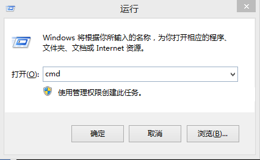
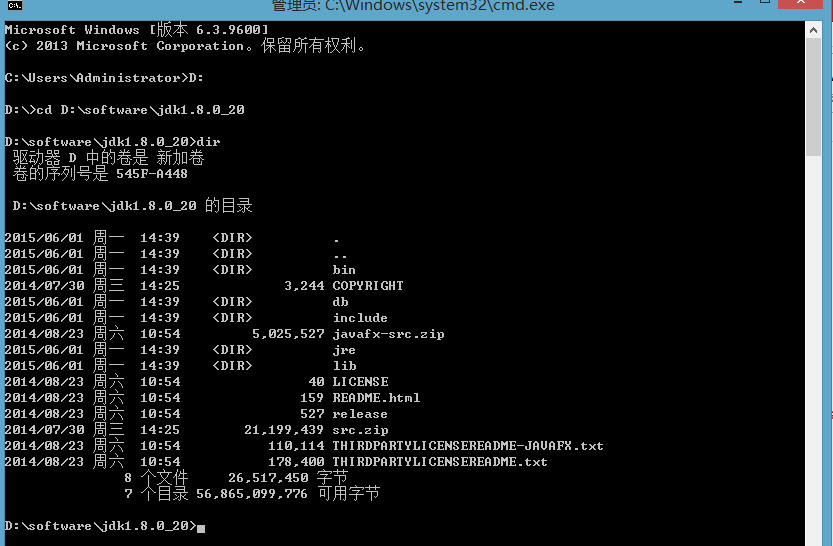

#获取文件签名


**1.为什么需要文件签名呢？**

Android系统要求每一个Android应用程序必须要经过数字签名才可以安装到系统中，也就是说如果一个Android应用程序没有经过数字签名，是无法安装到系统中的。</br>
Android系统通过数字签名在应用程序的作者和应用程序之间建立一种信任关系，它并不是决定用户最终可以安装哪些应用程序。
本数字签名是由应用程序的作者完成，并不需要权威的数字证书签名机构认证，它是用来让应用程序包进行自我认证。</br> </font>

```
2.以下是keystore文件的生成的具体步骤：
```
**2.1打开dos控制台；**



**2.2如果已经配置了jdk环境变量，可省略此步。**

使用命令行进入到jdk的bin目录，如图所示：</br>

</br>
**2.3执行如下命令，即生成keystore文件：**

keytool -genkey -dname "CN=fingki,OU=server,O=server,L=bj,ST=bj,C=CN" -alias myCA -keyalg RSA -keysize 1024 -keystore myCALib -keypass 654321 -storepass 123456 -validity 3650 </br>
这条命令将生成一个别名为myCA的自签名证书，证书的keypair的密码为654321，证书中实体信息为 "CN=fingki,OU=server,O=server,L=bj,ST=bj,C=CN"，存储在名为myCALib的keystore中（如果原本没有myCALib将会自动生成一个；如果已经存在则会被覆盖），这个keystore的密码为123456，加密算法为RSA
，有效期为10年。
